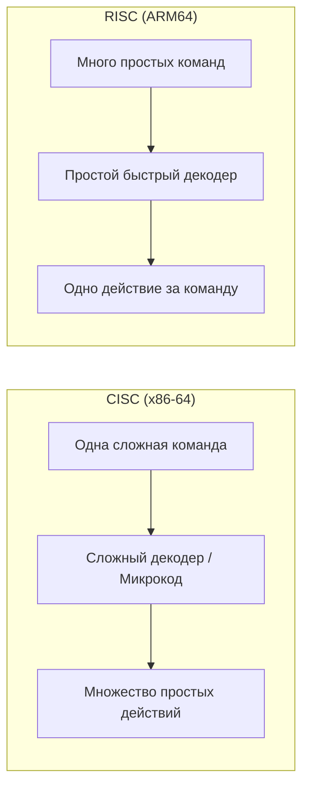

## Мост между кодом и кремнием

Мы прошли путь от транзисторов до сложнейших механизмов спекулятивного исполнения. Теперь перед нами стоит главный вопрос: как наш высокоуровневый код на Go превращается в те самые электрические сигналы, которые заставляют миллиарды транзисторов переключаться?

Ответом является **ISA (Instruction Set Architecture)** — Архитектура Набора Команд.

Если рассматривать процессор как сложный механизм, то ISA — это его **API**. Это строго определенный контракт между теми, кто создает софт (компиляторами), и теми, кто создает железо (инженерами Intel, AMD, Apple, ARM). 

ISA говорит компилятору: «Если ты пришлешь мне последовательность байтов `0x48 0x01 0xC3`, я пойму это как команду сложения двух 64-битных чисел в регистрах RAX и RBX».

## Что входит в ISA?

Архитектура набора команд — это не только список доступных команд. Это полный перечень ресурсов, которыми может оперировать программист (или компилятор):

1. **Набор инструкций**: Все доступные операции (сложение, вычитание, прыжки `JMP`, чтение из памяти `MOV` и т.д.).
2. **Регистры**: Сколько их, какого они размера (32 или 64 бита) и какие из них имеют специальное назначение (например, регистр стека `RSP` или счетчик команд `RIP`).
3. **Модель памяти**: Как процессор обращается к RAM, как выравниваются данные (Alignment) и как работает кэширование.
4. **Типы данных**: Какие форматы чисел поддерживаются аппаратно (целые числа, числа с плавающей запятой IEEE 754).

> [!info] Под капотом
> Важно не путать **ISA (Архитектуру)** и **Микроархитектуру**. 
> **ISA** — это *что* процессор умеет делать (интерфейс). Например, x86-64 — это ISA. 
> **Микроархитектура** — это *как* конкретный чип реализует этот интерфейс. Например, Intel Alder Lake и AMD Zen 4 имеют одну и ту же ISA (x86-64), но их микроархитектуры (количество конвейеров, размер кэшей, алгоритмы предсказания ветвлений) абсолютно разные. Именно поэтому одна и та же программа запускается на обоих процессорах, но работает с разной скоростью.

## Великое противостояние: CISC против RISC

В мире современных серверов и ноутбуков доминируют два подхода к созданию ISA. Разница между ними — в философии того, как должен выглядеть "идеальный" набор команд.

### 1. CISC (Complex Instruction Set Computer)
**Пример: x86-64 (Intel, AMD)**
Философия CISC: «Давайте создадим одну мощную инструкцию, которая сделает много работы за раз». 

В CISC одна команда может:
- Прочитать значение из памяти.
- Прибавить к нему число из регистра.
- Записать результат обратно в память.

Это экономит место в бинарном файле (программа короче), но делает Устройство управления (CU) невероятно сложным. Как мы разбирали в статье [[5. Анатомия CPU. Datapath и Control Unit]], CISC-процессоры вынуждены использовать сложный **микрокод**, чтобы разбить одну "сложную" команду на серию простых микроопераций.

### 2. RISC (Reduced Instruction Set Computer)
**Пример: ARM64 (Apple M1/M2/M3, AWS Graviton, Raspberry Pi)**
Философия RISC: «Давайте сделаем набор из очень простых, маленьких и одинаковых по размеру инструкций, которые выполняются максимально быстро».

В RISC нет команд, которые одновременно читают из памяти и вычисляют. Только три типа операций:
- **Load**: Загрузить из памяти в регистр.
- **Store**: Сохранить из регистра в память.
- **Compute**: Выполнить математику *только* в регистрах.

Это делает бинарные файлы длиннее, но позволяет упростить CU до предела. RISC-процессоры потребляют меньше энергии и меньше греются, так как им не нужно тратить ресурсы на сложную расшифровку микрокода.

## Go и кросс-компиляция: Почему это работает?

Go — один из самых дружелюбных языков для работы с разными ISA. Когда вы запускаете `go build`, компилятор Go проходит через стадию **SSA (Static Single Assignment)**. 

На этапе SSA ваш код представляет собой абстрактные операции: `Suma(a, b)`. Затем вступает в дело **бэкенд компилятора**, который переводит эти абстракции в конкретную ISA.

Если вы указали `GOARCH=amd64`, бэкенд превратит `Suma` в сложную CISC-инструкцию `ADD`.
Если вы указали `GOARCH=arm64`, он превратит её в серию простых RISC-инструкций.

> [!tip] Собеседование
> **Вопрос:** Почему в Go-проектах иногда можно встретить файлы с расширением `.s` (ассемблер) и почему они часто разделены по папкам или имеют суффиксы вроде `_amd64.s` и `_arm64.s`?
> **Ответ:** Некоторые критически важные части стандартной библиотеки Go (например, криптография в пакете `crypto` или работа с памятью в `runtime`) написаны на чистом ассемблере для максимальной производительности. Поскольку ассемблер привязан к конкретной ISA, разработчики Go пишут отдельную реализацию для каждой поддерживаемой архитектуры. Компилятор выбирает нужный файл в зависимости от целевой платформы (`GOARCH`).

## Mechanical Sympathy: Влияние ISA на производительность

Для большинства бэкенд-разработчиков разница между CISC и RISC незаметна. Однако, когда вы переходите на уровень Senior/Lead, понимание ISA помогает в следующих вещах:

1. **Выравнивание данных (Alignment)**: RISC-процессоры (ARM) очень чувствительны к тому, по каким адресам лежат данные. Если вы пытаетесь прочитать 64-битное число из адреса, который не делится на 8, ARM-процессор может либо выдать ошибку (`panic`), либо (что чаще) выполнить два чтения из памяти вместо одного, что вдвое замедлит операцию. Go-компилятор делает выравнивание автоматически, но при работе с `unsafe.Pointer` вы берете эту ответственность на себя.
2. **Выбор облачной инфраструктуры**: Переход с x86 (Intel) на ARM64 (например, AWS Graviton) в облаках часто дает прирост производительности на 20-40% при снижении стоимости аренды серверов. Это возможно именно потому, что RISC-архитектура эффективнее справляется с простыми, повторяющимися задачами типичного бэкенда.

## Итог

1. **ISA** — это контракт (API) между софтом и железом.
2. **CISC (x86-64)** — мощные, сложные команды, сложный декодер, высокая энергопотребление.
3. **RISC (ARM64)** — простые, однотипные команды, быстрый декодер, высокая энергоэффективность.
4. **Go** абстрагирует нас от ISA через мощный компилятор, позволяя собирать один и тот же код под разные архитектуры одним флагом.

Теперь мы понимаем, как работает "интерфейс" процессора. Но чтобы понять, как этот интерфейс превращается в реальные команды в памяти, нам нужно научиться читать этот язык. В следующей статье мы разберем основы ассемблера, чтобы вы могли понимать, во что превращается ваш Go-код после компиляции: [[10. Базовый Ассемблер. Как CPU видит код]].