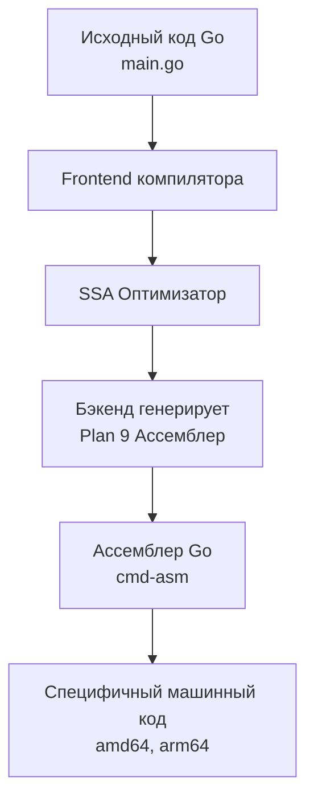

Для программиста исходный код — это бизнес-логика, архитектура и абстракции. Для процессора вашего кода не существует. Есть только последовательность микроскопических электрических импульсов. 

Ассемблер — это тончайшая прослойка между этими мирами. Это текстовое, человекочитаемое представление машинного кода (той самой ISA, которую мы обсуждали в [[8. ISA. Интерфейс между железом и софтом]]). 

Умение читать ассемблер — суперсила бэкенд-инженера. Код на Go может врать (скрывать аллокации, проверки границ, вызовы рантайма), но ассемблер не врет никогда. Это абсолютная истина того, что именно будет делать ваш процессор.

## Диалект Plan 9: Свой путь Go

В мире x86-64 исторически сложились два синтаксиса ассемблера: Intel (используется в Windows) и AT&T (используется в Linux/Unix). 

Но если вы скомпилируете Go-код, вы увидите третий, ни на что не похожий вариант — **Plan 9 Assembly**. Создатели Go (Кен Томпсон, Роб Пайк) использовали наработки своей операционной системы Plan 9, чтобы создать универсальный, кросс-платформенный псевдо-ассемблер.



Главное правило синтаксиса Plan 9: **Операция Источник, Приемник (Opcode Source, Destination)**. Данные всегда текут слева направо. 
*Пример:* `MOVQ AX, BX` означает "скопировать значение из регистра AX в регистр BX".

Кроме того, к инструкциям добавляется суффикс, обозначающий размер данных:
*   `B` (Byte) — 1 байт.
*   `W` (Word) — 2 байта.
*   `L` (Long) — 4 байта.
*   `Q` (Quadword) — 8 байт (самый частый суффикс на 64-битных системах).

## Базовый словарь инструкций

Чтобы понимать 90% выхлопа компилятора, достаточно знать несколько инструкций:

1.  **`MOV` (Move):** Главная рабочая лошадка процессора. Перемещает данные между регистрами, либо между памятью и регистром. Процессор тратит больше всего времени именно на `MOV`.
2.  **`ADD`, `SUB`, `IMUL`:** Арифметика (сложение, вычитание, умножение).
3.  **`LEA` (Load Effective Address):** Вычисляет адрес в памяти (или хитрую математику) без реального обращения к этой памяти. Компиляторы часто используют `LEAQ` для быстрого сложения чисел.
4.  **`CMP` (Compare):** Сравнивает два значения (вычитая одно из другого под капотом) и устанавливает флаги (RFLAGS) в процессоре.
5.  **`JMP`, `JEQ`, `JNE` (Jump):** Переходы по коду. Меняют значение регистра `RIP` (Счетчика команд). `JEQ` прыгнет, только если предыдущий `CMP` показал, что значения равны.
6.  **`CALL` и `RET`:** Вызов функции и возврат из нее.

## Псевдо-регистры Go

Главная фишка Plan 9 — наличие псевдо-регистров, которых физически не существует в процессоре. Компилятор Go использует их для навигации по структурам данных и стеку, а линкер потом превращает их в реальные аппаратные адреса.

*   **`SB` (Static Base):** Указатель на начало глобальной памяти программы. Все глобальные переменные и имена функций отсчитываются от `SB`. Например, `"".main(SB)` — это адрес вашей функции `main`.
*   **`FP` (Frame Pointer):** Указатель на аргументы функции и возвращаемые значения (на стеке).
*   **`SP` (Stack Pointer):** Указатель на локальные переменные в текущем фрейме стека.
*   **`PC` (Program Counter):** То же самое, что и аппаратный `RIP`.

> [!warning] Ловушка / Gotcha
> В ассемблере Go есть **два разных SP**. 
> Псевдо-регистр `SP` (пишется как `имя_переменной-8(SP)`) указывает на локальные переменные. 
> Аппаратный регистр `SP` (пишется без имени переменной, просто `-8(SP)`) — это настоящий физический регистр процессора `RSP`. Перепутать их при написании ручного ассемблерного кода — классический способ получить `segmentation fault`.

## Читаем код: Как CPU видит вашу функцию

Давайте напишем простейшую функцию и заглянем под капот.

```go
package main

//go:noinline
func add(a, b int) int {
	return a + b
}
```
*(Мы используем `//go:noinline`, чтобы компилятор не встроил эту функцию напрямую в `main`, иначе мы не увидим ее в ассемблере).*

Скомпилируем с флагом вывода ассемблера: `go build -gcflags="-S" main.go`.

Вывод будет выглядеть примерно так (на архитектуре amd64):
```asm
"".add STEXT nosplit size=4 args=0x10 locals=0x0 funcid=0x0 align=0x0
	0x0000 00000 (main.go:4)	TEXT	"".add(SB), NOSPLIT|ABIInternal, $0-16
	0x0000 00000 (main.go:5)	ADDQ	BX, AX
	0x0003 00003 (main.go:5)	RET
```

Разберем построчно:
1.  **`TEXT "".add(SB), NOSPLIT|ABIInternal, $0-16`**
    Это декларация функции. 
    `"".add(SB)` — имя в глобальной памяти.
    `$0-16` — означает, что локальных переменных нет (0 байт на стеке), а аргументы занимают 16 байт (два `int` по 8 байт).
2.  **`ADDQ BX, AX`**
    Подождите, а где `MOV` из памяти? Почему мы складываем регистры `BX` и `AX`? 
    В этом магия **ABIInternal** (стандарта Go 1.17+). Компилятор передал аргументы `a` и `b` прямо в аппаратных регистрах `AX` и `BX` для максимальной скорости (latency 0 тактов). Инструкция прибавляет `BX` к `AX` и оставляет результат в `AX` — именно оттуда вызывающая функция заберет ответ.
3.  **`RET`**
    Возврат управления вызывающей стороне. 

## Mechanical Sympathy: Скрытая цена слайсов

Ассемблер моментально показывает, почему некоторые конструкции Go работают медленнее, чем в C++. Возьмем чтение из слайса:

```go
func readSlice(s[]int, i int) int {
	return s[i]
}
```

Выхлоп компилятора (`go tool compile -S`):
```asm
	// AX хранит указатель на массив, BX хранит длину (len), CX хранит индекс (i)
	0x0000 00000 (main.go:2)	CMPQ	CX, BX         // Сравниваем индекс (i) и длину (len)
	0x0003 00003 (main.go:2)	JAE	    0x000b         // Если i >= len, прыгаем в конец!
	0x0005 00005 (main.go:2)	MOVQ	(AX)(CX*8), AX // Если все ок, читаем из памяти
	0x0009 00009 (main.go:2)	RET
	0x000b 00011 (main.go:2)	CALL	runtime.panicIndex(SB) // Паника!
```

В C/C++ обращение к массиву — это одна инструкция `MOVQ`. 
В Go компилятор принудительно вставляет две дополнительные инструкции: **`CMPQ`** и **`JAE`**. Это аппаратная защита от выхода за пределы памяти (Bounds Checking). 

Если вы пишете высоконагруженный цикл (например, обработку видео или криптографию), эти проверки на каждой итерации уничтожат производительность. Понимание ассемблера позволяет вам переписать код так, чтобы оптимизатор SSA смог доказать безопасность доступа до цикла и вырезать (Eliminate) эти инструкции.

> [!info] Под капотом: Динамические стеки
> В декларации функции `add` мы видели флаг `NOSPLIT`. Это директива компилятора, означающая, что функция настолько мала, что ей не нужно проверять размер стека.
> Если функция сложная, в самом начале (прологе) вы увидите инструкции:
> ```asm
> MOVQ (TLS), CX           // Читаем текущую горутину
> CMPQ SP, 16(CX)          // Сравниваем наш стек (SP) с g.stackguard0
> JLS  runtime.morestack(SB) // Если места мало - просим рантайм увеличить стек
> ```
> Это механизм динамических стеков (Continuous Stacks) в Go. Каждая горутина стартует всего с 2 КБ памяти. Перед каждым вызовом функции она проверяет аппаратно, хватит ли ей места на локальные переменные. Если нет — вызывается рантайм, выделяется новый кусок памяти в два раза больше, и все данные копируются туда.

## Итог

1.  **Ассемблер** — это язык, который почти дословно транслируется в машинный код (ISA).
2.  Go использует **Plan 9 Assembly** с кросс-платформенными псевдо-регистрами (`SB`, `PC`, `SP`, `FP`).
3.  Осмотр выхлопа `go build -gcflags="-S"` — лучший способ найти узкие места, невидимые аллокации (Escape Analysis) и проверки границ слайсов (Bounds Checking).
4.  С Go 1.17 компилятор активно использует аппаратные регистры (`AX`, `BX`...) для передачи аргументов через новый стандарт **ABIInternal**, что делает функции невероятно быстрыми.

В этой статье мы часто упоминали "передачу аргументов", "стек" и "возврат значений". Эти правила обмена данными между функциями не берутся из воздуха — они жестко регламентированы стандартами. В следующей статье мы разберем эти правила: [[10. ABI, Calling Convention и стек вызовов]].