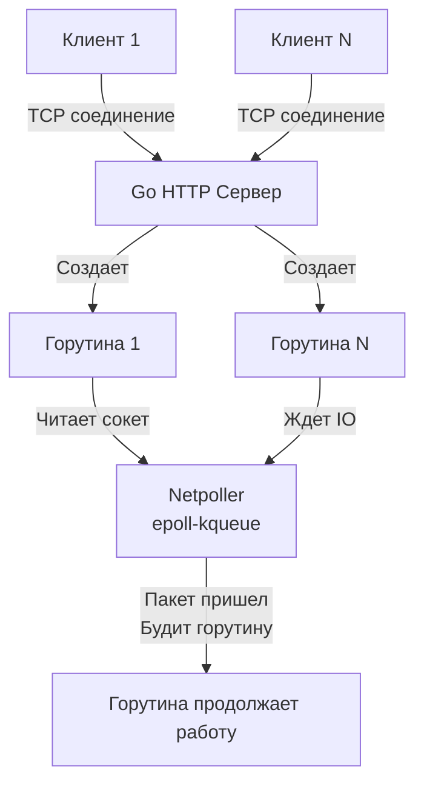

## Введение в сетевые интерфейсы: От монолита к распределенным контрактам

В предыдущих разделах мы препарировали железо, операционные системы и внутренности Go. Мы научились писать быстрый, конкурентный и аллокационно-эффективный код. Но в вакууме этот код бесполезен. Современный бэкенд — это распределенная система, узлы которой непрерывно общаются друг с другом и с внешним миром. 

Проектирование API (Application Programming Interface) — это дисциплина, в которой цена ошибки экспоненциально возрастает со временем. Неудачную внутреннюю архитектуру сервиса можно отрефакторить за спринт. Неудачный публичный API-контракт, на который завязались десятки клиентов, вы будете поддерживать годами, реализуя костыли для обратной совместимости.

Этот раздел базы знаний посвящен тому, как строить железобетонные сетевые интерфейсы, выбирать правильные протоколы и форматы данных.

## Философия контракта: Postel's Law и неявные ожидания

В распределенных системах мы руководствуемся **законом Постела (Postel's Law)**, также известным как принцип надежности:
> *«Будь строг в том, что отправляешь, и гибок в том, что принимаешь».*

На уровне API это означает:
1. **Строгость ответов**: Если ваш сервис обещает вернуть массив — он всегда должен возвращать массив (в худшем случае пустой `[]`), а не `null` или объект. Структура ответа должна быть детерминирована.
2. **Гибкость приема**: Если клиент прислал в JSON лишнее поле, которое не описано в контракте, сервис не должен падать с 500-й ошибкой. Он должен проигнорировать неизвестные данные (если это не противоречит строгим требованиям безопасности).

В мире Go эта концепция отлично ложится на то, как мы работаем с интерфейсами внутри языка. В C# или Java классы обязаны *явно* декларировать, какие интерфейсы они реализуют. В Go интерфейсы реализуются *неявно* (Duck typing). Мы описываем поведение, которое ожидаем от зависимости. Точно так же и в сети: клиент ожидает определенного поведения от сервера, абстрагируясь от того, написан ли он на Go, Java или Rust.

## Механика сетевого запроса в Go: Goroutine-per-Connection

Прежде чем углубляться в REST, gRPC или GraphQL, важно понимать, как сетевые интерфейсы ложатся на рантайм Go. Почему Go стал индустриальным стандартом для разработки API-шлюзов ([[25. API Gateway]]) и высоконагруженных микросервисов?

Исторически (в мире PHP/Apache или старого Python) на каждый входящий HTTP-запрос выделялся процесс ОС или тяжелый поток (Thread). Это приводило к проблеме C10K: сервер не мог держать 10 000 одновременных соединений из-за исчерпания памяти и чудовищного оверхеда на переключение контекста (Context Switch). Позже появились асинхронные фреймворки (Node.js, asyncio в Python, ReactPHP), использующие Event Loop. Разработчикам пришлось писать лапшу из коллбэков или использовать `async/await`, раскрашивая функции в разные цвета (блокирующие и неблокирующие).

Go предложил революционно простой и элегантный подход: **Goroutine-per-Connection**.

```go
package main

import (
	"log"
	"net/http"
)

// handler обрабатывает входящий HTTP-запрос
// Этот код выполняется в отдельной горутине для каждого клиента
func handler(w http.ResponseWriter, r *http.Request) {
    // Кажется, что это блокирующий IO вызов, но рантайм Go делает магию
	w.Write([]byte("Hello, API world!"))
}

func main() {
	http.HandleFunc("/", handler)
	// ListenAndServe блокирует текущую горутину и начинает слушать порт
	log.Fatal(http.ListenAndServe(":8080", nil))
}
```

> [!info] Под капотом: Netpoller
> Когда вы пишете `w.Write()` или читаете из базы данных, кажется, что горутина блокируется в ожидании IO. Но системные вызовы для сети в Go реализованы через **неблокирующий IO**.
> Когда горутина пытается прочитать данные из сокета, а данных еще нет, рантайм Go переводит сокет в неблокирующий режим и использует системный вызов мультиплексирования: `epoll` в Linux, `kqueue` в macOS или `IOCP` в Windows.
> 
> Горутина снимается с потока ОС (тред M) и переводится в состояние `waiting`. Поток ОС (M) берет из очереди (P) следующую готовую к выполнению горутину. Как только сетевая карта получает пакет и ядро ОС сигнализирует через `epoll`, сетевой поллер (Netpoller) рантайма Go "будит" нашу горутину, переводит её в статус `runnable` и она продолжает работу.
> Итог: мы пишем простой синхронный линейный код, а под капотом получаем производительность полностью асинхронного Event Loop'а без блокировки потоков ядра.



> [!warning] Ловушка / Gotcha: Утечка горутин на сетевом слое
> Модель goroutine-per-connection имеет обратную сторону. Если клиент открыл TCP-соединение и "завис" (не присылает данные, но и не разрывает соединение по RST/FIN), ваша горутина будет висеть в памяти вечно. Если таких клиентов миллион — вы получите OOM (Out Of Memory).
> **Правило:** При проектировании API в Go ВСЕГДА используйте таймауты (ReadTimeout, WriteTimeout в `http.Server`) и передавайте `context.Context` по всему дереву вызовов, чтобы обрывать работу при отмене запроса клиентом.

## Палитра проектировщика: Что мы будем изучать

Проектирование API — это выбор правильного инструмента для конкретной задачи бизнес-домена. В этом разделе мы разберем весь спектр доступных технологий:

1. **REST и HTTP**: Индустриальный стандарт. Хорошо кэшируется, понятен людям, легко инспектируется в браузере. Разберем идиоматику, статусы и ресурсный подход ([[3. REST. Основные принципы]]).
2. **gRPC и Protobuf**: Выбор номер один для межсервисного (Server-to-Server) взаимодействия внутри кластера. Бинарный формат обеспечивает колоссальную производительность парсинга и строгую типизацию контрактов прямо из коробки ([[16. gRPC. Основы]], [[7. Форматы данных JSON vs Protobuf]]).
3. **GraphQL**: Когда фронтенду или мобильному приложению нужно получать сложные деревья связанных сущностей без проблемы Over-fetching (получение лишних данных) или Under-fetching (нехватка данных и n+1 запросов).
4. **Real-time протоколы**: Когда классический запрос-ответ (Request-Response) не подходит, и сервер должен сам пушить данные клиенту. Разберем, чем отличаются [[22. WebSocket]], [[23. Server Sent Events]] и классический [[24. Long polling]].

> [!tip] Собеседование
> **Вопрос**: Чем REST отличается от HTTP API?
> **Ответ**: REST (Representational State Transfer) — это архитектурный стиль, набор ограничений (Stateless, Uniform Interface, Client-Server и т.д.), описанный Роем Филдингом. HTTP API — это просто любой веб-сервис, работающий поверх протокола HTTP. Большинство современных "REST API" на самом деле являются просто HTTP API (или JSON API), так как не реализуют важнейшее ограничение REST — HATEOAS (Hypermedia as the Engine of Application State).

## Жизненный цикл API-контракта

Проектирование API не заканчивается в момент релиза. Настоящая инженерия начинается, когда вам нужно изменить контракт, который уже используют клиенты.

В рамках этого раздела мы пристально рассмотрим:
* **Versioning**: Как версионировать API в URL, заголовках или через Content-Type ([[8. Versioning API]]).
* **Backward Compatibility**: Как вносить изменения в структуру баз данных и логику без разрушения старых клиентов ([[27. Backward compatibility]]).
* **Resilience**: Как защитить API от DDoS, недобросовестных клиентов и каскадных сбоев с помощью квот и Rate Limiters ([[11. Rate limiting в API]]).

Чтобы проектировать хорошие интерфейсы, нужно сначала договориться о терминах и понять, что именно мы защищаем этим слоем абстракции. Об этом мы подробно поговорим в следующей статье: [[2. Что такое API и контракт]].