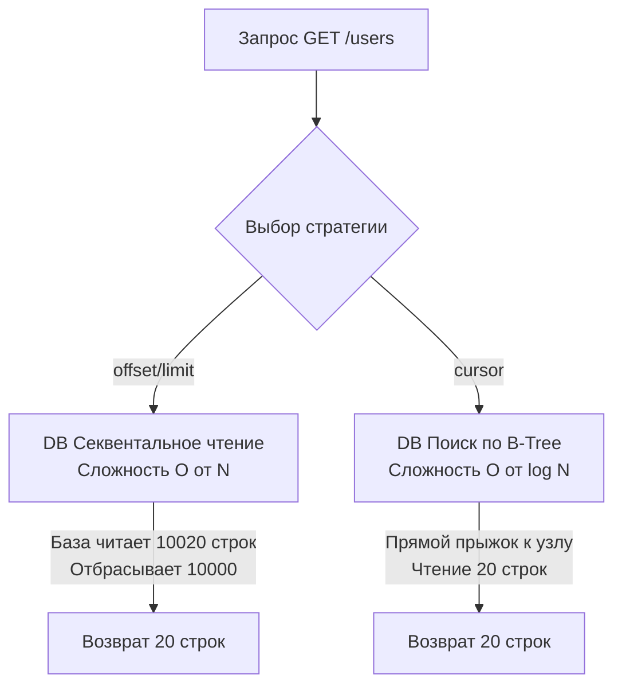

## Введение: Цена выборки «Всего»

Каждый разработчик начинает работу с базами данных с простого `SELECT * FROM users`. И в начале это отлично работает. Но по мере роста проекта таблицы разрастаются до десятков миллионов строк. 

В высоконагруженных распределенных системах мы никогда не должны доверять клиенту (Frontend, Mobile или другому микросервису). Если мы оставим эндпоинт `GET /users` без принудительного ограничения на количество возвращаемых записей, произойдет катастрофа:
1. **База данных:** Совершит Full Table Scan, вытеснит полезные данные из кэша (Buffer Pool) и загрузит диск IO-операциями.
2. **Сеть:** Забьет пропускную способность канала передачей мегабайт JSON.
3. **Go-приложение (Mechanical Sympathy):** Чтобы обработать 100 000 строк из `database/sql`, рантайм Go аллоцирует огромный срез (slice) структур в куче. Это вызовет всплеск потребления RAM (возможно, OOM) и заставит Garbage Collector "подавиться", останавливая мир (Stop-The-World паузы) для очистки этого мусора.

Чтобы этого избежать, мы обязаны применять паттерны **Пагинации (Pagination)**, **Фильтрации (Filtering)** и **Сортировки (Sorting)** на уровне API-контракта и транслировать их в оптимальные SQL-запросы.

---

## Пагинация: Битва подходов

Существует два фундаментальных способа реализовать постраничный вывод. И выбор между ними — это классический маркер уровня инженера на собеседовании.

### 1. Offset / Limit (Подход Junior)

Самый интуитивный способ. Клиент передает номер страницы и размер страницы: `GET /users?page=5&size=20`. 
Бэкенд переводит это в SQL:
```sql
SELECT id, name, created_at 
FROM users 
ORDER BY created_at DESC 
LIMIT 20 OFFSET 80;
```

> [!warning] Ловушка / Gotcha: Деградация производительности $O(N)$
> `OFFSET 1000000` не означает, что база данных магическим образом «перепрыгнет» на миллионную строку. Реляционная БД (PostgreSQL, MySQL) вынуждена прочитать с диска 1 000 020 строк, отсортировать их, **отбросить** первый миллион строк в мусорную корзину и вернуть только последние 20. На поздних страницах такой запрос будет выполняться секунды и убивать CPU базы данных.

**Вторая ловушка — Offset Drift (Смещение данных).** Пока клиент читал страницу 1, в систему добавилось 5 новых пользователей. Когда клиент запрашивает страницу 2 (со сдвигом 20), он увидит 5 дубликатов с первой страницы, потому что вся выборка "съехала" вниз.

### 2. Keyset / Cursor Pagination (Выбор Senior-инженера)

Вместо того чтобы говорить базе "пропусти 100 строк", мы говорим: "Дай мне 20 строк, которые идут строго **после** вот этой конкретной строки".
Клиент делает первый запрос: `GET /users?limit=20`. Сервер возвращает 20 записей и специальный токен — **Cursor**.
Следующий запрос: `GET /users?limit=20&cursor=dG9rZW4xMjM=`.

На уровне SQL это превращается в поиск по индексу:
```sql
-- Предположим, курсор был расшифрован как created_at = '2023-10-01 12:00:00'
SELECT id, name, created_at 
FROM users 
WHERE created_at < '2023-10-01 12:00:00' 
ORDER BY created_at DESC 
LIMIT 20;
```

> [!info] Под капотом: Магия B-Tree индекса
> Если на колонке `created_at` висит индекс B-Tree, сложность этого запроса составляет $O(\log N)$. Движок базы данных спускается по дереву индекса прямо к нужному значению (timestamp из курсора) и просто читает следующие 20 узлов дерева (Index Scan). Никакого чтения лишних строк, никаких сдвигов (Offset Drift). Запрос работает за 1 миллисекунду независимо от того, на первой мы странице или на тысячной.



> [!tip] Собеседование
> **Вопрос:** Как реализовать Cursor Pagination, если мы сортируем по не уникальному полю (например, `price`)? Ведь товаров с ценой "100" может быть много.
> **Ответ:** Использовать **Tie-breaker** (разрешитель ничьих). Мы должны добавить уникальное поле (обычно `id`) как вторичный критерий сортировки.
> Курсор будет содержать два значения: `(price, id)`.
> В PostgreSQL мы используем Tuple Comparison (сравнение кортежей):
> `WHERE (price, id) > (100, 452) ORDER BY price ASC, id ASC LIMIT 20;`
> Это позволяет однозначно позиционироваться в индексе, даже если цены совпадают. В Go мы кодируем структуру `{"price":100, "id":452}` в JSON и оборачиваем в Base64 — это и есть строка `cursor` для фронтенда.

---

## Сортировка (Sorting): Опасность Filesort

В API согласно принципам [[4. Resource oriented design.md]], параметры сортировки передаются в Query-строке:
`GET /users?sort=-created_at,name` (минус означает DESC).

Бэкенд на Go должен распарсить эту строку, провалидировать имена полей по White-list (иначе клиент сможет вытащить данные или устроить SQL Injection) и передать в `ORDER BY`.

> [!warning] Ловушка / Gotcha: Сортировка в памяти (Filesort / External Merge)
> Если клиент запрашивает сортировку по полю, на котором **нет индекса**, база данных не может просто выдать данные. Ей придется загрузить все подходящие строки в оперативную память (work_mem в Postgres). Если строк слишком много, БД сбросит их на жесткий диск во временные файлы, отсортирует там и только потом отдаст. Это убьет диск.
> **Правило:** В публичных API разрешайте сортировку ТОЛЬКО по тем полям, которые покрыты индексами. Строго валидируйте входные параметры!

---

## Фильтрация (Filtering): Динамический SQL в Go

Фильтрация позволяет клиенту делать выборки по критериям:
`GET /users?role=admin&status=active&age_gt=18`

Главная проблема при реализации этого в Go — генерация динамического SQL. 

```go
// АНТИПАТТЕРН: Никогда так не делайте! Прямой путь к SQL Injection
query := "SELECT * FROM users WHERE 1=1 "
if role != "" {
    query += "AND role = '" + role + "' " // Уязвимость!
}
```

Для сборки динамических фильтров в идиоматичном Go применяют Query Builders (например, пакет `Masterminds/squirrel`).

```go
// Идиоматичный Go: использование параметризованных запросов
import "[github.com/Masterminds/squirrel](https://github.com/Masterminds/squirrel)"

func BuildUserQuery(filter UserFilter) (string, []interface{}, error) {
    // Используем синтаксис плейсхолдеров Postgres ($1, $2)
    psql := squirrel.StatementBuilder.PlaceholderFormat(squirrel.Dollar)
    
    q := psql.Select("id", "name", "role").From("users")
    
    if filter.Role != "" {
        q = q.Where(squirrel.Eq{"role": filter.Role})
    }
    if filter.AgeGT > 0 {
        q = q.Where(squirrel.Gt{"age": filter.AgeGT})
    }
    
    q = q.OrderBy("created_at DESC").Limit(20)
    
    // ToSql возвращает строку с плейсхолдерами и слайс аргументов для database/sql
    return q.ToSql() 
}
```
Этот подход гарантирует безопасность: драйвер БД отправит параметры отдельно от запроса, исключая возможность SQL-иньекций.

---

## Mechanical Sympathy: Потоковое чтение в рантайме Go

Когда мы настроили правильную пагинацию (LIMIT 20), мы защитили приложение от OOM. Но как правильно вычитывать эти данные в Go?

Интерфейс `database/sql` спроектирован так, чтобы минимизировать аллокации через потоковое чтение из TCP-сокета базы данных:

```go
// rows.Query отправляет запрос, но НЕ ВЫКАЧИВАЕТ все результаты сразу
rows, err := db.QueryContext(ctx, query, args...)
if err != nil {
    return nil, err
}
// ОБЯЗАТЕЛЬНО: гарантируем закрытие соединения
defer rows.Close() 

var users []User
// rows.Next() читает следующую порцию данных из буфера TCP сокета
for rows.Next() {
    var u User
    // Прямая запись данных из бинарного формата БД в структуру
    if err := rows.Scan(&u.ID, &u.Name, &u.Role); err != nil {
        return nil, err
    }
    users = append(users, u)
}

// Проверка ошибок, возникших во время итерации (например, обрыв сети)
if err := rows.Err(); err != nil {
    return nil, err
}
```
Важно понимать, что `rows.Next()` не аллоцирует огромные массивы. Данные конвертируются из бинарного формата драйвера БД напрямую в вашу структуру. Ограничив `LIMIT 20`, мы гарантируем, что слайс `users` запросит у рантайма Go ровно тот объем памяти, который нужен для 20 структур, а затем быстро будет собран GC после отправки HTTP-ответа.

---

## Итог контракта

Идиоматичный JSON-ответ (см. [[9. Error handling в API.md]] для связи со стандартами) с курсорной пагинацией выглядит так:

```json
{
  "data": [
    { "id": 452, "price": 100, "name": "Книга" },
    { "id": 410, "price": 100, "name": "Ручка" }
  ],
  "meta": {
    "next_cursor": "eyJwcmljZSI6MTAwLCJpZCI6NDEwfQ==", 
    "has_next": true
  }
}
```
* Клиенту не нужно понимать, что внутри `next_cursor`. Он просто отправляет его обратно в следующем запросе.
* Сервер декодирует Base64-строку, достает JSON `{"price":100, "id":410}` и подставляет в `WHERE (price, id) > ($1, $2)`.

Мы научились эффективно и безопасно запрашивать данные, не ломая сервер. Но что делать, если злой умысел или сломанный скрипт клиента начнет запрашивать первую страницу 10 000 раз в секунду? Сервер быстро исчерпает пулы соединений с БД. Чтобы защитить инфраструктуру от перегрузки, нам необходимо выстроить линию обороны на входе. Эту задачу решает паттерн, который мы разберем в следующей статье: [[11. Rate limiting в API.md]].