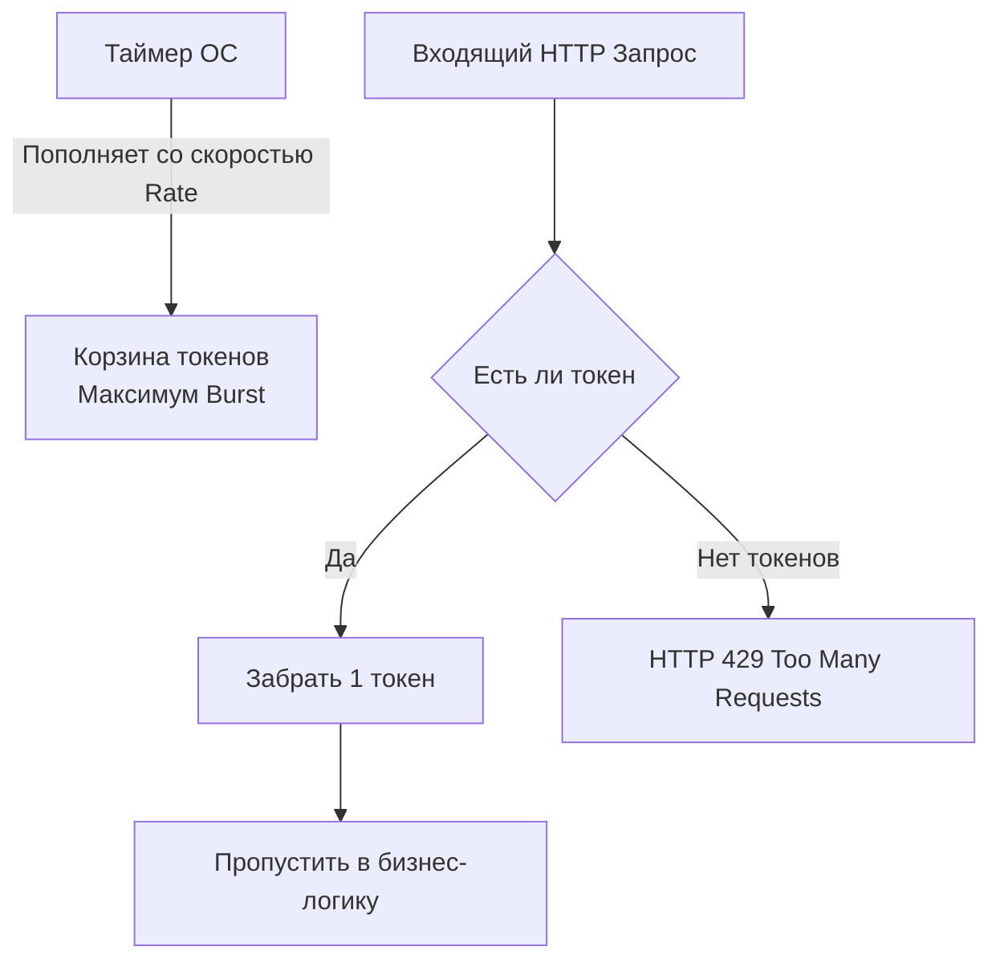
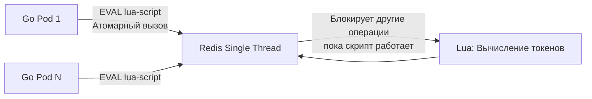

## Линия обороны: Зачем ограничивать запросы

В предыдущей статье ([[10. Pagination, filtering, sorting.md]]) мы защитили нашу базу данных от выгрузки огромных объемов информации в рамках одного запроса. Но что произойдет, если злоумышленник, плохо написанный скрипт или баг в мобильном приложении клиента начнут запрашивать эту самую первую страницу 10 000 раз в секунду?

В Go создание новой горутины для обработки входящего HTTP-запроса стоит всего пару килобайт памяти. Сервер на Go способен принимать десятки тысяч соединений. Но ваши базы данных (PostgreSQL), брокеры сообщений или сторонние API, к которым вы обращаетесь (например, биллинг), таких нагрузок не выдержат. У них закончатся пулы соединений (Connection Pools) или лимиты CPU.

**Rate Limiting (Ограничение частоты запросов)** — это архитектурный паттерн защиты системы, который контролирует количество запросов от одного клиента (IP-адреса, UserID или API-ключа) за единицу времени.

## Алгоритмы Rate Limiting: От наивных к индустриальным

Инженер уровня Senior должен знать не только как подключить библиотеку, но и по какому математическому алгоритму она работает, так как это напрямую влияет на потребление памяти и поведение при всплесках трафика (Burst).

### 1. Fixed Window (Фиксированное окно)
Самый простой алгоритм. Мы делим время на окна (например, с 12:00:00 до 12:01:00) и заводим счетчик для пользователя. Каждое обращение делает инкремент. Если счетчик превысил лимит (например, 100) — отклоняем запросы до начала следующей минуты.
* **Проблема:** "Проблема границы окна". Пользователь может отправить 100 запросов в 12:00:59 и еще 100 запросов в 12:01:01. Итог: наша инфраструктура получила удар в 200 запросов за 2 секунды, хотя лимит "100 в минуту".

### 2. Sliding Window (Скользящее окно)
Улучшенная версия. Мы храним временную метку (Timestamp) каждого запроса в массиве (например, в Redis List). При новом запросе мы удаляем все метки старше 1 минуты и считаем оставшиеся. 
* **Проблема:** Чудовищный расход памяти. Хранить миллионы меток времени для каждого пользователя — это прямой путь к Out Of Memory (OOM).

### 3. Token Bucket (Маркерная корзина) — Индустриальный стандарт
Именно этот алгоритм реализован в стандартной библиотеке `golang.org/x/time/rate`, а также в AWS, Stripe и других бигтехах.
У каждого клиента есть виртуальная "корзина", вмещающая максимум `Burst` токенов. Корзина пополняется со скоростью `Rate` (например, 10 токенов в секунду). При каждом запросе мы забираем 1 токен. Если корзина пуста — запрос отклоняется.



## Mechanical Sympathy: Как работает Token Bucket в Go

Если попросить Junior-разработчика написать Token Bucket с нуля, он почти наверняка создаст `time.Ticker` и запустит фоновую горутину:

```go
// АНТИПАТТЕРН: Убийца планировщика Go
func startRefill(bucket *Bucket) {
    ticker := time.NewTicker(time.Second)
    go func() {
        for range ticker.C {
            bucket.Lock()
            bucket.Tokens++
            bucket.Unlock()
        }
    }()
}
```

> [!warning] Ловушка / Gotcha: Смерть от горутин
> Представьте, что у вас 100 000 уникальных IP-адресов. Запуск 100 000 фоновых горутин с тикерами приведет к созданию 100 000 системных таймеров в рантайме Go (`runtime.timers`). Процессор будет тратить большую часть времени не на обработку запросов, а на переключение контекста и пробуждение горутин, чтобы сделать `Tokens++`.

**Идиоматичное решение (Lazy Evaluation):**
Официальный пакет `golang.org/x/time/rate` не использует ни одной фоновой горутины. Он использует **ленивое вычисление**. 
Структура хранит только текущее количество токенов и `last_updated` (время последнего запроса).
Когда приходит новый запрос, пакет берет `time.Now()`, вычисляет `delta = now - last_updated`, умножает это на скорость пополнения (`Rate`) и прибавляет результат к текущему количеству токенов.
Это чистая математика (операции с плавающей точкой или целыми числами), выполняющаяся за наносекунды с алгоритмической сложностью $O(1)$ по времени и памяти.

> [!info] Под капотом: Monotonic Clocks
> При вычислении разницы времени в Go используется Монотонные часы (Monotonic Clock), а не настенные (Wall Clock). Если системный администратор или NTP-сервер переведут время на сервере на час назад, Wall Clock изменится, и наивный алгоритм выдаст отрицательную дельту (заблокировав клиента на час). `time.Now()` в Go возвращает время с монотонным смещением (от момента старта ОС), которое всегда идет только вперед, защищая ваш лимитер от временных аномалий.

## Распределенный Rate Limiting: Боль микросервисов

Локальный лимитер в памяти Go работает отлично... пока вы не деплоите свое приложение в Kubernetes с 5 репликами (Pods).
Если балансировщик Nginx раскидывает запросы клиента по разным подам по принципу Round Robin, каждый под будет считать лимиты отдельно. Лимит в 100 RPS превратится в 500 RPS.

Для распределенного Rate Limiting нам нужен единый источник истины. Обычно это **Redis**.

### Проблема Race Conditions
Представим, что два Go-инстанса одновременно получают запрос от одного IP и обращаются к Redis:
1. Pod 1 делает `GET ip_123` -> получает `10`.
2. Pod 2 делает `GET ip_123` -> получает `10`.
3. Pod 1 вычисляет 10 - 1 = 9 и делает `SET ip_123 9`.
4. Pod 2 вычисляет 10 - 1 = 9 и делает `SET ip_123 9`.

**Итог:** Обработано 2 запроса, но списан только 1 токен. Это классическое состояние гонки (Lost Update).

> [!tip] Собеседование
> **Вопрос:** Как реализовать Token Bucket в Redis без race conditions, если встроенных команд для этого алгоритма нет?
> **Ответ:** Использовать **Lua-скрипты**. Redis выполняет Lua-скрипты атомарно (в один поток). Наш Go-сервис отправляет Lua-скрипт и нужные параметры (IP, текущее время). Redis внутри себя атомарно читает старое значение, вычисляет дельту по времени (lazy evaluation), обновляет ключи и возвращает `true/false` (пропустить запрос или нет). Никакая другая команда не может вклиниться в процесс выполнения Lua-скрипта.



## HTTP Контракт: Как отказывать красиво

Когда лимиты исчерпаны, мы обязаны использовать правильные HTTP-статусы ([[6. Статусы HTTP.md]]).

1. **HTTP Статус:** `429 Too Many Requests`. Это четкий сигнал клиенту, что проблема не в данных, а в частоте.
2. **Заголовок Retry-After:** Спецификация требует возвращать этот заголовок. Он указывает клиенту, через сколько секунд ему разрешено повторить запрос.
   * `Retry-After: 60` (повторить через минуту)
3. **Заголовки состояния (X-RateLimit):** Индустриальный стандарт де-факто (хоть и не закреплен в RFC жестко) — отдавать клиенту понимание его квоты при КАЖДОМ ответе (даже при `200 OK`):
   * `X-RateLimit-Limit: 100` (максимум запросов в минуту)
   * `X-RateLimit-Remaining: 42` (осталось запросов в текущем окне)
   * `X-RateLimit-Reset: 1698765432` (Unix Timestamp, когда лимиты обнулятся)

## Ловушка на собеседовании: Утечка памяти в локальном лимитере

Допустим, вы пишете API Gateway на Go и решили использовать локальный `golang.org/x/time/rate`. Вы создаете мапу:

```go
var (
    limiters = make(map[string]*rate.Limiter) // ключ - IP адрес
    mu       sync.RWMutex
)

func getVisitor(ip string) *rate.Limiter {
    mu.RLock()
    limiter, exists := limiters[ip]
    mu.RUnlock()

    if !exists {
        mu.Lock()
        limiter = rate.NewLimiter(1, 3)
        limiters[ip] = limiter
        mu.Unlock()
    }
    return limiter
}
```

> [!warning] Ловушка / Gotcha: Безлимитный рост Map
> В чем фатальная ошибка этого кода? **В нем нет механизма удаления (Eviction).**
> Если ваш сервис просканирует ботнет с 1 000 000 уникальных IP-адресов (сделав по одному запросу с каждого), мапа `limiters` навсегда сохранит 1 миллион объектов в куче Go. Память никогда не очистится, так как на каждый `*rate.Limiter` есть активная ссылка из структуры мапы. Это классическая утечка памяти (Memory Leak).
> 
> **Решение:** Использовать пакеты LRU-кэша (например, `hashicorp/golang-lru`), которые автоматически вытесняют старые элементы, либо запускать отдельную фоновую горутину-уборщика, которая раз в минуту сканирует мапу и удаляет объекты, у которых `last_seen` больше часа назад.

## Итог

1. **Rate Limiting** — обязательный паттерн для любого production API. Без него ваш сервис уязвим для DDoS или ошибок на клиенте.
2. Под капотом правильный лимитер (Token Bucket) использует **ленивые вычисления** и монотонные часы ОС, избегая создания тысяч горутин.
3. В распределенных системах полагаться на память Go нельзя — нужен Redis и **атомарные Lua-скрипты**.
4. Обязательно соблюдайте HTTP-контракт: возвращайте статус `429` и заголовки `Retry-After`.

Ограничив агрессивных клиентов, мы можем заняться оптимизацией легитимных. Как сделать так, чтобы тяжелый GET-запрос вообще не доходил до базы данных и даже не парсился внутри Go-приложения? В следующей статье мы разберем тонкости работы с сетями доставки и заголовками для реализации кэширования: [[12. Caching HTTP.md]].