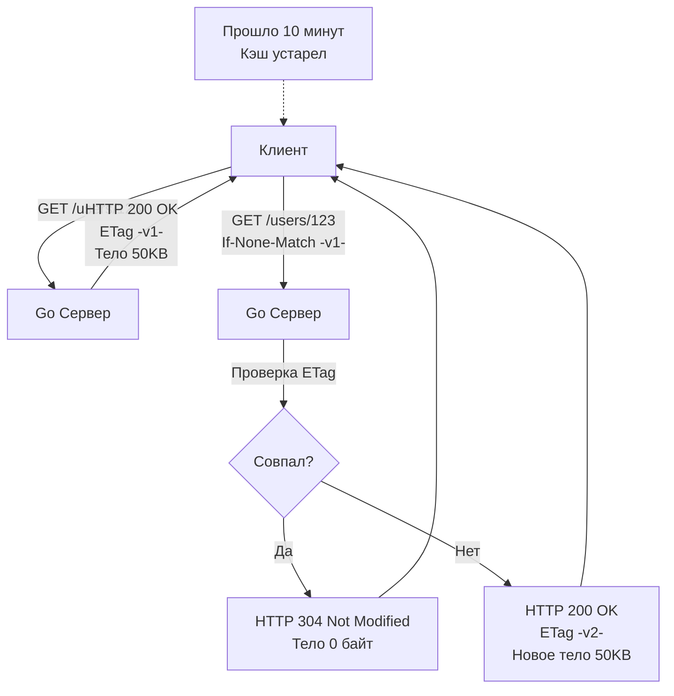

## Самый быстрый запрос — тот, которого не было

В предыдущих статьях мы оптимизировали работу с базой данных ([[10. Pagination, filtering, sorting.md]]) и защищали приложение от перегрузок ([[11. Rate limiting в API.md]]). Но даже самый оптимизированный код на Go с идеальными SQL-запросами требует тактов процессора, аллокаций памяти и сетевого IO. 

С точки зрения **Mechanical Sympathy**, каждый входящий HTTP-запрос, дошедший до рантайма Go, означает:
1. Системный вызов `epoll` / `kqueue` в Netpoller'е.
2. Пробуждение горутины планировщиком (переключение контекста).
3. Аллокацию структур `http.Request` и буферов для чтения заголовков в куче (Heap).
4. Работу сборщика мусора (GC) по очистке этого мусора после ответа.

Для высоконагруженных (Highload) систем истинное мастерство заключается в том, чтобы **вообще не пускать запрос в Go-приложение**, если ответ на него не изменился. Эту задачу решает кэширование на уровне HTTP-протокола. Используя правильные заголовки, мы можем заставить браузер клиента или промежуточные узлы (CDN, Nginx, API Gateway) отдавать данные прямо из их оперативной памяти.

## Анатомия HTTP Кэша: RFC 7234

Кэширование в REST (одно из обязательных архитектурных ограничений, см. [[3. REST. Основные принципы.md]]) управляется набором стандартных заголовков. Исторически их было много (`Expires`, `Pragma`), но в современном вебе балом правит один мощный заголовок — `Cache-Control`.

### Директивы Cache-Control

* **`public`**: Разрешает кэшировать ответ *любому* узлу в цепи (браузеру клиента, провайдеру, CDN Cloudflare, вашему Nginx).
* **`private`**: Разрешает кэшировать ответ *только* конечному клиенту (в браузере или мобильном приложении). Промежуточные прокси-серверы не имеют права сохранять этот ответ. Критически важно для эндпоинтов, возвращающих персональные данные (например, профиль пользователя).
* **`max-age=N`**: Указывает, сколько секунд ответ считается "свежим" (Fresh). Пока время не вышло, клиент вообще не будет отправлять сетевой запрос к вам, а сразу достанет данные из своего локального кэша.
* **`s-maxage=N`**: То же самое, что и `max-age`, но применяется *только* для Shared-кэшей (CDN). Позволяет настроить разное время жизни для браузера и балансировщика.

> [!tip] Собеседование
> **Вопрос:** В чем разница между `Cache-Control: no-cache` и `Cache-Control: no-store`? (Это классический вопрос-ловушка).
> **Ответ:** > * `no-store` означает **абсолютный запрет на кэширование**. Ни браузер, ни CDN не имеют права сохранять эти байты на диск или в память.
> * `no-cache` означает **"кэшировать можно, но перед использованием ОБЯЗАТЕЛЬНО спроси у сервера, не изменились ли данные"** (сделай валидационный запрос).

## Валидация кэша: Conditional Requests (Условные запросы)

Что происходит, когда `max-age` истекает? Ответ становится "протухшим" (Stale). Но это не значит, что данные реально изменились в базе! 

Вместо того чтобы заново скачивать весь JSON размером 2 МБ, клиент должен отправить **Условный запрос** (Conditional Request), используя механизмы валидации. Их два: по времени и по хешу.

### 1. Last-Modified / If-Modified-Since
Сервер отдает заголовок `Last-Modified: Wed, 21 Oct 2026 07:28:00 GMT`. 
Когда кэш истекает, клиент шлет запрос с заголовком `If-Modified-Since: Wed, 21 Oct 2026...`.
Go-сервер проверяет дату обновления сущности в базе. Если дата не изменилась, сервер не сериализует JSON, а мгновенно возвращает статус [[6. Статусы HTTP.md]] `304 Not Modified` с пустым телом ответа.

### 2. ETag / If-None-Match (Индустриальный стандарт)
Работа со временем часто дает сбои (проблемы часовых поясов, точность до секунд). `ETag` (Entity Tag) — это строка-идентификатор версии ресурса (обычно MD5-хеш от контента или номер ревизии из БД).



## Mechanical Sympathy: Ловушка генерации ETag в Go

Понимание того, *как именно* вы генерируете ETag, отличает Senior-инженера от Middle.

Типичная ошибка (Антипаттерн): написать Middleware, который перехватывает `http.ResponseWriter`, буферизует весь записанный JSON, вычисляет от него хеш (например, SHA1) и сравнивает с заголовком от клиента.

```go
// АНТИПАТТЕРН: Делает бесполезную работу
func ETagMiddlewareAntiPattern(next http.Handler) http.Handler {
    return http.HandlerFunc(func(w http.ResponseWriter, r *http.Request) {
        // Мы уже сходили в БД, уже аллоцировали структуры, 
        // уже потратили время GC на сериализацию JSON!
        body := generateHeavyJSON() 
        hash := calculateMD5(body)
        
        if r.Header.Get("If-None-Match") == hash {
            w.WriteHeader(http.StatusNotModified)
            return // Мы сэкономили трафик, но сожгли CPU!
        }
        w.Write(body)
    })
}
```
**Почему это плохо?** Вы сэкономили пропускную способность сети (Bandwidth), вернув `304 Not Modified`, но вы **не сэкономили ресурсы процессора и базы данных**. Вы все равно сделали тяжелый SELECT, загрузили структуры в кучу Go и сожгли такты CPU на JSON-сериализацию и хеширование.

**Идиоматичный подход (Senior Way):**
ETag должен вычисляться **до** тяжелых операций. Идеальный ETag — это `revision_id` или `updated_at` (преобразованный в Unix timestamp), который мы легко и дешево достаем из базы данных.

```go
// ИДИОМАТИЧНЫЙ GO: Быстрая проверка без аллокаций тяжелых данных
func GetUserHandler(w http.ResponseWriter, r *http.Request) {
    userID := r.PathValue("id")
    
    // 1. Делаем очень легкий запрос: получаем ТОЛЬКО версию (или timestamp)
    version, err := db.GetUserVersionOnly(r.Context(), userID)
    if err != nil {
        http.Error(w, err.Error(), http.StatusInternalServerError)
        return
    }
    
    currentETag := fmt.Sprintf(`"%d"`, version)
    
    // 2. Сравниваем с заголовком клиента ДО загрузки самих данных
    if r.Header.Get("If-None-Match") == currentETag {
        w.WriteHeader(http.StatusNotModified)
        return // <- Идеально! Ноль аллокаций тяжелых DTO, ноль JOIN-ов в БД.
    }
    
    // 3. Если ETag не совпал - делаем тяжелую работу
    user := db.GetFullUserWithHeavyJoins(r.Context(), userID)
    
    w.Header().Set("ETag", currentETag)
    w.Header().Set("Cache-Control", "private, max-age=3600")
    json.NewEncoder(w).Encode(user)
}
```

## Заголовок Vary: Разминирование кэш-бомбы

`Vary` — самый важный, но наименее понятный заголовок для настройки CDN и Nginx. 
Он говорит кэширующему серверу: *"Даже если URL один и тот же, ответы могут быть разными в зависимости от указанных заголовков запроса"*.

> [!warning] Ловушка / Gotcha: Утечка чужих данных (Cross-User Data Leak)
> Представьте, вы добавили `Cache-Control: public, max-age=60` на эндпоинт `GET /profile/settings`. 
> Пользователь А (с токеном А) запрашивает настройки. CDN сохраняет ответ.
> Через 5 секунд Пользователь Б (с токеном Б) делает запрос на тот же URL. CDN видит, что URL совпадает, и отдает Пользователю Б **персональные данные Пользователя А**! Это критическая уязвимость (P1).

Как это исправить?
1. Использовать `Cache-Control: private` (чтобы запретить CDN кэшировать это для всех).
2. Обязательно возвращать заголовок `Vary: Authorization`. Это скажет CDN: *"Создавай отдельную запись в кэше для каждого уникального токена авторизации"*.

Еще один классический пример — сжатие: `Vary: Accept-Encoding`. Это гарантирует, что клиент, не поддерживающий gzip, не получит из кэша бинарный сжатый мусор, который CDN ранее сохранил для более современного браузера.

## Паттерн Stale-While-Revalidate

В высоконагруженных микросервисах кэш имеет побочный эффект: **Cache Stampede (Эффект табуна)**.
Когда популярный кэш (например, главная страница магазина) истекает, 10 000 клиентов одновременно делают запрос. Nginx видит, что кэша нет, и отправляет все 10 000 запросов в ваш Go-бэкенд. База данных ложится от перегрузки.

Чтобы решить это на уровне HTTP, был введен заголовок расширения:
`Cache-Control: max-age=60, stale-while-revalidate=120`

Это гениальная механика:
1. До 60 секунд: CDN отдает кэш мгновенно.
2. От 60 до 180 секунд: Если приходит клиент, CDN **моментально отдает ему старый (stale) кэш**, но в фоне (асинхронно) отправляет **один** запрос к вашему Go-бэкенду, чтобы обновить данные.
3. Ваша система обрабатывает 1 фоновый запрос вместо 10 000. Клиенты получают ответ за 1 миллисекунду.

## Итог

1. **Самая мощная оптимизация бэкенда** — настроить правильные заголовки HTTP-кэширования и переложить отдачу статических или редко меняющихся данных на CDN (Cloudflare) или Nginx.
2. **Conditional Requests (ETag)** экономят трафик. Но для экономии CPU и памяти (с точки зрения Go) ETag нужно валидировать на базе легковесных запросов или счетчиков из Redis, избегая сборки тяжелых JSON-структур.
3. Обязательно используйте заголовок **Vary**, если ваш ответ зависит от заголовков клиента (`Accept-Encoding`, `Authorization`), иначе вы рискуете слить чужие данные.
4. Для публичных тяжелых эндпоинтов используйте **stale-while-revalidate**, чтобы защитить систему от лавинообразных нагрузок при инвалидации кэша.

Кэширование отлично работает для безопасных методов (GET). Но что делать с мутирующими запросами (POST), когда сеть обрывается и мы не знаем, выполнилась ли операция? Защиту от повторных списаний средств или создания дубликатов обеспечивает паттерн, который мы подробно разберем в следующей статье: [[13. Idempotency ключи.md]].