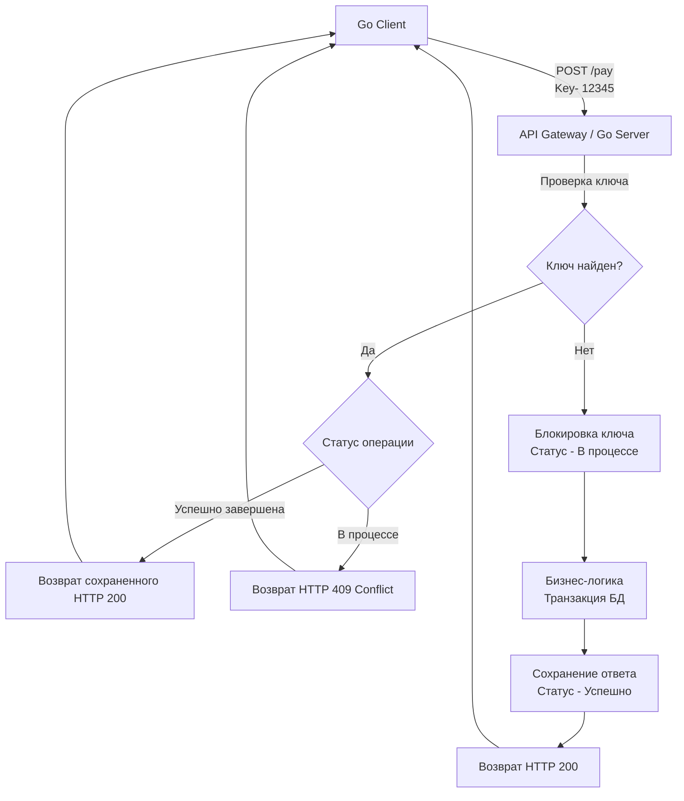

## Проблема слепых зон: Когда сеть подводит

В статье [[5. HTTP методы и идемпотентность.md]] мы установили фундаментальное правило: безопасные методы (GET, PUT, DELETE) можно повторять бесконечно. Если запрос "моргнул" в сети, балансировщик или HTTP-клиент в рантайме Go автоматически выполнит retry (повторную попытку).

Но что делать с операциями, которые **мутируют состояние и не являются идемпотентными по своей природе**? 
Самый классический пример — `POST /transactions` (списание средств) или `POST /orders` (создание заказа).

1. Клиент (Mobile App) отправляет запрос на списание 100$.
2. Ваш Go-бэкенд получает запрос, идет в базу данных и успешно списывает деньги.
3. Бэкенд отправляет HTTP `200 OK` клиенту.
4. **Происходит обрыв связи (Network Partition).** Ответ теряется где-то на уровне вышек сотовой связи.
5. Клиент получает `context.DeadlineExceeded` (таймаут).
6. С точки зрения клиента операция не выполнена. Приложение показывает ошибку и предлагает "Повторить".
7. Клиент нажимает кнопку, запрос повторяется, и ваш бэкенд списывает **еще 100$**.

Это катастрофа для бизнеса. Чтобы решить эту проблему, мы должны сделать неидемпотентный метод `POST` искусственно идемпотентным. Для этого используется паттерн **Idempotency Key (Ключ идемпотентности)**.

## Механика Idempotency Key: Контракт надежности

Идея паттерна заимствована из платежных систем (Stripe был пионером, сейчас это черновик стандарта IETF). 

1. Перед тем как отправить критичный `POST`-запрос, клиент генерирует уникальный идентификатор (обычно UUIDv4).
2. Клиент прикрепляет его в виде HTTP-заголовка: `Idempotency-Key: 123e4567-e89b-12d3-a456-426614174000`.
3. Сервер "запоминает" этот ключ вместе с результатом выполнения запроса.
4. Если клиент повторяет запрос с **тем же ключом**, сервер не выполняет бизнес-логику повторно, а просто достает из памяти закэшированный ответ от первой попытки и отдает его со статусом [[6. Статусы HTTP.md]].



## Где хранить состояние: Redis vs PostgreSQL

В распределенной системе, где у вас запущено 10 реплик (Pods) вашего Go-приложения, хранить ключи в оперативной памяти (в `map`) невозможно. Запрос-повтор может прилететь на другой инстанс. Нам нужно централизованное хранилище.

### Подход 1: Redis (Высокая производительность)
Ключи складываются в Redis с использованием команды `SETNX` (Set if Not eXists) или через Lua-скрипты для атомарности.
* **Плюсы:** Невероятно быстро. Идеально для Rate Limiting ([[11. Rate limiting в API.md]]) и идемпотентности, не нагружает основную БД. Легко настроить TTL (Time To Live), чтобы старые ключи сами удалялись через 24 часа.
* **Минусы:** Возможен рассинхрон. Если Redis упал, а БД жива, мы теряем гарантии идемпотентности. Если транзакция в БД прошла, но сеть до Redis моргнула и мы не сохранили ответ, при ретрае мы получим двойное списание.

### Подход 2: Основная реляционная БД (PostgreSQL) — Идеально для транзакций
Таблица `idempotency_keys` лежит в той же базе, что и бизнес-данные (например, таблица `transactions`).
* **Плюсы:** Абсолютная ACID-надежность. Мы можем обновлять статус ключа идемпотентности в рамках **той же самой транзакции**, что и списание средств. Либо всё закомитится вместе, либо всё откатится.
* **Минусы:** Дополнительная нагрузка на дисковую подсистему БД. Очистка старых ключей требует написания фоновых Cron-джобов.

> [!info] Под капотом: Транзакционная идемпотентность в БД
> С точки зрения Mechanical Sympathy, поход в Redis перед походом в PostgreSQL — это два сетевых вызова. В Highload системах (например, в финтехе) мы стараемся объединить их в один.
> Мы создаем таблицу `idempotency_keys (key UUID PRIMARY KEY, response JSONB, status VARCHAR)`.
> В Go мы открываем `sql.Tx`. Первым запросом делаем:
> `INSERT INTO idempotency_keys (key, status) VALUES ($1, 'in_progress') ON CONFLICT DO NOTHING;`
> Если строк затронуто 0 (ключ уже есть) — мы откатываем транзакцию (Rollback) и возвращаем клиенту кэш. Если 1 — продолжаем бизнес-логику и в конце той же транзакции делаем `UPDATE idempotency_keys SET status = 'completed', response = $2 WHERE key = $1`.

## Race Conditions: Параллельные ретраи

Самая сложная часть идемпотентности — это конкурентность.
Что произойдет, если клиент (из-за бага на фронтенде) отправит два абсолютно одинаковых запроса с одним ключом **одновременно**, миллисекунда в миллисекунду? 

Оба запроса попадут в разные горутины в вашем Go-приложении. Если вы сначала "читаете" ключ, а потом "пишете" — вы получите классический Race Condition, и обе горутины начнут списывать деньги.

Защита строится на строгих атомарных блокировках БД.
Когда второй запрос пытается вставить ключ "In Progress", который уже вставил первый запрос, он получит ошибку уникальности (Unique Violation). 

**Что должен вернуть сервер второму запросу?**
Типичная ошибка — заставить горутину второго запроса сделать `time.Sleep` или заблокироваться в ожидании (через `sync.Cond` или цикл), пока первый запрос не запишет ответ.
Это убивает производительность. Горутина "зависает", удерживая память и возможно ресурсы БД. 
**Идиоматичный подход:** Немедленно разорвать выполнение и вернуть клиенту HTTP `409 Conflict` (или `425 Too Early`), сигнализируя: "Твой первый запрос еще выполняется, перестань спамить, подожди секунду и спроси снова".

## Ловушки и корнер-кейсы (Gotchas)

> [!warning] Ловушка / Gotcha: Смена Payload-а (Payload Mismatch)
> Представьте сценарий:
> 1. Клиент шлет: `Idempotency-Key: X`, Тело: `{"amount": 100, "currency": "USD"}`.
> 2. Запрос падает по таймауту на клиенте, но успешно выполняется на сервере.
> 3. Злоумышленник (или бажный клиент) меняет тело запроса, но оставляет тот же ключ!
> 4. Ре-трай: `Idempotency-Key: X`, Тело: `{"amount": 999999, "currency": "USD"}`.
>
> Если ваш сервер просто проверяет ключ `X` и отдает кэш первого ответа, клиент получит чек на 100$, а сервер проигнорирует попытку списать 999999$. Но контракт нарушен!
> **Решение:** При сохранении ключа идемпотентности вы обязаны вычислить хэш (например, SHA-256) от всего тела HTTP-запроса (Payload) и сохранить его рядом с ключом. При ретрае сервер должен сравнить хэш нового тела с хэшем старого. Если они отличаются — возвращать жесткую ошибку `400 Bad Request` (Idempotency Key Mismatch).

> [!tip] Собеседование
> **Вопрос:** Если во время выполнения бизнес-логики (после захвата ключа идемпотентности) база данных упала и транзакция откатилась, какой статус ключа должен остаться в системе?
> **Ответ:** Ключ должен быть **удален** (или переведен в статус `failed`), чтобы разрешить клиенту сделать безопасный retry. Если вы оставите его в состоянии `in_progress` или закэшируете ошибку 500, клиент больше никогда не сможет завершить этот платеж (ключ будет "отравлен"). Кэшировать можно только терминальные бизнес-состояния (успех 2xx или бизнес-ошибки 4xx, например "Недостаточно средств"). Технические ошибки 5xx кэшировать нельзя!

## Жизненный цикл ключа в Go (Архитектура)

Реализация идемпотентности не должна размазываться по бизнес-логике. В идиоматичном Go-коде это выносится либо в **Middleware** (если используется Redis), либо в паттерн **Decorator** для сервисного слоя (если транзакции завязаны на БД).

Пример структуры в БД:
```sql
CREATE TABLE idempotency_keys (
    idempotency_key UUID PRIMARY KEY,
    request_hash VARCHAR(64) NOT NULL,
    http_status INT,           -- Заполняется после успеха
    response_body JSONB,       -- Заполняется после успеха
    created_at TIMESTAMP WITH TIME ZONE DEFAULT NOW(),
    expires_at TIMESTAMP WITH TIME ZONE NOT NULL
);
```

TTL (Time To Live) — обязательное условие. Ключи идемпотентности не должны храниться вечно. Для большинства API срок жизни ключа составляет 24 часа. В PostgreSQL для этого можно использовать партиционирование таблиц по датам (с drop старых партиций) или фоновый процесс (Daemon) на Go, который раз в час выполняет `DELETE FROM idempotency_keys WHERE expires_at < NOW()`.

## Итог

1. Идемпотентные ключи спасают бизнес-критичные методы (`POST`, `PATCH`) от дублирования при нестабильной сети.
2. Имплементация требует **атомарной блокировки** (через Redis SETNX или Constraints в реляционных БД), чтобы избежать двойного исполнения при конкурентных ретраях.
3. Обязательно защищайтесь от **Payload Mismatch**, хэшируя тело запроса.
4. Никогда не кэшируйте технические ошибки (5xx) — это "отравит" ключ и заблокирует клиента.

Проектируя такие сложные и неявные контракты, мы должны как-то донести до потребителей нашего API (клиентов, партнеров), какие заголовки они обязаны передавать, какие статусы ожидать и как формировать тела запросов. Хранить это в Wiki — путь к рассинхрону. Индустрия решила эту проблему через строгие схемы описания. О том, как документировать контракты так, чтобы код генерировался сам, мы поговорим в следующей статье: [[14. OpenAPI и Swagger.md]].