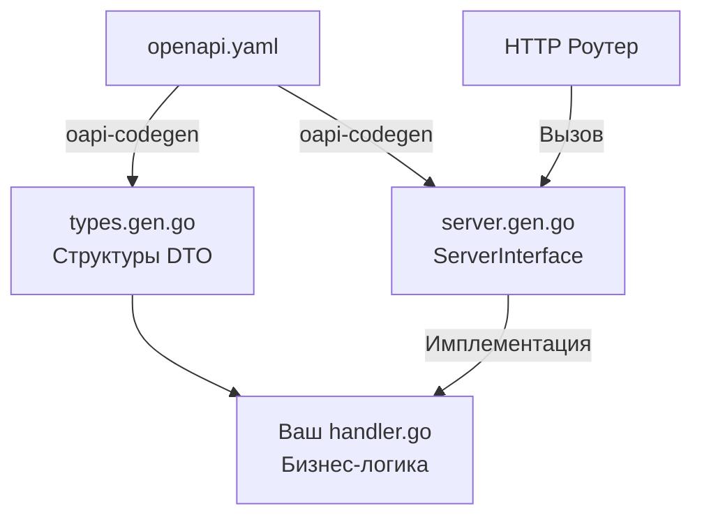

## Swagger и OpenAPI: От документации к строгому контракту

В статье [[2. Что такое API и контракт.md]] мы установили, что контракт — это обещание, высеченное в камне. Но как именно "высечь" это обещание для HTTP/JSON API, где нет строгой типизации, как в gRPC? 

Долгое время бэкенд-разработчики писали документацию в Wiki, Google Docs или Postman. Это приводило к классической проблеме рассинхронизации: код ушел вперед, документация устарела, фронтенд упал. 

Решением стала концепция машиночитаемого описания API. И здесь начинается путаница в терминах, которую на собеседованиях часто используют как проверку на "насмотренность".

### Swagger vs OpenAPI: Конец путаницы

* **OpenAPI Specification (OAS):** Это *спецификация* (стандарт), описывающая структуру вашего API (эндпоинты, методы, форматы JSON, схемы авторизации). Ранее она называлась Swagger Specification, но в 2015 году была передана в Linux Foundation и переименована в OpenAPI. Сейчас актуальны версии 3.0 и 3.1.
* **Swagger:** Это *набор инструментов* (Tooling) от компании SmartBear, который работает с форматом OpenAPI. 
    * *Swagger Editor* — браузерный редактор YAML.
    * *Swagger UI* — тот самый красивый веб-интерфейс с кнопочкой "Try it out", который рендерит вашу OpenAPI-схему в HTML.

> [!tip] Собеседование
> **Вопрос:** В чем разница между Swagger и OpenAPI?
> **Ответ:** OpenAPI — это формат данных (спецификация), описывающий контракт. Swagger — это инструменты для визуализации и работы с этой спецификацией. Мы пишем OpenAPI-файл, чтобы отобразить его в Swagger UI.

---

## Битва подходов: Code-First против Design-First

В мире Go существует два диаметрально противоположных подхода к работе с OpenAPI. Выбор подхода определяет архитектуру вашего проекта.

### 1. Code-First (Генерация из кода)

Вы пишете Go-код, добавляете к нему специальные комментарии, а затем утилита (например, `swaggo/swag`) сканирует эти комментарии и генерирует файл `swagger.json`.

```go
// @Summary Получить пользователя
// @Description Возвращает профиль по ID
// @Tags users
// @Accept json
// @Produce json
// @Param id path int true "ID Пользователя"
// @Success 200 {object} domain.UserDTO
// @Failure 404 {object} apperrors.ProblemDetails
// @Router /users/{id} [get]
func (h *Handler) GetUser(w http.ResponseWriter, r *http.Request) {
    // реализация...
}
```

**Плюсы:** Быстрый старт. Документация живет рядом с кодом.
**Минусы (Почему Senior-инженеры избегают этого):**
1.  **Загрязнение кода:** Бизнес-логика тонет в простынях комментариев. Для сложного эндпоинта комментарий может занимать 50 строк, а сам код хендлера — 10.
2.  **Запоздалая документация:** Вы сначала пишете код, а потом документируете его. Фронтенд-разработчики вынуждены ждать, пока вы напишете бэкенд, чтобы получить документацию и начать свою работу.
3.  **Ошибки парсинга:** `swaggo` использует пакет `go/ast` для разбора абстрактного синтаксического дерева Go. Если ваши DTO-структуры разбросаны по сложным пакетам с дженериками (Generics), парсер часто ломается или генерирует неверный JSON Schema.

### 2. Design-First (Сначала проектирование)

Это индустриальный стандарт для микросервисной архитектуры.
Вы (или системный аналитик) сначала описываете контракт в файле `openapi.yaml`. Это источник истины (Single Source of Truth). И только после утверждения контракта начинается написание кода.

```yaml
# openapi.yaml
openapi: 3.0.3
info:
  title: Users API
  version: 1.0.0
paths:
  /users/{id}:
    get:
      summary: Получить пользователя
      parameters:
        - name: id
          in: path
          required: true
          schema:
            type: integer
      responses:
        '200':
          description: OK
          content:
            application/json:
              schema:
                $ref: '#/components/schemas/User'
```

**Преимущества Design-First:**
* **Параллельная разработка:** Как только YAML закоммичен в репозиторий, Frontend или Mobile-команда может запустить Mock-сервер (например, Prism) на основе этого YAML и начать писать UI. Им не нужен работающий Go-бэкенд.
* **Строгий контракт (Contract-Driven):** Вы не сможете случайно изменить ответ сервера, так как генераторы кода завяжут вас на интерфейсы из спецификации.

---

## Code Generation: Магия oapi-codegen

В подходе Design-First мы не пишем HTTP-роутинг и DTO структуры руками. Мы используем кодогенерацию. В мире Go абсолютным лидером для этого является библиотека `deepmap/oapi-codegen`.

Она читает ваш `openapi.yaml` и генерирует:
1.  **Типы данных (Models):** Go-структуры с правильными JSON-тегами.
2.  **Интерфейс сервера (Server Interface):** Интерфейс, который ВЫ обязаны реализовать.
3.  **Код роутера:** Обвязку для `chi`, `echo` или стандартного `net/http` ServeMux.



> [!info] Под капотом: Защита на этапе компиляции
> Сгенерированный интерфейс выглядит примерно так:
> `type ServerInterface interface { GetUser(w http.ResponseWriter, r *http.Request, id int) }`
> Если бизнес решит изменить тип ID пользователя с `int` на `UUID`, вы измените `openapi.yaml`. `oapi-codegen` сгенерирует новый интерфейс с параметром `id uuid.UUID`. 
> Ваш старый Go-код **перестанет компилироваться**, потому что ваш обработчик больше не удовлетворяет интерфейсу `ServerInterface`. Это невероятно мощный механизм. Компилятор Go становится вашим главным QA-инженером, не позволяя выкатить API, нарушающее контракт (см. [[8. Versioning API.md]]).

---

## Mechanical Sympathy: Обслуживание Swagger UI

Распространенный антипаттерн в Go — "вшивать" Swagger UI прямо в бинарник приложения и отдавать его через `http.FileServer` или пакеты вроде `http-swagger`.

```go
// АНТИПАТТЕРН для Highload
import "[github.com/swaggo/http-swagger](https://github.com/swaggo/http-swagger)"

func main() {
    r := chi.NewRouter()
    // Go-сервер тратит ресурсы на отдачу HTML, JS, CSS и 2MB JSON файла
    r.Get("/swagger/*", httpSwagger.WrapHandler) 
}
```

Почему это плохо с точки зрения архитектуры и железа?
1.  **Утечка ресурсов (CPU/RAM):** Ваш Go-бэкенд спроектирован для высокоскоростной обработки транзакций. Отдача статических файлов (JS/CSS бандлов Swagger UI) блокирует горутины, требует аллокаций памяти под `[]byte` и генерирует бесполезный сетевой IO.
2.  **Размер бинарника:** Использование `go:embed` для встраивания Swagger-ассетов раздувает размер исполняемого файла.
3.  **Безопасность:** В публичном контуре часто забывают закрыть `/swagger/` роут, сливая злоумышленникам полную карту атаки на ваш сервис.

**Идиоматичный подход (Infrastructure-First):**
Go-приложение должно отдавать ТОЛЬКО JSON-данные. Swagger UI должен "крутиться" отдельно:
* В виде статики на Nginx / S3 ведре, скрытом за VPN.
* На отдельном портале разработчика (Developer Portal, например Backstage).
* Контракт `openapi.yaml` должен лежать в отдельном Git-репозитории или загружаться в реестр схем (Schema Registry) через пайплайны CI/CD.

---

## Валидация контракта: Spectral и Strict Mode

Как убедиться, что разработчики пишут качественный OpenAPI файл? 
Для этого в пайплайн CI (GitHub Actions / GitLab CI) встраивают **линтеры API**. Самый популярный — Spectral. Он проверяет, что:
* У каждого эндпоинта есть описание.
* У каждого 4xx и 5xx ответа описана схема (RFC 7807).
* Вы не сломали обратную совместимость (не удалили существующее поле).

Кроме того, при использовании кодогенерации важно включить **Strict Mode**.
В классическом `net/http` вы должны вручную парсить Query-параметры и тело запроса:
`ageStr := r.URL.Query().Get("age")` и затем вызывать `strconv.Atoi(ageStr)`.

В строгом режиме `oapi-codegen` генерирует обертку, которая **сама парсит и валидирует** все входящие данные на основе OpenAPI схемы, и передает в ваш хендлер уже готовую, строго типизированную Go-структуру `GetUserParams{Age: 25}`. Если клиент пришлет строку вместо числа, сгенерированный код сам ответит `400 Bad Request`, даже не вызывая вашу бизнес-логику! Это радикально экономит такты процессора на обработку заведомо мусорных запросов.

## Итог

1.  **OpenAPI** — это язык описания контракта, **Swagger** — инструменты визуализации.
2.  Забудьте про комментарии в коде (Code-First) для сложных проектов. Переходите на **Design-First**: сначала пишем `openapi.yaml`, потом программируем.
3.  Используйте **oapi-codegen** для превращения YAML в строгие Go-интерфейсы. Позвольте компилятору защищать контракт.
4.  Не отдавайте Swagger UI силами самого Go-приложения в production. Делегируйте статику инфраструктуре (Nginx, CDN).

Описание контракта — это лишь половина дела. В распределенной системе кто-то должен этот контракт вызывать. Писать HTTP-запросы руками через `http.NewRequest` — это удел прошлого века. Как автоматизировать создание клиентского кода и серверных заглушек, мы подробно разберем в следующей статье: [[15. Генерация клиентов и серверов.md]].