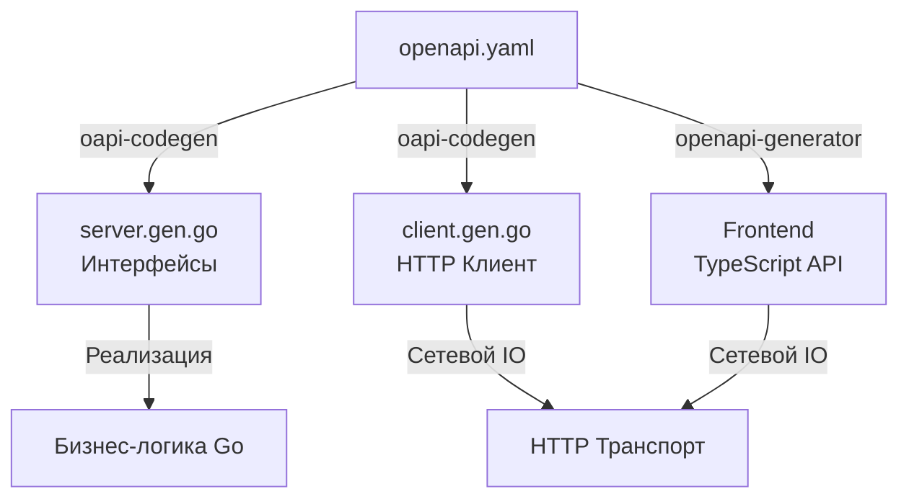

## Конец эпохи Boilerplate: Зачем генерировать код

В прошлой статье ([[14. OpenAPI и Swagger.md]]) мы пришли к выводу, что контракт API должен быть описан в машинно-читаемом формате (YAML/JSON), а разработка должна вестись по подходу Design-First. Но сам по себе YAML-файл не обрабатывает запросы и не делает сетевые вызовы. 

Исторически разработчики открывали спецификацию на одном мониторе и вручную писали HTTP-клиенты и серверные роутеры на другом. Это порождало тонны однообразного кода (Boilerplate): парсинг Query-параметров, конвертация строк в числа, ручная проверка наличия обязательных полей, сборка URL-адресов. 

Ручной труд — главный источник багов в интеграциях. Человек может забыть закрыть `resp.Body`, опечататься в названии заголовка или проигнорировать `context.Context`. **Генерация кода (Code Generation)** устраняет человеческий фактор. Компилятор Go и утилиты генерации берут на себя рутину, оставляя вам только написание чистой бизнес-логики.

В экосистеме Go абсолютным стандартом для генерации REST/HTTP контрактов является `deepmap/oapi-codegen`.

## Архитектура сгенерированного сервера

Генератор превращает ваш `openapi.yaml` в набор Go-интерфейсов и структур (DTO). 



### Strict Mode: Защита на уровне рантайма

Самая мощная фича современного `oapi-codegen` — это **Strict Mode**. Без него генератор создает классические обработчики вида `func(w http.ResponseWriter, r *http.Request)`. Со Strict Mode он абстрагирует вас от HTTP-слоя полностью.

Генерируется вот такой интерфейс:

```go
// СГЕНЕРИРОВАННЫЙ КОД (Редактировать запрещено)
type StrictServerInterface interface {
    // Получить пользователя
    // (GET /users/{id})
    GetUser(ctx context.Context, request GetUserRequestObject) (GetUserResponseObject, error)
}
```

Обратите внимание: здесь нет `http.Request` или `http.ResponseWriter`. 

> [!info] Под капотом: Как работает Strict Wrapper
> Ваш код больше не парсит HTTP. Сгенерированный "Wrapper" (обертка) сидит между роутером (например, `chi` или `net/http`) и вашей бизнес-логикой. 
> 1. Приходит TCP-пакет, Netpoller будит горутину.
> 2. Wrapper читает `r.PathValue("id")`.
> 3. Wrapper сам вызывает `strconv.Atoi()`, проверяя, что ID — это число. Если нет, он **сам** возвращает `400 Bad Request`, не дергая вашу бизнес-логику!
> 4. Если все валидно, Wrapper собирает структуру `GetUserRequestObject` и передает её в ваш метод `GetUser`.
> 5. Вы возвращаете объект ответа. Wrapper сам делает `json.Marshal`, проставляет правильный HTTP-статус (например, 200 или 404) и делает `w.Write`.
> 
> **Mechanical Sympathy:** Этот подход радикально снижает аллокации. Wrapper генерируется статически. Он не использует медленный пакет `reflect` для разбора параметров роутинга, а выполняет прямые вызовы типизированных конвертеров.

## Генерация клиента: Забытое искусство

Бэкенд-разработчики часто думают только о сервере. Но в микросервисной архитектуре ваш Go-сервис постоянно выступает в роли клиента, вызывая другие сервисы.

Писать HTTP-клиент вручную — боль. Нужно собрать URL, сделать `json.Marshal` тела запроса, создать `http.NewRequestWithContext`, выполнить запрос, проверить статус-код, сделать `json.Unmarshal`, и не забыть про ресурсы.

Сгенерированный клиент решает это в одну строку:

```go
// Инициализация (обычно при старте приложения)
client, err := usersclient.NewClientWithResponses("http://user-service:8080")

// Вызов в бизнес-логике
resp, err := client.GetUserWithResponse(ctx, 123)
if err != nil {
    return fmt.Errorf("network error: %w", err)
}

if resp.JSON200 != nil {
    log.Printf("Got user: %s", resp.JSON200.Name)
} else if resp.JSON404 != nil {
    log.Printf("User not found: %s", resp.JSON404.Message)
}
```

> [!warning] Ловушка / Gotcha: Утечка соединений (Connection Leak)
> В стандартном Go, если вы делаете `resp, err := http.DefaultClient.Do(req)`, вы **ОБЯЗАНЫ** сделать `defer resp.Body.Close()`. Если вы этого не сделаете, TCP-соединение не вернется в пул (Connection Pool), и ваш сервер быстро исчерпает лимит открытых файлов (упадет с ошибкой `too many open files`).
> 
> **Магия oapi-codegen:** Если вы используете методы с суффиксом `...WithResponse` (как в примере выше), сгенерированный клиент **автоматически читает всё тело ответа в память и закрывает `resp.Body` за вас**. Это спасает от утечек.
> **Обратная сторона:** Если другой микросервис возвращает файл размером 2 Гигабайта, `WithResponse` загрузит все 2 ГБ в оперативную память (Heap) вашей горутины, убив сервер по OOM. Для загрузки больших файлов всегда используйте "сырые" методы сгенерированного клиента (без суффикса `WithResponse`) и читайте тело потоково через `io.Copy`.

## Паттерн Interceptor: Расширение сгенерированных клиентов

Часто нам нужно добавить в каждый исходящий запрос токен авторизации (JWT) или ID трассировки (`X-Request-ID`) для Observability ([[32. Tracing запросов.md]]). 
Лезть в сгенерированный код нельзя — он перезапишется при следующей генерации. 

Для этого в генераторах применяется паттерн `RequestEditorFn` (функция-редактор запроса, аналог Middleware/Interceptor).

```go
// Создаем функцию, которая модифицирует запрос до его отправки
func WithAuthToken(token string) usersclient.RequestEditorFn {
    return func(ctx context.Context, req *http.Request) error {
        req.Header.Set("Authorization", "Bearer "+token)
        // Прокидываем Trace ID из контекста
        if traceID, ok := ctx.Value("trace_id").(string); ok {
            req.Header.Set("X-Request-ID", traceID)
        }
        return nil
    }
}

// Применяем при создании клиента
client, _ := usersclient.NewClientWithResponses(
    "http://user-service:8080",
    usersclient.WithRequestEditorFn(WithAuthToken("secret-jwt-xyz")),
)
```
Это гарантирует, что каждый вызов `client.GetUser` автоматически и безопасно подпишет запрос, сохраняя код бизнес-логики абсолютно чистым.

> [!tip] Собеседование
> **Вопрос:** В чем архитектурное отличие между кодогенерацией (Code Generation) и рефлексией (Reflection) при обработке HTTP контрактов?
> **Ответ:** Рефлексия (как в пакете `encoding/json` или в старых веб-фреймворках) переносит стоимость разбора структуры на **Runtime** (время выполнения). При каждом HTTP-запросе CPU тратит такты на обход полей структуры в памяти. 
> Кодогенерация переносит эту стоимость на **Compile-time** (время компиляции). Утилита один раз анализирует контракт и создает жестко зашитый, оптимизированный Go-код. Это дает строгую типизацию, позволяет компилятору ловить ошибки и радикально снижает нагрузку на Garbage Collector и CPU в production.

## Полиглоты: Генерация для Frontend и Mobile

Настоящая мощь OpenAPI раскрывается за пределами Go-экосистемы. Тот же самый `openapi.yaml`, который вы используете для генерации бэкенда, отдается Frontend-разработчикам (React/Vue) и мобильным разработчикам (iOS/Android).

Используя утилиты вроде `openapi-generator-cli`, они генерируют TypeScript, Swift или Kotlin клиенты за пару секунд.
Если вы на бэкенде изменили поле с `age` на `user_age`, генератор на фронтенде сразу обновит TypeScript-интерфейсы. Код фронтенда не скомпилируется, подсветив разработчику ошибку. 

**Интеграционные ошибки сводятся к нулю. API становится строго типизированным мостом между всеми микросервисами и клиентами компании.**

## Итог

1.  **Не пишите Boilerplate:** Ручное создание HTTP-роутеров, парсеров параметров и HTTP-клиентов — это пустая трата дорогого времени инженера и рассадник багов.
2.  **Используйте Strict Mode:** Позвольте генератору абстрагировать вас от `http.Request`. Работайте с готовыми бизнес-структурами. Это безопасно и эффективно с точки зрения аллокаций памяти.
3.  **Контролируйте память:** Помните, что удобные обертки клиентов (`...WithResponse`) читают весь ответ в RAM. Для потоковой передачи данных (Streaming) используйте сырые запросы.
4.  **Единый источник истины:** Один YAML файл генерирует сервер на Go, клиент на Go (для других микросервисов) и клиент на TypeScript (для фронтенда).

Мы выжали из связки HTTP/1.1 + JSON + OpenAPI максимум. Мы научились генерировать код и обеспечивать безопасность контракта. Но под капотом мы все еще парсим текст, передаем избыточные заголовки и страдаем от отсутствия нативного мультиплексирования. 

Для межсервисного (Backend-to-Backend) взаимодействия в Highload системах текстовый HTTP/JSON давно уступил место технологии, которая была спроектирована под кодогенерацию и бинарную производительность с самого первого дня. Об этом абсолютном стандарте распределенных систем мы поговорим в следующей статье: [[16. gRPC. Основы.md]].