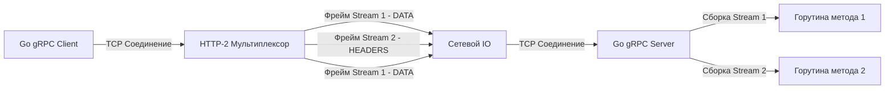

## Эволюция межсервисного общения: За пределы HTTP/1.1

В предыдущих статьях мы подробно разбирали архитектуру REST и JSON. Для публичных API (Frontend, Mobile) этот стек является абсолютным стандартом благодаря нативной поддержке в браузерах и удобочитаемости. Но когда мы спускаемся на уровень ниже, в изолированный кластер микросервисов (Backend-to-Backend), текстовый JSON поверх HTTP/1.1 становится узким местом.

Проблема HTTP/1.1 в распределенных системах сводится к физике сети и парсингу:
1. **Head-of-Line Blocking (Блокировка начала очереди):** В HTTP/1.1 вы не можете отправить второй запрос в то же TCP-соединение, пока не получите ответ на первый. Чтобы сделать 100 параллельных запросов к соседнему микросервису, рантайму Go нужно открыть (или взять из пула) 100 тяжелых TCP-соединений.
2. **Избыточность заголовков:** Каждый HTTP-запрос передает килобайты повторяющихся текстовых заголовков (`User-Agent`, `Accept`, `Authorization`).
3. **Отсутствие строгих контрактов:** Как мы выяснили в [[7. Форматы данных JSON vs Protobuf.md]], отсутствие схемы требует тяжелой работы с рефлексией (Reflection) при десериализации.

В 2015 году компания Google открыла исходный код своего внутреннего фреймворка Stubby, назвав его **gRPC** (gRPC Remote Procedure Calls). Он был спроектирован с нуля для решения проблем производительности в Highload системах, объединив два мощных стандарта: бинарную сериализацию **Protocol Buffers** и транспорт **HTTP/2**.

## Анатомия gRPC: Магия HTTP/2

Фундамент производительности gRPC — это протокол HTTP/2. В отличие от текстового HTTP/1.1, HTTP/2 является полностью **бинарным** и **мультиплексируемым**.

Между клиентом (Service A) и сервером (Service B) устанавливается **ровно одно долгоживущее TCP-соединение**. Внутри этого физического соединения HTTP/2 создает виртуальные "Потоки" (Streams). Каждый RPC-вызов — это отдельный Stream со своим уникальным ID.
Данные нарезаются на бинарные фреймы (Frames): `HEADERS` (метаданные) и `DATA` (сам payload). Фреймы от разных потоков могут перемешиваться в TCP-канале и собираться обратно на стороне получателя.



> [!info] Под капотом: gRPC и рантайм Go (Mechanical Sympathy)
> Когда вы используете библиотеку `google.golang.org/grpc`, под капотом работает невероятно оптимизированный транспорт на базе `x/net/http2`.
> 
> Вместо того чтобы блокировать горутину на системном вызове `read` для каждого запроса (как в HTTP/1.1), `grpc-go` запускает одну специализированную горутину-читателя (Reader Goroutine) на каждое TCP-соединение. Эта горутина "слушает" сокет через неблокирующий IO (Netpoller / epoll). 
> Когда из сети приходит батч бинарных фреймов HTTP/2, Reader Goroutine мгновенно читает их, смотрит на `Stream ID` и раскидывает данные по Go-каналам (channels) в рабочие горутины (Worker Goroutines), которые выполняют вашу бизнес-логику.
> **Итог:** Количество системных вызовов к ядру ОС падает в сотни раз. Переключения контекста (Context Switch) минимизируются. Одно TCP-соединение может легко прокачивать десятки тысяч RPS.

## Контракт в коде: Design-First "из коробки"

gRPC заставляет вас использовать подход Design-First. Вы не можете просто написать Go-код и надеяться, что клиент вас поймет. Вы обязаны сначала описать интерфейс в `.proto` файле.

```protobuf
// user_service.proto
syntax = "proto3";

package mycompany.users.v1;
option go_package = "internal/api/pb";

// Описание сервиса (Интерфейс)
service UserService {
  // Классический Unary запрос (Запрос-Ответ)
  rpc GetUser (GetUserRequest) returns (GetUserResponse);
}

// Описание структур данных
message GetUserRequest {
  int64 id = 1;
}

message GetUserResponse {
  int64 id = 1;
  string name = 2;
  string role = 3;
}
```

После компиляции этого файла утилитой `protoc` с плагинами для Go, вы получаете сгенерированный код. В отличие от REST-кодогенераторов, генерация gRPC встроена в язык и поддерживается самим Google. 

Генерируется строгий интерфейс для сервера:
```go
type UserServiceServer interface {
	GetUser(context.Context, *GetUserRequest) (*GetUserResponse, error)
}
```

И готовый клиент для других микросервисов:
```go
client := pb.NewUserServiceClient(grpcConn)
resp, err := client.GetUser(ctx, &pb.GetUserRequest{Id: 123})
```

Никакого ручного парсинга JSON, никакой конвертации `string` в `int`. Все строго типизировано на этапе компиляции. Если контракт изменится, ваш Go-код просто не соберется.

## Запуск сервера: Никакого net/http

gRPC сервер в Go живет независимо от стандартного `net/http` (хотя технически их можно подружить на одном порту через мультиплексирование байт, это тема для отдельного хардкорного разбора).

```go
import (
	"context"
	"net"
	"google.golang.org/grpc"
	pb "myproject/internal/api/pb"
)

// Наша структура, реализующая сгенерированный интерфейс
type server struct {
	pb.UnimplementedUserServiceServer // Обязательный эмбеддинг для forward compatibility
}

// Реализация бизнес-логики
func (s *server) GetUser(ctx context.Context, req *pb.GetUserRequest) (*pb.GetUserResponse, error) {
	// req.Id уже является int64, никакого парсинга!
	return &pb.GetUserResponse{
		Id:   req.Id,
		Name: "Ivan",
		Role: "Admin",
	}, nil
}

func main() {
	// Открываем "сырой" TCP сокет
	lis, _ := net.Listen("tcp", ":50051")
	
	// Создаем инстанс gRPC сервера
	s := grpc.NewServer()
	
	// Регистрируем нашу реализацию
	pb.RegisterUserServiceServer(s, &server{})
	
	// Запускаем блокирующий цикл обработки
	s.Serve(lis)
}
```

> [!warning] Ловушка / Gotcha: UnimplementedServiceServer
> Обратите внимание на встраивание (embedding) `pb.UnimplementedUserServiceServer` в нашу структуру `server`. Зачем это нужно? 
> Если завтра кто-то добавит новый метод `CreateUser` в `.proto` файл и перегенерирует код, интерфейс `UserServiceServer` расширится. Если бы мы не встроили `Unimplemented...`, наш проект перестал бы компилироваться (нарушение интерфейса). 
> Встроенная структура содержит дефолтные реализации всех методов, которые просто возвращают ошибку `codes.Unimplemented`. Это обеспечивает **Forward Compatibility** (прямую совместимость) вашего кода на Go при эволюции контракта.

## Метаданные (Metadata) и Обработка ошибок

В HTTP/1.1 мы передаем токены и Trace ID в заголовках (`Headers`). В gRPC нет объекта `http.Request`, поэтому заголовки абстрагированы в концепцию **Metadata**.
Метаданные привязаны к `context.Context` рантайма Go.

```go
// Чтение метаданных на сервере
import "google.golang.org/grpc/metadata"

func (s *server) GetUser(ctx context.Context, req *pb.GetUserRequest) (*pb.GetUserResponse, error) {
    md, ok := metadata.FromIncomingContext(ctx)
    if ok {
        traceIDs := md.Get("x-trace-id")
        // ...
    }
}
```

> [!tip] Собеседование
> **Вопрос:** Если в gRPC внутри HTTP/2 произошла ошибка (например, юзер не найден), какой HTTP статус-код вернет сервер клиенту на сетевом уровне?
> **Ответ:** Сервер вернет HTTP `200 OK`. 
> В gRPC HTTP статус означает лишь успешность *транспортного уровня* (запрос дошел, соединение живо). Бизнес-ошибки и статусы самого RPC передаются в **Trailers** (трейлерах) — специальных блоках метаданных, которые отправляются *в самом конце* потока HTTP/2, после передачи всего тела ответа. 
> В коде на Go мы используем пакет `status`: `return nil, status.Errorf(codes.NotFound, "user %d not found", req.Id)`. Клиент прозрачно получит эту ошибку через `err`, но на уровне Wireshark это будет HTTP 200 + Trailer `grpc-status: 5`.

## Главная архитектурная боль: Балансировка нагрузки (Load Balancing)

Это самая частая причина инцидентов при миграции с REST на gRPC.

В классическом REST мы ставим перед нашими Go-сервисами L4 Load Balancer (например, AWS NLB или HAProxy в режиме TCP). Балансировщик устанавливает TCP-соединение с одним из подов (Pod) и проксирует туда байты. Поскольку в HTTP/1.1 соединения часто пересоздаются (или используется пулинг), нагрузка размазывается по всем серверам равномерно.

**Что происходит с gRPC за L4-балансировщиком?**
Клиент открывает **одно долгоживущее HTTP/2 соединение**. L4-балансировщик направляет этот TCP-коннект на Server-1. 
Далее клиент начинает отправлять 10 000 RPS. Поскольку все запросы (Streams) мультиплексируются внутри *этого единственного TCP-соединения*, **все 10 000 запросов прилетят на Server-1**. Остальные серверы в кластере будут простаивать с 0 RPS. Ваша система упадет от перегрузки одного узла.

**Как это решать?**
1. **L7 Load Balancing:** Использовать балансировщики, которые умеют парсить HTTP/2 и "заглядывать" внутрь фреймов, распределяя сами *потоки* (Streams), а не TCP-соединения. (Nginx с директивой `grpc_pass`, Envoy, Traefik).
2. **Client-Side Load Balancing:** В мире микросервисов (особенно с Kubernetes) сам Go-клиент умеет "смотреть" в DNS (или Service Mesh контроль-плейн), получать список всех IP-адресов серверов, открывать TCP-соединение *к каждому из них* и балансировать запросы на своей стороне (Round-Robin).

## Итог

1. **gRPC** — это стандарт межсервисного взаимодействия, решающий проблему блокировок HTTP/1.1 через мультиплексирование потоков в едином TCP-соединении на базе HTTP/2.
2. Использование кодогенерации и строгих бинарных контрактов снижает нагрузку на CPU, уменьшает аллокации (GC pressure) и исключает баги ручного парсинга.
3. gRPC абстрагирует вас от HTTP: заголовки становятся контекстными **Metadata**, а ошибки переезжают в **Trailers**.
4. **Критически важно:** gRPC ломает классическую L4 TCP балансировку. Вы обязаны использовать L7-прокси или балансировку на стороне клиента, иначе получите перегрузку одиночных узлов.

gRPC неразрывно связан со своим форматом сериализации. Чтобы писать действительно эффективный код, мы должны понимать, как именно наши структуры превращаются в байты, почему важен порядок полей и как не сломать совместимость при удалении полей. Детальный разбор бинарной физики этих процессов ждет нас в следующей статье: [[17. Protocol Buffers.md]].