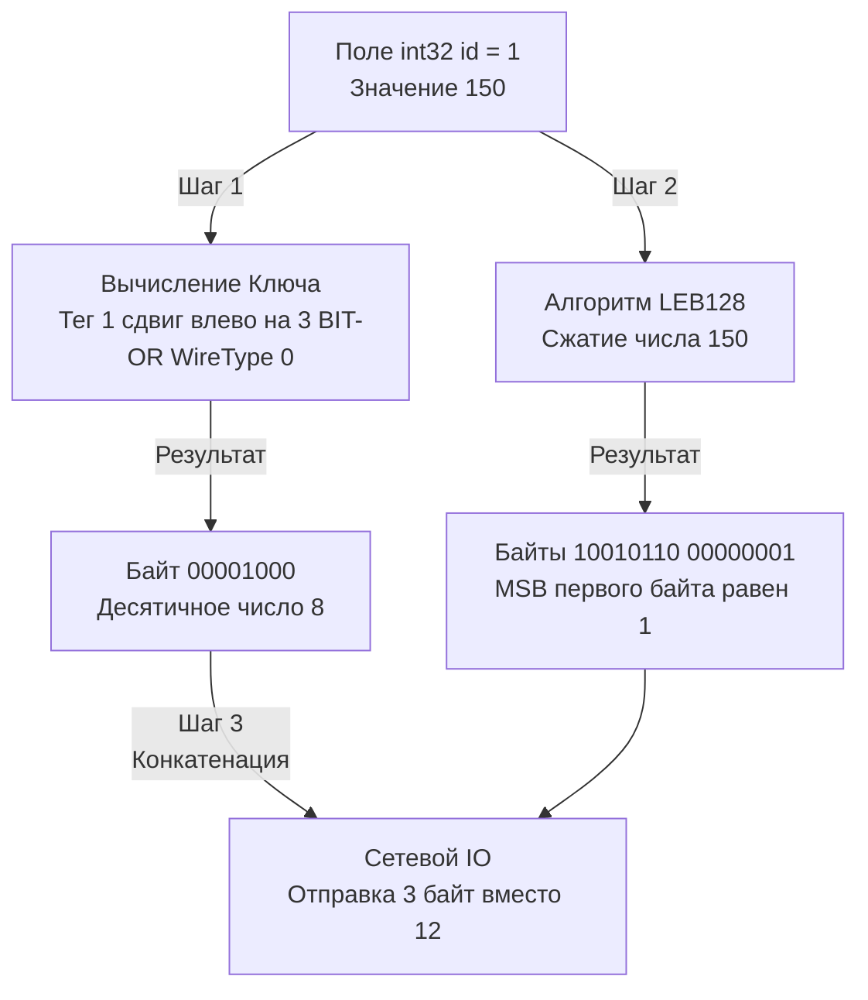

## Бинарная физика контрактов: Как работает Protobuf

В статье [[16. gRPC. Основы.md]] мы определили Protocol Buffers (Protobuf) как фундамент, на котором строится высокопроизводительное межсервисное взаимодействие. Мы обсуждали его на архитектурном уровне, сравнивая с JSON ([[7. Форматы данных JSON vs Protobuf.md]]). Теперь пришло время спуститься на уровень байтов и регистров процессора, чтобы понять, за счет чего достигается эта производительность и какие скрытые ловушки ждут Go-разработчика при работе со сгенерированным кодом.

Protobuf — это не просто формат, это компилятор (`protoc`) и строгая спецификация бинарной упаковки данных. В отличие от JSON, который отправляет в сеть ключи в виде строк (`"user_id": 123`), Protobuf превращает структуру в максимально плотный поток бит, где нет ни одного лишнего пробела или символа кавычки.

## Идентификация полей: Магия чисел (Tags)

Фундаментальное правило Protobuf: **имена полей существуют только для людей**. Рантайм Go и бинарный протокол ничего не знают о поле `user_id`. Они знают только его числовой тег (Tag).

```protobuf
message User {
  int64 id = 1;       // 1 - это Tag
  string email = 2;   // 2 - это Tag
}
```

Когда `protoc-gen-go` генерирует Go-код, эти теги "зашиваются" под капот методов сериализации. Если вы поменяете имя поля с `email` на `primary_email` в `.proto` файле, бинарная совместимость не сломается. Сервер на Go и клиент на Python продолжат прекрасно понимать друг друга. 

> [!warning] Ловушка / Gotcha: Переиспользование тегов
> **Никогда не меняйте тип существующего поля и не переиспользуйте удаленные теги!**
> Если вы удалите `string email = 2;` и добавите `int32 age = 2;`, вы сломаете всю систему (нарушение контракта, см. [[27. Backward compatibility.md]]). Старые клиенты будут пытаться прочитать байты возраста как строку UTF-8, что приведет к фатальной ошибке десериализации.
> **Правильный подход:** Используйте ключевое слово `reserved`.
> ```protobuf
> message User {
>   reserved 2;
>   reserved "email";
>   int64 id = 1;
>   int32 age = 3;
> }
> ```

## Mechanical Sympathy: Алгоритм Varint (LEB128)

Junior-разработчик может подумать: если поле имеет тип `int64`, значит, в сеть всегда отправляется 8 байт. В мире баз данных и структур C это так. Но Protobuf использует динамическое сжатие целых чисел — **Varint (Variable-length integer)**.

Под капотом используется алгоритм кодирования LEB128 (Little Endian Base 128).
В каждом байте числа 7 бит используются для хранения самих данных (Payload), а 8-й бит (Most Significant Bit, MSB) работает как флаг продолжения:
* `MSB = 1`: "Это еще не конец, читай следующий байт".
* `MSB = 0`: "Это последний байт числа".

Если вы отправляете число `1` в поле типа `int64`, Protobuf не будет слать 8 байт `00000000 ... 00000001`. Он отправит ровно **1 байт**: `00000001` (MSB равен нулю). 
Если вы отправляете число `150`, оно займет **2 байта**. 

**Как формируется итоговый бинарный фрейм?**
Перед каждым значением идет так называемый "Ключ" (Key), который сообщает парсеру номер поля (Tag) и тип данных (Wire Type). 
Формула вычисления ключа на уровне битовых операций:
`Key = Tag << 3 BIT-OR WireType`

Существует всего несколько Wire Types:
* `0`: Varint (для int32, int64, uint32, bool, enum)
* `1`: 64-bit (фиксированные 8 байт для fixed64, sfixed64, double)
* `2`: Length-delimited (строки, байты, вложенные сообщения — сначала идет длина Varint-ом, потом сами данные)
* `5`: 32-bit (фиксированные 4 байта)



> [!info] Под капотом: Почему парсинг Protobuf такой быстрый
> В Go десериализация JSON требует работы пакета `reflect` для сопоставления строковых ключей с полями структур. Сгенерированный код Protobuf использует `switch` по числам (тегам). 
> Процессор читает байт ключа, делает битовый сдвиг вправо на 3 (`Key >> 3`), получает номер тега `1` и мгновенно прыгает в нужную ветку `case 1:`, где прямо в память по указателю записывает распакованный Varint. Это чистая математика регистров CPU, исключающая аллокации строк и обход мап.

## Рантайм Go и внутреннее устройство структур

Когда утилита `protoc` генерирует `.pb.go` файл, создаваемые структуры разительно отличаются от простых DTO.

```go
// Сгенерированный код выглядит примерно так
type User struct {
	state         protoimpl.MessageState
	sizeCache     protoimpl.SizeCache
	unknownFields protoimpl.UnknownFields

	Id    int64  `protobuf:"varint,1,opt,name=id,proto3" json:"id,omitempty"`
	Email string `protobuf:"bytes,2,opt,name=email,proto3" json:"email,omitempty"`
}
```

Структура содержит скрытые поля (`state`, `sizeCache`, `unknownFields`). Они необходимы рантайму `google.golang.org/protobuf` для оптимизации вычисления размера буфера перед аллокацией и хранения метаданных.

> [!warning] Ловушка / Gotcha: Сравнение сообщений
> Никогда не используйте стандартный оператор `==` или `reflect.DeepEqual` для сравнения двух Protobuf-сообщений в ваших Unit-тестах.
> Из-за скрытых полей (особенно `unknownFields`, которые могут содержать мусорные байты) идентичные по бизнес-логике объекты могут не совпасть, или хуже того — вызовут панику (panic) из-за внутренних блокировок (Mutex) в `protoimpl.MessageState`.
> **Правильный способ:** Всегда используйте пакет `google.golang.org/protobuf/proto`.
> ```go
> if proto.Equal(user1, user2) {
>     // Сообщения идентичны
> }
> ```

## Проблема Zero Values и возвращение Optional

В спецификации `proto3` Google сделал кардинальное изменение по сравнению с `proto2`: все поля стали опциональными по умолчанию, но было убрано понятие "присутствия поля" (Field Presence).

**Как это работает в сети:**
Если поле типа `int32 age = 3;` имеет значение `0` (Zero Value), Protobuf **вообще не отправляет его в сеть**. 
Это великолепно экономит трафик, но создает фундаментальную проблему для бэкенд-разработки (особенно для PATCH запросов из [[4. Resource oriented design.md]]).

Если ваш Go-сервер получает структуру `User`, и поле `Age` равно `0`, вы не знаете:
1. Клиент явно прислал возраст `0`.
2. Клиент вообще не прислал это поле (оно обнулилось при инициализации структуры в Go).

**Решение (начиная с proto 3.15):**
Google вернул ключевое слово `optional`.
```protobuf
message UpdateUserRequest {
  optional int32 age = 1;
}
```
При генерации Go-кода, `optional int32` превращается в **указатель `*int32`**. 
Теперь, если поле не было отправлено в сеть, указатель будет `nil`. Если прислали `0` — будет указатель на область памяти с нулем. Это позволяет четко различать намерения клиента.

## Forward Compatibility и Unknown Fields

Что произойдет, если микросервис А (версия v2) отправляет сообщение с полями 1, 2 и 3, а микросервис Б (версия v1) знает только про поля 1 и 2?

В JSON мы часто используем жесткую валидацию и можем упасть с ошибкой "неизвестное поле". 
В Protobuf заложена строгая политика **Forward Compatibility (Прямой совместимости)**. 
Когда рантайм Go в сервисе Б читает поток байт и встречает Тег `3`, он не паникует. Он видит его Wire Type, считывает нужное количество байт и помещает их в то самое скрытое поле `unknownFields` внутри сгенерированной структуры `User`.

Зачем сохранять то, что мы не понимаем?
Представьте, что сервис Б — это просто роутер или прокси. Он принял сообщение от А, посмотрел на `id`, ничего не понял в новых полях и переслал это сообщение в сервис В (который уже обновлен до v2). 
При сериализации рантайм Go "приклеит" байты из `unknownFields` к исходящему потоку. Таким образом, **новые данные не теряются при прохождении через старые узлы системы**.

> [!tip] Собеседование
> **Вопрос:** В Protobuf есть тип `map<string, string>`. Сохраняется ли порядок элементов в мапе при передаче по сети?
> **Ответ:** Нет. Спецификация Protobuf явно утверждает, что порядок пар "ключ-значение" в мапах не детерминирован (Wire ordering is undefined). При десериализации в Go они превращаются в стандартную мапу `map[string]string`, которая в Go также физически не гарантирует порядка итерации. Если порядок важен для бизнес-логики, необходимо использовать массив (repeated) специальных структур с ключом и значением.

## Итог

1. **Protobuf** — это математически выверенный механизм упаковки данных. Имена полей игнорируются, всё строится на числовых Тегах (Tags).
2. Целые числа сжимаются алгоритмом **LEB128 (Varint)**, где маленькие значения занимают 1 байт.
3. Сгенерированные структуры в Go содержат внутреннее состояние. Их можно сравнивать только через **`proto.Equal`**.
4. В `proto3` нулевые значения не передаются по сети. Для явного отличия отсутствующего поля от нуля используйте ключевое слово **`optional`**.
5. Рантайм сохраняет неизвестные поля (**Unknown Fields**) в памяти, позволяя старым версиям микросервисов прозрачно пересылать новые форматы данных.

Понимая физику бинарных кадров и мультиплексирование потоков, мы готовы выйти за рамки классического паттерна Request-Response. Что делать, если нам нужно непрерывно загружать гигабайты логов или отдавать ленту котировок в реальном времени, не разрывая соединение? Эти задачи решает мощнейший механизм HTTP/2, который мы разберем в следующей статье: [[18. gRPC streaming.md]].