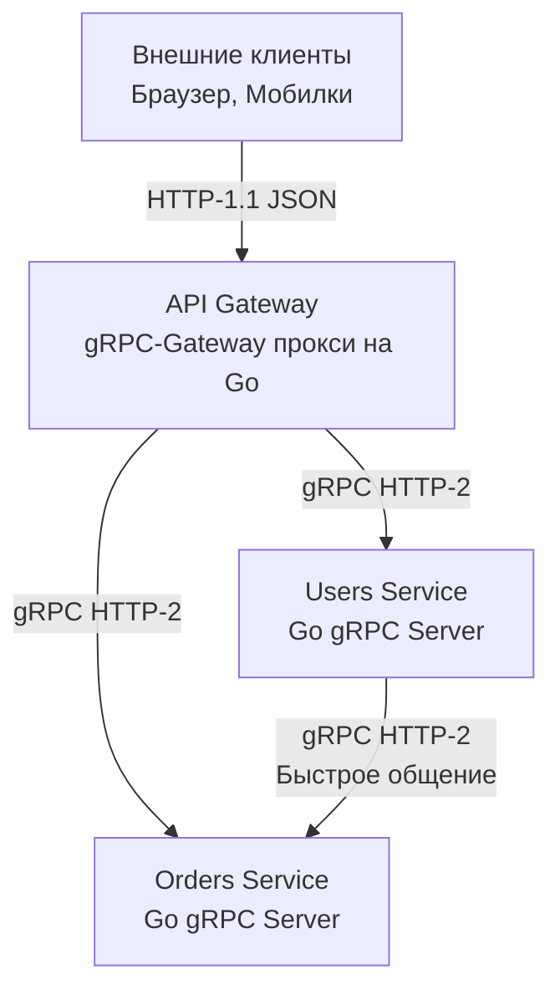

## Архитектурный холивар: Выбор без серебряной пули

Мы детально разобрали оба фундаментальных подхода: классический [[3. REST. Основные принципы.md]] и высокопроизводительный [[16. gRPC. Основы.md]]. На собеседованиях и архитектурных комитетах вопрос "Что выбрать: REST или gRPC?" часто превращается в религиозный спор. 

Инженер уровня Senior понимает, что "лучшего" протокола не существует. Есть только компромиссы (Trade-offs). Выбор сетевого контракта напрямую диктует топологию инфраструктуры, паттерны масштабирования и то, как рантайм Go будет утилизировать железо.

В этой статье мы сведем оба подхода в финальной битве, разберем их физику и рассмотрим гибридные архитектурные решения.

## Матрица компромиссов

| Критерий | REST (JSON + HTTP/1.1) | gRPC (Protobuf + HTTP/2) |
| :--- | :--- | :--- |
| **Транспорт** | HTTP/1.1 (чаще всего) | Только HTTP/2 |
| **Формат данных** | Текстовый (JSON, XML) | Бинарный (Protobuf) |
| **Контракт** | Опциональный (OpenAPI) | Строгий, обязательный (`.proto`) |
| **Читаемость (Debug)** | Идеальная (видно в curl / браузере) | Требует специальных тулзов (gRPCurl) |
| **Кэширование** | Нативное на уровне протокола (CDN/Nginx) | Требует реализации в бизнес-логике |
| **Браузеры** | Нативная поддержка (`fetch`) | Требует прокси (gRPC-Web) |
| **Модель общения** | Только Request-Response | Request-Response + Streaming |

---

## Mechanical Sympathy: Битва за ресурсы (CPU & RAM)

Сравним, как рантайм Go обрабатывает 10 000 входящих запросов в секунду в обоих сценариях.

### REST-сервер в Go
1. **Сетевой IO:** Если клиенты не используют Keep-Alive эффективно, рантайм Go будет постоянно открывать и закрывать TCP-соединения, дергая системные вызовы ядра.
2. **Парсинг HTTP:** Пакет `net/http` аллоцирует мапы для заголовков (Headers) и буферы для чтения текстового протокола на каждый запрос.
3. **Десериализация JSON:** Пакет `encoding/json` запускает тяжелую машину рефлексии (Reflection). Он ищет строковые ключи, конвертирует типы, порождая тысячи мелких объектов-строк.
4. **Сборка мусора (GC):** Все эти промежуточные токены, строки заголовков и DTO отправляются в кучу (Heap). Garbage Collector просыпается чаще, его фаза Mark занимает больше времени, увеличивая Tail Latency (задержки 99-го перцентиля).

### gRPC-сервер в Go
1. **Сетевой IO:** Все 10 000 потоков (Streams) мультиплексируются внутри **одного** физического TCP-соединения. Ядро ОС отдыхает.
2. **Парсинг HTTP/2:** Горутина-чтец в `grpc-go` просто нарезает байты на бинарные фреймы. Заголовки (Metadata) сжимаются алгоритмом HPACK, экономя память и пропускную способность (Bandwidth).
3. **Десериализация Protobuf:** Никакой рефлексии. Сгенерированный Go-код использует `switch-case` по целочисленным тегам (Tags) и быстрые побитовые сдвиги для распаковки чисел (Varint).
4. **Сборка мусора:** Структуры Protobuf переиспользуют пулы памяти. Аллокаций на порядок меньше. Процессор занят бизнес-логикой, а не сбором мусора.

> [!info] Под капотом: Полиглотные микросервисы
> В больших компаниях Go часто соседствует с Python (Data Science), Java (Enterprise) или Node.js (Frontend-BFF). 
> В REST несовпадение контрактов (Python ожидает `null`, а Go шлет пустую строку `""`) вызывает баги в рантайме. gRPC заставляет все команды генерировать код из единого `.proto` файла. gRPC решает проблему типизации между языками на уровне компиляции, что критически важно при размере команды от 50 человек.

---

## Главная слабость gRPC: Проблема "Последней мили"

Если gRPC настолько эффективен, почему мы не пишем на нем фронтенды и публичные API?

### 1. Браузерная несовместимость
Браузерные API (XHR, `fetch`) не предоставляют JavaScript-коду доступа к низкоуровневым фреймам HTTP/2. Фронтендер не может напрямую контролировать бинарные потоки, необходимые для нативного gRPC.
*Решение:* Использование **gRPC-Web** (специальной обертки, транслирующей gRPC в формат, понятный браузеру), но это усложняет инфраструктуру фронтенда.

### 2. Кэширование (Убийца производительности на чтение)
Вспомним статью [[12. Caching HTTP.md]]. В REST мы можем повесить заголовок `Cache-Control: max-age=3600` на `GET /products`, и CDN (Cloudflare) возьмет на себя 99% нагрузки. Ваш Go-бэкенд даже не узнает об этих запросах.
В gRPC все запросы — это `POST`-запросы (под капотом), и протокол не имеет встроенных стандартов для HTTP-кэширования. Любой запрос, даже на получение статического справочника, всегда будет долетать до вашего Go-процесса.

> [!warning] Ловушка / Gotcha: Инфраструктурная сложность
> gRPC ломает L4 балансировщики (TCP), отправляя весь трафик на один узел. Требуется внедрение Service Mesh (Istio, Linkerd) или сложных L7-прокси (Envoy), которые умеют балансировать HTTP/2 потоки. Если в компании нет сильных DevOps-инженеров, внедрение gRPC может привести к инцидентам.

---

## Архитектурный паттерн: gRPC-Gateway (Лучшее из двух миров)

Инженеры пришли к элегантному паттерну: **Пишем код один раз на gRPC, а наружу отдаем оба варианта (и gRPC, и REST).**

Это реализуется с помощью технологии **gRPC-Gateway** (экосистема grpc-ecosystem).

1. Вы описываете контракт в `.proto` файле.
2. Используя специальные аннотации Google API, вы мапите RPC-методы на HTTP-пути и методы (REST).
3. Компилятор генерирует Reverse Proxy на Go.
4. Внешние клиенты (Браузеры, curl, сторонние партнеры) шлют обычный JSON/REST.
5. Сгенерированный Gateway на лету парсит JSON, переводит его в бинарный Protobuf и делает быстрый gRPC-вызов в ваш микросервис.

```protobuf
// Пример .proto файла с аннотациями для gRPC-Gateway
import "google/api/annotations.proto";

service UserService {
  rpc GetUser (GetUserRequest) returns (GetUserResponse) {
    // Маппинг gRPC на REST
    option (google.api.http) = {
      get: "/v1/users/{id}"
    };
  }
}
```



> [!tip] Собеседование
> **Вопрос:** Мы пишем бэкенд для мобильного приложения с высокой динамикой данных. Что выберем: REST или gRPC?
> **Ответ:** Зависит от требований. Если мобильное приложение часто запрашивает статические каталоги (где нужен кэш CDN), REST предпочтительнее. Если требуется стриминг (чат, котировки), экономия батареи мобильного устройства и жесткая типизация контракта, стоит рассмотреть gRPC. Однако в современных архитектурах часто выбирают паттерн **BFF (Backend-For-Frontend)** (детальнее в [[26. BFF pattern.md]]): мобилка общается с BFF по REST/GraphQL, а BFF общается с ядром микросервисов по gRPC.

## Итог: Правила выбора

1. **Используйте REST (JSON + OpenAPI), если:**
   * Вы проектируете публичный API для внешних партнеров или браузеров.
   * Важнейшим фактором является возможность кэширования через CDN (товары, статьи, каталоги).
   * Инфраструктура ограничена классическими балансировщиками без поддержки HTTP/2.

2. **Используйте gRPC, если:**
   * Вы строите закрытый кластер микросервисов (Internal Server-to-Server).
   * Вы используете много разных языков (Go, Java, Python) и хотите единый генератор контрактов.
   * У вас Highload и важна максимальная экономия CPU/Memory и отсутствие аллокаций.
   * Вам необходим двунаправленный стриминг или Server Push.

Мы столкнули лбами два самых популярных подхода к проектированию API. Но оба они страдают от одной проблемы при взаимодействии с фронтендом: либо фронтенд получает слишком много лишних данных (Over-fetching), либо вынужден делать десятки запросов для сборки одной страницы (Under-fetching). 

Для решения именно этой проблемы (преимущественно на уровне BFF) был создан совершенно иной язык запросов. В следующей статье мы познакомимся с ним: [[20. GraphQL. Основы.md]].