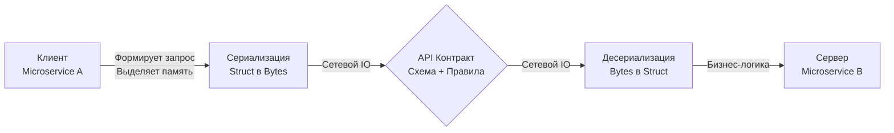

## Анатомия взаимодействия: За пределами HTTP

Когда Junior-разработчик слышит слово "API" (Application Programming Interface), он обычно представляет себе HTTP-запросы, JSON и REST. Но для инженера уровня Senior API — это фундаментальная концепция изоляции, граница между подсистемами, где заканчивается ответственность одного компонента и начинается ответственность другого.

API существует на множестве уровней:
* **Аппаратный уровень:** Набор инструкций процессора (ISA) — это API между железом и операционной системой.
* **Уровень ОС:** Системные вызовы (syscalls) — это API между ядром Linux и вашей Go-программой.
* **Уровень кода:** Экспортируемые функции пакета и Go-интерфейсы (`io.Reader`, `http.Handler`) — это API между модулями внутри одного бинарника.
* **Сетевой уровень:** Правила обмена байтами через TCP/UDP между независимыми сервисами.

В контексте бэкенд-разработки, когда мы говорим об API, мы почти всегда подразумеваем **сетевой API**. Это способ заставить два процесса, потенциально написанных на разных языках и запущенных на разных континентах, работать как единая система.

## Контракт: Обещание, высеченное в камне

API — это механизм взаимодействия, а **Контракт** (Contract) — это строгий набор правил, по которым это взаимодействие происходит. Контракт определяет:
1. **Предусловия (Inputs):** Какие данные клиент обязан предоставить (типы данных, обязательность полей, форматы дат).
2. **Постусловия (Outputs):** Какие данные сервер обязуется вернуть при успешном выполнении.
3. **Ошибки (Errors):** Как сервер сообщит о том, что что-то пошло не так (коды статусов, структура тела ошибки).
4. **Инварианты и побочные эффекты (Side-effects):** Неявные обещания (например, идемпотентность — гарантия того, что повторный запрос не спишет деньги дважды).

В Go контракты на уровне кода описываются интерфейсами. Интерфейс `io.Reader` — это контракт: *"Если ты дашь мне срез байт, я обязуюсь заполнить его данными и вернуть количество прочитанных байт или ошибку"*. Сетевой контракт — это то же самое, но вынесенное за пределы адресного пространства процесса.

> [!info] Под капотом: Физика сетевого вызова (Mechanical Sympathy)
> Внутри одной Go-программы передача данных между функциями стоит копейки: вы просто передаете указатель (8 байт на x64), и принимающая сторона читает данные из L1/L2 кэша процессора. 
> 
> Сетевой API-вызов ломает эту идиллию. Процессор не может передать указатель по сети. Структуру данных в памяти (с ее выравниванием, паддингами и указателями) необходимо сплющить в линейный массив байт. 
> 1. Рантайм делает аллокации в куче (Escape Analysis гарантированно отправит буферы сериализации в heap).
> 2. CPU тратит такты на парсинг и кодирование (например, обход полей через `reflect` в случае с `encoding/json`).
> 3. Вызывается syscall `write` для отправки байт в буфер сетевой карты.
> 4. Пакеты летят по сети, собираются на другой стороне, и процесс повторяется в обратном порядке.
> 
> Итог: Сетевой вызов медленнее локального в сотни тысяч раз. Проектируя API, вы должны минимизировать количество сетевых запросов (Chatty API — антипаттерн) и оптимизировать размер payload'а.

## Неявные vs Явные контракты (JSON vs Protobuf)

В мире Go и микросервисов контракты делятся на два лагеря по уровню их строгости.

### 1. Неявные контракты (REST + JSON)
Когда вы разрабатываете классический HTTP JSON API, ваш контракт часто существует только в голове разработчиков, в Wiki или, в лучшем случае, в формате Swagger/OpenAPI ([[14. OpenAPI и Swagger.md]]). 
Сам язык Go ничего не знает об этом контракте. Когда приходит JSON, Go использует пакет `encoding/json`, который под капотом применяет **Reflection** (пакет `reflect`), чтобы во время выполнения программы (runtime) сопоставить строки из JSON с полями вашей структуры.

**Минусы:** Медленная работа из-за рефлексии, отсутствие строгой типизации на этапе компиляции, высокий риск сломать клиента (изменили имя поля в структуре — клиент упал, а компилятор Go этого не заметил).

### 2. Явные контракты (gRPC + Protocol Buffers)
В этом подходе контракт является *первичным*. Вы описываете его в строгом `.proto` файле.
Этот файл — единый источник истины. Специальный компилятор читает этот файл и генерирует готовый, строго типизированный Go-код (структуры и методы) для клиента и сервера.

> [!info] Под капотом: Почему Protobuf быстрее
> Сгенерированный Go-код для Protobuf не использует `reflect` для парсинга каждого сообщения на лету. Код уже "знает" смещения полей в памяти и типы данных. Десериализация сводится к эффективному чтению потока байт и прямой записи значений в заранее аллоцированную память, что радикально снижает нагрузку на Garbage Collector (GC). Подробнее мы разберем это в [[7. Форматы данных JSON vs Protobuf.md]] и [[16. gRPC. Основы.md]].

## Ловушки обратной совместимости (Backward Compatibility)

Контракт легко создать, но невероятно сложно изменить.
В Go, если вы измените сигнатуру интерфейса, компилятор немедленно подсветит все места в коде, которые сломались. В распределенной системе компилятора нет.

> [!warning] Ловушка / Gotcha: Breaking Changes
> Самая частая причина инцидентов при обновлении микросервисов — нарушение обратной совместимости контракта ([[27. Backward compatibility.md]]).
> 
> **Типичная ошибка:** Сервер `A` ожидает от клиента `B` поле `status` как `int` (0, 1, 2). Вы решаете сделать рефакторинг и меняете поле на `string` ("pending", "active"). Вы деплоите сервер `A`. В этот момент клиент `B`, который все еще шлет `int`, начинает получать ошибки десериализации (HTTP 400 Bad Request) или, что еще хуже, сервер молча пишет дефолтные пустые строки в базу данных.
> 
> **Золотое правило API:** Никогда не удаляйте поля и не меняйте их тип. Только добавляйте новые. Если старое поле больше не нужно, пометьте его как `deprecated`, но продолжайте поддерживать, пока жив хотя бы один клиент.

> [!tip] Собеседование
> **Вопрос:** Как вы гарантируете, что изменения в коде сервиса не сломают API-контракт для потребителей?
> **Ответ:** Использование Consumer-Driven Contract Testing (например, фреймворк Pact). Клиенты пишут тесты на то, как они используют наше API. Эти тесты запускаются в нашем CI-пайплайне. Если наш Pull Request ломает ожидаемый клиентом формат, билд падает до деплоя. Также обязательно внедрение линтеров схем (например, `buf` для Protobuf или `spectral` для OpenAPI), которые на уровне CI/CD запрещают "ломающие" (breaking) изменения контракта. (Детальнее в [[34. Contract testing.md]]).

## Итог

1. **API** — это абстракция и граница взаимодействия. В сети это способ общения процессов через сериализованные потоки байт.
2. **Контракт** — это строгие правила этого общения. Без описанного контракта система превращается в хаос, где каждый клиент вынужден угадывать поведение сервера методом проб и ошибок.
3. **Механика:** Любой сетевой вызов — это дорогая операция перекладывания структур из памяти в сеть через системные вызовы и аллокации. Формат контракта (JSON vs Protobuf) напрямую влияет на CPU и Garbage Collector в Go.

Понимая суть контракта, мы можем перейти к конкретным архитектурным стилям его реализации. Самым популярным, но часто неправильно понимаемым стилем является REST. В следующей статье мы разберем его фундаментальные принципы: [[3. REST. Основные принципы.md]].