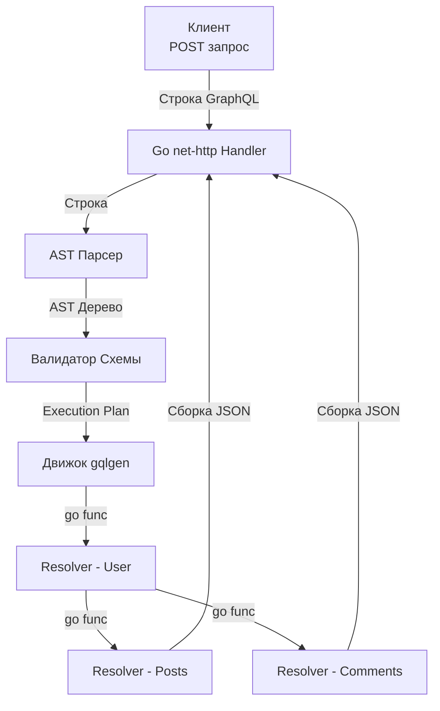

## Анатомия графа: Решение проблем Over-fetching и Under-fetching

В предыдущих статьях мы обсуждали, как REST ([[3. REST. Основные принципы.md]]) и gRPC ([[16. gRPC. Основы.md]]) решают задачи взаимодействия систем. В REST мы строго привязаны к ресурсам: эндпоинт `/users/123` всегда возвращает предопределенную структуру пользователя. 

По мере роста Frontend и Mobile приложений это порождает две фундаментальные проблемы:
1. **Over-fetching (Избыточность):** Мобильному приложению для отображения списка аватарок нужны только `id` и `avatar_url`. Но REST-сервер возвращает мегабайтный JSON со всеми полями (`address`, `preferences`, `settings`), сжигая трафик клиента и CPU сервера на сериализацию.
2. **Under-fetching (Нехватка данных):** Чтобы отобразить страницу профиля, клиенту нужен пользователь, его последние 5 постов и количество лайков под каждым. В REST клиенту придется сделать 1 запрос к `/users/123`, дождаться ответа, а затем сделать еще 5 запросов к `/posts?user_id=123`. Это называется "проблемой N+1 на стороне клиента", и она катастрофически замедляет рендеринг UI из-за сетевых задержек (Network Latency).

В 2015 году Facebook опубликовал **GraphQL** — язык запросов к API и среду выполнения (Runtime) для этих запросов. Главная идея: **клиент сам описывает структуру данных, которую хочет получить, а сервер собирает этот "граф" за один сетевой вызов.**

## Контракт в GraphQL: Schema Definition Language (SDL)

Как и gRPC, GraphQL использует строгую типизацию и подход Design-First. Контракт описывается на языке SDL.

```graphql
# схема контракта
type User {
  id: ID!
  name: String!
  posts: [Post!]!
}

type Post {
  id: ID!
  title: String!
  likes: Int!
}

type Query {
  user(id: ID!): User
}
```

Клиент отправляет POST-запрос на единственный эндпоинт (обычно `/query`), передавая строку запроса:

```graphql
query {
  user(id: "123") {
    name
    posts {
      title
    }
  }
}
```

Сервер вернет JSON, форма которого будет **точно** совпадать с формой запроса. Ни байтом больше.

## Mechanical Sympathy: Как GraphQL работает в Go

Если вы попытаетесь написать GraphQL-сервер на Go с нуля, вы столкнетесь с тяжелейшей задачей парсинга строк и построения абстрактных синтаксических деревьев (AST). 

В экосистеме Go исторически было два лидера:
1. `graphql-go/graphql` (Code-First) — построение схемы прямо в коде Go. Сильно полагается на рефлексию (`reflect`), медленный, заставляет писать много бойлерплейта.
2. **`99designs/gqlgen` (Schema-First)** — абсолютный индустриальный стандарт на сегодняшний день. 

### Под капотом gqlgen
Утилита `gqlgen` берет ваш файл `.graphql`, парсит его и **генерирует** Go-код. 
Вместо того чтобы в рантайме обходить интерфейсы через `reflect`, генератор создает жестко типизированные структуры и механизм исполнения (Execution Plan).

Когда приходит HTTP-запрос со строкой GraphQL:
1. **Лексический анализ и Парсинг:** Строка запроса превращается в AST.
2. **Валидация:** AST проверяется на соответствие сгенерированной схеме (запросил ли клиент существующие поля?).
3. **Execution (Выполнение):** Рантайм `gqlgen` обходит AST-дерево в ширину (Breadth-First Search). Для каждого поля он вызывает специальную Go-функцию — **Resolver (Распознаватель)**.

> [!info] Под капотом: Горутины и Резолверы
> В `gqlgen` резолверы выполняются конкурентно. Если клиент запросил `user { posts { ... } comments { ... } }`, рантайм Go может запустить получение постов и комментариев в параллельных горутинах, собирая результат через каналы или `sync.WaitGroup`. Это максимально утилизирует многоядерные процессоры.



## Убийца базы данных: Проблема N+1 в GraphQL

GraphQL дает невероятную гибкость фронтенду, но переносит всю боль агрегации данных на бэкенд. Самая страшная проблема GraphQL — **проблема N+1 на стороне сервера**.

Представьте запрос, получающий 50 пользователей и их посты:
```graphql
query {
  users(limit: 50) {
    name
    posts { title }
  }
}
```

Как это отработает внутри наивного Go-сервера:
1. Вызывается `QueryResolver.Users()`. Он делает `SELECT * FROM users LIMIT 50`. (1 запрос к БД).
2. Движок GraphQL видит 50 объектов `User`. Для каждого объекта он параллельно вызывает `UserResolver.Posts(user)`.
3. Каждый из 50 резолверов делает `SELECT * FROM posts WHERE user_id = X`. (50 запросов к БД).

**Итог:** Чтобы отдать один HTTP-запрос, ваш Go-сервер сделал **51 запрос к базе данных**. Если 100 клиентов одновременно откроют эту страницу, пул соединений PostgreSQL (Connection Pool) будет мгновенно исчерпан, и БД "ляжет".

## Решение: Паттерн Dataloader

В мире GraphQL проблема N+1 решается только одним способом: батчингом (пакетированием) через Dataloader. В Go популярны библиотеки `graph-gophers/dataloader` или `vektah/dataloaden` (с кодогенерацией для избежания `interface{}`).

**Механика работы Dataloader:**
1. Вместо того чтобы сразу идти в базу, `UserResolver.Posts()` говорит даталоадеру: *"Мне нужны посты для `user_id = 1`. Я подожду, вот тебе канал (Thunk)"*.
2. Даталоадер собирает все запрошенные ID (1, 2, 3... 50) в памяти.
3. Он ждет несколько миллисекунд (или пока планировщик Go не соберет все вызовы на текущем уровне графа).
4. Затем даталоадер делает **ОДИН** SQL запрос: `SELECT * FROM posts WHERE user_id IN -1, 2, 3... 50-`.
5. Результаты мапятся (группируются) обратно по `user_id` и возвращаются в ожидающие резолверы.

Мы превратили 51 запрос в 2 запроса. Это критически важный концепт для любого Middle+/Senior инженера. Без понимания Dataloader запускать GraphQL в production категорически запрещено.

> [!tip] Собеседование
> **Вопрос:** Как Dataloader в Go понимает, что пора "отправлять" батч-запрос в базу, а не ждать новых ключей вечно?
> **Ответ:** Есть два подхода. 
> Первый (на основе таймеров): Dataloader стартует `time.After(2 * time.Millisecond)`. Если за 2мс новых ключей не поступило, батч отправляется. 
> Второй (на основе планировщика): В Go часто используют неявную синхронизацию через `sync.WaitGroup` на уровне движка исполнения. `gqlgen` знает, сколько резолверов на текущем уровне дерева он запустил. Когда все резолверы этого уровня "встали на паузу" в ожидании данных от Dataloader-а, движок дает сигнал на выполнение батч-запроса. Это намного эффективнее таймеров, так как не добавляет искусственных задержек.

## Ловушки архитектуры: Безопасность и Кэширование

Отдавая контроль над формой данных клиенту, вы открываете колоссальные векторы для атак (DDoS).

### 1. Исчерпание ресурсов (Query Complexity & Depth)
Злоумышленник (или сломанный скрипт) может отправить рекурсивный запрос:
```graphql
query { user { posts { author { posts { author { ... } } } } } }
```
Такой запрос глубиной в 100 уровней заставит сервер аллоцировать гигабайты памяти, вызовет OOM (Out Of Memory) и убьет ваш под в Kubernetes.
**Защита:** В `gqlgen` необходимо обязательно включать `MaxDepth` (ограничение глубины дерева) и `Query Complexity` (каждому полю присваивается "вес", и если суммарный вес запроса превышает лимит, AST парсер отклоняет его еще до выполнения).

### 2. Смерть HTTP Кэширования
В [[12. Caching HTTP.md]] мы разбирали, что REST идеально кэшируется на уровне Nginx или CDN благодаря уникальным URL (`GET /users/123`). 
В GraphQL абсолютно **все запросы — это POST-запросы на `/query`**. Тело запроса скрыто в payload. Nginx и CDN "из коробки" не умеют кэшировать POST-запросы.
**Решение:** Для GraphQL кэширование переносится:
1. Либо на уровень самого приложения (кэширование результатов резолверов в Redis).
2. Либо используется подход APQ (Automatic Persisted Queries), когда клиент отправляет не саму строку запроса, а её хеш (через GET-запрос), что позволяет включить CDN обратно в цепочку.

## Итог

1. **GraphQL** решает боли Frontend/Mobile разработки (Over-fetching и Under-fetching), позволяя запрашивать ровно то, что нужно, за один сетевой вызов.
2. В Go идиоматичным является подход Schema-First с генерацией кода через **`gqlgen`**, что избавляет рантайм от дорогой рефлексии.
3. Граф — это убийца БД. Применение **Dataloader** обязательно для преобразования N+1 запросов в один батч-запрос `WHERE IN`.
4. Инфраструктура REST (Rate Limiters по URL, Nginx кэш) не работает для GraphQL. Защиту (лимиты сложности) нужно выстраивать внутри самого Go-приложения на этапе разбора AST.

GraphQL — это мощный, но опасный инструмент. Он идеален для определенных слоев архитектуры, но может стать катастрофой, если попытаться заменить им внутреннее общение всех микросервисов. В какой именно точке системы место GraphQL, а где лучше оставить REST и gRPC? Этот вопрос мы разберем в следующей статье: [[21. Когда использовать GraphQL.md]].