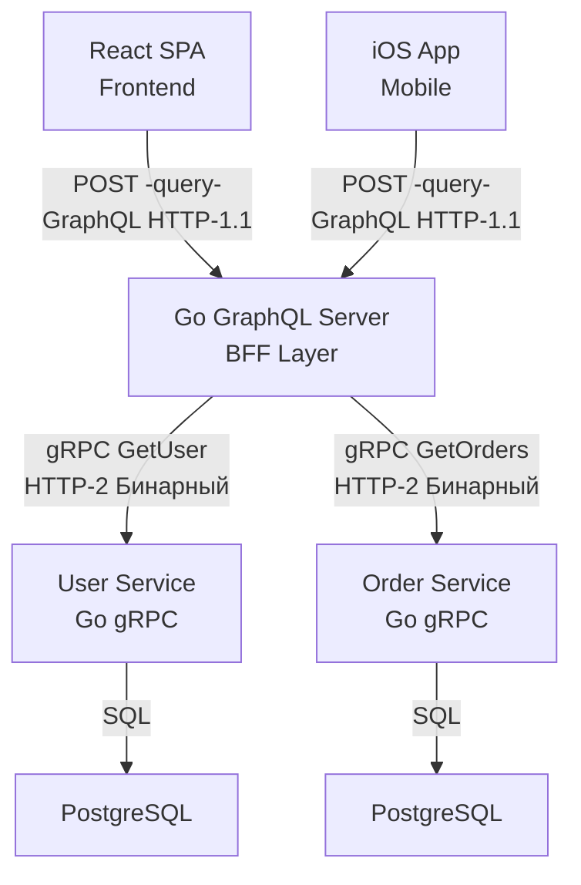
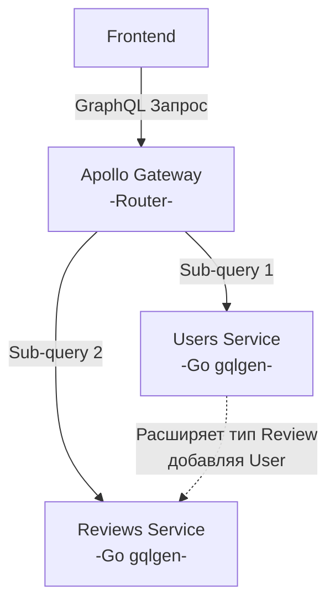

## Архитектурный прагматизм: GraphQL — это скальпель, а не швейцарский нож

В статье [[20. GraphQL. Основы.md]] мы увидели, как GraphQL элегантно решает проблемы фронтенда (Over-fetching и Under-fetching), перенося ответственность за формирование ответа на клиента. Воодушевленные этой гибкостью, разработчики часто совершают фатальную архитектурную ошибку: они пытаются переписать все свои микросервисы на GraphQL.

Инженер уровня Senior должен понимать: GraphQL не заменяет REST ([[3. REST. Основные принципы.md]]) и тем более не является конкурентом gRPC ([[16. gRPC. Основы.md]]). Это высокоспециализированный инструмент для слоя представления (Presentation Layer). 

В этой статье мы разберем жесткие критерии выбора и поймем, где GraphQL превращается из спасителя в убийцу производительности вашего Go-бэкенда.

## Идеальный сценарий: Паттерн BFF (Backend-For-Frontend)

Единственное место в современной микросервисной архитектуре, где GraphQL раскрывает свой потенциал на 100% — это паттерн **BFF**. Мы будем детально разбирать его в [[26. BFF pattern.md]], но в контексте GraphQL механика выглядит так:

У вас есть зоопарк внутренних микросервисов. Они общаются между собой по быстрому бинарному gRPC. Наружу, для мобильных приложений и SPA (Single Page Application) на React/Vue, вы ставите один единый шлюз — GraphQL-сервер, написанный на Go (с использованием `gqlgen`).

В этой топологии GraphQL-сервер не ходит в базу данных напрямую. В его резолверах (Resolvers) происходит вызов сгенерированных gRPC-клиентов.

**Почему это работает идеально?**
* **Оркестрация на бэкенде:** Мобильному телефону с нестабильным 3G не нужно делать 5 запросов к разным сервисам. Он делает 1 HTTP-запрос к BFF. BFF в дата-центре по внутренней сети в 10 Гбит/с параллельно опрашивает gRPC-сервисы и склеивает ответ.
* **Независимость клиентов:** iOS-команда может запросить только аватарки, а Web-команда — полные профили. Нам не нужно писать кастомные REST-эндпоинты под каждую платформу.

## Mechanical Sympathy: Цена гибкости GraphQL

За всё нужно платить. С точки зрения рантайма Go, GraphQL — это один из самых тяжелых (по ресурсам) протоколов сетевого взаимодействия. 

Сравним обработку запроса в gRPC и в GraphQL:

1.  **gRPC:** Приходит бинарный пакет. Процессор делает побитовый сдвиг тега и сразу кладет значение в готовую Go-структуру на стеке (или в заранее аллоцированную кучу). Аллокации минимальны.
2.  **GraphQL:** Приходит огромная строка (String) с текстом запроса. 
    * **Лексический анализ:** Go должен распарсить эту строку, выделив токены.
    * **Построение AST:** Движок (например, `gqlgen`) создает Абстрактное Синтаксическое Дерево (AST). Каждая нода этого дерева — это указатель (Pointer). Сотни указателей.
    * **Escape Analysis:** Все это огромное дерево AST гарантированно "убегает" в кучу (Heap).
    * **Execution:** Движок рекурсивно обходит это дерево, создавая мапы `map[string]interface{}` для формирования итогового ответа.
    * **GC Pressure:** После отправки ответа клиенту, сборщик мусора (Garbage Collector) должен просканировать и удалить весь этот граф объектов. На высоких RPS (Requests Per Second) фаза Mark у GC начинает съедать процессорное время.

> [!warning] Ловушка / Gotcha: Server-to-Server GraphQL
> Никогда не используйте GraphQL для общения между двумя внутренними микросервисами на бэкенде. 
> Если Service A хочет получить данные от Service B, он точно знает, какие поля ему нужны (это жесткий системный контракт, а не UI). Использование GraphQL здесь добавит чудовищный оверхед на парсинг AST и сериализацию/десериализацию текста там, где gRPC справится за наносекунды с околонулевым давлением на GC.

## Когда GraphQL не нужен (Антипаттерны)

### 1. Простые CRUD приложения
Если ваш сервис — это админка, которая просто показывает таблицы данных из базы (Create, Read, Update, Delete), GraphQL станет архитектурным оверинжинирингом. Вы потратите недели на настройку Dataloader-ов (от проблемы N+1), настройку лимитов глубины дерева и сложных мутаций, хотя классический REST ([[4. Resource oriented design.md]]) с пагинацией и фильтрацией закрыл бы эту задачу за пару дней.

### 2. Приложения, критичные к кэшированию на уровне сети
Как мы помним из [[12. Caching HTTP.md]], HTTP-кэширование (CDN, Nginx) опирается на URL и метод GET. В GraphQL все запросы — это `POST /query`. Nginx видит миллион запросов на один и тот же URL и не может их кэшировать, так как не понимает внутренности JSON-тела. 
Если вы делаете публичное API для новостного портала или каталога интернет-магазина, REST с заголовками `Cache-Control` разгрузит ваши серверы в десятки раз эффективнее, чем любой кэш внутри GraphQL.

*Примечание: Существуют костыли вроде APQ (Automatic Persisted Queries), позволяющие использовать GET, но это усложняет инфраструктуру.*

### 3. Бинарные данные и потоковая загрузка
GraphQL ужасно работает с загрузкой файлов (Multipart/File Upload). Спецификации для этого есть, но они превращают запрос в сложную и хрупкую конструкцию. Стриминг видео или отдача тяжелых бинарных отчетов — это территория чистого HTTP или gRPC Streaming.

## Эволюция API: REST vs GraphQL

> [!tip] Собеседование
> **Вопрос:** Как отличается подход к версионированию в REST и GraphQL?
> **Ответ:** В REST при сломе контракта мы вынуждены повышать мажорную версию в URL (например, с `/v1/` на `/v2/`), поддерживая оба контроллера в коде (подробнее в [[8. Versioning API.md]]).
> GraphQL спроектирован так, чтобы избегать глобального версионирования. Он использует концепцию **Deprecation** на уровне отдельных полей. Мы не меняем тип старого поля `age`, мы помечаем его директивой `@deprecated(reason: "Use birth_date instead")` и добавляем новое поле `birth_date`. Клиенты перестают запрашивать старое поле естественным образом. Благодаря тому, что мы видим, какие именно поля запрашивают клиенты (Field Usage Analytics), мы можем безопасно удалить старое поле, когда метрики покажут, что к нему больше нет обращений. В REST мы не знаем, какие поля JSON-ответа клиент реально использует, а какие игнорирует.

## Apollo Federation: Граф для больших компаний

Если у вас 50 микросервисов, писать единый монолитный BFF на Go, который знает обо всех gRPC-контрактах, становится тяжело. Команда BFF превращается в "бутылочное горлышко".

Для решения этой проблемы была придумана **Apollo Federation**.
Это архитектура, где каждый микросервис (на Go, Java, Node.js) отдает наружу свой маленький "кусочек" графа GraphQL. 
Сверху стоит умный шлюз (Gateway), который собирает эти кусочки в единый Суперграф (Supergraph). Когда фронтенд делает сложный запрос, Gateway сам парсит его, разбивает на части, параллельно опрашивает нужные микросервисы (по GraphQL) и склеивает ответ.

*Mechanical Sympathy в Федерации:* Важно понимать, что в такой схеме между Gateway и вашими Go-сервисами ходит GraphQL (а не gRPC). Вы получаете оверхед на парсинг графа на **каждом** узле бэкенда. Это плата за организационную масштабируемость (Conway's Law), но удар по процессорному времени.

## Итог

1.  **GraphQL — это инструмент фронтенда.** Его место на слое BFF (Edge), где он агрегирует данные из внутренних gRPC/REST сервисов и минимизирует сетевые запросы с мобильных устройств.
2.  Никогда не используйте GraphQL для **внутреннего межсервисного общения**. Бинарный gRPC сгенерирует меньше мусора (GC) и отработает в разы быстрее.
3.  Избегайте GraphQL, если ваш сервис отдает тяжелую статику или редко меняющиеся каталоги — вы потеряете мощь инфраструктурного кэширования (CDN).
4.  GraphQL требует высокой квалификации. Вам придется самостоятельно решать проблему N+1 (Dataloader), ограничивать сложность запросов (Complexity Limits) и строить сложную систему авторизации на уровне графа.

Мы разобрали все классические синхронные паттерны: от REST до GraphQL. Мы умеем запрашивать данные эффективно. Но как быть, если сервер должен *сам* отправить данные клиенту в любой непредсказуемый момент времени? Как строить чаты, игры и биржевые терминалы? Мы переходим к Real-Time протоколам. В следующей статье разберем фундаментальную технологию двунаправленной связи в браузере: [[22. WebSocket.md]].