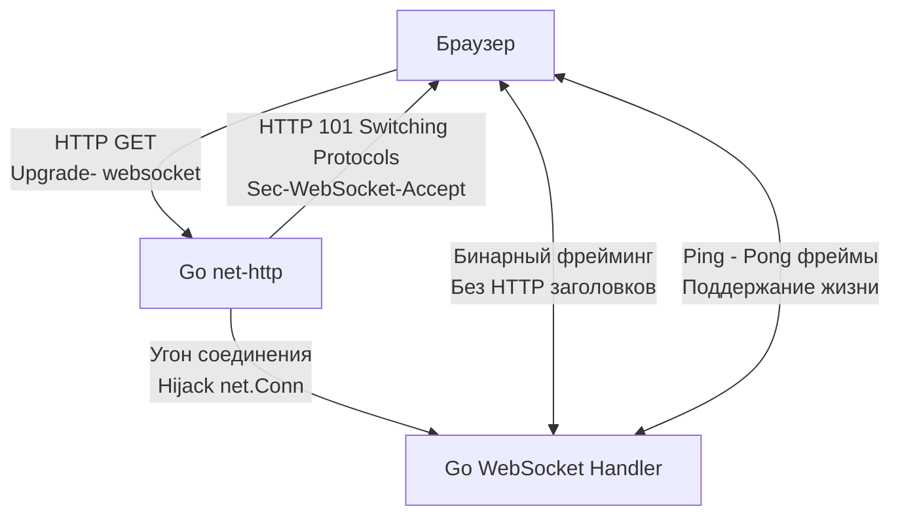
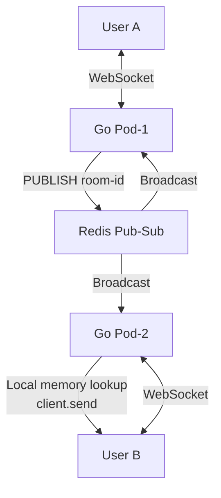

## Двунаправленный реалтайм: Когда инициатива у сервера

В предыдущих статьях мы разобрали паттерн «Запрос-Ответ» в REST и мультиплексируемые стримы в [[18. gRPC streaming.md]]. Если gRPC — это идеальный выбор для внутреннего общения (Backend-to-Backend), то что делать с фронтендом (SPA в браузере)? 

Браузеры не имеют прямого доступа к низкоуровневым фреймам HTTP/2, поэтому gRPC-стриминг там работает только через тяжелые прокси-обертки (gRPC-Web). Если нам нужно написать чат, биржевой терминал или мультиплеерную игру в браузере, нам нужен протокол, который нативно поддерживается JavaScript-ом и позволяет серверу *пушить* данные клиенту в любой момент времени.

Абсолютным стандартом для этой задачи является **WebSocket (RFC 6455)**. 
Для Senior-инженера WebSocket — это не просто «сокет в браузере». Это Stateful-протокол поверх TCP, который кардинально меняет подход к масштабированию, деплою и управлению памятью в Go.

## Анатомия протокола: От HTTP к сырому TCP

С точки зрения железа и ОС, соединение WebSocket начинается как обычный HTTP/1.1 запрос. Это гениальный архитектурный хак, который позволяет веб-сокетам беспрепятственно проходить через корпоративные файрволы и балансировщики (Nginx), работающие на 80 и 443 портах.

**Шаг 1: Handshake (Рукопожатие)**
Клиент отправляет стандартный `GET` запрос, но добавляет специфичные заголовки:
* `Connection: Upgrade`
* `Upgrade: websocket`
* `Sec-WebSocket-Key: dGhlIHNhbXBsZSBub25jZQ==`

**Шаг 2: Hijacking (Угон соединения)**
Если сервер поддерживает веб-сокеты, рантайм Go (через интерфейс `http.Hijacker`) физически «отбирает» TCP-соединение (дескриптор сокета) у HTTP-сервера. HTTP-роутер больше не контролирует этот сокет. Сервер отвечает статусом [[6. Статусы HTTP.md]] `101 Switching Protocols` и передает управление бизнес-логике веб-сокета.



> [!info] Под капотом: Фрейминг и Маскирование
> После 101 статуса данные передаются в виде фреймов (Frames). Фрейм имеет заголовок (2-14 байт), где указан Opcode (0x1 для текста, 0x2 для бинарных данных, 0x8 для закрытия, 0x9 для Ping).
> **Mechanical Sympathy:** Чтобы предотвратить атаки Cache Poisoning на промежуточные прокси-серверы, спецификация требует, чтобы ВСЕ данные от клиента к серверу были замаскированы (XOR-шифрование с 32-битным ключом). Рантайм Go вынужден тратить такты CPU на побайтовый XOR (через SIMD-инструкции) каждого входящего сообщения. Данные от сервера к клиенту не маскируются.

## Идиоматичный Go: Архитектура на горутинах

В мире Go стандартом де-факто для работы с WS является библиотека `github.com/gorilla/websocket` (или более современная `nhooyr.io/websocket`). 

Паттерн проектирования для одного клиента ВСЕГДА требует **двух горутин**: `readPump` и `writePump`. Это связано с тем, что чтение из сокета в Go — операция блокирующая. Если мы попытаемся читать и писать в одном цикле `for`, медленный клиент заблокирует всю логику.

```go
package chat

import (
	"log"
	"net/http"
	"time"

	"[github.com/gorilla/websocket](https://github.com/gorilla/websocket)"
)

var upgrader = websocket.Upgrader{
	ReadBufferSize:  1024,
	WriteBufferSize: 1024,
	// В production обязательно проверяйте Origin для защиты от CSWSH атак!
	CheckOrigin: func(r *http.Request) bool { return true },
}

// Client оборачивает TCP сокет
type Client struct {
	conn *websocket.Conn
	send chan []byte // Буферизованный канал для исходящих сообщений
}

// Обработчик HTTP
func ServeWS(w http.ResponseWriter, r *http.Request) {
	// Угон соединения: net.Conn переходит к gorilla/websocket
	conn, err := upgrader.Upgrade(w, r, nil)
	if err != nil {
		log.Printf("upgrade error: %v", err)
		return
	}

	client := &Client{
		conn: conn,
		send: make(chan []byte, 256),
	}

	// Запускаем две независимые горутины
	go client.writePump()
	go client.readPump()
}
```

> [!warning] Ловушка / Gotcha: Concurrent Writes Panic
> Главная причина падения серверов с веб-сокетами у новичков — попытка вызвать `conn.WriteMessage()` конкурентно из разных горутин. Сокет в `gorilla/websocket` **НЕ потокобезопасен для записи**! Если два системных события попытаются одновременно записать в один сокет, приложение упадет с `panic: concurrent write to websocket connection`. 
> **Решение:** Все исходящие данные должны отправляться в канал `client.send`, а горутина `writePump` должна эксклюзивно читать из канала и писать в сокет.

## Проблема мертвых душ: Ping / Pong и утечки памяти

С точки зрения железа, TCP-соединение — это просто договоренность между роутерами. Если у мобильного клиента пропала сеть в туннеле метро, он не успеет отправить TCP FIN пакет. Ваш Go-сервер будет думать, что клиент жив, удерживая в оперативной памяти горутины `readPump`, `writePump`, каналы и буферы. На миллионе клиентов это приведет к тихой утечке гигабайт RAM.

TCP Keep-Alive часто срезается промежуточными балансировщиками (AWS ALB/NLB). Для спасения серверов спецификация WebSocket ввела фреймы уровня приложения: **Ping и Pong**.

```go
// Идиоматичный ReadPump с контролем дедлайнов
func (c *Client) readPump() {
	defer func() {
		c.conn.Close()
	}()

	// Если клиент не ответил на Ping за 60 секунд - он мертв
	c.conn.SetReadDeadline(time.Now().Add(60 * time.Second))
	
	// При получении Pong от клиента - сдвигаем дедлайн смерти
	c.conn.SetPongHandler(func(string) error {
		c.conn.SetReadDeadline(time.Now().Add(60 * time.Second))
		return nil
	})

	for {
		_, message, err := c.conn.ReadMessage()
		if err != nil {
			if websocket.IsUnexpectedCloseError(err, websocket.CloseGoingAway, websocket.CloseAbnormalClosure) {
				log.Printf("error: %v", err)
			}
			break // Выход из цикла завершает горутину и освобождает память
		}
		// Обработка message...
	}
}
```
Горутина `writePump` должна быть настроена на отправку Ping-фрейма каждые 50 секунд (с помощью `time.Ticker`). Это фундамент стабильности (Mechanical Sympathy) — мы активно ищем мертвые сокеты и заставляем Garbage Collector очищать память.

## Масштабирование WebSockets: Архитектурный вызов

В REST-системах мы можем добавить 10 новых подов (Pods) в Kubernetes, и Nginx просто размажет по ним `GET` запросы. Архитектура Stateless ([[3. REST. Основные принципы.md]]) прощает нам это.

Веб-сокеты — это **Stateful** (состояние). Пользователь привязан к конкретному инстансу Go-приложения на время всего TCP-соединения (которое может длиться часами).

**Сценарий:** Пользователь А (подключен к Pod-1) пишет сообщение Пользователю Б (подключен к Pod-2). 
Как Pod-1 передаст сообщение в сокет, который физически находится в оперативной памяти Pod-2?

**Решение: Брокер Pub/Sub (Redis или NATS)**
Мы обязаны внедрить центральную шину сообщений.
1. Пользователь А шлет сообщение в Pod-1.
2. Pod-1 делает `PUBLISH chat_room_1 "Привет"`.
3. ВСЕ поды (включая Pod-2) подписаны на `SUBSCRIBE chat_room_1`.
4. Pod-2 получает сообщение из Redis, проверяет свою локальную мапу подключенных клиентов, находит там Пользователя Б и шлет ему сообщение в канал `client.send`.



> [!tip] Собеседование
> **Вопрос:** Если мы деплоим новую версию микросервиса (Rolling Update в Kubernetes), что произойдет с нашими WebSocket соединениями?
> **Ответ:** При Graceful Shutdown сервер перестанет принимать новые соединения, но старые WS-соединения останутся "висеть". Если не ограничить время их жизни, Pod никогда не завершится, или Kubernetes убьет его жестко (SIGKILL), что приведет к мгновенному разрыву связи у тысяч клиентов, и они устроят DDoS, пытаясь переподключиться (Thundering Herd problem).
> **Решение:** В обработчик сигнала SIGTERM нужно добавить логику, которая плавно (с рандомизированным джиттером) рассылает клиентам управляющий фрейм `Close`, заставляя их переподключиться к новым подам не одновременно, а размазанно в течение 30-60 секунд.

## Итог

1. **WebSocket** — это двунаправленный постоянный канал поверх TCP, идеально подходящий для Real-time задач в браузерах.
2. **Архитектура в Go:** Для каждого клиента требуется две горутины (`readPump` и `writePump`) и буферизованный канал для защиты от состояния гонки (Race Condition) при записи.
3. **Механизм Ping/Pong** абсолютно критичен для обнаружения полуоткрытых соединений и предотвращения утечек памяти (Memory Leaks).
4. **Масштабирование** Stateful-приложений требует внешней шины сообщений (Redis Pub/Sub) для маршрутизации событий между узлами кластера.

Веб-сокеты мощны, но сложны в балансировке и потребляют ресурсы на поддержание двунаправленного канала. Что делать, если нам нужен только однонаправленный поток? Если клиент должен только *слушать* обновления (например, лента новостей или курсы валют), но не отправлять команды? Для этой задачи есть более легковесный инструмент, работающий поверх классического HTTP/1.1 без "угона" соединений. Этот инструмент мы разберем в следующей статье: [[23. Server Sent Events.md]].