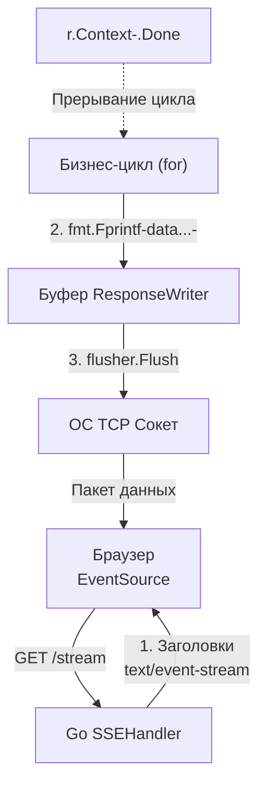

## Однонаправленный поток: Зачем стрелять из пушки по воробьям

В статье [[22. WebSocket.md]] мы увидели, что двунаправленный реалтайм — это сложно. Угон соединения (Hijacking), кастомный бинарный фрейминг, обязательное маскирование (XOR) каждого пакета от клиента, ручная реализация Ping/Pong и потеря всех преимуществ HTTP/2.

Но давайте будем честными: в 80% случаев вашему фронтенду не нужен *двунаправленный* канал. 
Лента новостей, биржевые котировки, уведомления о новых сообщениях, прогресс-бар долгой фоновой задачи — всё это **однонаправленные** потоки данных от сервера к клиенту. Фронтенд просто слушает. Если ему нужно отправить действие (например, "поставить лайк"), он может сделать обычный, быстрый `POST`-запрос.

Для таких задач использовать WebSocket — это оверинжиниринг. Идеальный инструмент для однонаправленного пуша данных в браузере — это **Server-Sent Events (SSE)**.

## Анатомия протокола: Старый добрый HTTP

В отличие от WebSocket, SSE не придумывает свой собственный бинарный протокол. Это классический HTTP-запрос, который сервер просто *бесконечно долго не закрывает*, постоянно докидывая в него новые куски текста.

**Запрос клиента:**
Обычный `GET`. В браузере это реализуется через нативный класс `EventSource`.

**Ответ сервера:**
Сервер отвечает статусом `200 OK` (никаких 101 Switching Protocols), но с тремя критически важными заголовками:
* `Content-Type: text/event-stream` (сообщает клиенту, что данные будут идти потоком).
* `Cache-Control: no-cache` (запрещает Nginx и браузеру кэшировать ответ).
* `Connection: keep-alive` (просит ОС не рвать TCP-соединение).

Формат данных — это простой текст, где сообщения разделяются двумя переносами строк `\n\n`.

```text
id: 101
event: price_update
data: {"ticker":"AAPL", "price":150.5}

id: 102
data: {"ticker":"GOOG", "price":2800.1}

```

> [!info] Под капотом: Mechanical Sympathy и экономия CPU
> В WebSocket рантайм Go вынужден применять побайтовую XOR-маску к каждому входящему фрейму для защиты от кэш-отравления (Cache Poisoning). Это сжигает процессорное время.
> В SSE нет фрейминга и нет маскирования. Это чистый поток байт (PlainText) поверх TCP-сокета. Сериализация и отправка сообщения в SSE обходится процессору сервера в разы дешевле, чем подготовка бинарного фрейма WebSocket. 

## Идиоматичный Go: Интерфейс http.Flusher

Стандартный `http.ResponseWriter` в Go буферизирует данные. Когда вы вызываете `w.Write()`, данные сначала копятся во внутреннем буфере (обычно 4 КБ), чтобы отправить их в системный сокет одним большим куском (оптимизация IO). 
Для SSE это фатально: клиент не увидит новое сообщение, пока буфер не заполнится.

Чтобы протолкнуть данные прямо в сеть немедленно, мы используем интерфейс `http.Flusher`.

```go
func SSEHandler(w http.ResponseWriter, r *http.Request) {
	// 1. Устанавливаем заголовки
	w.Header().Set("Content-Type", "text/event-stream")
	w.Header().Set("Cache-Control", "no-cache")
	w.Header().Set("Connection", "keep-alive")

	// 2. Проверяем, поддерживает ли сервер сброс буфера
	flusher, ok := w.(http.Flusher)
	if !ok {
		http.Error(w, "Streaming unsupported", http.StatusInternalServerError)
		return
	}

	// 3. Главный цикл отправки событий
	ticker := time.NewTicker(1 * time.Second)
	defer ticker.Stop()

	for {
		select {
		case <-r.Context().Done():
			// Клиент закрыл вкладку браузера или разорвал TCP-соединение.
			// Рантайм Go отловит это и закроет контекст запроса.
			log.Println("Client disconnected")
			return
            
		case t := <-ticker.C:
			// 4. Формируем текстовый блок (обязательно \n\n в конце)
			msg := fmt.Sprintf("data: {\"time\": \"%s\"}\n\n", t.Format(time.RFC3339))
			
			// Пишем в буфер
			_, err := w.Write([]byte(msg))
			if err != nil {
				return
			}
			
			// 5. КРИТИЧЕСКИ ВАЖНО: Выталкиваем данные в TCP-сокет
			flusher.Flush()
		}
	}
}
```



## Авто-восстановление: Магия EventSource

Если WebSocket обрывается (например, при смене сети с Wi-Fi на LTE), фронтенд-разработчик должен написать сложную логику переподключения (Reconnection) с экспоненциальной задержкой. 
Если падает сервер, и клиент переподключается, сервер не знает, какие сообщения клиент пропустил.

SSE решает это на уровне нативного браузерного API `EventSource` и спецификации.

1. **Авто-переподключение:** Если TCP-соединение рвется, браузер сам, без единой строчки JS-кода, попытается переподключиться к серверу через 3 секунды.
2. **Гарантия доставки (Last-Event-ID):** Если ваш Go-сервер отправлял поле `id: 42` вместе с данными, браузер запоминает этот ID. При обрыве и авто-переподключении браузер сам добавит в GET-запрос HTTP-заголовок `Last-Event-ID: 42`. 
Ваш Go-код может прочитать этот заголовок, сходить в Redis/Kafka и дослать клиенту все сообщения, начиная с 43-го.

## SSE + HTTP/2 = Идеальный матч

Главный исторический минус SSE — это лимит соединений браузера. 
В протоколе HTTP/1.1 браузеры (Chrome, Firefox) жестко ограничивают количество одновременных TCP-соединений к одному домену шестью (6). Если у пользователя открыто 6 вкладок с вашим приложением (и каждая держит SSE-соединение), 7-я вкладка просто зависнет. Веб-сокеты обходили это ограничение за счет статуса `101 Upgrade`.

**Но пришел HTTP/2 и уничтожил этот минус.**
В HTTP/2, как мы знаем из [[16. gRPC. Основы.md]], все запросы к одному домену мультиплексируются внутри **ОДНОГО** TCP-соединения. 
Если ваш Go-сервер настроен на HTTP/2 (TLS включен по умолчанию), браузер может открыть 100 вкладок с SSE-подписками, и все они будут передаваться как независимые потоки (Streams) внутри одного физического TCP-сокета. 

> [!tip] Собеседование
> **Вопрос:** В чем архитектурная разница между gRPC Server Streaming и Server-Sent Events (SSE)?
> **Ответ:** На уровне физики сети (HTTP/2) они работают почти идентично — это долгоживущий стрим, куда сервер пушит фреймы. Разница в контракте и клиенте. gRPC передает строгий бинарный Protobuf, но недоступен напрямую из JS-кода браузера (требует gRPC-Web-прокси). SSE передает текст (чаще всего JSON) и нативно поддерживается классом `EventSource` в браузере. Если мы пушим данные в мобильное приложение на Swift/Kotlin — лучше gRPC. Если в браузер — однозначно SSE.

## Ловушки и корнер-кейсы (Gotchas)

> [!warning] Ловушка / Gotcha: Nginx Buffering
> Самая частая проблема при деплое SSE в production. Вы написали код, всё работает локально. Вы деплоите это за Nginx, и сообщения перестают приходить по одному! Вместо этого они приходят пачками раз в 10 секунд.
> **Причина:** Nginx по умолчанию включает буферизацию проксируемых ответов (`proxy_buffering on`). Он перехватывает ваши `flusher.Flush()`, копит их в своей памяти, и отдает клиенту только когда наберет достаточно мегабайт.
> **Решение:** Для роута с SSE обязательно отключайте буферизацию в конфиге Nginx (`proxy_buffering off;`) или возвращайте из Go-приложения специальный заголовок `X-Accel-Buffering: no`, который скажет Nginx не буферизировать этот конкретный ответ.

## Итог

1. **SSE** — это идеальный инструмент для однонаправленного потока данных (от сервера браузеру), таких как уведомления или live-ленты.
2. В отличие от WebSocket, он работает поверх **чистого HTTP**, не ломает роутинг и не требует парсинга бинарных фреймов в рантайме Go.
3. Браузер сам управляет переподключениями и состоянием (`Last-Event-ID`).
4. В связке с **HTTP/2**, SSE решает проблему лимита открытых соединений, мультиплексируя потоки на уровне одного TCP-канала.
5. Не забывайте отключать буферизацию на Reverse Proxy (Nginx).

Мы рассмотрели двунаправленный WebSocket и однонаправленный SSE. Но что если наша корпоративная инфраструктура (строгие WAF, устаревшие прокси) вообще блокирует долгоживущие потоковые HTTP-соединения? Существует исторический, но до сих пор применяемый "хак", позволяющий эмулировать реалтайм обычными короткими HTTP-запросами. Мы разберем его механику и цену в Go в следующей статье: [[24. Long polling.md]].