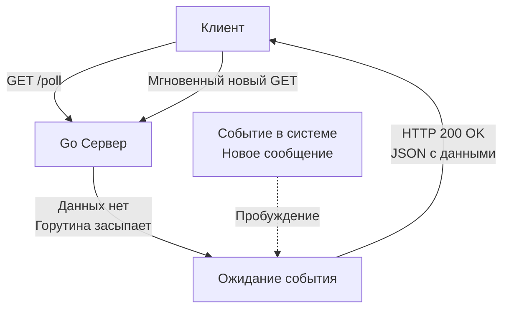

## Исторический хак, ставший индустриальным стандартом

В предыдущих статьях мы восхищались элегантностью [[22. WebSocket.md]] и эффективностью [[23. Server Sent Events.md]]. Эти технологии прекрасны, но они требуют поддержки долгих потоковых соединений на всех узлах сети. 

В реальном мире (Enterprise) вы столкнетесь с жесткими корпоративными файрволами, старыми антивирусами, агрессивными прокси-серверами (Squid) и мобильными операторами, которые принудительно обрывают любое TCP-соединение, если по нему не бегут байты дольше 10 секунд. В таких условиях WS и SSE просто не работают.

Чтобы эмулировать Real-time в агрессивной сети, инженеры придумали **Long Polling (Длинный опрос)**. Это не протокол, это архитектурный паттерн поверх стандартного, короткоживущего HTTP/1.1. До появления веб-сокетов на нем работал весь интерактивный веб (включая первые версии чатов Facebook и ВКонтакте), и он до сих пор используется как самый надежный Fallback (запасной вариант).

## Short Polling vs Long Polling

Чтобы понять гениальность Long Polling, нужно вспомнить его наивного предшественника — **Short Polling (Короткий опрос)**.

В Short Polling фронтенд просто делает `GET`-запрос каждую секунду: *"Есть новые сообщения? Нет. А сейчас? Нет. А сейчас? Да"*.
С точки зрения железа и рантайма Go это катастрофа:
1. Вы тратите CPU на парсинг HTTP-заголовков и аллокации `http.Request` тысячу раз в секунду.
2. База данных получает тысячи бессмысленных `SELECT` запросов, возвращающих пустоту.
3. Сеть забивается TCP/TLS хендшейками.

**Long Polling** меняет правила игры.
Клиент делает `GET`-запрос. Если у сервера нет новых данных, он **не возвращает пустой ответ**. Он "замораживает" HTTP-запрос (удерживает TCP-соединение открытым) и ждет, пока в системе не появится событие. Как только событие происходит, сервер мгновенно отправляет ответ и закрывает соединение. Клиент получает данные, обрабатывает их и *тут же открывает новый Long Polling запрос*.



## Mechanical Sympathy: Цена спящей горутины

Что происходит внутри Go-приложения, когда сервер решает "подождать"?
В Node.js этот паттерн идеален: благодаря Event Loop, удержание 100 000 соединений стоит копейки, процесс просто не вызывает callback, пока нет данных.

В Go модель другая — **Goroutine-per-Connection**. 
Каждый Long Polling запрос — это одна живая горутина. Если у вас 50 000 клиентов висят в ожидании, у вас в оперативной памяти висит 50 000 горутин.

**Насколько это страшно?**
1. Сама горутина в режиме сна (`select` на каналах) весит около 2 КБ.
2. Но структуры `net/http`, буферы чтения/записи и переменные в области видимости хендлера добавят еще 10-20 КБ на соединение.
3. Итого 50 000 спящих клиентов съедят около 1 ГБ оперативной памяти (Heap). 

Для современного бэкенда это ничто. Рантайм Go (в отличие от пулов тредов в Java/Tomcat) справляется с этим играючи. Горутины, заблокированные на `select`, исключаются планировщиком (Scheduler) из очереди выполнения, освобождая потоки ядра ОС (M). Они потребляют только RAM, но не CPU.

## Идиоматичный Go: Реализация Long Polling

Главное правило Long Polling: **запрос не может висеть вечно**.
Балансировщик Nginx или AWS ALB имеет настройку таймаута (например, 60 секунд). Если ваш Go-сервер будет молчать 61 секунду, балансировщик сам разорвет TCP-соединение и вернет клиенту `504 Gateway Timeout`. Это воспринимается клиентом как ошибка сети.

Идиоматичный Long Polling обработчик должен сам прервать ожидание **до** того, как сработает таймаут инфраструктуры, и вернуть статус `204 No Content` (или пустой `200 OK`), мягко попросив клиента переподключиться.

```go
func LongPollHandler(w http.ResponseWriter, r *http.Request) {
    // 1. Подписываемся на события конкретного пользователя через брокер
    userID := r.PathValue("user_id")
    eventChan := pubsub.Subscribe(userID)
    defer pubsub.Unsubscribe(userID, eventChan)

    // 2. Устанавливаем таймер ДО срабатывания таймаута Nginx (например, Nginx = 60s, мы = 50s)
    // ВАЖНО: Добавляем Jitter (рандомизацию), чтобы избежать Thundering Herd!
    timeoutDuration := 50*time.Second + time.Duration(rand.Intn(5000))*time.Millisecond
    timeout := time.NewTimer(timeoutDuration)
    defer timeout.Stop()

    // 3. Блокирующий select
    select {
    case msg := <-eventChan:
        // Успех: Появились данные
        w.Header().Set("Content-Type", "application/json")
        w.WriteHeader(http.StatusOK)
        json.NewEncoder(w).Encode(msg)
        return

    case <-timeout.C:
        // Таймаут инфраструктуры: Данных нет, просим переподключиться
        w.WriteHeader(http.StatusNoContent) // 204
        return

    case <-r.Context().Done():
        // Клиент оборвал соединение (закрыл вкладку, пропала сеть)
        // Рантайм Go отловит это на уровне Netpoller и закроет контекст
        log.Printf("client %s disconnected: %v", userID, r.Context().Err())
        return
    }
}
```

> [!warning] Ловушка / Gotcha: Проблема Thundering Herd (Стадо бизонов)
> Посмотрите на код создания таймера. Почему мы добавили случайные миллисекунды (`rand.Intn(5000)`) к 50 секундам?
> Представьте, что у вас 10 000 клиентов подключились ровно в 12:00:00 (например, после кратковременного сбоя серверов). Если таймаут у всех жестко равен 50 секундам, то ровно в 12:00:50 все 10 000 горутин проснутся, вернут 204 статус, и все 10 000 клиентов **одновременно** отправят новый HTTP-запрос. 
> Этот всплеск (Spike) CPU и сетевого IO может "положить" ваш сервер. **Jitter (Джиттер)** размазывает эти переподключения в окне от 50 до 55 секунд, сглаживая нагрузку.

## Окно потери данных (The Reconnect Window)

Самый сложный архитектурный недостаток Long Polling скрывается в зазоре между запросами.

1. Сервер отвечает клиенту (например, по таймауту 204).
2. Пакет летит по сети (50 мс).
3. Клиент обрабатывает ответ и инициирует новый запрос (10 мс).
4. Новый запрос летит к серверу (50 мс).

Итого, существует "слепое окно" в 110 миллисекунд, в течение которого клиент **физически не подключен к серверу**. Если в эти 110 мс бизнес-логика попытается отправить клиенту важное уведомление (событие попадет в `pubsub`), сообщение уйдет "в пустоту", так как горутины-подписчика в этот момент нет.

> [!tip] Собеседование
> **Вопрос:** Как гарантировать доставку сообщений (At-Least-Once) при использовании Long Polling?
> **Ответ:** Система Pub/Sub не должна быть эфемерной (fire-and-forget). Мы обязаны использовать паттерн **Outbox** или очередь с курсором (как в Kafka или базе данных). 
> Клиент должен передавать в Long Polling запросе параметр `last_event_id`. Сервер, прежде чем заблокироваться на `select`, обязан сходить в хранилище и проверить: "А были ли события для этого юзера после `last_event_id`?". Если да — мгновенно вернуть их. Если нет — засыпать. Только так мы исключаем потерю сообщений в окне реконнекта.

## Эволюция: Как Long Polling работает в распределенной системе

Как и в случае с WebSockets, Stateful-природа Long Polling требует от нас маршрутизации событий между подами. 

Если запрос от пользователя A "висит" на Pod-1, а фоновый воркер (Worker), обрабатывающий оплату, закончил работу на Pod-2, как Pod-2 скажет Pod-1 завершить HTTP-запрос?
Именно для этого в коде выше используется `pubsub.Subscribe(userID)`. Под капотом этот `pubsub` обычно реализуется через **Redis Pub/Sub** или **NATS**.
Pod-2 публикует событие в шину: `PUBLISH user_123_events "payment_success"`. Pod-1 получает его из шины, отправляет в локальный Go-канал `eventChan`, горутина просыпается и отдает HTTP 200.

## Итог

1. **Long Polling** — это самый пуленепробиваемый способ эмуляции Real-time. Он работает через любые прокси, VPN и корпоративные файрволы, так как ничем не отличается от обычного GET-запроса.
2. **Память в Go:** 100 000 висящих запросов — это 100 000 спящих горутин. Рантайм Go справляется с этим отлично, но вы должны следить за метриками Heap-памяти.
3. **Таймауты и Jitter:** Никогда не позволяйте Nginx закрыть соединение первым. Сервер должен закрывать его сам с добавлением рандомизации (Jitter) для защиты от каскадных всплесков нагрузки (Thundering Herd).
4. **Слепое окно:** Вы обязаны использовать версионирование событий (курсоры) для предотвращения потери сообщений в момент переподключения клиента.

Мы завершили огромный блок проектирования и сетевых протоколов (REST, gRPC, GraphQL, WS, SSE, Long Polling). Теперь мы понимаем, как сервисы общаются с миром. Но прежде чем этот трафик попадет в вашу бизнес-логику, он должен пройти через "Входную дверь" вашей микросервисной архитектуры. О том, как вынести авторизацию, лимиты и роутинг на периметр кластера, мы поговорим в следующей статье: [[25. API Gateway.md]].