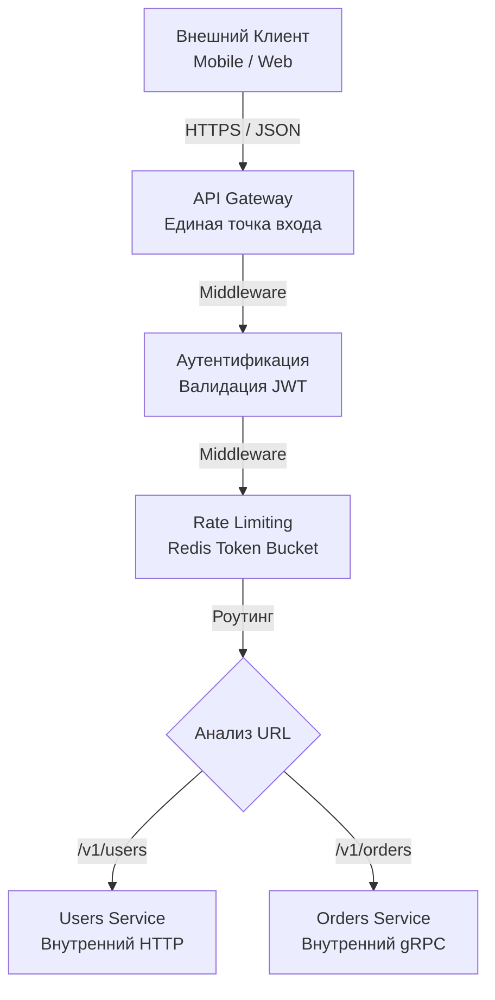

## Хаос микросервисов: Зачем нужна "Входная дверь"

В предыдущих разделах мы построили арсенал сетевого взаимодействия: научились писать быстрый REST, строгий gRPC ([[16. gRPC. Основы.md]]), гибкий GraphQL и реалтаймовые веб-сокеты. Теперь представьте, что ваш проект вырос до 50 микросервисов. 

Если заставить мобильное приложение или SPA-фронтенд общаться с каждым микросервисом напрямую (выставив 50 IP-адресов наружу), вы получите архитектурную катастрофу:
1. **Сложность клиента:** Клиент должен знать топологию всей сети, обрабатывать CORS для десятков доменов и управлять пулами соединений к разным хостам.
2. **Дублирование кода (Cross-Cutting Concerns):** Каждый из 50 микросервисов должен самостоятельно проверять JWT-токены, реализовывать Rate Limiting ([[11. Rate limiting в API.md]]), защищаться от DDoS и писать логи доступа.
3. **Безопасность:** Чем больше точек входа торчит в публичный интернет, тем шире поверхность атаки (Attack Surface).

**API Gateway (API-Шлюз)** — это паттерн проектирования, который ставит единую "входную дверь" (Reverse Proxy на стероидах) между внешним миром и вашей внутренней сетью микросервисов. 

## Функции API Gateway

Инженер уровня Senior четко разделяет бизнес-логику (Domain) и инфраструктурную логику (Edge). API Gateway забирает на себя всю инфраструктурную нагрузку L7 (прикладного уровня):

* **Терминация SSL/TLS:** Шлюз берет на себя тяжелую математику расшифровки HTTPS-трафика. Внутренние сервисы общаются по быстрому, нешифрованному HTTP (или mTLS, если включен Service Mesh).
* **Аутентификация и Авторизация:** Шлюз проверяет подпись JWT токена и только после этого пускает запрос во внутреннюю сеть, обогащая заголовки (например, добавляя `X-User-ID: 123`). Внутренним сервисам больше не нужно парсить токены.
* **Rate Limiting & Throttling:** Защита от перегрузок реализуется в одной точке.
* **Request Routing:** Маршрутизация по префиксам пути (URL) или заголовкам (Canary Releases, A/B тестирование).
* **Protocol Translation:** Трансляция внешнего HTTP/REST во внутренний gRPC (через gRPC-Gateway) или агрегация ответов.



## Mechanical Sympathy: Пишем API Gateway на Go

Написать базовый API Gateway на Go невероятно просто благодаря встроенному механизму `httputil.ReverseProxy`. 

Частая ошибка Junior-разработчика при написании прокси — попытаться прочитать запрос в память, создать новый `http.Request`, отправить его через `http.Client`, прочитать ответ в память и отдать клиенту. **Это убивает сервер по памяти (OOM) при загрузке больших файлов.**

Стандартный `ReverseProxy` в Go написан с идеальной Mechanical Sympathy. Он использует потоковое копирование байт (`io.Copy`), перекладывая данные из входящего TCP-сокета напрямую в исходящий TCP-сокет, не аллоцируя огромные срезы (slices) в куче (Heap).

> [!info] Под капотом: Новое API в Go 1.20+
> Исторически `ReverseProxy` настраивался через поле `Director`. Начиная с Go 1.20, разработчики рантайма представили более безопасный и мощный хук `Rewrite`. Он позволяет модифицировать входящий запрос до его отправки в target-сервис.

```go
package main

import (
	"log"
	"net/http"
	"net/http/httputil"
	"net/url"
	"time"
)

func NewUsersGateway(targetURL *url.URL) *httputil.ReverseProxy {
	// Идиоматичный Go 1.20+
	proxy := &httputil.ReverseProxy{
		Rewrite: func(r *httputil.ProxyRequest) {
			// Переписываем URL на целевой
			r.SetURL(targetURL)
			// Добавляем служебные заголовки для внутренних сервисов
			r.Out.Header.Set("X-Forwarded-Host", r.In.Host)
			r.Out.Header.Set("X-Gateway-Auth", "verified")
		},
		// Обязательный тюнинг для Highload
		Transport: &http.Transport{
			MaxIdleConns:          1000,
			MaxIdleConnsPerHost:   100, // Пул соединений к бэкенду
			IdleConnTimeout:       90 * time.Second,
			ResponseHeaderTimeout: 5 * time.Second, // Защита от зависших бэкендов
		},
	}
	return proxy
}

func main() {
	target, _ := url.Parse("http://internal-users-service:8080")
	gateway := NewUsersGateway(target)

	// Теперь gateway реализует http.Handler и его можно обернуть в Middleware
	http.Handle("/api/users/", AuthMiddleware(gateway))
	log.Fatal(http.ListenAndServe(":80", nil))
}
```

## Ловушки производительности (Gotchas)

### 1. Изменение тела ответа (Response Body Modification)
Самая частая задача для кастомного шлюза — залогировать тело ответа или изменить часть JSON-а. Для этого в `ReverseProxy` есть поле `ModifyResponse`.

> [!warning] Ловушка / Gotcha: Смерть Streaming-а
> Как только вы решаете изменить или прочитать `resp.Body` внутри `ModifyResponse`, вы **разрушаете потоковую передачу (streaming)**. 
> Чтобы изменить тело ответа, рантайму Go придется вычитать его целиком в оперативную память (с помощью `io.ReadAll`). Если через ваш шлюз скачивают видео размером 1 ГБ, ваша горутина аллоцирует 1 ГБ в куче. Если 10 клиентов делают это одновременно — ваш Gateway падает с OOM (Out of Memory).
> **Правило:** API Gateway должен быть "глупым" в отношении полезной нагрузки (payload). Никогда не парсите и не логируйте тела запросов/ответов на шлюзе, кроме случаев жесткой необходимости (и только с ограничением размера через `io.LimitReader`).

### 2. Утечка файловых дескрипторов
В примере кода выше мы переопределили `Transport`. Если вы используете дефолтный `http.DefaultTransport` в высоконагруженном шлюзе, вы можете упереться в лимиты открытых файлов (`ulimit -n`). По умолчанию Go держит мало бездействующих соединений (`MaxIdleConnsPerHost = 2`). Это приведет к тому, что шлюз будет постоянно закрывать и заново открывать TCP-соединения к вашим внутренним микросервисам (Time-Wait state). Всегда настраивайте connection pool!

## Индустриальные стандарты: Зачем писать самому?

В 90% случаев вам **не нужно** писать свой API Gateway на Go с нуля, несмотря на всю простоту пакета `httputil`. В экосистеме уже существуют мощнейшие продукты, написанные на Go, которые решают эту задачу "из коробки" с огромной производительностью:

1. **KrakenD:** Сверхбыстрый API Gateway, написанный на Go (на базе фреймворка Lura). Его киллер-фича — декларативная агрегация. В конфиге вы можете указать, что при GET-запросе клиента шлюз должен параллельно сходить в 3 разных микросервиса, склеить их JSON-ответы в один и отдать клиенту.
2. **Traefik:** Cloud-native Edge Router. Идеально интегрируется с Kubernetes и Docker, автоматически находя новые сервисы и выписывая им SSL-сертификаты (Let's Encrypt).
3. **Tyk:** Полноценная платформа управления API (API Management) с порталом разработчика, биллингом и монетизацией API, написанная на Go.

Писать свой велосипед на `httputil.ReverseProxy` стоит только в том случае, если вам нужна крайне специфическая, кастомная логика маршрутизации, которая не ложится на конфигурационные файлы готовых решений.

> [!tip] Собеседование
> **Вопрос:** В чем разница между API Gateway, Load Balancer (например, AWS ALB) и Service Mesh (например, Istio)?
> **Ответ:** > * **Load Balancer (L4/L7):** Глупая труба. Его задача — просто раскидать трафик по здоровым узлам (Round-Robin, Least Connections). Он ничего не знает о ваших бизнес-правилах или пользователях.
> * **API Gateway (L7 Edge):** Умная точка входа "Снаружи-Внутрь" (North-South traffic). Он знает про домены вашего бизнеса, проверяет JWT, склеивает запросы и прячет внутреннюю архитектуру от внешнего мира.
> * **Service Mesh (L7 Internal):** Регулирует трафик "Внутри-Внутри" (East-West traffic). Это Sidecar-прокси (например, Envoy), которые стоят *рядом* с каждым микросервисом. Они обеспечивают mTLS шифрование между сервисами, ретраи, Circuit Breaker и распределенную трассировку, чтобы микросервисы могли безопасно общаться *друг с другом*.

## Итог

1. **API Gateway** защищает внутренние микросервисы от хаоса внешнего мира, беря на себя функции безопасности, лимитирования и роутинга.
2. В Go написание прокси-сервера тривиально благодаря `httputil.ReverseProxy`, который использует потоковое копирование байт (`io.Copy`) для минимального давления на Garbage Collector.
3. Опасайтесь чтения тел ответов на уровне шлюза — это уничтожает производительность и аллоцирует огромные объемы памяти.
4. В production-системах предпочитайте готовые OpenSource решения на Go (KrakenD, Traefik), переходя на кастомный код только при крайней бизнес-необходимости.

API Gateway — это отличное решение для общего доступа. Но что если мобильному приложению нужен совершенно другой формат данных, чем веб-сайту? Если мы засунем логику форматирования ответов под каждого клиента в единый шлюз, он превратится в неподдерживаемый монолит. Для решения этой проблемы существует эволюция паттерна API Gateway, которую мы детально разберем в следующей статье: [[26. BFF pattern.md]].