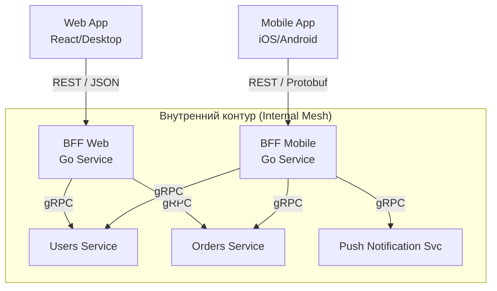

## Backend for Frontend: Изоляция интересов клиентов

В предыдущей статье про [[25. API Gateway.md]] мы рассмотрели концепцию единой точки входа. Однако в больших системах один «универсальный» шлюз часто становится узким местом. 

Представьте ситуацию:
* **Web-приложение** (Desktop) хочет видеть детальные таблицы с 20 колонками.
* **Mobile-приложение** (iOS/Android) имеет ограниченный экран и слабый процессор — ему нужны только 3 колонки и сжатые изображения.
* **Smart TV** или **IoT-устройства** имеют свои специфические требования к форматам и таймаутам.

Если мы попытаемся реализовать всю эту логику адаптации в одном API Gateway, он превратится в «божественный объект», где изменение кода для мобилок может случайно сломать десктоп. Решение этой проблемы — паттерн **BFF (Backend for Frontend)**.

## Суть паттерна: Под каждую платформу свой бэкенд

Вместо одного общего шлюза мы создаем **несколько специализированных легковесных прослоек**, каждая из которых обслуживает строго определенный тип клиента. 

BFF — это не просто прокси. Это слой агрегации, который:
1.  **Форматирует данные:** Переводит типы (например, `int64` из бэкенда в `string` для JS, чтобы избежать потери точности).
2.  **Агрегирует вызовы:** Заменяет 10 запросов к внутренним микросервисам на 1 запрос от клиента.
3.  **Оптимизирует Payload:** Вырезает ненужные поля (своеобразный GraphQL на минималках, но жестко зашитый в код).
4.  **Управляет сессиями:** Реализует специфичную для платформы аутентификацию (например, Cookie для Web и Token для Mobile).



## Mechanical Sympathy: Почему Go идеален для BFF

BFF — это I/O-intensive слой. Он не делает сложных вычислений, он постоянно ждет: ответа от сервиса А, ответа от сервиса Б. 

В языках с классическими тредами (Java/Python) создание BFF требует огромного расхода памяти, так как сотни потоков будут просто "спать", ожидая сетевого ответа от внутренних систем. В Go модель **Goroutine-per-Request** позволяет BFF держать десятки тысяч соединений при минимальном потреблении RAM.

### Параллельная агрегация через errgroup
Идиоматичный способ реализации агрегации в Go BFF — использование пакета `golang.org/x/sync/errgroup`. Он позволяет запустить запросы к нескольким микросервисам параллельно и дождаться их завершения или первой ошибки.

```go
func (s *BffServer) GetDashboard(ctx context.Context, req *DashboardRequest) (*DashboardResponse, error) {
    g, ctx := errgroup.WithContext(ctx)
    
    var (
        user   *pb.User
        orders []*pb.Order
    )

    // Запрос к сервису пользователей
    g.Go(func() error {
        var err error
        user, err = s.userClient.GetProfile(ctx, &pb.GetProfileRequest{Id: req.UserID})
        return err
    })

    // Запрос к сервису заказов
    g.Go(func() error {
        var err error
        resp, err := s.orderClient.ListOrders(ctx, &pb.ListOrdersRequest{UserId: req.UserID})
        if err == nil {
            orders = resp.Orders
        }
        return err
    })

    // Ждем завершения всех горутин
    if err := g.Wait(); err != nil {
        return nil, fmt.Errorf("failed to aggregate data: %w", err)
    }

    // Здесь мы мапим внутренние gRPC структуры в DTO, специфичное для фронтенда
    return &DashboardResponse{
        UserName:    user.FullName,
        RecentOrder: mapToMobileFormat(orders),
    }, nil
}
```

> [!info] Под капотом: Контексты и отмены
> Заметьте, что мы передаем `ctx` из `errgroup` во все вложенные вызовы. Если запрос к `userClient` упадет с ошибкой, `errgroup` автоматически отменит контекст для всех остальных запущенных горутин. Это экономит ресурсы: нам не нужно ждать ответа от сервиса заказов, если мы уже знаем, что не сможем собрать целый ответ для клиента.

## Кто должен владеть BFF?

Это главный архитектурно-организационный вопрос (Conway's Law). 
* **Вариант А:** BFF пишет команда бэкенда.
* **Вариант Б:** BFF пишет команда фронтенда.

В современной практике побеждает **Вариант Б**. Фронтенд-разработчики лучше знают, какой формат данных им удобен. Поскольку Go имеет низкий порог входа и высокую производительность, фронтенд-инженеры (особенно те, кто знаком с TypeScript) быстро осваивают написание простых BFF-сервисов на Go, избавляя бэкенд-команду от бесконечных задач типа "Добавьте еще одно поле в JSON".

## Ловушки паттерна (Gotchas)

### 1. Дублирование кода
Если логика авторизации или логирования копипастится в `BFF-Web` и `BFF-Mobile`, это порождает технический долг. 
**Решение:** Общая логика (Cross-cutting concerns) должна быть вынесена либо в разделяемые Go-библиотеки (Internal SDK), либо оставаться на уровне «глупого» API Gateway, который стоит ПЕРЕД всеми BFF.

### 2. Задержка (Latency)
BFF добавляет еще один сетевой "прыжок" (Hop). Клиент -> BFF -> Микросервис. 
**Mechanical Sympathy:** Чтобы минимизировать эту задержку, общение между BFF и микросервисами ДОЛЖНО идти через **gRPC** ([[16. gRPC. Основы.md]]) по долгоживущим HTTP/2 соединениям. Использование REST/JSON внутри кластера между BFF и сервисами — это пустая трата ресурсов на сериализацию и хендшейки.

### 3. "Тонкий" или "Толстый" BFF?
BFF должен оставаться максимально "худым". Как только вы начинаете писать в нем бизнес-логику (например, расчет скидок или валидацию цен), вы нарушаете архитектуру. Бизнес-логика должна быть только в микросервисах. BFF — это только **Транспорт и Агрегация**.

> [!tip] Собеседование
> **Вопрос:** В чем разница между API Gateway и BFF?
> **Ответ:** API Gateway — это единая точка входа для всей компании, решающая общие инфраструктурные задачи (безопасность, лимиты). BFF — это слой, созданный для конкретного интерфейса пользователя. Система может иметь один API Gateway, но иметь 3-4 разных BFF за ним.

## Итог

1.  **BFF** изолирует сложности фронтенда от чистоты доменной логики бэкенда.
2.  Go идеально подходит для BFF благодаря **горутинам** и пакету **errgroup**, позволяющим эффективно агрегировать данные из множества источников параллельно.
3.  Используйте BFF для адаптации контрактов под разные платформы, но не переносите в него бизнес-логику.
4.  Внутреннее взаимодействие BFF -> Microservices всегда должно быть максимально быстрым (gRPC).

Мы обсудили, как строить интерфейсы и шлюзы. Но самая большая боль в эволюции систем наступает тогда, когда контракт нужно изменить. Как добавить новое поле или удалить старое, не вызвав "белый экран смерти" у пользователей? Этому искусству посвящена следующая статья: [[27. Backward compatibility.md]].