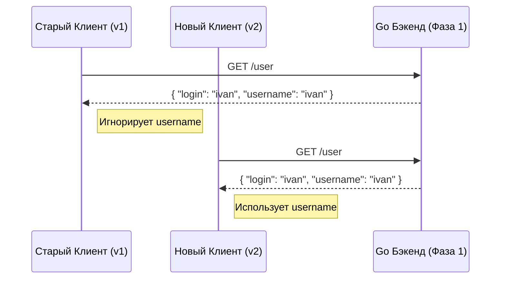

## Искусство не ломать: Обратная совместимость в распределенных системах

В монолитном приложении изменение сигнатуры функции исправляется одним рефакторингом и компиляцией. В микросервисной архитектуре, как мы выяснили в статье [[2. Что такое API и контракт.md]], контракт — это внешнее обязательство. 

**Обратная совместимость (Backward Compatibility)** — это способность новой версии сервера корректно работать со старыми версиями клиентов. 

Для Senior-разработчика это не просто "не удалять поля". Это глубокое понимание того, как сериализаторы (JSON, Protobuf) и рантайм Go обрабатывают данные, которых они не ожидали, и как проектировать изменения так, чтобы клиенты даже не заметили обновления бэкенда.

## Золотые правила изменений

Любое изменение в API можно классифицировать как **Breaking** (ломающее) или **Non-breaking** (совместимое).

### Что НЕ ломает контракт (Safe):
1. **Добавление нового эндпоинта.**
2. **Добавление нового (опционального) поля в ответ.** Согласно закону Постела, старые клиенты просто проигнорируют неизвестное поле при десериализации.
3. **Добавление нового опционального Query-параметра.**
4. **Изменение порядка полей в JSON.** JSON — это неупорядоченная мапа.

### Что ГАРАНТИРОВАННО ломает контракт (Breaking):
1. **Переименование или удаление поля.**
2. **Изменение типа поля** (например, был `int`, стал `string`).
3. **Добавление обязательного (required) поля в запрос.** Старые клиенты пришлют запрос без него, и сервер ответит 400 Bad Request.
4. **Изменение семантики.** Вы оставили поле `status` типом `int`, но раньше `1` значило "Active", а теперь — "Deleted". Это самая коварная ошибка.

---

## Mechanical Sympathy: Совместимость на уровне байтов

Разные форматы данных по-разному реагируют на изменения. Понимание их "внутренней кухни" помогает делать изменения дешевле.

### JSON (Неявная совместимость)
В Go пакет `encoding/json` при встрече лишнего поля в байтах просто пропускает его. Если же поле в JSON отсутствует, Go-структура получит Zero Value для этого типа.
**Ловушка:** Если вы добавили поле, и старый клиент его не прислал, ваш код получит `0` или `""`. Вы должны уметь отличать "намеренный ноль" от "отсутствия данных" (см. [[4. Resource oriented design.md]] про указатели в PATCH).

### Protobuf (Явная совместимость)
Как мы разбирали в [[17. Protocol Buffers.md]], Protobuf использует номера тегов. 
* Если сервер шлет тег `4`, который клиент не знает, клиент сохранит его в `unknownFields` и проигнорирует.
* Если вы измените имя поля в `.proto`, но оставите тег тем же — **совместимость сохранится**.

> [!warning] Ловушка / Gotcha: Смена типов в Protobuf
> В Protobuf некоторые типы бинарно совместимы (например, `int32`, `int64`, `uint32` и `bool` упаковываются как `varint`). Технически вы можете сменить `int32` на `int64` без падения парсера, но данные могут быть обрезаны или интерпретированы неверно. Всегда считайте смену типа — breaking change.

---

## Стратегия "Expand and Contract" (Расширение и Сужение)

Это фундаментальный паттерн для удаления или изменения полей в Highload системах без остановки сервиса. Процесс проходит в три фазы.

### Сценарий: Нужно переименовать поле `login` в `username`.

**Фаза 1: Расширение (Expand)**
1. Бэкенд добавляет новое поле `username` в ответ, но **сохраняет** старое поле `login`. Они дублируют друг друга.
2. Деплоится новая версия бэкенда. Старые клиенты читают `login`, новые — `username`. Все счастливы.

**Фаза 2: Миграция (Migrate)**
1. Вы объявляете поле `login` устаревшим (`@deprecated` в OpenAPI или GraphQL).
2. Вы обновляете все свои фронтенды и мобильные приложения, чтобы они перешли на `username`.
3. Вы ждете (иногда месяцы), пока процент старых клиентов в логах не упадет до нуля.

**Фаза 3: Сужение (Contract)**
1. Вы удаляете поле `login` из кода и контракта.
2. Вы деплоите бэкенд, очищая кодовую базу.



---

## Совместимость Enum-ов: Проблема "Default"

Это классический вопрос на Middle+ собеседовании по Go и Protobuf.

Представьте Enum:
```protobuf
enum Role {
  UNKNOWN = 0;
  USER = 1;
  ADMIN = 2;
}
```
Вы добавляете новую роль `SUPERADMIN = 3;`. Сервер v2 отправляет роль `3`. Старый клиент v1 получает байты, но в его сгенерированном коде нет значения `3`.

В Go сгенерированный Protobuf-код просто запишет в переменную число `3`. Но если ваш код делает `switch` по ролям и не имеет ветки `default`, вы можете столкнуться с непредсказуемым поведением бизнес-логики.
**Правило:** Всегда пишите `default` в `switch` по перечислениям из API.

---

## Тестирование на разрыв: Contract Testing

Как гарантировать, что вы случайно не удалили поле в огромном проекте?
1. **Linter:** Использование `buf breaking` для Protobuf или `spectral` для OpenAPI. Они сравнивают текущую схему с предыдущей версией в Git и выдают ошибку в CI, если вы внесли ломающее изменение.
2. **Contract Tests (Pact):** Потребители вашего API (например, Frontend) пишут тесты, описывающие, какие поля они ожидают. Эти тесты запускаются на стороне бэкенда. Если бэкенд перестал отдавать поле, которое нужно фронтенду, билд падает.

> [!tip] Собеседование
> **Вопрос:** Что делать, если ломающее изменение неизбежно и "Expand and Contract" не подходит?
> **Ответ:** Использовать версионирование (см. [[8. Versioning API.md]]). Мы создаем `/v2/` эндпоинт, где живет новый контракт, сохраняя `/v1/` нетронутым для старых клиентов. Это увеличивает стоимость поддержки, но гарантирует стабильность системы.

## Итог

1. **Обратная совместимость** важнее "красивого" кода. Сломанный клиент — это потерянные деньги и репутация.
2. Используйте **Expand and Contract** для плавных миграций.
3. Никогда не меняйте **семантику** поля, сохраняя его имя и тип.
4. Автоматизируйте проверку совместимости в CI через **линтеры схем**.

Контракты и их стабильность — это фундамент. Теперь мы готовы перейти к самому важному аспекту эксплуатации любого API: безопасности. Как защитить наш бэкенд от кражи данных, подделки запросов и несанкционированного доступа? Об этом в следующей статье: [[28. Security API. Auth, OAuth2.md]].