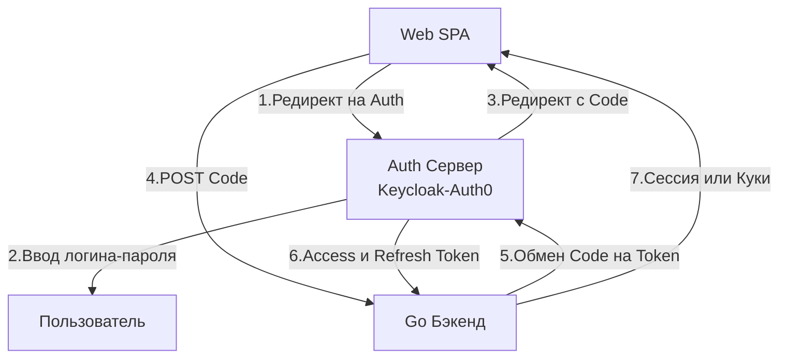

## Защита периметра: От идентификации до авторизации

В предыдущих разделах мы построили архитектуру нашего бэкенда, настроили роутинг, шлюзы и кэширование. Наша система работает невероятно быстро, утилизируя всю мощь рантайма Go. Но без надлежащей безопасности эта скорость будет использована злоумышленниками для мгновенного выкачивания вашей базы данных.

Безопасность API — это не фича, которую можно "прикрутить" перед релизом. Это фундаментальный слой, который пронизывает каждый HTTP-запрос. Для инженера уровня Senior понимание криптографии, стандартов авторизации и векторов атак (OWASP) так же важно, как понимание работы сборщика мусора.

В этой статье мы разберем два базовых столпа безопасности: **Аутентификацию (AuthN)** и **Авторизацию (AuthZ)**.

## Терминология: AuthN vs AuthZ

Это самый частый вопрос-разминка на собеседованиях, на котором "сыплются" разработчики, путающие эти понятия.

1. **Аутентификация (Authentication / AuthN):** Ответ на вопрос *"Кто ты?"*. Процесс проверки подлинности субъекта. (Например: проверка логина и пароля, биометрия, одноразовый код из SMS).
2. **Авторизация (Authorization / AuthZ):** Ответ на вопрос *"Что тебе разрешено?"*. Процесс проверки прав доступа аутентифицированного пользователя к конкретному ресурсу. (Например: может ли этот `user_id` удалить статью с `post_id = 5`).

## Эволюция аутентификации: От сессий к токенам

Исторически бэкенд использовал **Stateful-сессии**. Пользователь вводил пароль, сервер создавал запись в оперативной памяти или Redis (`session_id -> user_id`) и отдавал клиенту Cookie.
В архитектуре REST ([[3. REST. Основные принципы.md]]) это нарушает принцип Stateless. Кроме того, проверка сессии в Redis на каждый из 10 000 RPS — это дополнительный сетевой вызов (IO) и задержка (Latency).

Современные распределенные системы используют **Stateless-токены**, самым популярным из которых является **JWT (JSON Web Token)**.

### Анатомия JWT и Mechanical Sympathy

JWT — это просто строка, разделенная двумя точками на три части: `Header.Payload.Signature` (Заголовок, Полезная нагрузка, Подпись).
Первые две части — это просто Base64URL-кодированный JSON. Их может прочитать кто угодно. **Секретность JWT заключается исключительно в его Подписи.**

С точки зрения рантайма Go, валидация JWT — это математическая операция (Криптография).

Существует два основных класса алгоритмов подписи:
1. **Симметричные (HMAC - HS256):** Один и тот же секретный ключ используется и для создания, и для проверки токена.
   * *Плюсы:* Очень быстрые алгоритмы. Минимальная нагрузка на CPU.
   * *Минусы:* Если у вас 5 микросервисов, каждый из них должен знать этот секретный ключ, чтобы проверить токен. Утечка ключа на любом сервисе компрометирует всю систему.
2. **Асимметричные (RSA - RS256 или ECDSA - ES256):** Используется пара ключей. Auth-сервер подписывает токен Закрытым ключом (Private Key). Все остальные микросервисы проверяют подпись Открытым ключом (Public Key).
   * *Плюсы:* Идеально для микросервисов. Публичный ключ можно безопасно раздавать кому угодно.
   * *Минусы:* Асимметричная криптография — это **очень дорого** для процессора.

> [!info] Под капотом: Математика RSA и CPU
> Валидация RSA-подписи требует возведения больших чисел в степень по модулю. В высоконагруженных Go-сервисах использование алгоритма RS256 на каждом входящем HTTP-запросе приведет к тому, что ваш CPU будет постоянно занят математикой пакета `crypto/rsa`. 
> Горутины будут дольше удерживать процессор (M), не уходя в IO-блокировки, что может замедлить работу планировщика (Scheduler).
> **Решение для Highload:** Использовать эллиптические кривые (ECDSA, алгоритм ES256). Они обеспечивают ту же криптографическую стойкость при значительно меньшей длине ключа, что делает верификацию подписи в рантайме Go в несколько раз быстрее.

### Ловушка пакета golang-jwt/jwt

Библиотека `github.com/golang-jwt/jwt` является стандартом де-факто в Go. Но ее неправильное использование приводит к критическим уязвимостям.

> [!warning] Ловушка / Gotcha: Атака Key Confusion (Алгоритмическая путаница)
> Представьте, что ваш сервис ожидает RSA-токен (алгоритм RS256) и использует публичный ключ для валидации. Злоумышленник берет ваш публичный ключ (он же публичный!), скачивает его и генерирует свой собственный JWT, но в заголовке токена указывает алгоритм `HS256` (симметричный HMAC). При этом в качестве "секрета" HMAC он использует сам текст вашего публичного ключа.
> Если ваш Go-код слепо доверяет заголовку `alg` из присланного токена, библиотека использует публичный ключ как HMAC-секрет, подпись сойдется, и злоумышленник получит права администратора!
> 
> **Защита:** В функции `Keyfunc` вы ОБЯЗАНЫ жестко проверять тип метода подписи:
> ```go
> token, err := jwt.Parse(tokenString, func(t *jwt.Token) (interface{}, error) {
>     // КРИТИЧЕСКИ ВАЖНАЯ ПРОВЕРКА
>     if _, ok := t.Method.(*jwt.SigningMethodRSA); !ok {
>         return nil, fmt.Errorf("unexpected signing method: %v", t.Header["alg"])
>     }
>     return rsaPublicKey, nil
> })
> ```

## OAuth 2.0: Делегирование доступа

Если JWT — это "паспорт" пользователя, то OAuth 2.0 — это протокол, описывающий, как именно этот паспорт получить.
Частая ошибка — считать OAuth 2.0 протоколом аутентификации. На самом деле это протокол **делегированного доступа** (чтобы приложение "Бэкенд" получило доступ к данным пользователя в "Google" без передачи пароля).
Для аутентификации поверх OAuth 2.0 была создана надстройка — **OpenID Connect (OIDC)**, которая стандартизировала возврат `id_token` (в формате JWT).

### Authorization Code Flow
В современных приложениях (SPA, Mobile) используется исключительно *Authorization Code Flow with PKCE*.



Почему SPA не получает токен напрямую от Auth-сервера? Потому что браузер — это недоверенная среда (XSS атаки).
Правильная архитектура: SPA получает временный одноразовый "Код", отправляет его на ваш Go-бэкенд, и именно ваш Go-бэкенд (используя свой секретный `client_secret`) идет к Auth-серверу обменивать код на JWT. 

## Авторизация (AuthZ) в Go: RBAC

Когда мы убедились, что токен валиден и перед нами `user_id = 42`, нам нужно решить, пускать ли его в обработчик `DELETE /users/10`.

Индустриальный стандарт — **RBAC (Role-Based Access Control)**. Пользователям назначаются роли ("admin", "editor"), ролям назначаются права ("delete_user").

В Go авторизация реализуется через Middleware (паттерн Декоратор).

```go
package auth

import (
	"context"
	"net/http"
)

// Идиоматичный Go: ключи контекста не должны быть строками во избежание коллизий!
type contextKey string
const userRoleKey contextKey = "user_role"

// 1. AuthN Middleware (Проверка токена)
func RequireAuth(next http.Handler) http.Handler {
	return http.HandlerFunc(func(w http.ResponseWriter, r *http.Request) {
		token := extractToken(r)
		claims, err := validateJWT(token)
		if err != nil {
			http.Error(w, "Unauthorized", http.StatusUnauthorized)
			return
		}

		// Сохраняем роль пользователя в context.Context
		ctx := context.WithValue(r.Context(), userRoleKey, claims.Role)
		next.ServeHTTP(w, r.WithContext(ctx))
	})
}

// 2. AuthZ Middleware (Проверка прав)
func RequireRole(requiredRole string, next http.Handler) http.Handler {
	return http.HandlerFunc(func(w http.ResponseWriter, r *http.Request) {
		// Достаем роль из контекста
		role, ok := r.Context().Value(userRoleKey).(string)
		if !ok || role != requiredRole {
			// Статус 403, а не 401!
			http.Error(w, "Forbidden", http.StatusForbidden)
			return
		}
		next.ServeHTTP(w, r)
	})
}
```

> [!tip] Собеседование
> **Вопрос:** В чем разница между RBAC и ABAC?
> **Ответ:** RBAC (Role-Based) статичен: "Админ может удалять статьи". ABAC (Attribute-Based) динамичен и оценивает контекст запроса: "Пользователь может удалять статью, ТОЛЬКО ЕСЛИ `article.author_id == user.id` И `time.Now() < article.created_at + 24h`". ABAC сложнее в реализации, так как требует загрузки состояния ресурса (из БД) до принятия решения об авторизации. В Go для сложного ABAC часто используют внешние движки политик, такие как **Open Policy Agent (OPA)** с языком Rego.

## OWASP Top 10 в контексте Go API

Помимо сломанной аутентификации, ваш API-контракт должны быть защищены от классических уязвимостей.

1. **SQL Injection (SQLi):**
   * *Решение в Go:* Никогда не используйте форматирование строк `fmt.Sprintf` для SQL. Все драйверы в пакете `database/sql` используют параметризованные запросы (`$1`, `?`). Драйвер базы данных сам экранирует параметры до выполнения плана запроса.

2. **Cross-Site Scripting (XSS):**
   * *Специфика API:* XSS — это проблема рендеринга в браузере. Если ваш Go-сервер возвращает `application/json`, он не уязвим для XSS напрямую. Главное — убедиться, что вы отдаете правильный `Content-Type` (см. [[6. Статусы HTTP.md]]), чтобы браузер не попытался "угадать" тип и исполнить присланный HTML-код.

3. **Cross-Site Request Forgery (CSRF):**
   * Если ваши JWT-токены хранятся в LocalStorage — CSRF невозможен (так как JS-код фронтенда сам прикрепляет заголовок `Authorization: Bearer`). 
   * Если токены хранятся в `HttpOnly Cookie` (что безопаснее от XSS), вы **обязаны** защищаться от CSRF. Злоумышленник может сделать скрытую форму на своем сайте, которая отправит POST-запрос на ваш API, и браузер автоматически прикрепит 쿠ки с токеном. 
   * *Решение в Go:* Использование пакета `gorilla/csrf` (Double Submit Cookie Pattern) или проверка заголовка `Origin` / `Referer`.

4. **Mass Assignment:**
   * Уязвимость, когда клиент присылает JSON `{"name": "Ivan", "is_admin": true}`, а ваш Go-бэкенд делает `json.Unmarshal` прямо в структуру базы данных (GORM), нечаянно повышая права пользователя.
   * *Решение в Go:* Строгое разделение моделей (DTO). Всегда создавайте отдельную структуру для Request-а (см. [[4. Resource oriented design.md]]), в которой поля `is_admin` просто нет.

## Итог

1. **AuthN** (Аутентификация) проверяет личность, **AuthZ** (Авторизация) проверяет права.
2. Валидация **JWT** — это математика. Используйте эллиптические кривые (ECDSA) для снижения нагрузки на процессор и всегда жестко валидируйте метод подписи в пакете `golang-jwt`.
3. Современные SPA должны получать доступ к API через **OAuth 2.0 Authorization Code Flow**, а Go-сервер выступать надежным посредником для обмена кода на токен.
4. Контекст запроса (`r.Context()`) — это идиоматичный способ передачи данных пользователя (ID, роли) от Auth-Middleware до бизнес-логики.

Мы защитили прикладной уровень (L7). Наши токены надежны, а роли проверены. Но что если злоумышленник (или скомпрометированный внутренний сервис) "слушает" трафик внутри нашей собственной корпоративной сети или кластера Kubernetes? О том, как обеспечить криптографическую защиту каждого байта при межсервисном общении (Zero Trust Architecture), мы поговорим в следующей статье: [[29. mTLS в сервисах.md]].