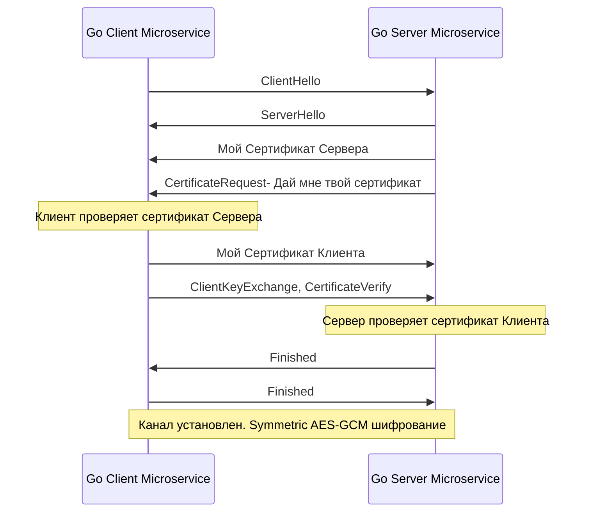

## Смерть периметра: Архитектура Zero Trust

В статье [[28. Security API. Auth, OAuth2.md]] мы защитили наш API от внешних угроз. Мы настроили валидацию JWT на уровне [[25. API Gateway.md]] и уверены, что никто из интернета не получит доступ к данным без токена. 

Исторически инженеры строили безопасность по модели "Замка и рва" (Castle-and-Moat). Снаружи — опасный интернет (там мы требуем HTTPS и токены). Внутри периметра кластера (в нашей частной VPC) — доверенная сеть, где микросервисы общаются друг с другом по открытому HTTP на порту 8080.

**Почему эта модель устарела?**
1. **SSRF (Server-Side Request Forgery):** Злоумышленник находит уязвимость в сервисе генерации PDF (например, через отправку вредоносного URL в картинке). Он получает удаленное выполнение кода (RCE) внутри вашего "безопасного" кластера.
2. **Внутренние угрозы:** Скомпрометированный ноутбук разработчика с доступом к VPN дата-центра.
3. **Облачные провайдеры:** Вы арендуете виртуальные машины у AWS/GCP. Технически, ваш трафик идет по проводам, которые вы не контролируете.

Если ваш сервис A доверяет любому запросу, пришедшему из локальной сети, злоумышленник, попавший внутрь, скачает всю базу данных за секунды. 

Решение — **Zero Trust Architecture (Архитектура Нулевого Доверия)**. Главный принцип: "Никогда не доверяй, всегда проверяй". И технологическим фундаментом для межсервисного Zero Trust является **mTLS (Mutual TLS)**.

## Анатомия mTLS: Двустороннее рукопожатие

Классический TLS (HTTPS), который мы видим в браузере, — это **односторонняя аутентификация**. 
Браузер (Клиент) проверяет сертификат Сервера, чтобы убедиться, что он действительно общается с `google.com`, а не с хакером. Серверу при этом абсолютно неважно, кто такой клиент (для идентификации клиента используются JWT или Cookie поверх уже зашифрованного канала).

**mTLS (Взаимный TLS)** заставляет обе стороны доказывать свою личность на уровне криптографии сетевого сокета, ЕЩЕ ДО того, как будет отправлен хотя бы один байт HTTP-запроса.



## Идиоматичный Go: Настройка mTLS в рантайме

Стандартная библиотека Go предоставляет невероятно мощный пакет `crypto/tls`. Вам не нужен Nginx для поднятия mTLS. 

Чтобы mTLS работал, у вас должен быть свой внутренний Центр Сертификации (Internal CA — Certificate Authority). Этот CA подписывает сертификаты и для Сервера, и для Клиента.

### 1. Код Сервера (Go Server)

Сервер должен быть настроен так, чтобы **требовать** и **проверять** сертификат клиента.

```go
package main

import (
	"crypto/tls"
	"crypto/x509"
	"log"
	"net/http"
	"os"
)

func main() {
	// 1. Загружаем корневой сертификат нашего внутреннего CA
	caCert, err := os.ReadFile("ca.crt")
	if err != nil {
		log.Fatalf("Failed to read CA cert: %v", err)
	}
	caCertPool := x509.NewCertPool()
	caCertPool.AppendCertsFromPEM(caCert)

	// 2. Настраиваем TLS Config
	tlsConfig := &tls.Config{
		// RequireAndVerifyClientCert - КРИТИЧЕСКИЙ ПАРАМЕТР!
		// Если клиент не пришлет сертификат, рукопожатие будет разорвано.
		ClientAuth: tls.RequireAndVerifyClientCert,
		
		// Указываем, какому CA мы доверяем при проверке клиентов
		ClientCAs:  caCertPool,
		
		// Рекомендуется жестко задать минимальную версию TLS 1.3 для Highload
		MinVersion: tls.VersionTLS13, 
	}

	server := &http.Server{
		Addr:      ":8443",
		TLSConfig: tlsConfig,
		Handler:   http.HandlerFunc(func(w http.ResponseWriter, r *http.Request) {
			// Вытаскиваем информацию о клиенте прямо из сертификата!
			clientName := r.TLS.PeerCertificates[0].Subject.CommonName
			w.Write([]byte("Hello, authenticated service: " + clientName))
		}),
	}

	// Запускаем сервер, предоставляя его собственный сертификат
	log.Fatal(server.ListenAndServeTLS("server.crt", "server.key"))
}
```

### 2. Код Клиента (Go Client)

Клиент `net/http` по умолчанию не отправляет клиентские сертификаты. Мы должны переопределить `http.Transport`.

```go
func createMTLSClient() *http.Client {
	// 1. Загружаем сертификат КЛИЕНТА и его приватный ключ
	clientCert, _ := tls.LoadX509KeyPair("client.crt", "client.key")

	// 2. Загружаем CA, чтобы проверять сертификат СЕРВЕРА
	caCert, _ := os.ReadFile("ca.crt")
	caCertPool := x509.NewCertPool()
	caCertPool.AppendCertsFromPEM(caCert)

	// 3. Создаем TLS конфигурацию
	tlsConfig := &tls.Config{
		Certificates: []tls.Certificate{clientCert},
		RootCAs:      caCertPool,
	}

	// 4. Подменяем транспорт
	transport := &http.Transport{
		TLSClientConfig: tlsConfig,
	}

	return &http.Client{Transport: transport}
}
```

## Mechanical Sympathy: Производительность mTLS

> [!warning] Ловушка / Gotcha: Смерть от рукопожатий (Handshake Death)
> В TLS 1.2/1.3 процесс обмена ключами (Handshake) использует тяжелую асимметричную криптографию (Elliptic Curve Diffie-Hellman - ECDHE). 
> Если ваш Go-клиент открывает новое mTLS-соединение на каждый HTTP-запрос (не используя Keep-Alive пулинг), ваш процессор будет постоянно занят вычислением криптографических кривых.
> **Итог:** Загрузка CPU улетит в 100%, а полезный RPS (Requests Per Second) упадет в 5-10 раз по сравнению с открытым HTTP.

**Как решается эта проблема в архитектуре?**
1. **Connection Pooling:** Использовать мультиплексирование. Именно поэтому связка mTLS + gRPC ([[16. gRPC. Основы.md]]) так популярна в микросервисах. Одно долгоживущее HTTP/2 соединение делает дорогой mTLS Handshake ровно один раз, а затем миллионы запросов шифруются быстрым симметричным алгоритмом (AES-GCM), который аппаратно ускоряется на современных процессорах инструкциями AES-NI. Оверхед от AES-GCM составляет менее 2%.
2. **Session Resumption:** В Go 1.21+ `tls.Config` по умолчанию поддерживает возобновление сессий (Session Tickets). Если TCP-соединение разорвалось, следующее рукопожатие будет "укороченным" и потребует меньше CPU.

## Авторизация на уровне сертификатов (SPIFFE)

mTLS дает нам строгую Аутентификацию (AuthN), но что с Авторизацией (AuthZ)?
Сервис А подключился к Сервису Б. Как Сервис Б поймет, что это именно "Билинг-сервис", которому разрешено списывать деньги?

В сертификате X.509 есть поля `Subject` (Common Name) и `SAN` (Subject Alternative Name). 
Индустриальным стандартом для идентификации микросервисов стал формат **SPIFFE (Secure Production Identity Framework for Everyone)**.
SPIFFE определяет структуру URI (SPIFFE ID), которая зашивается в поле SAN сертификата:
`spiffe://mycompany.local/ns/billing/sa/billing-service`

Ваш Go-сервер при обработке запроса извлекает этот URI:

```go
func BillingHandler(w http.ResponseWriter, r *http.Request) {
    if len(r.TLS.PeerCertificates) == 0 {
        http.Error(w, "MTLS required", http.StatusUnauthorized)
        return
    }
    
    // Читаем SAN (URI) из сертификата клиента
    uris := r.TLS.PeerCertificates[0].URIs
    if len(uris) == 0 || uris[0].String() != "spiffe://mycompany.local/ns/billing/sa/billing-service" {
        http.Error(w, "Forbidden: Invalid Service Identity", http.StatusForbidden)
        return
    }
    // Разрешаем операцию...
}
```

## Проблема Ротации Сертификатов и Service Mesh

> [!tip] Собеседование
> **Вопрос:** Если мы загрузили сертификат через `tls.LoadX509KeyPair()`, и срок действия сертификата истек (например, через 30 дней), что произойдет с Go-сервером?
> **Ответ:** Сервер перестанет принимать новые соединения (клиенты получат `certificate expired`). Функция `LoadX509KeyPair` загружает байты в оперативную память **один раз** при старте приложения. 
> Чтобы обновить сертификат без рестарта процесса (Downtime), в `tls.Config` есть callback-функция `GetCertificate`. Мы можем написать логику, которая при каждом новом рукопожатии читает сертификат из памяти (защищенной `sync.RWMutex`), а фоновая горутина раз в час перечитывает файл с диска и атомарно обновляет указатель.

В реальном Highload Enterprise писать этот код вручную для 50 микросервисов — безумие. 
Поэтому индустрия перешла на **Service Mesh** (Istio, Linkerd, Consul).

В архитектуре Service Mesh ваше Go-приложение вообще ничего не знает про mTLS, сертификаты и `crypto/tls`. Оно "думает", что работает в безопасной сети и слушает обычный `http.ListenAndServe(":8080", nil)`.
Всю магию делает **Sidecar Proxy (например, Envoy)**, который запускается в том же поде Kubernetes. 
1. Ваш сервис делает запрос на `http://billing-service`.
2. Локальный Envoy перехватывает трафик через `iptables`.
3. Envoy "оборачивает" этот трафик в mTLS, используя сертификаты, которые ему автоматически поставляет Control Plane (SPIRE/Istio).
4. На другой стороне Envoy снимает mTLS и отдает чистый HTTP в сервис Биллинга.

Вы получаете криптографическую защиту, отсутствие оверхеда на Go GC и автоматическую ротацию ключей каждые 24 часа.

## Итог

1. **mTLS** — фундамент архитектуры Zero Trust. Он защищает от внутренних угроз и прослушки трафика внутри дата-центра.
2. В Go mTLS настраивается тривиально через `tls.Config{ClientAuth: tls.RequireAndVerifyClientCert}`. 
3. **Производительность:** Асимметричное рукопожатие требует значительных тактов CPU. Крайне важно использовать переиспользование соединений (HTTP/2 / gRPC) и аппаратное ускорение AES-GCM.
4. В крупных системах управление сертификатами в коде делегируют инфраструктурному слою — **Service Mesh**.

Мы построили защищенный периметр и криптографически безопасную внутреннюю сеть. Но что если скомпрометированный сервис (или ошибочный скрипт) внутри нашей mTLS-сети начнет спамить запросами соседний узел, вызывая каскадный отказ (Cascading Failure)? Нам нужен механизм квотирования между микросервисами. О том, как управлять ресурсами и защищаться от "шумных соседей", мы поговорим в следующей статье: [[30. API rate limiting и quotas.md]].