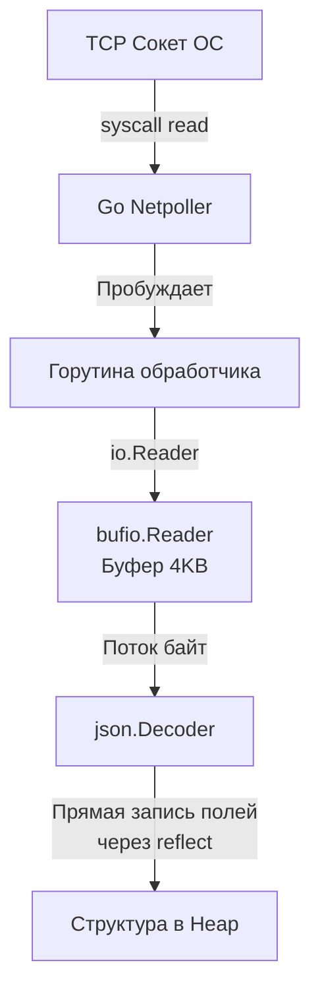

## REST: Развенчание мифов и архитектурные ограничения

Слово "REST" в современной разработке стало синонимом выражения "JSON поверх HTTP". Если вы спросите Junior-разработчика, что такое REST, он, скорее всего, ответит: «Это когда мы используем GET для получения данных, POST для создания, а данные передаем в JSON». 

Для инженера уровня Senior это фатальное упрощение. REST (Representational State Transfer) — это не протокол, не стандарт и не формат данных. Это **архитектурный стиль** для распределенных гипермедиа-систем, описанный Роем Филдингом в его диссертации в 2000 году. 

Понимание истинных принципов REST критически важно, потому что эти ограничения напрямую влияют на то, как мы проектируем наши Go-сервисы, как они масштабируются, сколько памяти потребляют и как часто просыпается Garbage Collector (GC).

Чтобы система могла называться RESTful, она должна удовлетворять шести строгим архитектурным ограничениям.

## 6 Ограничений REST

### 1. Client-Server (Разделение клиента и сервера)
Принцип прост: клиент отвечает за UI и пользовательский опыт (или бизнес-логику вызывающей стороны), сервер отвечает за хранение данных и валидацию. Они развиваются независимо. Серверу на Go абсолютно неважно, кто его вызывает: мобильное приложение на Swift, SPA на React или другой микросервис на Python. Главное — соблюдение контракта.

### 2. Stateless (Отсутствие состояния)
**Самое важное ограничение для построения высоконагруженных бэкендов.**
Сервер не должен хранить никакого клиентского состояния между запросами. Каждый HTTP-запрос от клиента должен содержать абсолютно всю информацию, необходимую серверу для его понимания и обработки (включая токены авторизации).

> [!info] Под капотом: Stateless и рантайм Go
> В языках вроде PHP исторически использовались сессии: пользователь логинился, сервер создавал в памяти или файле объект сессии и отправлял клиенту Cookie с `SessionID`. 
> 
> Если мы попытаемся реализовать Stateful-сервер на Go (храня состояния в `map[string]*UserSession`), мы столкнемся с катастрофой при масштабировании:
> 1. **Синхронизация:** Глобальная мапа потребует использования `sync.RWMutex`. При тысячах RPS (Requests Per Second) этот мьютекс станет узким местом (Lock Contention), и все ваши тысячи горутин выстроятся в очередь, простаивая в ожидании.
> 2. **Утечки памяти и GC:** Забытые сессии будут бесконечно раздувать Heap. Сборщик мусора в Go сканирует указатели в куче. Чем больше активных сессий в памяти, тем дольше фаза Mark у Garbage Collector'а, что увеличивает задержки (Tail Latency) для всех запросов.
> 3. **Горизонтальное масштабирование:** Запросы одного клиента придется направлять на один и тот же инстанс сервера (Sticky Sessions), иначе балансировщик перекинет запрос на другой узел, где этой мапы нет.
>
> Истинный REST (Stateless) решает это: состояние передается в заголовках (например, JWT). Сервер расшифровывает токен, обрабатывает запрос и забывает о клиенте. Никаких мьютексов, минимальная нагрузка на GC.

### 3. Cacheability (Кэшируемость)
Ответы сервера должны явно указывать, могут ли они быть кэшированы клиентом или промежуточными узлами, и если да, то на какое время. В HTTP это реализуется заголовками `Cache-Control`, `ETag`, `Last-Modified`. Подробнее мы разберем это в [[12. Caching HTTP.md]]. Если сервер генерирует отчет 5 секунд, но данные меняются раз в час — REST требует, чтобы мы разрешили кэширование, тем самым снимая нагрузку с CPU нашего сервера.

### 4. Uniform Interface (Единообразный интерфейс)
Это то, с чем чаще всего ассоциируют REST. Интерфейс между клиентом и сервером должен быть универсальным и следовать 4 правилам:
* **Идентификация ресурсов:** Сущности определяются через URI (например, `/users/123`).
* **Манипуляция через представления:** Клиент модифицирует ресурс, отправляя его представление (например, JSON-документ).
* **Самоописываемые сообщения:** Каждый запрос содержит достаточно информации о том, как его обрабатывать (например, заголовок `Content-Type: application/json` говорит рантайму, какой десериализатор использовать).
* **HATEOAS (Hypermedia as the Engine of Application State):** Клиент переходит по состояниям приложения, используя ссылки, которые возвращает сервер (спойлер: в современном API это почти никто не делает).

### 5. Layered System (Многоуровневая система)
Клиент не должен знать, общается он с вашим Go-приложением напрямую или через цепочку промежуточных узлов. В реальном production перед вашим Go-бинарником всегда стоит Reverse Proxy (Nginx), Load Balancer (HAProxy), Web Application Firewall (WAF) или [[25. API Gateway.md]]. Многоуровневость позволяет балансировать нагрузку и внедрять политики безопасности без изменения кода самого API.

### 6. Code on Demand (Код по требованию - опционально)
Сервер может отправлять клиенту исполняемый код (например, JavaScript для браузера). Для межсервисного бэкенд-взаимодействия это ограничение игнорируется.

## REST и Go: Симфония IO и Аллокаций

Когда мы применяем принципы REST, мы оперируем ресурсами и представлениями (обычно JSON). Посмотрим, как обработка стандартного REST-запроса транслируется в работу железа и рантайма Go.

В Go интерфейс `net/http` спроектирован так, чтобы поощрять потоковую обработку данных (Streaming IO).

```go
func createUserHandler(w http.ResponseWriter, r *http.Request) {
    // Структура для десериализации
    var user UserCreateDTO
    
    // ПЛОХОЙ ПОДХОД: Чтение всего тела в память
    // body, err := io.ReadAll(r.Body) 
    // json.Unmarshal(body, &user)
    
    // ИДИОМАТИЧНЫЙ ПОДХОД: Потоковое декодирование
    decoder := json.NewDecoder(r.Body)
    if err := decoder.Decode(&user); err != nil {
        http.Error(w, err.Error(), http.StatusBadRequest)
        return
    }
    
    // ... бизнес-логика ...
    w.WriteHeader(http.StatusCreated)
}
```

> [!warning] Ловушка / Gotcha: Аллокации при чтении Body
> В REST-API мы постоянно принимаем и отдаем JSON. 
> Если вы используете `io.ReadAll(r.Body)` перед `json.Unmarshal`, вы заставляете рантайм Go выделить сплошной кусок памяти (slice байт) в куче (Heap), размер которого равен размеру всего входящего запроса. Если кто-то пришлет вам JSON размером 50 МБ, ваша горутина аллоцирует 50 МБ.
> 
> Использование `json.NewDecoder(r.Body).Decode(&obj)` работает иначе. `r.Body` реализует интерфейс `io.Reader`. Decoder читает данные из сокета небольшими порциями (через системные буферы ОС и внутренние буферы Go) и сразу собирает Go-структуру на лету. Пиковое потребление памяти снижается кратно, а Escape Analysis работает эффективнее.



## Уровни зрелости REST (Richardson Maturity Model)

> [!tip] Собеседование
> **Вопрос:** Чем просто HTTP API отличается от RESTful API? На каком уровне REST находятся большинство современных микросервисов?
> **Ответ:** Отвечать лучше через Модель зрелости Ричардсона (Richardson Maturity Model).
> * **Level 0 (Swamp of POX):** Один endpoint (например, `/api`), использование только POST. Внутри payload передается название метода и параметры. (Так работал SOAP или работают многие RPC-подобные самоделки).
> * **Level 1 (Resources):** Появление уникальных URI для ресурсов (`/users/1`, `/orders/42`). Но все еще используется только POST или GET.
> * **Level 2 (HTTP Verbs):** Правильное использование методов HTTP (GET для чтения, POST для создания, PUT/PATCH для обновления, DELETE). Использование правильных статус-кодов (200, 201, 404).
> * **Level 3 (HATEOAS):** В ответах присутствуют ссылки на связанные действия (Hypermedia).
> 
> Практически 99% так называемых "REST API" в индустрии замирают на **Level 2**. Реализовывать HATEOAS (Level 3) в микросервисах и мобильной разработке оказалось неоправданно дорого и избыточно.

## Итог

REST — это не догма о том, как писать JSON. Это набор архитектурных решений, направленных на масштабируемость и отказоустойчивость веба. Главный урок REST для Go-разработчика — это принцип **Stateless**. Разделяя состояние и бизнес-логику, мы позволяем планировщику Go и сборщику мусора работать с максимальной эффективностью, создавая легковесные, горизонтально масштабируемые ноды.

Архитектура REST требует от нас мыслить сущностями — ресурсами. Как правильно выделять эти ресурсы в URL, избегать "лагов" проектирования и строить понятные структуры, мы детально разберем в следующей статье: [[4. Resource oriented design.md]].