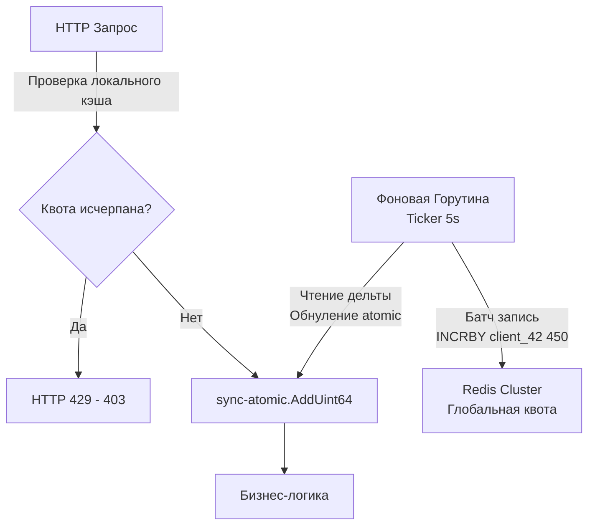

## Защита бизнеса и железа: Разделение понятий

В статье [[11. Rate limiting в API.md]] мы разобрали базовые алгоритмы ограничения частоты запросов (Token Bucket) и реализовали их в Redis через Lua-скрипты. Мы защитили наш Go-бэкенд от лавинообразных нагрузок и DDoS-атак. 

Однако в зрелой микросервисной архитектуре и B2B/SaaS продуктах этого недостаточно. Защита CPU и базы данных — это лишь один уровень. Второй уровень — это бизнес-логика, тарификация (Billing) и приоритизация трафика.

Инженер уровня Senior должен четко проводить границу между тремя смежными паттернами: **Rate Limiting**, **Throttling** и **Quotas**. Смешивание этих понятий в одном сервисе (или, что еще хуже, в одной таблице базы данных) приводит к нераспутываемым архитектурным узлам.

## Терминология: Limit vs Throttling vs Quota

1. **Rate Limit (Лимит частоты):** * **Цель:** Защита инфраструктуры.
   * **Окно:** Короткое (секунды, минуты). Пример: 100 RPS (Requests Per Second).
   * **Реакция:** Жесткий отказ. Если клиент превысил лимит, мы мгновенно возвращаем статус [[6. Статусы HTTP.md]] `429 Too Many Requests`.

2. **Throttling (Сглаживание/Дросселирование):**
   * **Цель:** Выравнивание трафика (Traffic Shaping), защита от кратковременных всплесков (Bursts) без потери запросов клиента.
   * **Реакция:** Вместо того чтобы отбить запрос ошибкой 429, сервер "притормаживает" его выполнение, ставя в очередь (или заставляя горутину подождать), пока не появится свободный слот.

3. **Quota (Квота):**
   * **Цель:** Монетизация, бизнес-ограничения, защита от разорения (Cost Control) на сторонних API.
   * **Окно:** Длинное (день, календарный месяц). Пример: 1 000 000 вызовов API в месяц на тарифе "Basic".
   * **Реакция:** Отказ с указанием бизнес-причины (иногда `402 Payment Required` или `403 Forbidden`).

---

## Throttling: Механика Leaky Bucket в Go

Для сглаживания трафика используется алгоритм **Leaky Bucket (Ведро с дыркой)**.
Представьте ведро: запросы наливаются в него сверху неравномерно (всплесками), но выливаются снизу (в бизнес-логику) с постоянной, строго заданной скоростью.

В Go этот паттерн идеально ложится на механизм буферизованных каналов и тикеров.

> [!info] Под капотом: Идиоматичный Throttling
> Стандартный пакет `golang.org/x/time/rate` умеет делать не только жесткий Rate Limiting, но и Throttling.
> Вместо метода `limiter.Allow()` (который возвращает `true/false`), используется метод `limiter.Wait(ctx)`.
> Если токенов в корзине нет, `Wait` **блокирует текущую горутину** (усыпляет её в планировщике ОС), пока токен не появится или пока не истечет таймаут в `context.Context`. Это идеальная Mechanical Sympathy: горутина не жжет процессор в цикле (busy-wait), а освобождает поток ядра ОС для других задач.

---

## Архитектура Квот: Проблема распределенного счетчика

Квоты (Quotas) работают на долгих промежутках времени (месяц). Их нельзя хранить исключительно в оперативной памяти (в случае рестарта пода мы потеряем счетчики, и клиент бесплатно получит миллион запросов). Квоты **обязаны** быть персистентными.

**Наивный подход (Антипаттерн):**
На каждый входящий HTTP-запрос делать UPDATE в PostgreSQL:
`UPDATE api_quotas SET used = used + 1 WHERE client_id = 42;`

> [!warning] Ловушка / Gotcha: Row-level Lock Contention
> Если клиент начнет делать 2000 RPS, 2000 горутин одновременно попытаются обновить **одну и ту же строку** в таблице PostgreSQL. База данных использует эксклюзивные блокировки строки на запись (Row Exclusive Lock). Все эти транзакции выстроятся в очередь. Утилизация CPU базы улетит в 100%, время ответа вырастет до секунд, и весь ваш кластер упадет.

### Индустриальный подход: Async Batching (Асинхронное пакетирование)

Чтобы защитить базу данных от шквала инкрементов, мы используем **асинхронный сброс (Flush)**. 

1. На уровне Go-процесса мы храним счетчики в оперативной памяти и инкрементируем их атомарно (за наносекунды).
2. Раз в $N$ секунд фоновая горутина берет накопленную "дельту" (например, +450 запросов за последние 5 секунд) и отправляет её в Redis или PostgreSQL **одним батч-запросом**.
3. Мы снижаем нагрузку на базу с 2000 IOPS до 0.2 IOPS на одного клиента.



## Идиоматичный Go: Реализация Async Flusher

Рассмотрим, как правильно написать агрегатор счетчиков, который не блокирует входящие HTTP-запросы мьютексами (Mutex).

Мы будем использовать `sync.Map`, где ключом будет ID клиента, а значением — **указатель на `uint64`**. Это позволяет нам инкрементировать счетчик через пакет `sync/atomic` без блокировки всей мапы.

```go
package quota

import (
	"context"
	"sync"
	"sync/atomic"
	"time"
)

type Manager struct {
	// Ключ: ClientID (string), Значение: *uint64 (указатель для атомарных операций)
	localCounters sync.Map
	redisClient   RedisClient // Абстракция базы данных
}

// Increment вызывается на каждый HTTP запрос
func (m *Manager) Increment(clientID string) {
	// Пытаемся получить указатель на счетчик
	val, ok := m.localCounters.Load(clientID)
	if !ok {
		// Если нет - создаем новый
		var zero uint64
		val, _ = m.localCounters.LoadOrStore(clientID, &zero)
	}

	// АТОМАРНЫЙ ИНКРЕМЕНТ (Без Mutex!)
	counterPtr := val.(*uint64)
	atomic.AddUint64(counterPtr, 1)
}

// StartFlusher запускается один раз в main.go через горутину
func (m *Manager) StartFlusher(ctx context.Context, flushInterval time.Duration) {
	ticker := time.NewTicker(flushInterval)
	defer ticker.Stop()

	for {
		select {
		case <-ctx.Done():
			m.flushToRedis() // Финальный сброс перед Graceful Shutdown
			return
		case <-ticker.C:
			m.flushToRedis()
		}
	}
}

func (m *Manager) flushToRedis() {
	m.localCounters.Range(func(key, value interface{}) bool {
		clientID := key.(string)
		counterPtr := value.(*uint64)

		// Атомарно забираем накопленное значение и обнуляем счетчик
		// Swap гарантирует, что мы не потеряем запросы, пришедшие в момент сброса
		delta := atomic.SwapUint64(counterPtr, 0)

		if delta > 0 {
			// Отправляем дельту в Redis (INCRBY)
			// В реальном проекте здесь должен быть Pipelining для всех ключей сразу
			m.redisClient.IncrBy(context.Background(), "quota:"+clientID, int64(delta))
		}
		return true // продолжаем итерацию
	})
}
```

> [!tip] Собеседование
> **Вопрос:** Если ваш Go-сервер упал (OOM Kill или отключение питания) до того, как сработал таймер `flushToRedis`, вы потеряете часть данных о квотах. Является ли это проблемой?
> **Ответ:** Это классический компромисс распределенных систем: **Точность vs Производительность**. Да, мы подарим клиенту несколько бесплатных запросов (Under-billing). В 99% бизнес-моделей потеря нескольких десятков запросов в месяц обходится компании дешевле, чем закупка и поддержка кластеров PostgreSQL, способных выдержать транзакционный учет каждого вызова. Если же это финансовое API (например, мы списываем реальные деньги за каждый вызов AI-модели), паттерн Async Batching использовать нельзя, мы обязаны проверять и списывать квоту синхронно (в рамках транзакции или атомарно в Redis).

## Контракт квот в HTTP

Когда квота исчерпана, важно правильно сообщить об этом клиенту. В отличие от Rate Limiting, где мы можем просто сказать "Подожди минуту", исчерпание квоты часто требует действия от пользователя (пополнить баланс, сменить тариф).

Статус-коды:
* **`429 Too Many Requests`**: Допускается, если вы используете стандартный драфт IETF, но может путать клиентов (они будут пытаться сделать Retry).
* **`402 Payment Required`**: Идеальный статус для коммерческих API (используется Stripe). Он четко говорит машине: "Твоя банковская карта отклонена или тариф закончился".
* **`403 Forbidden`**: Часто используется как фолбэк, если 402 не поддерживается инфраструктурой.

**Обязательные заголовки:**
Чтобы клиент не гадал, сколько запросов ему осталось, мы обязаны возвращать метаданные. (Черновик стандарта IETF `RateLimit`):
```http
RateLimit-Limit: 10000
RateLimit-Remaining: 0
RateLimit-Reset: 1714521600
```
Где `RateLimit-Reset` — это Unix Timestamp времени, когда начнется следующий биллинг-цикл (например, 1-е число следующего месяца).

## Итог

1. **Разделяйте ответственность:** Rate Limiting — для защиты инфраструктуры (на уровне API Gateway), Quotas — для бизнеса и тарификации (на уровне биллинга или выделенного микросервиса).
2. **Throttling** полезен для выравнивания пиков нагрузки и реализуется через `limiter.Wait()` и блокировку горутин, экономя такты CPU.
3. **Async Batching** — обязательный паттерн для высоконагруженных квот. Собирайте метрики в памяти Go через `sync/atomic` и сбрасывайте их батчами, чтобы не устроить DDoS собственной базе данных.
4. Выбор между строгим учетом и асинхронным сбросом — это компромисс между точностью биллинга и производительностью (Mechanical Sympathy).

Любые отказы (Rate Limits, исчерпанные квоты, ошибки) должны быть видны команде эксплуатации. Если клиент жалуется на 429 ошибку, мы должны уметь найти этот конкретный запрос в океане трафика. О том, как выстроить систему логов, метрик и трейсов, не замедляя работу самого приложения, мы поговорим в следующей статье: [[31. API observability.md]].