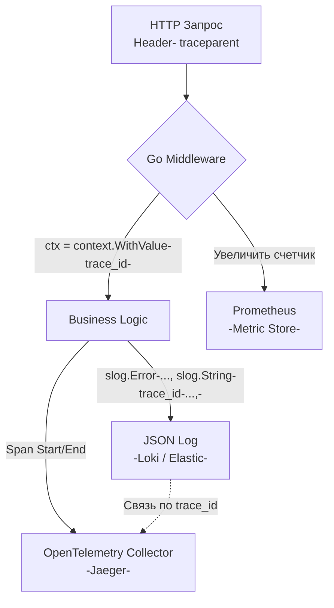

## Управление вслепую: Почему логов недостаточно

Когда вы разрабатываете монолит на локальной машине, для отладки достаточно `fmt.Println()` или `log.Printf()`. Если что-то идет не так, вы просто смотрите в консоль (STDOUT) и читаете текст ошибки. 

В распределенной микросервисной системе с балансировщиками, API-шлюзами ([[25. API Gateway.md]]) и асинхронными очередями этот подход перестает работать. Когда пользователь жалуется, что "кнопка оплаты выдает ошибку", а у вас 50 подов (Pods) генерируют 10 гигабайт логов в минуту, попытка найти проблему через `grep` превращается в поиск иголки в стоге сена.

**Observability (Наблюдаемость)** — это мера того, насколько хорошо вы можете понять внутреннее состояние системы по ее внешним выходным данным. Это не просто "установка Графаны". Это архитектурный подход к написанию кода.

Индустрия выделяет три фундаментальных столпа Observability:
1. **Метрики (Metrics):** "Что-то сломалось?" (Агрегированные числа).
2. **Трассировка (Tracing):** "Где именно сломалось?" (Путь запроса через сеть).
3. **Логи (Logs):** "Почему сломалось?" (Детальный контекст ошибки).

## Логирование: Переход к структурированным данным (Structured Logs)

Исторически логи были просто текстом: `2023-10-25 15:00:00 ERROR: user 123 failed to pay order 456 because of timeout`.
Парсить такие логи регулярными выражениями (в ElasticSearch или Loki) — это чудовищно дорого и нестабильно. Измените одно слово в коде, и дашборд сломается.

Идиоматичный подход (Senior Way) — **Структурированное логирование (Structured Logging)**. Каждая запись лога — это JSON объект, где бизнес-данные отделены от сообщения.

### Go 1.21+ и пакет `log/slog`

Долгое время стандартом де-факто в Go были библиотеки `uber-go/zap` и `rs/zerolog`. В Go 1.21 разработчики языка встроили структурированное логирование прямо в стандартную библиотеку — пакет `log/slog`.

```go
import "log/slog"

// Идиоматичная запись ошибки в slog
slog.Error("payment processing failed",
	slog.String("user_id", "user-123"),
	slog.Int("order_id", 456),
	slog.String("reason", "timeout"),
)
```

В консоли сервера (или в сборщике логов) это превратится в:
```json
{"time":"2023-10-25T15:00:00Z","level":"ERROR","msg":"payment processing failed","user_id":"user-123","order_id":456,"reason":"timeout"}
```

> [!info] Под капотом: Аллокации в slog (Mechanical Sympathy)
> Почему `slog.String("key", "value")` лучше, чем передача мапы `map[string]interface{}`? 
> Пакет `slog` спроектирован с упором на производительность. Использование `slog.String`, `slog.Int` создает структуры `slog.Attr`, которые избегают упаковки значений в пустой интерфейс (`interface{}`). Это предотвращает аллокации в куче (Escape Analysis) и сильно разгружает Garbage Collector. В высоконагруженных хендлерах (10 000 RPS) логирование без аллокаций критически важно для стабильного времени ответа.

> [!warning] Ловушка / Gotcha: Утечка PII и токенов
> Самая страшная ошибка на уровне логирования — запись PII (Personal Identifiable Information) или секретов.
> Если вы сделаете `slog.Any("request", req.Header)`, вы случайно запишете в базу логов заголовок `Authorization: Bearer <JWT>`. Разработчик, имеющий доступ к логам (например, в Kibana), сможет украсть этот токен и выполнить действия от лица пользователя. Всегда маскируйте (obfuscate) пароли, токены и номера кредитных карт до передачи в логгер.

## Метрики: Метод RED и Prometheus

Логи дороги в хранении. Вы не можете хранить логи каждого успешного `200 OK` запроса, если у вас миллионы RPS (диски переполнятся за часы). 
Для оценки здоровья системы мы используем Метрики (Metrics).

Абсолютным стандартом сбора метрик в Kubernetes и микросервисах является **Prometheus**. Он работает по pull-модели: ваш Go-сервер просто держит в памяти текущие значения счетчиков, а сервер Prometheus раз в 15 секунд делает HTTP-запрос `/metrics` к вашему сервису и забирает (скрапит) эти числа.

Для HTTP API мы обязаны собирать метрики по методологии **RED**:
1. **Rate (Частота):** Сколько запросов в секунду (RPS) мы получаем.
2. **Errors (Ошибки):** Сколько запросов завершились с 5xx статусом (см. [[6. Статусы HTTP.md]]).
3. **Duration (Длительность):** Сколько времени (в миллисекундах) заняла обработка.

### Идиоматичный Prometheus Middleware

В Go мы оборачиваем наш HTTP-роутер в Middleware, который прозрачно собирает RED-метрики.

```go
package observability

import (
	"net/http"
	"strconv"
	"time"

	"[github.com/prometheus/client_golang/prometheus](https://github.com/prometheus/client_golang/prometheus)"
	"[github.com/prometheus/client_golang/prometheus/promauto](https://github.com/prometheus/client_golang/prometheus/promauto)"
)

var (
	httpRequestsTotal = promauto.NewCounterVec(
		prometheus.CounterOpts{
			Name: "http_requests_total",
			Help: "Total number of HTTP requests",
		},
		[]string{"method", "path", "status"}, // Labels (Ярлыки)
	)

	httpRequestDuration = promauto.NewHistogramVec(
		prometheus.HistogramOpts{
			Name:    "http_request_duration_seconds",
			Help:    "Duration of HTTP requests",
			Buckets: prometheus.DefBuckets, // Дефолтные корзины времени
		},
		[]string{"method", "path"},
	)
)

// MetricsMiddleware собирает RED метрики
func MetricsMiddleware(next http.Handler) http.Handler {
	return http.HandlerFunc(func(w http.ResponseWriter, r *http.Request) {
		start := time.Now()

		// Используем специальный ResponseWriter, чтобы перехватить HTTP статус
		rw := &statusResponseWriter{ResponseWriter: w, status: 200}
		
		next.ServeHTTP(rw, r)

		duration := time.Since(start).Seconds()
		statusStr := strconv.Itoa(rw.status)

		// Записываем метрики (работает за наносекунды)
		httpRequestsTotal.WithLabelValues(r.Method, r.URL.Path, statusStr).Inc()
		httpRequestDuration.WithLabelValues(r.Method, r.URL.Path).Observe(duration)
	})
}
```

> [!warning] Ловушка / Gotcha: Взрыв кардинальности (High Cardinality)
> Обратите внимание на `r.URL.Path` в `WithLabelValues`. Что произойдет, если у нас REST API ([[4. Resource oriented design.md]]) и путь выглядит как `/users/123`, `/users/456`?
> Prometheus создает отдельный временной ряд (Time Series) для **каждой уникальной комбинации ярлыков (Labels)**. Если в базу придет 1 миллион уникальных ID пользователей, библиотека `client_golang` создаст в оперативной памяти вашего Go-приложения 1 миллион структур счетчиков. Сервер мгновенно умрет от OOM (Out Of Memory), а база Prometheus ляжет при скрапинге.
> **Решение:** Вы обязаны передавать в метрики **шаблон (Route Pattern)**, а не сырой URL. В Go 1.22 роутер позволяет получить паттерн через `r.Pattern` (например, `/users/{id}`). В метриках должен быть только паттерн!

## Observability как единое целое (OpenTelemetry)

Метрики показывают, что эндпоинт `/orders` стал отвечать за 5 секунд вместо 100 миллисекунд (Duration выросла). Логи показывают ошибку `timeout in DB`. 

Но как понять, из-за какого конкретно пользовательского запроса произошел таймаут? Нам нужно связать лог и метрику. Эту задачу решает **Trace ID**.

В современной инженерии все три столпа объединяются стандартом **OpenTelemetry (OTel)**. Когда запрос приходит в API Gateway ([[25. API Gateway.md]]), шлюз генерирует уникальный `Trace ID` (например, `5b8aa5a2d2c872e8321cf373fac1e818`) и передает его в заголовке `traceparent`.

Ваш Go-бэкенд извлекает его и **обязан** добавить этот `Trace ID` в каждый лог, связанный с этим запросом.



> [!tip] Собеседование
> **Вопрос:** Как правильно прокидывать логгер (`slog.Logger`) внутрь глубоких слоев приложения: через зависимости структуры (Dependency Injection) или через `context.Context`?
> **Ответ:** В Go сообществе идут горячие споры. 
> 1. *Строгий подход:* Логгер передается в `struct` при инициализации. А `Trace ID` вытаскивается из `ctx` на месте: `logger.With("trace_id", GetTraceID(ctx)).Info(...)`. Это семантически правильно (Context не мусорка для зависимостей).
> 2. *Удобный подход:* Хранить логгер с уже вшитым Trace ID прямо в контексте. `log := GetLogger(ctx); log.Info(...)`. Это избавляет от дублирования кода, но нарушает чистоту DI. 
> На Middle+ уровне ожидается, что вы понимаете плюсы и минусы обоих подходов и выбираете стандарт команды, но первый вариант считается более "идиоматичным" (Idiomatic Go).

## Итог

1. **Observability** — это не просто логи, это архитектура, позволяющая понять состояние системы.
2. Используйте структурированные логи (**JSON + `log/slog`**) для быстрого машинного поиска и избегайте логирования PII данных. С точки зрения памяти `slog` минимизирует аллокации за счет типизированных атрибутов.
3. Собирайте **RED-метрики** (Rate, Errors, Duration) через Prometheus, но категорически избегайте высокой кардинальности в ярлыках (используйте шаблоны роутов, а не сырые URL).
4. Все логи и запросы должны быть прошиты сквозным идентификатором **Trace ID**.

Упомянув `Trace ID`, мы лишь коснулись поверхности самой сложной и мощной технологии отладки распределенных систем. Как понять, сколько времени запрос провел в очереди Kafka, сколько в PostgreSQL, а сколько в парсинге JSON на Go? Как собрать все эти микро-тайминги в один красивый граф? Эту магию (и её цену для производительности) мы детально разберем в следующей статье: [[32. Tracing запросов.md]].