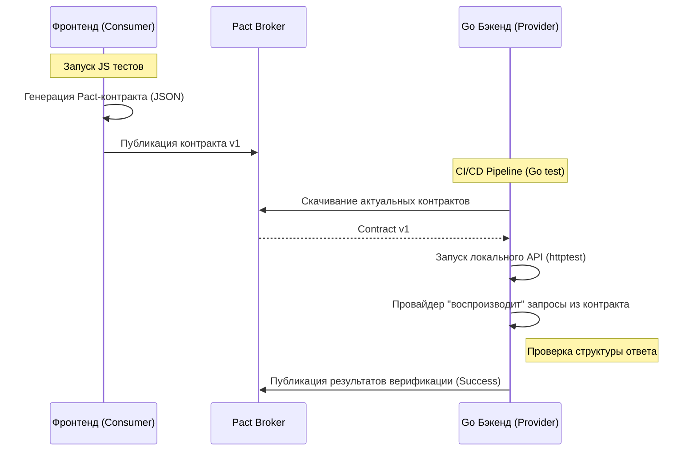

## Смерть E2E: Почему интеграционные среды убивают релизы

В предыдущей статье [[33. API testing.md]] мы научились писать молниеносные интеграционные тесты в Go с использованием `httptest` и `Testcontainers`. Мы уверены, что наш бэкенд работает безупречно: он правильно читает данные из базы и возвращает валидный JSON.

Но затем происходит деплой в production, и у пользователей появляется "белый экран смерти". Почему?
Потому что фронтенд (React/iOS) ожидал поле `user_age` (тип `number`), а наш бэкенд, после безобидного рефакторинга, начал отдавать `age` (тип `string`). Наш Go-тест был "зеленым", потому что он проверял логику *самого бэкенда*, но он ничего не знал об ожиданиях *клиента*.

**Историческое решение:** End-to-End (E2E) тесты (Selenium, Cypress). Мы поднимаем весь кластер микросервисов, базу данных, фронтенд и "прокликиваем" браузер скриптами.
**Проблема E2E:** Они чудовищно медленные, нестабильные (Flaky) и требуют выделенного тестового окружения (Staging), которое всегда тормозит. E2E-тесты превращают микросервисную архитектуру (где сервисы должны релизиться независимо) обратно в неповоротливый монолит.

Решение этой проблемы, ставшее индустриальным стандартом для Senior-инженеров — **Contract Testing (Контрактное тестирование)**.

## Consumer-Driven Contracts (CDC): Клиент всегда прав

В архитектуре CDC мы переворачиваем игру. Не бэкенд диктует, что он отдает, а **Потребитель (Consumer - фронтенд или другой микросервис) декларирует, что ему нужно**.

1. Фронтенд-разработчик пишет Unit-тест на своем TypeScript-коде: *"Я ожидаю, что при запросе `GET /users/1` бэкенд вернет мне JSON с полями `id` (int) и `name` (string)"*.
2. Специальный фреймворк запускает этот тест, перехватывает запрос и генерирует **Контракт (Pact-файл)** — JSON-документ с описанием ожиданий.
3. Этот контракт загружается в центральный реестр (Pact Broker).
4. Во время CI/CD пайплайна Go-бэкенда (Provider), фреймворк скачивает этот контракт и **автоматически отправляет описанные в нем запросы к нашему Go-серверу**, проверяя, совпадает ли ответ бэкенда с ожиданиями фронтенда.



**Итог:** Нам больше не нужно поднимать фронтенд и бэкенд одновременно. Мы тестируем их в абсолютной изоляции, но при этом математически гарантируем, что они смогут общаться в production.

## Идиоматичный Go: Верификация Пактов

В экосистеме Go стандартом для CDC является фреймворк `github.com/pact-foundation/pact-go/v2`.

Как выглядит верификация на стороне Go-провайдера (бэкенда)? Нам не нужно писать HTTP-запросы вручную. Мы просто запускаем наш сервер и просим утилиту Pact "обстрелять" его на основе скачанного контракта.

```go
package contract_test

import (
	"fmt"
	"net/http/httptest"
	"testing"

	"[github.com/pact-foundation/pact-go/v2/provider](https://github.com/pact-foundation/pact-go/v2/provider)"
)

func TestPactProviderVerification(t *testing.T) {
	// 1. Поднимаем наш реальный Go-роутер (из статьи 33) в тестовом сервере
	router := SetupRouter(mockDB)
	server := httptest.NewServer(router)
	defer server.Close()

	// 2. Настраиваем Pact Verifier
	verifier := provider.NewVerifier()

	// 3. Запускаем верификацию контрактов
	err := verifier.VerifyProvider(t, provider.VerifyRequest{
		ProviderBaseURL: server.URL,
		Provider:        "UserService", // Имя нашего бэкенда
		// В реальном проекте мы качаем пакты из Broker-а:
		BrokerURL:       "[https://my-company.pactflow.io](https://my-company.pactflow.io)",
		BrokerToken:     "secret-token",
		PublishVerificationResults: true, // Сообщаем фронтенду, что мы ничего не сломали
		ProviderVersion: "1.0.0",
		
		// Настройка состояний (КРИТИЧЕСКИ ВАЖНО, см. ниже)
		StateHandlers: provider.StateHandlers{
			"user 123 exists": func(setup bool, state provider.ProviderState) (provider.ProviderStateResponse, error) {
				if setup {
					// Настраиваем БД или моки так, чтобы юзер 123 существовал
					mockDB.InsertUser(123, "Ivan")
				} else {
					// Очищаем БД после проверки
					mockDB.DeleteUser(123)
				}
				return provider.ProviderStateResponse{}, nil
			},
		},
	})

	if err != nil {
		t.Fatalf("Contract verification failed: %v", err)
	}
}
```

## Mechanical Sympathy: Магия Provider States (Состояний)

> [!warning] Ловушка / Gotcha: Проблема контекста
> Если фронтенд написал контракт: *"Запроси пользователя с ID 456"*, то Pact Verifier отправит на ваш Go-сервер `GET /users/456`. Но если ваша тестовая база пуста, ваш бэкенд вернет `404 Not Found`. Тест контракта упадет, хотя ваш код правильный! 
> Как бэкенд должен догадаться, какие данные нужны фронтенду для конкретного теста?

Здесь на сцену выходят **Provider States (Состояния Провайдера)**.
В Pact-файле фронтендер не просто описывает URL, он пишет: *"Given state: 'user 456 exists', when I send GET /users/456..."*.

Когда Pact Verifier на стороне Go читает эту строку, он ищет в мапе `StateHandlers` (в коде выше) ключ `"user 456 exists"`. 
**До того** как отправить сам HTTP-запрос, Verifier вызывает эту Go-функцию. Ваша задача в этой функции — сделать `INSERT` в PostgreSQL (или настроить Mock-объекты), чтобы подготовить систему. Это позволяет тестам быть полностью детерминированными и не зависеть от "магических" тестовых дампов БД.

## Альтернатива: Schema-based Contract Testing (OpenAPI)

Использование Pact идеально, но оно требует интеграции SDK в код фронтенда и поддержки Pact Broker.
Существует более легковесный, инфраструктурный подход — **Спецификация как Контракт**.

Как мы разбирали в [[14. OpenAPI и Swagger.md]], мы пишем файл `openapi.yaml`. Этот файл становится нашим источником истины.
Чтобы гарантировать контракт без поднятия Pact-экосистемы, мы можем использовать библиотеку `github.com/getkin/kin-openapi` в наших обычных `httptest` (из прошлой статьи).

```go
import (
	"[github.com/getkin/kin-openapi/openapi3](https://github.com/getkin/kin-openapi/openapi3)"
	"[github.com/getkin/kin-openapi/openapi3filter](https://github.com/getkin/kin-openapi/openapi3filter)"
	"[github.com/getkin/kin-openapi/routers/gorillamux](https://github.com/getkin/kin-openapi/routers/gorillamux)"
)

func TestAgainstOpenAPIContract(t *testing.T) {
	// 1. Загружаем нашу OpenAPI спецификацию
	ctx := context.Background()
	doc, _ := openapi3.NewLoader().LoadFromFile("../../openapi.yaml")
	router, _ := gorillamux.NewRouter(doc)

	// 2. Делаем тестовый запрос к нашему Go-хендлеру
	req := httptest.NewRequest("GET", "/users/1", nil)
	rec := httptest.NewRecorder()
	myAppRouter.ServeHTTP(rec, req)

	// 3. Создаем HTTP Response объект из рекордера
	response := rec.Result()

	// 4. ВАЛИДАЦИЯ: Проверяем, соответствует ли наш ответ OpenAPI схеме!
	route, pathParams, _ := router.FindRoute(req)
	requestValidationInput := &openapi3filter.RequestValidationInput{
		Request:    req,
		PathParams: pathParams,
		Route:      route,
	}
	responseValidationInput := &openapi3filter.ResponseValidationInput{
		RequestValidationInput: requestValidationInput,
		Status:                 response.StatusCode,
		Header:                 response.Header,
		Body:                   io.NopCloser(bytes.NewReader(rec.Body.Bytes())),
	}

	err := openapi3filter.ValidateResponse(ctx, responseValidationInput)
	if err != nil {
		t.Fatalf("API Response broke the OpenAPI contract: %v", err)
	}
}
```

> [!tip] Собеседование
> **Вопрос:** Что выбрать: Pact (Consumer-Driven) или OpenAPI Validation (Provider-Driven)?
> **Ответ:** > * **Pact (CDC)** лучше, когда у вас есть жесткий контроль над потребителями (например, ваши собственные SPA и микросервисы). Pact показывает *какие именно поля* реально используют клиенты. Если поле есть в ответе, но его никто не проверяет в контрактах Pact, вы можете смело его удалить.
> * **OpenAPI Validation** лучше для публичных API, где у вас тысячи неизвестных клиентов. Вы жестко фиксируете схему и гарантируете, что ваш Go-код никогда не отдаст JSON, не соответствующий `openapi.yaml`. Вы не знаете, кто использует какие поля, но вы гарантируете математическую точность схемы.

## Можно ли отказаться от E2E полностью?

Contract Testing закрывает 90% интеграционных проблем (совпадение форматов, имен полей, типов данных). Но он не проверяет сложные бизнес-сценарии с состоянием в базе данных. Например: *"Пользователь добавляет товар в корзину, затем админ меняет цену товара, затем пользователь оформляет заказ"*. 

Такие бизнес-цепочки все еще требуют E2E-тестов, но благодаря контрактам количество E2E-тестов можно сократить с тысяч до десятка критических сценариев ("Happy paths").

## Итог

1. **E2E-тесты** слишком медленные и хрупкие для проверки базовых интеграций между микросервисами и фронтендом.
2. **Contract Testing (Pact)** позволяет тестировать микросервисы в изоляции, доказывая, что поставщик данных и потребитель понимают друг друга.
3. В Go контракты проверяются путем запуска локального сервера (`httptest.NewServer`) и натравливания на него утилиты Pact Verifier.
4. Ключ к успеху CDC — управление состоянием через **Provider States**, чтобы бэкенд динамически готовил базу данных перед каждым проверочным запросом.
5. Для публичных API легковесной альтернативой является автоматическая валидация всех ответов `httptest` об вашу схему **OpenAPI**.
