## Искусство уходить красиво: Зачем приложению уметь умирать

Мы прошли огромный путь. Наш Go-сервис имеет идеальную архитектуру, покрыт метриками ([[31. API observability.md]]), защищен mTLS ([[29. mTLS в сервисах.md]]) и математически доказан контрактными тестами ([[34. Contract testing.md]]). Вы нажимаете кнопку "Deploy", Kubernetes начинает выкатывать новую версию (Rolling Update), и... у 1% пользователей вылетает ошибка `502 Bad Gateway` или обрывается транзакция.

Почему идеально написанный код теряет запросы при релизе?

Потому что мы не научили наше приложение правильно реагировать на смерть.

В современных облачных средах (Kubernetes, AWS ECS) поды создаются и уничтожаются тысячи раз в день. Деплой новой версии, масштабирование (Autoscaling), нехватка памяти на узле (Eviction) — всё это приводит к завершению процесса. Если ваш Go-сервис просто падает при получении системного сигнала, он разрывает все текущие TCP-соединения, оставляя клиентов с незавершенными платежами и сломанными загрузками файлов.

Паттерн **Graceful Shutdown (Плавное завершение)** — это способность приложения перестать принимать новые запросы, дождаться завершения всех текущих операций, безопасно закрыть соединения с базой данных и только после этого завершить процесс.

## Анатомия убийства: Pod Lifecycle в Kubernetes

Чтобы написать правильный код в Go, нужно обладать **Mechanical Sympathy** к среде исполнения. Как Kubernetes убивает ваш контейнер?

1. **Phase 1: Сигнал к отступлению (SIGTERM).** Kubelet отправляет вашему процессу (PID 1) Linux-сигнал `SIGTERM`. Это вежливая просьба: _"Пожалуйста, заверши свои дела и умри"_.
2. **Phase 2: Окно благодати (Grace Period).** По умолчанию Kubernetes дает вам ровно **30 секунд** (параметр `terminationGracePeriodSeconds`). В это время ваш процесс всё ещё жив.
3. **Phase 3: Казнь (SIGKILL).** Если через 30 секунд ваш процесс всё ещё работает (например, завис в бесконечном цикле или ждет долгий SQL-запрос), ядро Linux отправляет `SIGKILL`. Этот сигнал нельзя перехватить или проигнорировать. Процесс убивается мгновенно, память освобождается.

Code snippet

```mermaid
gantt
    title Жизненный цикл завершения Pod'а
    dateFormat s
    axisFormat %S
    
    section Сигналы ОС
    Отправка SIGTERM :milestone, m1, 0, 0s
    Grace Period (30s) :active, a1, 0, 30s
    Отправка SIGKILL :milestone, m2, 30, 0s
    
    section Go Приложение
    Перехват сигнала :crit, c1, 0, 1s
    Остановка Listener (Новых нет) :active, c2, 1, 2s
    Доработка текущих запросов :c3, 2, 10s
    Закрытие БД и выход (Exit 0) :milestone, m3, 10, 0s
```



## Идиоматичный Go: Реализация Graceful Shutdown

Исторически перехват сигналов в Go делался через создание канала `chan os.Signal`. Начиная с Go 1.16, в стандартной библиотеке появился более элегантный способ, интегрированный с контекстами — **`signal.NotifyContext`**.

> [!info] Под капотом: `http.Server.Shutdown(ctx)`
> 
> Когда вы вызываете метод `Shutdown` у стандартного HTTP-сервера, он делает две вещи:
> 
> 1. Мгновенно закрывает все открытые слушатели (Listeners), то есть перестает принимать _новые_ TCP-соединения.
>     
> 2. Блокирует текущую горутину и ждет, пока все _уже открытые_ и активные соединения не завершат свою работу (или пока не истечет контекст).
>     

Вот как выглядит идеальный `main.go` Senior-разработчика:

```go
package main

import (
	"context"
	"errors"
	"log/slog"
	"net/http"
	"os"
	"os/signal"
	"syscall"
	"time"
)

func main() {
	// 1. Создаем контекст, который автоматически отменится при SIGINT (Ctrl+C) или SIGTERM (Docker/K8s)
	ctx, stop := signal.NotifyContext(context.Background(), os.Interrupt, syscall.SIGTERM)
	defer stop() // Восстанавливаем стандартное поведение сигналов после выхода

	srv := &http.Server{
		Addr:    ":8080",
		Handler: businessLogicHandler(),
	}

	// 2. Запускаем сервер в фоновой горутине, чтобы не блокировать main
	go func() {
		slog.Info("Server is starting", "port", 8080)
		// ErrServerClosed - это НОРМАЛЬНАЯ ошибка при вызове Shutdown, мы не должны паниковать
		if err := srv.ListenAndServe(); err != nil && !errors.Is(err, http.ErrServerClosed) {
			slog.Error("Server failed", "error", err)
			os.Exit(1)
		}
	}()

	// 3. Блокируемся и ждем сигнала от ОС (контекст будет отменен)
	<-ctx.Done()
	slog.Info("Shutdown signal received, initiating graceful shutdown...")

	// 4. Даем приложению максимум 20 секунд на завершение всех дел (меньше, чем 30 секунд K8s!)
	shutdownCtx, cancel := context.WithTimeout(context.Background(), 20*time.Second)
	defer cancel()

	// 5. Вызываем Shutdown. Он заблокируется, пока все запросы не доработают или не истекут 20 секунд
	if err := srv.Shutdown(shutdownCtx); err != nil {
		slog.Error("Graceful shutdown failed (timeout or error)", "error", err)
	} else {
		slog.Info("Server stopped gracefully")
	}

	// 6. Очистка ресурсов (Закрытие пула соединений БД, очередей Kafka)
	// db.Close()
	// kafkaProducer.Close()
	slog.Info("Resources cleaned up, exiting.")
}
```

## Ужас асинхронности: Почему Kubernetes всё равно теряет запросы?

Вы написали код выше. Он идеален. Но при Rolling Update вы всё равно видите ошибки у пользователей. Почему?

Это самая глубокая и неочевидная ловушка в связке Go и Kubernetes.

Проблема заключается в том, что Kubernetes — это распределенная асинхронная система. Когда вы удаляете Pod, Control Plane делает **ДВЕ вещи одновременно**:

1. Отправляет `SIGTERM` вашему Go-контейнеру.
2. Отправляет команду демонам `kube-proxy` на всех узлах кластера: _"Удалите IP этого пода из правил iptables/IPVS"_.

**В чем ловушка?**

Отправка `SIGTERM` происходит почти мгновенно. Ваша программа ловит его за миллисекунды, вызывает `srv.Shutdown()` и перестает принимать новые соединения.

Но обновление `iptables` на всех узлах кластера (чтобы трафик перестал лететь на ваш IP) может занять от 1 до 5 секунд (а иногда и дольше)!

В этот зазор времени в 3 секунды балансировщик (Ingress) всё ещё думает, что ваш Pod жив, и шлет в него новые HTTP-запросы. Но ваш Go-сервер уже закрыл Listener! Результат — `Connection Refused` (502 Bad Gateway) для клиента.

> [!warning] Ловушка / Gotcha: Лекарство от асинхронности (The Sleep Hack)
> 
> Чтобы решить эту проблему, вы обязаны искусственно задержать остановку `Listener`'а.
> 
> Когда Go ловит `SIGTERM`, вы не должны сразу вызывать `srv.Shutdown()`. Вы должны сделать `time.Sleep(5 * time.Second)`.
> 
> В эти 5 секунд ваш сервер продолжает честно принимать новые запросы (ведь iptables еще не обновились). За эти 5 секунд Ingress-контроллер успевает обновить свою таблицу маршрутизации и перестает слать вам новый трафик. И только после этого sleep-а вы вызываете `Shutdown()`.
> 
> _Альтернатива:_ Использовать `preStop` hook в конфигурации Deployment в K8s: `preStop: command: ["/bin/sh", "-c", "sleep 5"]`. Это сделает то же самое без изменения кода на Go.

## Фоновые задачи: Защита горутин (Workers)

`http.Server.Shutdown()` защищает только входящие HTTP-запросы. Но что если ваш сервис раз в минуту запускает горутину для пересчета балансов или асинхронной отправки email-ов?

Если вы просто завершите `main()`, все фоновые горутины будут "убиты" на полуслове (hard kill).

Чтобы защитить асинхронные процессы, мы используем паттерн **Tracker** на основе `sync.WaitGroup`.

```go
type BackgroundWorker struct {
	wg sync.WaitGroup
}

// Запуск фоновой задачи
func (w *BackgroundWorker) RunTask(task func()) {
	w.wg.Add(1)
	go func() {
		defer w.wg.Done()
		task() // Бизнес-логика
	}()
}

// Ожидание завершения всех задач
func (w *BackgroundWorker) Wait(ctx context.Context) error {
	done := make(chan struct{})
	go func() {
		w.wg.Wait()
		close(done)
	}()

	select {
	case <-done:
		return nil // Все задачи успешно завершились
	case <-ctx.Done():
		return ctx.Err() // Таймаут Graceful Shutdown (не успели доработать)
	}
}
```

Вы добавляете вызов `worker.Wait(shutdownCtx)` в секцию 6 вашего `main.go`. Теперь приложение не умрет, пока не доотправит последний email.

> [!tip] Собеседование
> 
> **Вопрос:** Мы используем gRPC-сервер. Отличается ли его Graceful Shutdown от HTTP?
> 
> **Ответ:** Принципиально — нет, но методы называются иначе. У gRPC сервера есть метод `grpcServer.GracefulStop()`.
> 
> Однако есть нюанс: `GracefulStop` не принимает контекст с таймаутом! Он может заблокироваться навсегда, если клиент держит стрим (Streaming RPC) открытым и не отключается. Поэтому в production-коде `GracefulStop()` всегда вызывают в отдельной горутине, а основная горутина ждет с таймаутом и, если таймаут истек, жестко вызывает `grpcServer.Stop()` для принудительного разрыва соединений.

## Итог и завершение цикла

1. **Graceful Shutdown** — это уважение к пользователям. При деплоях не должно рваться ни одно соединение.
2. Используйте `signal.NotifyContext` для перехвата `SIGTERM` и `SIGINT`.
3. Обязательно ограничивайте время Graceful Shutdown (через таймаут контекста), чтобы избежать "зависания" пода, если база данных перестала отвечать. Эта цифра всегда должна быть меньше, чем `terminationGracePeriodSeconds` в Kubernetes.
4. Помните про **The Sleep Hack**: задержка остановки Listener'а критически важна в K8s для синхронизации сетевых правил (iptables).
5. Не забывайте дожидаться завершения фоновых горутин через `sync.WaitGroup` и закрывать пулы соединений (`db.Close()`).