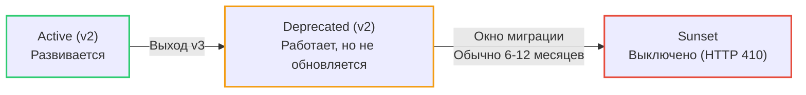

## Искусство убивать код: Почему удалять сложнее, чем создавать

Мы обсуждали, как создавать новые версии API ([[8. Versioning API.md]]) и как сохранять обратную совместимость ([[27. Backward compatibility.md]]). Но поддерживать старые версии вечно — это путь к банкротству. Старый код требует обновления уязвимостей, адаптации под новые схемы базы данных и замедляет разработку новых фич.

Рано или поздно версию `v1` нужно удалить. И здесь вступает в силу суровый закон программной инженерии — **Закон Хайрама (Hyrum's Law)**:
> *"При достаточном количестве пользователей API, неважно, что написано в вашем контракте: любое наблюдаемое поведение вашей системы станет зависимостью для кого-то из клиентов".*

Если вы просто удалите эндпоинт, у клиентов упадут интеграции, бизнес потеряет деньги, а вас завалят гневными тикетами в саппорт. 
**Version Deprecation (Вывод из эксплуатации)** — это не техническая задача (удалить файл роутера), это сложный организационный процесс.

## Жизненный цикл API: От рождения до заката

Senior-инженер должен четко разделять два термина, которые часто путают: **Deprecation** и **Sunset**.

1. **Active (Активный):** Рекомендуемая версия для всех новых интеграций.
2. **Deprecated (Устаревший):** API всё ещё работает безупречно. SLA соблюдается. **Но!** Новым клиентам запрещено его использовать, а старым настоятельно рекомендуется начать миграцию на новую версию. В эту версию больше не добавляются новые фичи.
3. **Sunset (Закат / Отключение):** Момент X. Дата, когда сервер физически перестанет обслуживать этот эндпоинт и начнет возвращать ошибку.



## Технический контракт: Как сказать машине, что API устарело

Отправлять клиентам письма на email — это хорошо, но разработчики редко читают корпоративные рассылки. Оповещение о Deprecation должно происходить на уровне протокола HTTP и контрактов.

### 1. Слой OpenAPI (Design-First)
Как мы обсуждали в [[36. Документация API best practices.md]], первым делом метод помечается в `openapi.yaml`.
```yaml
paths:
  /v1/users:
    get:
      summary: "Получить список пользователей"
      deprecated: true  # <- Инструменты кодогенерации пометят это как @Deprecated
```
Генераторы клиентов увидят этот флаг и при компиляции TypeScript или Go-кода на стороне клиента начнут выдавать `Warning` разработчику прямо в его IDE.

### 2. Слой HTTP: Стандарт RFC 8594
Существует официальный стандарт IETF для вывода API из эксплуатации. Ваш Go-сервер должен начать отдавать специальные заголовки для всех `Deprecated` маршрутов.

* `Deprecation: true` (или Unix timestamp, когда метод стал устаревшим).
* `Sunset: Wed, 31 Dec 2026 23:59:59 GMT` (Точная дата, когда API перестанет работать).
* `Link: <https://api.mycompany.com/docs/migration>; rel="deprecation"` (Ссылка на гайд по миграции).

```go
// Идиоматичный Go: Middleware для устаревших маршрутов
func DeprecatedMiddleware(sunsetDate string, migrationURL string) func(http.Handler) http.Handler {
	return func(next http.Handler) http.Handler {
		return http.HandlerFunc(func(w http.ResponseWriter, r *http.Request) {
			// Добавляем RFC заголовки
			w.Header().Set("Deprecation", "true")
			w.Header().Set("Sunset", sunsetDate)
			w.Header().Set("Link", fmt.Sprintf(`%s; rel="deprecation"`, migrationURL))
			
			next.ServeHTTP(w, r)
		})
	}
}
```

## Mechanical Sympathy: Наблюдаемость (Observability) устаревшего кода

Главное правило безопасного удаления: **Нельзя удалять код, пока метрики не покажут ноль вызовов.**

Вы не можете верить менеджерам ("Да все уже перешли на v2!"). Вы должны верить только Prometheus (см. [[31. API observability.md]]).
Если вы повесите на старый роутер сборщик метрик, вы должны собирать не только факт вызова, но и **кто именно** его вызывает.

```go
// Метрика с детализацией по клиентам
var deprecatedUsageCounter = promauto.NewCounterVec(
	prometheus.CounterOpts{
		Name: "api_deprecated_usage_total",
		Help: "Counts usage of deprecated endpoints to track migration",
	},
	// client_id достаем из JWT токена (Auth Middleware)
	[]string{"endpoint", "client_id"}, 
)
```
Построив график в Grafana, вы увидите топ-5 клиентов, которые саботируют миграцию, и сможете прийти к ним с предметным разговором.

## "The Scream Test" (Тест на крик) и Brownouts

Что делать, если дата Sunset (31 декабря) наступила, а ваши метрики показывают, что 15% трафика всё ещё идет на `v1`? 
Если вы просто удалите роутер, эти 15% упадут с ошибкой `404 Not Found`, что станет причиной массовых инцидентов (P1).

Индустрия выработала стратегию **Brownouts (Веерные отключения)**. Это аналог "Теста на крик", но в автоматизированном виде.

Вместо того чтобы отключать API навсегда, вы отключаете его **на короткие промежутки времени**, чтобы спровоцировать ошибки у забывчивых клиентов, но дать им шанс исправить код без фатальных последствий для их бизнеса.

**План Brownouts:**
1. За месяц до Sunset: Выключаем API на 5 минут каждый день (например, возвращаем `410 Gone` или `429/503` с ошибкой миграции). Мониторим Slack и баг-трекеры.
2. За 2 недели: Выключаем API на 1 час каждый день.
3. За 1 неделю: Выключаем на 12 часов.
4. Дата Sunset: Выключаем навсегда.

> [!tip] Собеседование
> **Вопрос:** Какой HTTP-статус должен возвращать навсегда отключенный (Sunset) эндпоинт?
> **Ответ:** Многие возвращают `404 Not Found`, но это семантически неверно. 404 означает "Я не знаю, что это". Правильный статус — **`410 Gone`**. Он означает: "Ресурс был здесь, но его намеренно удалили, и он больше никогда не вернется. Пожалуйста, удалите эту ссылку из вашего клиента". Это дает явный сигнал поисковым роботам и разработчикам.

## Динамические Brownouts в Go

Реализовать Brownout в Go можно через умный Middleware, который случайным образом или по расписанию "роняет" запросы.

```go
// BrownoutMiddleware начинает отбивать часть запросов по мере приближения к Sunset
func BrownoutMiddleware(dropPercentage int) func(http.Handler) http.Handler {
	return func(next http.Handler) http.Handler {
		return http.HandlerFunc(func(w http.ResponseWriter, r *http.Request) {
			// Если попали в процент "веерного отключения"
			if rand.Intn(100) < dropPercentage {
				w.Header().Set("Content-Type", "application/problem+json")
				// 410 Gone
				w.WriteHeader(http.StatusGone) 
				w.Write([]byte(`{
					"title": "API is sunsetting",
					"detail": "This endpoint is experiencing planned brownouts before permanent deletion.",
					"type": "[https://api.mycompany.com/docs/migration](https://api.mycompany.com/docs/migration)"
				}`))
				return
			}
			
			next.ServeHTTP(w, r)
		})
	}
}
```

> [!warning] Ловушка / Gotcha: Асинхронные потребители
> Стратегия Brownouts отлично работает для синхронного REST/gRPC. Но если ваш Deprecated-контракт касается формата сообщений в Kafka/RabbitMQ, вы не можете вернуть `410 Gone` в очередь. Если вы просто перестанете публиковать старый формат сообщений, асинхронные потребители могут "проголодаться" или зависнуть. В Event-Driven архитектурах единственный путь — это стратегия двойной записи (Dual Write): вы публикуете и старое сообщение, и новое, пока мониторинг (Consumer Lag) старой очереди не покажет, что подписчиков больше нет.

## Итог

1. **Deprecation — это процесс, а не событие.** Он требует месяцев коммуникации и поддержки как старой, так и новой версии.
2. Используйте **RFC 8594 (`Deprecation`, `Sunset`, `Link`)**, чтобы машиночитаемо сообщать клиентам о скором отключении.
3. Опирайтесь на **метрики (Prometheus)** с детализацией по `client_id`, чтобы знать, кто конкретно всё ещё использует устаревший код.
4. Применяйте **Brownouts (Веерные отключения)** для принудительной стимуляции миграции ленивых клиентов перед окончательным отключением.
5. После отключения возвращайте **`410 Gone`**, а не `404 Not Found`.