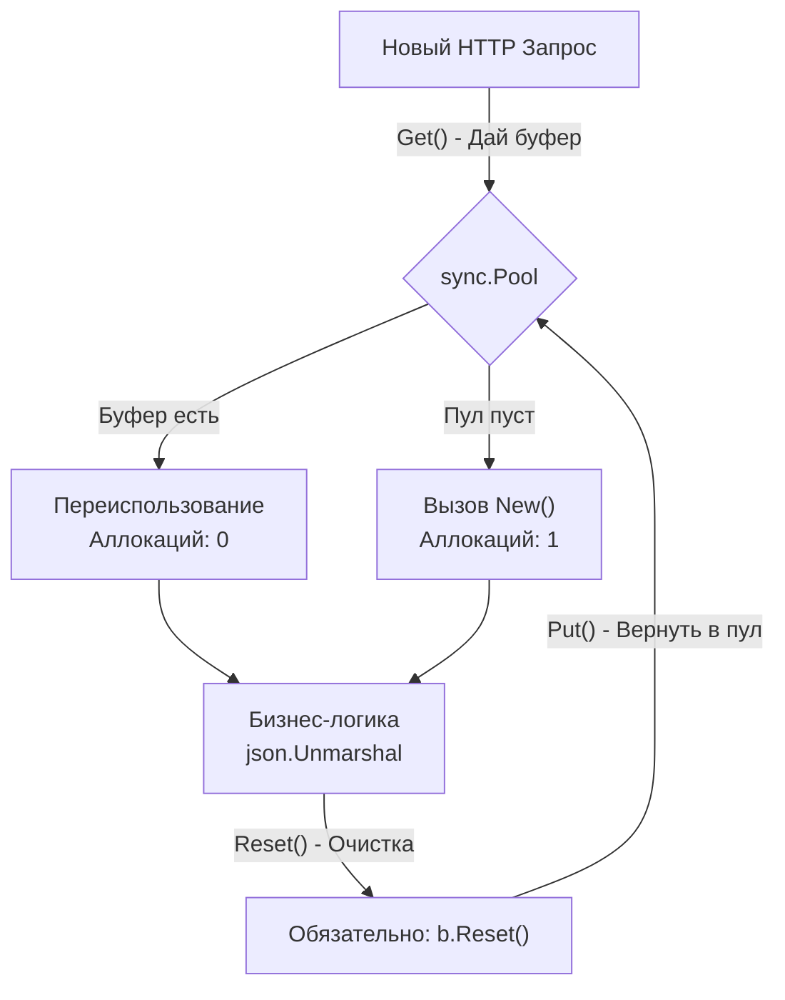

## Выжимаем максимум: Производительность и Mechanical Sympathy

Мы спроектировали распределенную систему, защитили её от атак, настроили лимиты, трейсинг и graceful shutdown. Наш код готов к выходу в production. И вот наступает Черная Пятница. Трафик вырастает в 10 раз. Серверы начинают потреблять 100% CPU, задержки (Latency) растут с 50 мс до 5 секунд, а Kubernetes начинает в панике масштабировать поды (HPA), сжигая бюджет компании.

Junior-разработчик в такой ситуации идет переписывать алгоритмы или добавлять кэширование (которое мы уже обсудили в [[12. Caching HTTP.md]]). 
Senior-разработчик знает: в I/O-bound приложениях (какими является 99% веб-сервисов) алгоритмическая сложность $O(N)$ редко является проблемой. Проблема кроется во взаимодействии рантайма Go с железом (процессором, памятью и сетью). Это и есть **Mechanical Sympathy**.

В этой статье мы разберем, как найти бутылочные горлышки и оптимизировать API на уровне памяти и планировщика Go.

## 1. Телеметрия: Не гадай, а измеряй (pprof)

Главное правило оптимизации: **Никогда не оптимизируйте код вслепую.** То, что вам кажется медленным, процессор может выполнять за наносекунды. А то, что кажется безобидным (например, конкатенация строк), может убить сборщик мусора (GC).

В Go встроен один из лучших в индустрии профайлеров — **pprof**.

Чтобы включить его, достаточно добавить один импорт, но делать это нужно безопасно.

> [!warning] Ловушка / Gotcha: pprof в публичном интернете
> Если вы просто импортируете `_ "net/http/pprof"` и используете `http.DefaultServeMux`, эндпоинты `/debug/pprof/` станут доступны всему интернету. Злоумышленник может выкачать дамп вашей памяти со всеми секретами или устроить DDoS, запрашивая тяжелые профили CPU.
> **Решение:** Профайлер всегда должен "висеть" на отдельном внутреннем порту, недоступном снаружи балансировщика.

```go
package main

import (
	"log"
	"net/http"
	"net/http/pprof"
)

func startDebugServer() {
	mux := http.NewServeMux()
	// Явно регистрируем роуты pprof на внутреннем мультиплексоре
	mux.HandleFunc("/debug/pprof/", pprof.Index)
	mux.HandleFunc("/debug/pprof/cmdline", pprof.Cmdline)
	mux.HandleFunc("/debug/pprof/profile", pprof.Profile) // CPU profile
	mux.HandleFunc("/debug/pprof/symbol", pprof.Symbol)
	mux.HandleFunc("/debug/pprof/trace", pprof.Trace)

	// Слушаем только localhost или закрытый порт для метрик
	log.Println("Debug server listening on :6060")
	http.ListenAndServe("127.0.0.1:6060", mux)
}
```
С помощью команды `go tool pprof http://localhost:6060/debug/pprof/profile?seconds=30` вы собираете профиль процессора прямо с работающего production-сервера, не останавливая его.

## 2. Смерть от тысячи порезов: Garbage Collector и Аллокации

Go — язык со сборщиком мусора. Когда вы создаете объекты в куче (Heap), GC должен периодически просыпаться, сканировать память (фаза Mark) и освобождать её (фаза Sweep). Чем больше объектов вы создаете на каждый HTTP-запрос, тем больше времени CPU тратится на сборку мусора, а не на бизнес-логику.

### Escape Analysis (Анализ побега)
Рантайм Go пытается выделить память на Стеке (Stack) горутины. Стек невероятно быстр, и данные с него удаляются мгновенно при выходе из функции (без участия GC). Но если компилятор видит, что указатель на переменную передается наружу (или размер переменной неизвестен во время компиляции), переменная "убегает" в Кучу (Heap).

**Пример из реальной жизни:** Возврат интерфейсов.
Вспомните наш логгер `slog.Any("key", value)`. Функция `Any` принимает пустой интерфейс `interface{}`. Любое значение, переданное в пустой интерфейс, **гарантированно убегает в кучу**, вызывая аллокацию. Именно поэтому в высоконагруженных API мы используем строгие типы: `slog.String`, `slog.Int`.

### Предварительная аллокация срезов (Slices)
Самая банальная, но самая эффективная оптимизация в Go.
Когда вы используете `append`, и емкость (capacity) среза исчерпана, Go выделяет новый, в 2 раза больший массив в куче, копирует старые данные в новый, а старый отдает на растерзание GC.

```go
// АНТИПАТТЕРН: Вызовет множество аллокаций и копирований памяти
func getUserIDs(users []User) []int64 {
    var ids []int64
    for _, u := range users {
        ids = append(ids, u.ID)
    }
    return ids
}

// ИДИОМАТИЧНЫЙ HIGHLOAD: Ноль лишних аллокаций
func getUserIDsFast(users []User) []int64 {
    // Мы знаем итоговый размер, выделяем память один раз!
    ids := make([]int64, 0, len(users))
    for _, u := range users {
        ids = append(ids, u.ID)
    }
    return ids
}
```

## 3. Оружие Судного Дня: sync.Pool

Если ваш API обрабатывает загрузку файлов, парсинг гигантских JSON или формирует сложные HTML-шаблоны, вы постоянно выделяете буферы (`[]byte` или `bytes.Buffer`). На 10 000 RPS это убьет ваш GC.

**`sync.Pool`** — это механизм переиспользования памяти. Вместо того чтобы просить у ОС новую память, вы берете готовый кусок из пула, используете его, **очищаете** и возвращаете обратно.



**Пример использования:**
```go
var bufferPool = sync.Pool{
	New: func() interface{} {
		// Выделяем буфер на 32 КБ
		b := make([]byte, 32*1024)
		return &b
	},
}

func HeavyJSONHandler(w http.ResponseWriter, r *http.Request) {
	// Берем буфер из пула (быстрая операция)
	bufPtr := bufferPool.Get().(*[]byte)
	buf := *bufPtr
	
	// ВАЖНО: Обязательно возвращаем буфер в пул в конце функции
	defer bufferPool.Put(bufPtr)

	// Читаем из сети в наш переиспользуемый буфер
	n, err := r.Body.Read(buf)
	if err != nil && err != io.EOF {
		http.Error(w, "Read error", http.StatusInternalServerError)
		return
	}

	// Обрабатываем полезную нагрузку buf[:n] ...
}
```

> [!warning] Ловушка / Gotcha: Утечка грязных данных
> Никогда не возвращайте в пул "грязный" объект. Если вы работаете с `bytes.Buffer`, перед вызовом `bufferPool.Put(buf)` вы **ОБЯЗАНЫ** вызвать `buf.Reset()`. Иначе следующий HTTP-запрос, который возьмет этот буфер из пула, получит JSON от предыдущего клиента (утечка чужих данных!).

## 4. Иллюзия бесконечности: Ограничение Concurrency

Go делает создание горутин (сопрограмм) невероятно дешевым (около 2 КБ). Из-за этого возникает соблазн запускать горутину на любую чих: "Нужно отправить 100 email-ов? Запущу цикл с `go sendEmail()` 100 раз!".

Это антипаттерн (Goroutine Leak / Resource Exhaustion).
Если к вам придет 1000 клиентов, и каждый запустит по 100 горутин, у вас появится 100 000 активных потоков. Они мгновенно исчерпают пул соединений к базе данных или стороннему SMTP-серверу, что приведет к каскадному отказу (Cascading Failure).

**Паттерн: Bounded Concurrency (Ограниченная конкурентность)**
Всегда используйте буферизованные каналы в качестве семафоров.

```go
// Ограничиваем количество одновременных горутин до 10
var emailSemaphore = make(chan struct{}, 10)

func SendEmailsBulk(emails []string) {
	var wg sync.WaitGroup
	
	for _, email := range emails {
		wg.Add(1)
		
		// Блокируемся, если 10 горутин уже работают
		emailSemaphore <- struct{}{}
		
		go func(e string) {
			defer wg.Done()
			// Освобождаем слот в семафоре после работы
			defer func() { <-emailSemaphore }()
			
			sendEmail(e) // Тяжелая I/O операция
		}(email)
	}
	
	wg.Wait()
}
```

## 5. JSON: Главный враг производительности REST

Если вы строите REST API ([[3. REST. Основные принципы.md]]), 80% времени ваш сервер занимается не базой данных, а превращением байтов в структуры Go и обратно (сериализацией JSON).

Стандартный пакет `encoding/json` использует **Рефлексию (Reflection)**. Он в рантайме обходит структуру, читает теги `` `json:"id"` `` и угадывает типы. Это чудовищно медленно на масштабе.

> [!tip] Собеседование
> **Вопрос:** Стандартный `encoding/json` слишком медленный для нашего Highload-сервиса. gRPC внедрять нельзя. Что делать?
> **Ответ:** Есть три пути оптимизации:
> 1. **Code Generation:** Использовать библиотеку `mailru/easyjson`. Она читает ваши структуры до компиляции и генерирует жестко зашитый Go-код (методы `MarshalEasyJSON`), который собирает байты напрямую без рефлексии. Ускорение в 3-5 раз, но усложняет CI/CD (нужно запускать генератор).
> 2. **Drop-in replacements:** Использовать `goccy/go-json` или `json-iterator/go`. Они имеют тот же API, что и стандартная библиотека, но используют агрессивное кэширование рефлексии и ассемблерные вставки.
> 3. **SIMD:** Для парсинга гигантских JSON (>1MB) использовать `minio/simdjson-go`. Она задействует векторные инструкции процессора (AVX2/AVX-512) для разбора документа со скоростью в несколько Гигабайт в секунду.

## Итог

1. **Не угадывайте, а профилируйте:** Используйте `pprof`, чтобы найти реального виновника тормозов (CPU, Heap, блокировки мьютексов).
2. **Берегите Garbage Collector:** Предварительно аллоцируйте срезы (`make([]T, 0, len)`). Избегайте передачи переменных через пустой `interface{}`, чтобы снизить нагрузку от Escape Analysis.
3. Переиспользуйте память на горячих эндпоинтах через **`sync.Pool`**, но не забывайте обнулять буферы (Reset) перед возвратом в пул.
4. Жестко ограничивайте конкурентность фоновых задач **семафорами** (буферизованными каналами).
5. На сверхвысоких нагрузках отказывайтесь от стандартного `encoding/json` в пользу генерации кода (`easyjson`) или оптимизированных библиотек.

Мы научились выжимать из рантайма Go всё, на что способны процессор и оперативная память. В следующей (и завершающей!) статье нашего большого цикла мы подведем общие итоги, соберем все разобранные архитектурные паттерны в единую карту знаний Senior Backend инженера и составим чек-лист запуска идеального API. Переходим к финалу: [[40. Итоги раздела. Хороший API глазами Go разработчика]].****