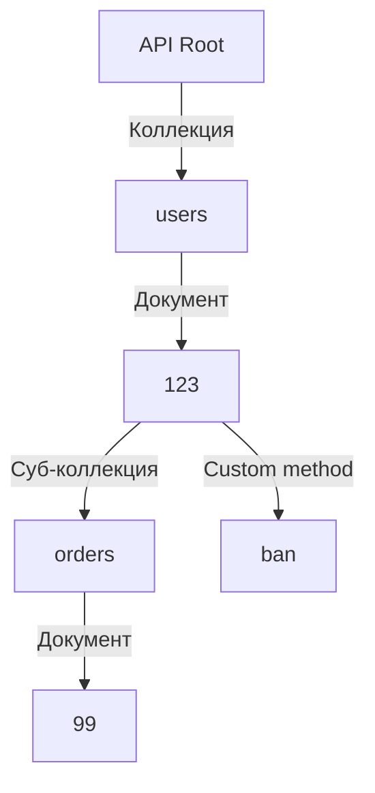

## Переход от глаголов к существительным: Что такое ROD?

В начале своей карьеры разработчики часто проектируют API как удаленный вызов процедур (RPC). Мы мыслим функциями: "получить пользователя", "создать заказ", "заблокировать аккаунт". В URL это выражается как `/getUsers`, `/createNewOrder`, `/banUser`. 

Resource-Oriented Design (ROD) — это строгая парадигма проектирования, которая является логическим продолжением принципов REST ([[3. REST. Основные принципы.md]]). В ROD мы перестаем мыслить действиями (глаголами) и начинаем мыслить **ресурсами (существительными)**. 

Индустриальным стандартом для ROD сейчас является **Google API Design Guide**. Изначально созданный для gRPC, он идеально ложится на HTTP/REST, унифицируя контракты в распределенных системах.

### Базовые концепции ROD

1. **Ресурс (Resource):** Сущность данных. Имеет состояние, может содержать другие ресурсы.
2. **Коллекция (Collection):** Список ресурсов одного типа. Например, `/users`.
3. **Документ (Document):** Конкретный экземпляр ресурса внутри коллекции. Уникально идентифицируется. Например, `/users/123`.

Любое API в ROD — это иерархическое дерево ресурсов.



## Роутинг в Go: Цена красивых URL

Когда клиент отправляет HTTP-запрос `GET /users/123/orders/99`, серверу на Go нужно:
1. Понять, какой именно обработчик (handler) должен выполниться.
2. Извлечь динамические параметры (`123` и `99`) и передать их в бизнес-логику.

До Go 1.22 стандартный пакет `net/http` умел делать только точные совпадения (Exact Match) или совпадения по префиксу. Разработчикам приходилось использовать сторонние библиотеки: `gorilla/mux` (использовал регулярные выражения) или `go-chi/chi` (использовал Radix Tree).

Начиная с Go 1.22, стандартный маршрутизатор (ServeMux) научился работать с паттернами и методами «из коробки»:

```go
package main

import (
	"fmt"
	"net/http"
)

func handleOrderGet(w http.ResponseWriter, r *http.Request) {
	// Идиоматичное извлечение параметров в Go 1.22+
	userID := r.PathValue("userID")
	orderID := r.PathValue("orderID")
	
	fmt.Fprintf(w, "User: %s, Order: %s", userID, orderID)
}

func main() {
	mux := http.NewServeMux()
	// Метод и паттерн прямо в строке роута
	mux.HandleFunc("GET /users/{userID}/orders/{orderID}", handleOrderGet)
	
	http.ListenAndServe(":8080", mux)
}
```

> [!info] Под капотом: Radix Tree vs Регулярные выражения
> Почему `gorilla/mux` проиграл гонку и был отправлен в архив, а `chi` и новый `ServeMux` стали стандартом? 
> Регулярные выражения (RegEx) имеют сложность парсинга $O(N)$, где $N$ — количество зарегистрированных маршрутов. Если у вас 500 эндпоинтов, при каждом запросе роутер будет проверять их один за другим.
> 
> Современные роутеры в Go используют **Radix Tree (Компактное префиксное дерево)**. Сложность поиска в таком дереве составляет $O(K)$, где $K$ — длина URL-адреса, и совершенно не зависит от количества маршрутов в системе. 
> Кроме того, извлечение параметров `r.PathValue()` в Go 1.22 оптимизировано так, чтобы не делать лишних аллокаций в куче (Heap), избегая создания новых `map[string]string` на каждый запрос.

## Custom Methods: Когда CRUD недостаточно

Классический REST опирается на стандартные HTTP-методы: GET, POST, PUT, PATCH, DELETE. 
Но что делать с бизнес-операциями, которые не ложатся на концепцию "создать/удалить/обновить"? Например:
* Восстановить пароль.
* Заблокировать пользователя.
* Применить промокод к корзине.

Частая ошибка Junior-разработчиков — пытаться "впихнуть" это в `PATCH`:
```json
// ПЛОХО: Неявное действие через изменение статуса
// PATCH /users/123
{
  "status": "banned",
  "reason": "spam"
}
```
Это порождает спагетти-код в обработчике, который вынужден анализировать: "Ага, если поменялся статус на banned, мне нужно вызвать сервис отправки email-уведомлений и разорвать все текущие WebSocket-сессии".

В ROD (по стандарту Google) используются **Custom Methods (Пользовательские методы)**. Они всегда используют HTTP метод `POST` и добавляются в конец URL через двоеточие или слэш:

* `POST /users/123:ban` (Формат Google API)
* `POST /users/123/ban` (Альтернативный распространенный формат)

Такой подход оставляет URL ресурсным (`/users/123`), но четко декларирует бизнес-намерение.

> [!warning] Ловушка / Gotcha: Глубокая вложенность ресурсов
> При проектировании иерархии легко увлечься и создать монстра:
> `GET /companies/1/departments/5/teams/12/employees/404`
> 
> **Проблема 1:** Хрупкость URL. Если сотрудник перейдет в другую команду, его URI изменится, что сломает кэш клиентов и сохраненные ссылки.
> **Проблема 2:** Сложность запросов в БД. Чтобы отдать этот ресурс, вашему бэкенду придется сделать JOIN четырех таблиц только ради валидации того, что этот сотрудник действительно принадлежит этой компании и команде.
> 
> **Правило:** Избегайте вложенности глубже двух-трех уровней. Если ресурс имеет глобально уникальный идентификатор (например, UUID), обращайтесь к нему напрямую: `GET /employees/404`.

## Разделение ресурсов и проблема PATCH в Go

Самая большая техническая боль при реализации Resource Oriented Design в Go — это операция частичного обновления ресурса (`PATCH`).

Представим DTO (Data Transfer Object) для обновления пользователя. В JSON клиент может прислать три разных состояния поля:
1. `"age": 25` (обновить на 25)
2. `"age": 0` (обновить на 0)
3. *Поле `age` отсутствует* (не обновлять поле вообще)
4. `"age": null` (сбросить значение в базе, если допустимо)

Если мы опишем структуру в Go стандартным образом:
```go
type UpdateUserRequest struct {
	Name string `json:"name"`
	Age  int    `json:"age"`
}
```
Если клиент пришлет `{"name": "Ivan"}` (без возраста), пакет `encoding/json` инициализирует поле `Age` нулем (zero value для `int`). Наш бэкенд не сможет отличить ситуацию "клиент хочет установить возраст 0" от "клиент не прислал возраст".

> [!tip] Собеседование
> **Вопрос:** Как вы реализуете PATCH запрос в Go, чтобы отличить отсутствующее поле от Zero Value?
> **Ответ:** Есть три основных паттерна:
> 
> 1. **Использование указателей:**
> ```go
> type UpdateUserRequest struct {
>     Name *string `json:"name"`
>     Age  *int    `json:"age"`
> }
> ```
> Если поле отсутствует в JSON, указатель будет `nil`. Если прислали `0`, будет указатель на область памяти со значением `0`. 
> *Mechanical Sympathy:* Этот подход сильно нагружает Garbage Collector, так как каждый указатель провоцирует Escape Analysis перенести значение в Heap. Для высоконагруженных API (тысячи RPS) это вызовет просадки производительности.
> 
> 2. **Типы из `sql.Null*` или кастомные обертки:**
> Использование структур, которые хранят значение и boolean-флаг `Valid` (или `Set`). Эффективно по памяти, не создает указателей, но требует написания кастомных `UnmarshalJSON` методов.
> 
> 3. **Десериализация в `map[string]interface{}` (Антипаттерн):**
> Десериализация сырого JSON в мапу и ручная проверка наличия ключей. Это убивает строгую типизацию Go, делает код медленным (из-за обилия рефлексии под капотом `encoding/json`) и трудно поддерживаемым.

## Итог

Resource Oriented Design структурирует хаос HTTP-вызовов, превращая их в предсказуемое дерево сущностей. 
* Мы используем существительные для коллекций и документов (`/users/123`).
* Мы используем Custom Methods для бизнес-операций, не вписывающихся в CRUD (`POST /users/123/ban`).
* Мы не допускаем глубокой вложенности URL, чтобы не усложнять запросы к базам данных и не ломать инвалидацию кэша.

В этой статье мы вскользь упомянули, что Custom Methods всегда используют `POST`, а чтение данных — `GET`. Эта привязка методов к действиям не случайна. В распределенных системах критически важно понимать, безопасно ли повторить запрос, если сеть моргнула и мы не получили ответ от сервера. Этим поведением управляют спецификации HTTP, которые мы детально разберем в следующей статье: [[5. HTTP методы и идемпотентность.md]].