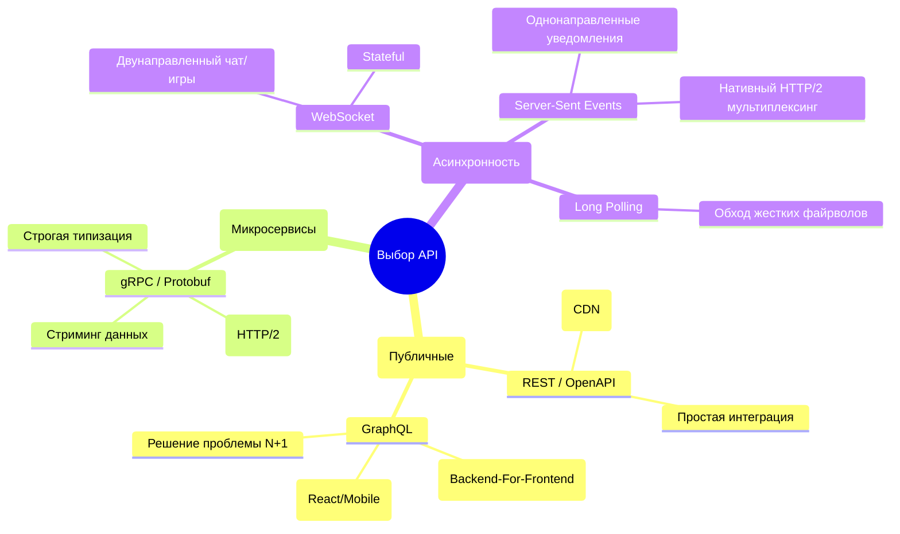

## Гранд-финал: Анатомия идеального бэкенда

Мы прошли огромный путь, состоящий из 40 шагов. Мы начинали с базовых принципов REST и форматов данных, погружались в бинарную физику Protobuf, строили двунаправленные стримы, защищали периметр через API Gateway и mTLS, а также учились выжимать из рантайма Go максимальную производительность.

Senior-разработчик отличается от Junior-разработчика не знанием синтаксиса языка. Он отличается умением предвидеть отказы, пониманием *Mechanical Sympathy* (как код работает на уровне железа) и способностью проектировать контракты, которые не причиняют боль другим командам.

В этой финальной статье мы соберем весь наш опыт в единую архитектурную карту и составим ультимативный чек-лист "Хорошего API".

## Матрица протоколов: Что и когда использовать

Не существует "серебряной пули". Идеальная архитектура — это всегда компромисс.

## Чек-лист Senior Go-разработчика

Перед тем как нажать кнопку "Merge" и отправить ваш новый микросервис в production, прогоните его по этому списку. Если где-то стоит "Нет", вы закладываете бомбу замедленного действия.

### 1. Проектирование контракта (Design-First)
- [ ] **Контракт первичен.** Написан ли `openapi.yaml` или `.proto` файл ДО написания бизнес-логики?
- [ ] **Идемпотентность.** Если метод `POST` или `PATCH` вызовут дважды из-за обрыва сети, защитит ли систему `Idempotency-Key`?
- [ ] **Пагинация.** Защищены ли списочные методы (`GET /items`) лимитами (`limit=100`), чтобы не выгрузить миллион строк в память?
- [ ] **Версионирование.** Указана ли версия API (в URL для REST или в package для gRPC), чтобы иметь пространство для маневра в будущем?

### 2. Безопасность и Периметр
- [ ] **Аутентификация.** Проверяется ли JWT токен на уровне Middleware (или API Gateway), и валидируется ли алгоритм подписи (защита от Key Confusion)?
- [ ] **Ограничение Payload.** Обернут ли `r.Body` в `http.MaxBytesReader` для защиты от загрузки 10-гигабайтных файлов в оперативную память?
- [ ] **Rate Limiting.** Защищен ли эндпоинт от DDoS с помощью алгоритма Token Bucket (в Redis или памяти)?
- [ ] **mTLS.** Если это внутренний микросервис, зашифрован ли трафик между сервисами сертификатами (Zero Trust)?

### 3. Эксплуатация и Observability
- [ ] **Graceful Shutdown.** Перехватывает ли `main.go` сигнал `SIGTERM` и ждет ли он завершения активных соединений (с учетом The Sleep Hack для Kubernetes)?
- [ ] **Таймауты сервера.** Установлены ли `ReadTimeout` и `WriteTimeout` в `http.Server` для защиты от атак Slowloris?
- [ ] **Context Propagation.** Передается ли `r.Context()` во все вызовы БД и сторонние HTTP-запросы, чтобы отменить их, если клиент разорвал соединение?
- [ ] **Трассировка.** Прокидывается ли `Trace ID` (W3C Trace Context) сквозь все микросервисы и записывается ли он в структурированные логи (`log/slog`)?
- [ ] **Метрики RED.** Собирает ли Prometheus метрики Rate, Errors, Duration? Очищены ли URL от ID (кардинальность), чтобы не "убить" память метрик?

### 4. Тестирование
- [ ] **Быстрые интеграции.** Используется ли `httptest` для тестирования хендлеров без поднятия реальных TCP-портов?
- [ ] **Изоляция БД.** Используется ли `Testcontainers` (реальный PostgreSQL в Docker) вместо SQLite с откатом транзакций (Rollback) после каждого теста?
- [ ] **Contract Testing.** Проверяются ли ответы бэкенда на соответствие ожиданиям фронтенда (через Pact или валидацию OpenAPI схемы)?

## Квинтэссенция Mechanical Sympathy в Go

Хороший API на Go — это API, который не мешает рантайму языка делать свою работу. 

1. **Меньше мусора (GC Pressure):** Избегайте пустых интерфейсов `interface{}`. Предварительно аллоцируйте слайсы `make([]T, 0, len)`. Если используете `bytes.Buffer` в горячих точках — берите их из `sync.Pool`.
2. **Горутины — не бесплатны:** Запуск 100 000 горутин убьет пул соединений базы данных. Всегда используйте семафоры (буферизованные каналы) для ограничения конкурентности (Bounded Concurrency).
3. **Блокировки без простоя:** Используйте асинхронные батчи (Async Flush) для обновления квот и метрик. Вместо блокировки входящих HTTP-запросов мьютексами, используйте `sync/atomic` для счетчиков в памяти.

> [!tip] Главное правило создания API
> **Эмпатия к потребителю.** > Ваш код может быть невероятно быстрым, а архитектура — гениальной. Но если ваша документация неполная, ошибки возвращают пустой `500 Internal Server Error` без объяснения причин, а при релизе рвутся TCP-соединения — пользователи возненавидят ваш продукт. Стройте API так, чтобы интеграция с ним приносила удовольствие.

## Финал

Архитектура бэкенда — это бесконечный процесс поиска компромиссов между скоростью разработки, стоимостью железа, надежностью и простотой поддержки. В этом курсе мы разобрали инструменты, которые помогут вам принимать эти решения осознанно, опираясь на физику сетей и устройство рантайма Go. 

Создавайте надежные системы, пишите чистый код и никогда не забывайте про контекст!