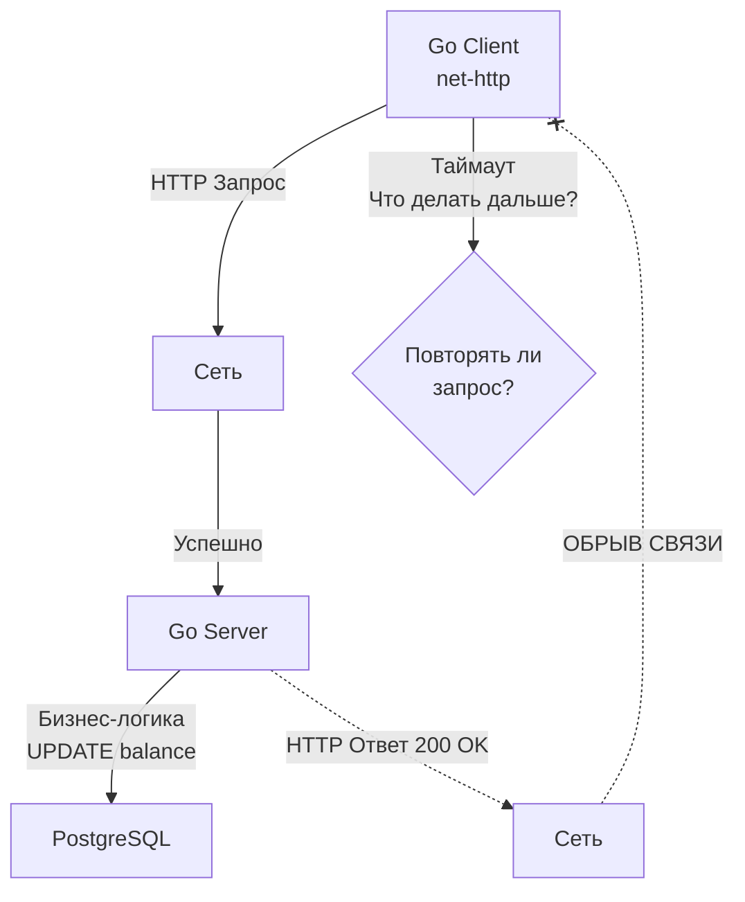

## Анатомия HTTP-методов: Больше, чем просто CRUD

В предыдущей статье ([[4. Resource oriented design.md]]) мы научились мыслить ресурсами, отказавшись от глаголов в URL. Но действия никуда не исчезли — они делегированы на уровень протокола. В REST эту роль выполняют методы HTTP (Verbs).

Для Junior-разработчика методы HTTP — это просто синонимы операций CRUD (Create, Read, Update, Delete). Для Senior-инженера, проектирующего высоконагруженные распределенные системы, методы HTTP — это **гарантии поведения**, которые определяют, как сеть, балансировщики и клиенты могут безопасно обрабатывать ошибки и таймауты.

Центральными концепциями здесь являются **Безопасность (Safety)** и **Идемпотентность (Idempotency)**.

## Идемпотентность: Математика в сетях

Термин пришел из алгебры. Операция является идемпотентной, если многократное ее применение дает тот же результат, что и однократное: $f(f(x)) = f(x)$.

В контексте API это означает: **сервер может получить один и тот же запрос один раз, дважды или тысячу раз, но состояние ресурсов на сервере останется таким же, как если бы запрос был выполнен ровно один раз.**

> [!warning] Ловушка / Gotcha: Ответ vs Состояние
> Идемпотентность гарантирует неизменность *состояния сервера*, но **не гарантирует одинаковый ответ** (HTTP Status Code). 
> Например, первый запрос `DELETE /users/123` может вернуть `204 No Content`. Повторный запрос вернет `404 Not Found`. Ответы разные, но состояние системы идентично: пользователя 123 в базе нет. Операция идемпотентна.

### Зачем это нужно? Проблема двух генералов

В распределенных системах сеть ненадежна (Fallacy of Distributed Computing #1). Когда ваш Go-клиент отправляет HTTP-запрос и получает `context.DeadlineExceeded` (таймаут), он находится в "слепой зоне". 
Вы не знаете, на каком этапе произошел сбой:
1. Запрос не дошел до сервера.
2. Сервер получил запрос, но упал до его обработки.
3. Сервер успешно обработал запрос (например, списал деньги), но ответ потерялся по пути назад.



Если операция **идемпотентна**, ответ на вопрос "Повторять ли запрос?" — **ДА**. Мы можем безопасно делать retry бесконечное количество раз. 
Если операция **не идемпотентна** (например, создание заказа без ключа идемпотентности), автоматический retry приведет к созданию дубликатов.

## Классификация HTTP-методов

Согласно спецификации RFC 7231, методы делятся по двум осям.
**Безопасные методы (Safe)** — методы, которые предназначены исключительно для получения информации и не изменяют состояние сервера (Read-only). Все безопасные методы по умолчанию идемпотентны.

### 1. GET, HEAD, OPTIONS
* **Безопасный:** Да.
* **Идемпотентный:** Да.
* **Специфика:** `GET` может менять состояние опосредованно (например, логирование запроса или инкремент счетчика просмотров), но бизнес-состояние ресурса меняться не должно. Кэширование GET-запросов (через CDN или Reverse Proxy) строится именно на этой гарантии.

### 2. PUT
* **Безопасный:** Нет.
* **Идемпотентный:** Да.
* **Специфика:** `PUT` означает "Замени целевой ресурс этим payload-ом целиком". Если вы отправляете `PUT /users/1` с полным объектом пользователя 10 раз, ресурс 10 раз перезапишется одними и теми же данными. Состояние в итоге будет идентично одному вызову.

> [!warning] Ловушка / Gotcha: Ложный PUT
> Если вы реализуете эндпоинт `PUT /users/1` и внутри делаете инкремент `UPDATE users SET age = age + 1 WHERE id = 1`, вы нарушаете спецификацию HTTP. Ваш `PUT` перестал быть идемпотентным. Если сеть моргнет и балансировщик повторит запрос — пользователь постареет на 2 года.

### 3. DELETE
* **Безопасный:** Нет.
* **Идемпотентный:** Да.
* **Специфика:** Удаление уже удаленного ресурса не меняет систему.

### 4. POST
* **Безопасный:** Нет.
* **Идемпотентный:** Нет.
* **Специфика:** Рабочая лошадка для всего, что не укладывается в другие методы. Создание новых ресурсов, запуск сложных вычислений, Custom Methods (из ROD). Повторный POST обычно приводит к дублированию данных.

### 5. PATCH
* **Безопасный:** Нет.
* **Идемпотентный:** Нет (согласно RFC 5789), но *часто реализуется как идемпотентный*.
* **Специфика:** `PATCH` применяет частичное изменение. Если payload выглядит как `{"status": "active"}`, применение его 10 раз даст тот же результат. Но если payload содержит инструкции вида `{"$inc": {"balance": 100}}` (паттерн JSON Patch), то повторный запрос изменит состояние. Поэтому на уровне протокола PATCH не считается идемпотентным.

> [!tip] Собеседование
> **Вопрос:** В чем разница между PUT и PATCH с точки зрения спецификации HTTP?
> **Ответ:** Во-первых, PUT заменяет ресурс целиком, а PATCH применяет частичные изменения (diff). Во-вторых, и это более важно для архитектуры, PUT строго идемпотентен, в то время как PATCH не гарантирует идемпотентность (хотя на практике разработчики часто делают его таким).

## Mechanical Sympathy: Как net/http работает с идемпотентностью

В стандартной библиотеке Go за отправку запросов отвечает `http.Transport`. Мало кто знает, что рантайм Go использует знание об идемпотентности HTTP-методов для **автоматических скрытых ретраев (Auto-Retries)** прямо под капотом.

Если вы инициализируете HTTP-клиент, и он пытается отправить запрос в переиспользованное соединение (Keep-Alive), которое сервер только что закрыл (отправив TCP RST или HTTP/2 GOAWAY), Go должен решить, что делать.

В исходниках Go (файл `src/net/http/transport.go`, функция `shouldRetryRequest`) зашита следующая логика:

```go
// Псевдокод из рантайма Go (net/http)
func (req *Request) isReplayable() bool {
    if req.Body == nil || req.Body == NoBody || req.GetBody != nil {
        switch req.Method {
        case "GET", "HEAD", "OPTIONS", "TRACE":
            return true
        }
        // В Go спецификация реализована так: 
        // Автоматически ретраятся только "Safe" методы, 
        // либо запросы, которые физически еще не начали отправляться.
    }
    return false
}
```

> [!info] Под капотом: Транспортный слой
> Если соединение оборвалось до того, как Go записал хотя бы один байт из тела запроса (в `netFD`), рантайм прозрачно для вас пересоздаст TCP-сокет и повторит ЛЮБОЙ метод, включая POST. 
> Но если хотя бы часть `POST`-запроса улетела в сеть, Go вернет вам ошибку, потому что не знает, обработал ли сервер эти данные. Для `GET`-запросов рантайм более агрессивен в ретраях, полагаясь на их безопасность.

## Как сделать POST идемпотентным?

Если метод `POST` не идемпотентен по своей природе, как нам безопасно списывать деньги с баланса в микросервисной архитектуре, где таймауты — это обыденность?

Мы должны привнести идемпотентность искусственно, на прикладном уровне. Для этого используется паттерн **Idempotency Key (Ключ идемпотентности)**.

1. Клиент генерирует уникальный идентификатор (например, UUIDv4) для конкретной бизнес-операции.
2. Клиент передает этот ключ в специальном заголовке: `Idempotency-Key: 123e4567-e89b-12d3-a456-426614174000`.
3. Сервер перед обработкой `POST`-запроса идет в БД (или Redis) и проверяет, есть ли там такой ключ.
   * Если ключа нет: сохраняет ключ, выполняет операцию, кэширует ответ.
   * Если ключ есть: **не выполняет бизнес-логику**, а сразу отдает закешированный ответ от предыдущей успешной попытки.

Подробнее архитектуру, конкурентный доступ (Race Conditions) при проверке ключа и стратегии кэширования ответов мы разберем в отдельной статье: [[13. Idempotency ключи.md]].

## Итог

1. Выбор метода HTTP — это не просто дань уважения REST. Это технический контракт, сообщающий клиентам (и промежуточным балансировщикам типа Nginx/Envoy), можно ли безопасно повторять упавшие запросы.
2. **Safe методы** (GET) не меняют состояние.
3. **Идемпотентные методы** (PUT, DELETE) могут менять состояние, но повторный вызов не ломает систему.
4. **POST** по умолчанию опасен для слепых ретраев.
5. Библиотеки (как `net/http` в Go) полагаются на эти правила для оптимизации сетевого взаимодействия под капотом.

Мы разобрались, как клиент отправляет намерение через методы HTTP. Но как сервер сообщает клиенту о результате? Текстовые сообщения в JSON часто меняются и не стандартизированы. Для строгого ответа на уровне протокола существуют числовые коды. В следующей статье мы углубимся в их анатомию: [[6. Статусы HTTP.md]].