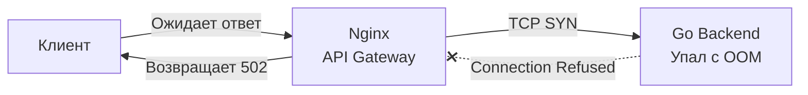

## Статусы HTTP: Контракт возврата в распределенной системе

Если HTTP-методы ([[5. HTTP методы и идемпотентность]]) — это сигнатура вызываемой функции (что мы хотим сделать), то HTTP-статусы — это её `return type` (результат выполнения). 

В монолитном приложении, когда одна функция вызывает другую, мы можем вернуть `nil, err` и детально разобрать ошибку по её типу (`errors.Is` / `errors.As`). В распределенной системе, где клиенты написаны на разных языках, а между ними стоят балансировщики (Nginx, Envoy) и API-шлюзы, нам нужен универсальный язык. Этим языком являются коды состояния HTTP (Status Codes).

Использование правильных статус-кодов критически важно, потому что промежуточная инфраструктура (Reverse Proxies, CDN, Load Balancers) принимает решения о кэшировании, повторных попытках (retries) и маршрутизации, опираясь исключительно на эти цифры.

## Классификация: Пять семейств

HTTP-статусы разбиты на 5 сотен. Первая цифра определяет класс ответа.

* **1xx (Информационные):** Протокольные сообщения. В повседневной REST-разработке почти не встречаются (исключение — `101 Switching Protocols` для [[22. WebSocket]]).
* **2xx (Успех):** Клиент сделал правильный запрос, сервер успешно его выполнил.
* **3xx (Перенаправление):** Клиенту нужно сделать дополнительное действие (сходить по другому URL), чтобы завершить запрос.
* **4xx (Ошибка клиента):** Клиент прислал мусор, забыл токен, запросил несуществующий ресурс. Повторять запрос *в том же виде* бессмысленно — он снова упадет.
* **5xx (Ошибка сервера):** Клиент все сделал правильно, но сервер сломался (упала БД, паника в коде, таймаут). Запрос *можно* безопасно повторить позже (если метод идемпотентен).

---

## 2xx Успех: Больше, чем просто 200

Junior-разработчики часто возвращают `200 OK` на любые успешные действия. Это лишает клиента важного контекста.

* **200 OK:** Универсальный ответ для `GET`, `PUT`, `PATCH`. Если мы обновляем ресурс, в теле ответа обычно возвращается его обновленное состояние.
* **201 Created:** Обязательный ответ для успешного `POST` (создание ресурса). 
  * *Специфика:* По стандарту REST, вместе с 201 ответом сервер должен вернуть заголовок `Location`, указывающий URL нового ресурса (например, `Location: /users/123`).
* **202 Accepted:** Критически важный статус для асинхронных операций. Означает: "Я принял твою задачу в очередь (например, RabbitMQ), но она еще не выполнена". Клиент не должен ждать завершения запроса. Подробнее архитектуру очередей разберем в разделе про брокеры.
* **204 No Content:** Идеальный ответ для идемпотентного `DELETE`. Означает: "Операция успешна, но мне нечего тебе вернуть в теле ответа". Экономит байты в сети.

---

## 4xx Ошибки клиента: Зона ответственности Frontend / API Consumer

Эти ошибки означают, что контракт нарушен вызывающей стороной.

### 400 Bad Request vs 422 Unprocessable Entity
Это самый частый предмет споров на код-ревью. Как правильно разделить ошибки валидации?
В мире Go (и многих других языках) сложился четкий паттерн:

* **400 Bad Request:** Ошибка *синтаксиса*. Клиент прислал битый JSON.
  * Если `json.NewDecoder(r.Body).Decode(&dto)` возвращает ошибку (например, клиент передал строку `"foo"` в поле типа `int`) — это 400. Рантайм Go физически не смог разобрать байты.
* **422 Unprocessable Entity:** Ошибка *семантики* (бизнес-валидация). 
  * JSON валидный, Go успешно смапил его в структуру. Но когда вы вызвали `validator.Struct(dto)`, выяснилось, что `age` равен -5, или `email` не содержит символа `@`. Это 422.

### 401 Unauthorized vs 403 Forbidden
Обе ошибки про безопасность, но семантика кардинально отличается (детальнее в [[28. Security API. Auth, OAuth2]]):
* **401 Unauthorized:** Ошибка Аутентификации. "Я не знаю, кто ты". Клиент не прислал токен (JWT) или он протух.
* **403 Forbidden:** Ошибка Авторизации. "Я знаю, кто ты, но тебе туда нельзя". Токен валиден, пользователь известен, но у него нет прав (например, обычный юзер лезет в админку).

### 404 Not Found vs 405 Method Not Allowed
* **404 Not Found:** Ресурс не существует. `GET /users/999` (юзера 999 нет в базе).
* **405 Method Not Allowed:** URL правильный, ресурс существует, но этот метод к нему не применим. Например, вы делаете `POST /users/123`, хотя для конкретного пользователя разрешены только `GET` и `DELETE`.

> [!info] Под капотом: Роутер Go 1.22+
> Начиная с Go 1.22, встроенный `http.ServeMux` умеет автоматически и правильно обрабатывать 405 статус. Если вы зарегистрировали `mux.HandleFunc("GET /users/{id}", handler)` и клиент делает `POST /users/123`, роутер сам вернет `405 Method Not Allowed` и автоматически проставит заголовок `Allow: GET`, как того требует спецификация RFC.

### 409 Conflict
Используется при нарушениях конкурентности или бизнес-конфликтах состояния. Например, попытка зарегистрировать пользователя с email, который уже есть в базе. Или конфликт версий при Optimistic Locking (когда два клиента одновременно пытаются обновить один и тот же ресурс).

### 429 Too Many Requests
Срабатывает, когда клиент упирается в лимиты API. Обязательно возвращается вместе с заголовком `Retry-After`, чтобы клиент знал, когда можно возобновить запросы. Мы будем плотно работать с ним в [[11. Rate limiting в API]].

---

## 5xx Ошибки сервера: Зона ответственности Backend Engineer

Если мониторинг показывает рост 5xx ошибок — вас должны разбудить посреди ночи. Это означает, что инфраструктура или код деградируют.

* **500 Internal Server Error:** Неперехваченная паника (`panic`), потеря связи с БД прямо в момент транзакции или любая неожиданная ошибка, которую мы не смогли классифицировать.
* **502 Bad Gateway:** Ваш Go-бэкенд вообще не ответил (например, процесс `panic`нул и упал, или контейнер убит OOM Killer-ом). Эту ошибку генерирует Nginx или API Gateway, потому что он не смог установить TCP-соединение с вашим бинарником.
* **503 Service Unavailable:** Сервер жив, но намеренно отказывается обслуживать запрос. Возвращается во время Graceful Shutdown (когда сервер дорабатывает старые соединения, но не берет новые) или когда срабатывают Readiness-пробы в Kubernetes, потому что сервис перегружен.
* **504 Gateway Timeout:** Nginx/Gateway установил TCP-соединение с Go, передал запрос, но Go-приложение зависло (например, долгий запрос к мертвой базе) и не уложилось в отведенный таймаут прокси-сервера.



---

## Mechanical Sympathy: Как net/http работает со статусами

В Go запись HTTP-ответа реализуется через интерфейс `http.ResponseWriter`. Работа с ним имеет строгий и неочевидный порядок, нарушение которого приведет к трудноуловимым багам.

### Анатомия ResponseWriter

```go
func myHandler(w http.ResponseWriter, r *http.Request) {
    // 1. Установка заголовков - всегда ДО записи статуса и тела
    w.Header().Set("Content-Type", "application/json")
    
    // 2. Установка статуса
    w.WriteHeader(http.StatusCreated) // 201
    
    // 3. Запись тела (payload)
    w.Write([]byte(`{"status":"success"}`)) 
}
```

> [!warning] Ловушка / Gotcha: Неявный 200 OK
> Что будет, если вы забудете вызвать `w.WriteHeader` и сразу вызовете `w.Write([]byte("data"))`?
> Рантайм Go не упадет с ошибкой. Внутри реализации `net/http` (в файле `server.go`) стоит проверка: если метод `Write` вызван до `WriteHeader`, рантайм **неявно вызовет `w.WriteHeader(http.StatusOK)`**.
> 
> Более того, если вы попытаетесь изменить статус ПОСЛЕ вызова `w.Write`, Go проигнорирует ваш статус и выведет в консоль ворнинг: `http: multiple response.WriteHeader calls`. TCP-пакет с HTTP-заголовками уже улетел в сеть, изменить статус невозможно!

### Sniffing контента
Если вы не зададите заголовок `Content-Type`, при первом вызове `w.Write` пакет `net/http` возьмет первые 512 байт ваших данных и попытается угадать тип (MIME sniffing). Это использует процессорное время. Для высоконагруженных систем (Highload) всегда явно проставляйте `w.Header().Set("Content-Type", ...)`.

> [!tip] Собеседование
> **Вопрос:** В чем разница между возвратом ошибки через `fmt.Fprint(w, err)` и `http.Error(w, err.Error(), code)`?
> **Ответ:** `fmt.Fprint` или `w.Write` просто запишут текст ошибки в тело ответа и неявно отправят статус `200 OK`. Клиент решит, что все прошло успешно. Функция `http.Error` под капотом делает три вещи в правильном порядке: 
> 1. Устанавливает `Content-Type: text/plain` (и отключает sniffing).
> 2. Вызывает `w.WriteHeader(code)`.
> 3. Записывает текст ошибки через `w.Write`.

---

## Итог

Статусы HTTP — это фундаментальный контракт взаимодействия. 
* 2xx управляют потоком создания и асинхронными задачами.
* 4xx четко говорят клиенту (или Frontend-разработчику), что ему нужно исправить в своем коде.
* 5xx используются инфраструктурой (K8s, балансировщики) для маршрутизации, повторных запросов и алертинга.

В Go необходимо строго следить за тем, чтобы заголовки и статус (через `w.WriteHeader`) отправлялись **до** того, как мы начнем писать данные в сокет через `w.Write`. 

Теперь мы понимаем, как передавать состояние ресурса (методы) и как сообщать о результате операции (статусы). Остался последний фундаментальный вопрос контракта: в каком виде (формате) мы будем пересылать сами данные ресурса. Эту битву технологий мы разберем в следующей статье: [[7. Форматы данных JSON vs Protobuf]].