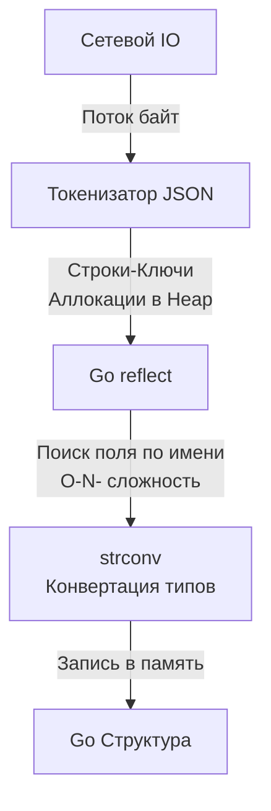
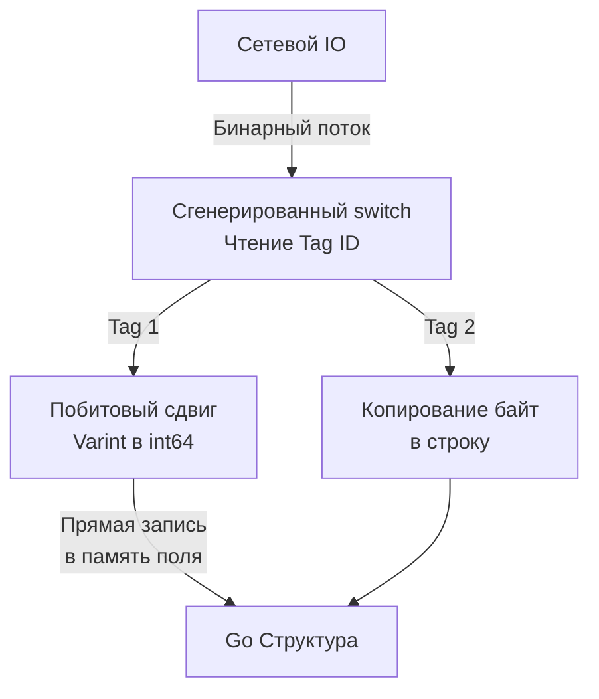

## Битва форматов: Текст против Бинарников

Проектируя сетевой контракт, мы определяем не только семантику (что передаем), но и синтаксис (в каком виде). Компьютеры не общаются абстрактными структурами данных. Любая переменная, срез или мапа в памяти вашей Go-программы должна быть "сплющена" в линейную последовательность байт перед отправкой в сетевой сокет, а затем "надута" обратно на стороне получателя. Этот процесс называется сериализацией и десериализацией.

В современной бэкенд-разработке 99% задач покрываются двумя форматами: вездесущим **JSON** (текстовый) и **Protocol Buffers** (бинарный, далее Protobuf). 

Выбор между ними — это не вопрос вкуса. Это фундаментальный архитектурный компромисс между удобством отладки для человека и эффективностью утилизации CPU и RAM (Memory Bandwidth).

## JSON: Удобство, за которое мы платим производительностью

JSON (JavaScript Object Notation) стал де-факто стандартом благодаря простоте и нативной интеграции с браузерами. Он самоописываемый: каждое сообщение содержит и ключи (имена полей), и значения.

Однако с точки зрения железа и рантайма Go, JSON — это катастрофа производительности.

### Как работает `encoding/json` под капотом

В Go стандартный пакет `encoding/json` полагается на механизм **Reflection** (пакет `reflect`). Поскольку Go — статически типизированный язык, а JSON — динамический формат, рантайму нужно во время выполнения программы (runtime) сопоставить строки из JSON-байтов с полями вашей структуры.

Процесс десериализации (`json.Unmarshal`) выглядит так:
1. **Токенизация:** Парсер идет по массиву байт, ища фигурные скобки, кавычки и запятые, чтобы разбить текст на токены.
2. **Аллокация строк:** Ключи из JSON превращаются в Go-строки.
3. **Рефлексия:** Для каждого ключа `encoding/json` вызывает `reflect.ValueOf(&struct).Elem().FieldByName("key")`, чтобы найти нужное поле в структуре, проверяя его теги `json:"key"`.
4. **Приведение типов:** Строковое представление числа `"123"` парсится в `int` через вызовы пакета `strconv`.

> [!info] Под капотом: Escape Analysis и GC Pressure
> Главная проблема JSON в Go — это чудовищное давление на Garbage Collector (GC). 
> Во-первых, функция `json.Unmarshal(data []byte, v interface{})` принимает `interface{}`. Как только вы передаете указатель на вашу структуру в интерфейс, **Escape Analysis** компилятора гарантированно отправляет эту структуру в кучу (Heap), даже если она живет только в рамках одной функции-обработчика.
> Во-вторых, процесс парсинга создает множество промежуточных объектов: токены, строки ключей, интерфейсы для вложенных объектов. Все это аллоцируется в куче, заставляя GC просыпаться чаще, тратить такты CPU на фазу Mark и увеличивать Tail Latency (задержки на 99-м перцентиле) вашего API.



> [!warning] Ловушка / Gotcha: Потеря точности int64
> В JSON нет типа `int64`, есть только абстрактный `Number`. Если вы десериализуете JSON с большим числом в `map[string]interface{}`, стандартный `encoding/json` по умолчанию распарсит его как `float64` (число с плавающей точкой двойной точности). `float64` не может без потерь хранить целые числа больше $2^{53} - 1$. Если это был ID из базы (например, Snowflake ID), он будет искажен.
> **Решение:** Использовать `json.NewDecoder(r).UseNumber()`. Это заставит парсер сохранять числа как тип `json.Number` (под капотом это строка), которую потом можно безопасно перевести в `int64`.

## Protocol Buffers (Protobuf): Максимальная Mechanical Sympathy

Protobuf — это бинарный формат сериализации от Google. В отличие от JSON, он не является самоописываемым. Он требует **схемы** — `.proto` файла, который описывает структуру контракта.

```protobuf
// пример контракта
syntax = "proto3";

message User {
  int64 id = 1;
  string name = 2;
  bool is_active = 3;
}
```

Ключевая особенность: вместо имен полей (`"id"`, `"name"`) Protobuf использует числовые теги (`1`, `2`, `3`). В полет по сети отправляются только эти числа-теги и сами значения в бинарном виде.

### Под капотом: Кодогенерация вместо Рефлексии

Главная магия Protobuf в Go заключается в **кодогенерации**. Утилита `protoc` вместе с плагином `protoc-gen-go` читает вашу схему и генерирует готовый `.pb.go` файл со структурами и, что самое важное, готовыми методами сериализации и десериализации.

Генерированный код точно знает расположение полей в памяти. Ему не нужен `reflect`. Когда приходит поток байт, парсер Protobuf читает тег поля (например, `1`), и через `switch tag { case 1: ... }` напрямую пишет значение в смещение памяти, соответствующее полю `Id` в структуре.

> [!info] Под капотом: Varint и битовые операции
> Protobuf не отправляет `int64` как сырые 8 байт (если вы явно не укажете `fixed64`). Он использует кодирование **Varint** (алгоритм LEB128). Небольшие числа (например, 1 или 50) будут занимать в сети всего 1 байт, а не 8. 
> Парсинг Varint — это быстрые побитовые операции сдвига (`>>`, `<<`) на уровне CPU. Это работает на порядки быстрее, чем парсинг строки `"12345"` в число через деление и сложение в цикле, как это делает `strconv.Atoi`.



### Преимущества Protobuf перед JSON

1. **Производительность CPU:** Десериализация Protobuf в Go работает в 3-10 раз быстрее `encoding/json` из-за отсутствия рефлексии и парсинга строк.
2. **Память и Аллокации:** Protobuf генерирует в разы меньше аллокаций. Структура известна заранее, размер слайсов часто передается вместе с ними. GC "отдыхает".
3. **Размер Payload:** Бинарный формат с Varint обычно в 2-4 раза меньше текстового JSON. Вы экономите пропускную способность сети.
4. **Строгий контракт:** Контракт задекларирован в `.proto` файле. Клиент на Python и сервер на Go гарантированно понимают типы друг друга. Невозможно прислать `string` вместо `int`.

> [!tip] Собеседование
> **Вопрос:** Если Protobuf настолько хорош, почему мы не используем его везде вместо JSON?
> **Ответ:** Во-первых, отсутствие Human Readability. Бинарный трафик нельзя просто прочитать глазами во вкладке Network браузера (без специальных плагинов) или через `curl`. Во-вторых, экосистема Frontend. JavaScript в браузере работает с JSON нативно (на уровне движков V8 / SpiderMonkey, написанных на C++). Парсинг Protobuf в браузере часто реализуется на чистом JS/WASM, что сводит часть выгоды на нет. Поэтому Protobuf стал стандартом для Server-to-Server общения (через gRPC), а JSON — для общения Server-to-Frontend.

## Оптимизация JSON: Путь джедая

Что делать, если архитектура требует HTTP/JSON (например, для публичного API или фронтенда), но производительность стандартного `encoding/json` уперлась в потолок?

В мире Go применяют паттерн **JSON Code Generation**. Библиотеки вроде `mailru/easyjson` или `ffjson` работают по принципу Protobuf. Вы пишете обычные Go-структуры, а утилита генерирует для них методы `MarshalJSON` и `UnmarshalJSON`. 

Внутри этих методов нет рефлексии! Там находится сгенерированный хардкорный код конечного автомата (State Machine), который побайтово читает входной слайс и собирает структуру. Это дает буст скорости парсинга JSON в 2-4 раза и снижает количество аллокаций почти до нуля, приближая производительность текстового JSON к бинарным протоколам.

В последних версиях Go также популярна библиотека `goccy/go-json` или `json-iterator/go`, которые используют JIT-компиляцию или кэширование рефлексии, позволяя получить ускорение без необходимости запускать кодогенерацию перед каждой сборкой.

## Итог

1. **JSON** — идеален для публичных API и интеграции с фронтендом. Его легко дебажить, но он чудовищно прожорлив до CPU и памяти из-за рефлексии в Go и текстовой природы.
2. **Protobuf** — выбор для высоконагруженных внутренних микросервисов. Кодогенерация, прямая работа с памятью и бинарное сжатие (Varint) обеспечивают максимальную Mechanical Sympathy, разгружая сборщик мусора.
3. Проектируя высоконагруженные JSON API, всегда используйте оптимизированные библиотеки (`easyjson` / `goccy/go-json`) и будьте предельно осторожны с десериализацией чисел в `interface{}`.

Определившись с тем, как данные передаются через сеть и в каком формате, мы переходим к одной из самых сложных проблем эксплуатации — эволюции этих контрактов. Как изменять структуру данных, не ломая старых клиентов? Об этом мы поговорим в следующей статье: [[8. Versioning API]].