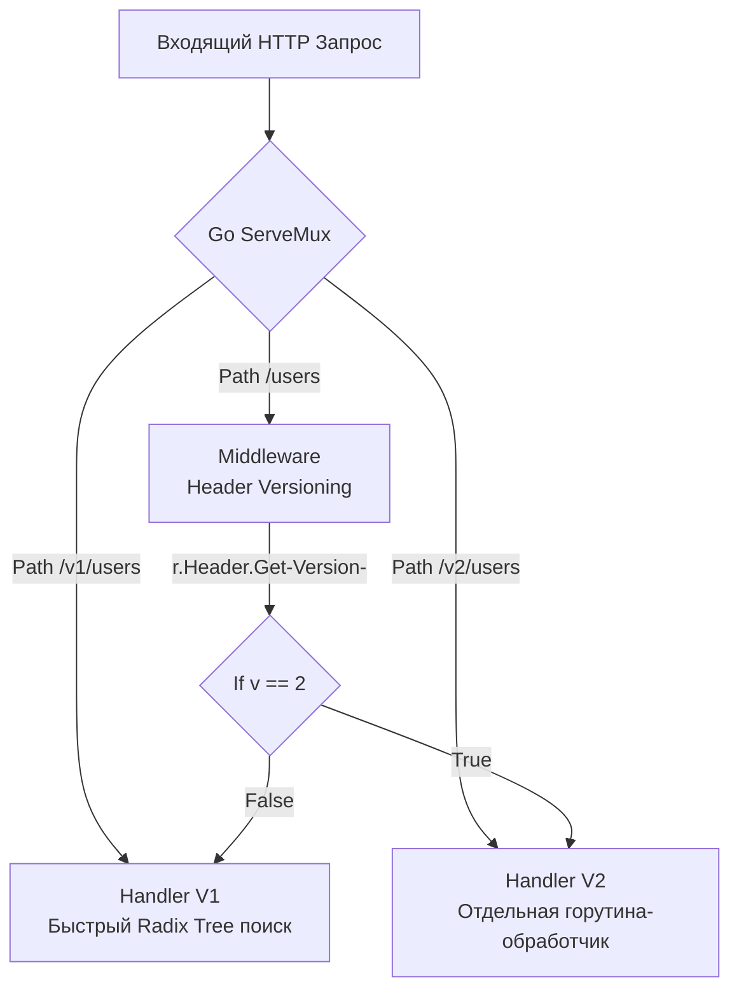

## Неизбежность изменений: Зачем API нужны версии

Мы спроектировали красивый, ресурсный и идемпотентный контракт. Сервис запущен в production, у него появились тысячи клиентов (мобильные приложения, SPA, партнерские микросервисы). А затем бизнес приносит новую задачу: "Нам нужно изменить структуру профиля пользователя". 

В монолите вы бы просто отрефакторили структуру и обновили все вызовы в коде. В распределенной системе вы не контролируете клиентов. Если вы сломаете контракт, мобильные приложения у пользователей, которые не обновлялись год, начнут падать с ошибками десериализации. 

Версионирование — это механизм, позволяющий развивать API, не нарушая работу существующих интеграций. Это страховка от хаоса, но за нее мы платим дублированием кода и усложнением поддержки.

## Когда нужна новая версия? (Breaking Changes)

Фундаментальное правило: **Версия API меняется ТОЛЬКО при нарушении обратной совместимости (Backward Incompatible Changes).**

Добавление нового поля в JSON-ответ, добавление нового эндпоинта или необязательного query-параметра — это *обратно совместимые изменения*. Они не требуют версии `v2`. Старые клиенты просто проигнорируют новые поля (согласно закону Постела). 

Изменение типа поля (с `int` на `string`), удаление обязательного поля, изменение семантики существующих данных — это *ломающие изменения*. Только они триггерят создание новой версии. Детальнее механику ломающих изменений мы разберем в статье [[27. Backward compatibility.md]].

## 4 Стратегии версионирования в HTTP

Существует четыре основных подхода передачи версии от клиента к серверу. У каждого есть архитектурная цена.

### 1. URI Versioning (Версионирование в пути)
Самый популярный, индустриальный стандарт (используется в Stripe, Twilio, Google API).
* **Пример:** `GET /v1/users/123` и `GET /v2/users/123`
* **Плюсы:** Максимально наглядно. Легко тестировать в браузере. Кэширование на уровне CDN/Nginx работает "из коробки" (разные URL — разные ключи кэша).
* **Минусы:** Нарушает академический подход REST ([[3. REST. Основные принципы.md]]), так как `/v1/users` и `/v2/users` технически выглядят как два разных ресурса, хотя это одно и то же представление под разными углами.

### 2. Query Parameter Versioning
* **Пример:** `GET /users/123?version=2`
* **Плюсы:** Сохраняет чистоту базового URL ресурса.
* **Минусы:** Легко забыть передать параметр. Могут возникнуть проблемы с роутингом, так как большинство роутеров базируются на пути, а не на query-параметрах.

### 3. Custom Header Versioning
* **Пример:** `GET /users/123` + Заголовок `X-API-Version: 2`
* **Плюсы:** URL остается чистым и ресурсным.
* **Минусы:** Невозможно скинуть ссылку на API коллеге (нужно использовать curl/Postman). Сильно усложняет жизнь фронтендерам при загрузке статики (тегом `` заголовок не отправишь).

### 4. Media Type / Accept Header (Content Negotiation)
Самый "каноничный" с точки зрения REST подход (используется в GitHub API).
* **Пример:** `GET /users/123` + Заголовок `Accept: application/vnd.mycompany.v2+json`
* **Плюсы:** Версионируется не URL, а конкретное представление (Representation) данных ресурса.
* **Минусы:** Самый сложный в реализации и отладке.

> [!tip] Собеседование
> **Вопрос:** Какой подход версионирования вы выберете для публичного B2B API и почему?
> **Ответ:** URI Versioning (`/v1/`). Несмотря на претензии REST-пуристов, это самый надежный, предсказуемый и легко маршрутизируемый способ. Инфраструктура (API Gateways, WAF, балансировщики) отлично умеет разделять трафик на основе префикса пути. Это позволяет на уровне Nginx направить трафик `/v1/` на кластер legacy-серверов, а `/v2/` — на новые поды в Kubernetes.

## Mechanical Sympathy: Роутинг версий в Go

Если вы выбрали версионирование через заголовки, вам придется обрабатывать это на уровне кода Go. Посмотрим на цену такого решения.

Дерево маршрутов (Radix Tree) в Go 1.22+ `http.ServeMux` построено на анализе URL. Поиск по префиксу пути `GET /v1/users` имеет вычислительную сложность O-K- (где K — длина URL) и не требует аллокаций.

Если вы используете заголовки, роутер сначала должен найти общий обработчик для `/users`, а затем внутри него (или в Middleware) вы будете читать мапу `r.Header.Get("X-API-Version")`. Доступ к мапе заголовков медленнее прямого роутинга, и это связывает логику диспетчеризации HTTP с вашей бизнес-логикой.



## Архитектура кода Go: Как не превратить проект в спагетти

Самая частая ошибка Junior/Middle разработчиков при введении v2 — использование `if/else` внутри существующих обработчиков.

```go
// ПЛОХОЙ ПОДХОД (Антипаттерн)
func GetUserHandler(w http.ResponseWriter, r *http.Request) {
    user := db.GetUser()
    
    // Спагетти-логика версионирования прямо в хендлере
    if r.Header.Get("X-API-Version") == "2" {
        json.NewEncoder(w).Encode(UserV2Response{...})
        return
    }
    
    json.NewEncoder(w).Encode(UserV1Response{...})
}
```
Такой код быстро становится нечитаемым. При добавлении v3 файл превратится в ад.

### Idiomatic Go подход: Изоляция на уровне пакетов (Ports & Adapters)

Для каждой мажорной версии API создается свой собственный изолированный пакет (слой Delivery/Transport).

**Структура директорий (Standard Layout):**
```text
internal/
├── domain/               // Бизнес-логика, не знает про HTTP и версии
│   └── user.go           // Базовая структура User
├── api/
│   ├── v1/
│   │   ├── models.go     // DTO для v1 (например, Age int)
│   │   └── handlers.go   // Преобразует domain.User в v1.UserDTO
│   └── v2/
│       ├── models.go     // DTO для v2 (например, DateOfBirth string)
│       └── handlers.go   // Преобразует domain.User в v2.UserDTO
```

```go
// ПРАВИЛЬНЫЙ ПОДХОД: Изолированные обработчики
// Пакет internal/api/v2

type UserResponse struct {
    ID          string `json:"id"`
    DateOfBirth string `json:"date_of_birth"` // Новое поле в v2
}

func (h *Handler) GetUser(w http.ResponseWriter, r *http.Request) {
    // 1. Получаем единую доменную модель (не версионируется)
    domainUser, err := h.usecase.GetUser(r.Context(), id)
    
    // 2. Мапим доменную модель в DTO конкретной версии (v2)
    response := UserResponse{
        ID:          domainUser.ID,
        DateOfBirth: domainUser.BirthDate.Format(time.RFC3339),
    }
    
    json.NewEncoder(w).Encode(response)
}
```

> [!warning] Ловушка / Gotcha: Дублирование DTO
> Да, при таком подходе вам придется дублировать структуры запросов и ответов (DTO) для `v1` и `v2`, даже если они отличаются на 10%. В Go **явное дублирование DTO лучше, чем неявная связанность**. Если вы попытаетесь переиспользовать одну структуру между версиями, обвешав ее сложными тегами `json:"-"` и костылями, изменение в `v2` неизбежно сломает `v1`. Копирование (Copy-Paste) на уровне транспортных моделей API — это осознанный компромисс ради безопасности контракта.

## gRPC и Protocol Buffers: Версионирование из коробки

В отличие от REST, где версионирование остается на совести разработчика, в gRPC версионирование заложено в саму спецификацию (детальнее в [[16. gRPC. Основы.md]]).

В файле `.proto` версия указывается как часть пакета:
```protobuf
syntax = "proto3";

package mycompany.users.v1; // Версия жестко зашита в схему

message GetUserResponse { ... }
```
Когда вы генерируете Go-код, `protoc` создаст пакет `v1`, который будет жить независимо от `v2`. Вызов gRPC под капотом использует пути в стиле `/mycompany.users.v1.UserService/GetUser`, то есть gRPC на транспортном уровне HTTP/2 использует **URI Versioning**.

## Итог

1. **Меняйте мажорную версию только при ломающих изменениях** (удаление полей, смена типов). Добавление новых полей безопасно.
2. **URI Versioning (`/v1/`)** — самый практичный, инфраструктурно-прозрачный и производительный способ в Go.
3. **Изолируйте версии в коде.** Создавайте отдельные пакеты `v1/` и `v2/` со своими независимыми структурами DTO. Бизнес-логика при этом должна оставаться единой и не знать о транспортных версиях.

Когда клиент делает запрос по правильному контракту нужной версии, мы надеемся на успех. Но в реальности сети нестабильны, базы данных падают, а пользователи присылают невалидные JSON. То, как вы отдаете ошибки наружу, формирует "лицо" вашего API. Правильному конструированию и маппингу ошибок в Go посвящена следующая статья: [[9. Error handling в API.md]].