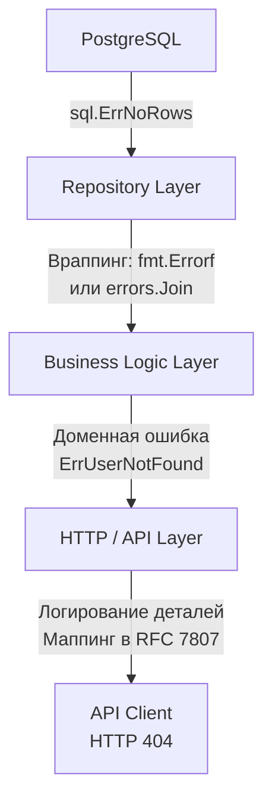

## Анатомия ошибки: От базы данных до JSON-ответа

В предыдущей статье мы разобрали [[6. Статусы HTTP.md]] — числовые коды, которые служат первичным сигналом для клиентов и инфраструктуры. Однако статуса `400 Bad Request` недостаточно, чтобы Frontend-разработчик понял, какое именно поле формы заполнено неверно. Статуса `500 Internal Server Error` недостаточно, чтобы SRE-инженер понял, почему упал запрос. 

Обработка ошибок в API — это искусство балансирования между двумя противоречивыми требованиями:
1. **Для клиента (Security & UX):** Ошибка должна быть понятной, стандартизированной, но при этом **не раскрывать** внутреннее устройство системы (названия таблиц, SQL-запросы, IP-адреса).
2. **Для разработчика (Observability):** Ошибка в логах должна содержать максимальный контекст (Stack Trace, ID запроса, параметры), чтобы баг можно было найти за пару минут.

В этой статье мы разберем, как идеология Go "Errors are values" помогает строить железобетонные, производительные и безопасные API.

## Парадигма Go: Ошибки vs Исключения

Разработчики, приходящие в Go из Java, C# или PHP, часто жалуются на конструкцию `if err != nil`. Они привыкли к Исключениям (Exceptions) и блокам `try/catch`. Почему создатели Go отказались от исключений в пользу явного возврата ошибок?

> [!info] Под капотом: Механика Exceptions (Mechanical Sympathy)
> В языках с исключениями (Java/C#) выброс `throw new Exception()` — это катастрофически дорогая операция для рантайма. 
> 1. **Stack Unwinding (Раскрутка стека):** Рантайм прерывает нормальный поток выполнения (по сути, скрытый `GOTO`) и начинает идти вверх по стеку вызовов, ища ближайший блок `catch`.
> 2. **Аллокации и GC:** При создании исключения рантайм собирает Stack Trace (массив строк с именами файлов и номерами строк). Это вызывает тяжелые аллокации в куче (Heap). Garbage Collector получает дополнительную работу.
> 
> В Go ошибка — это просто интерфейс `error`. Возврат `nil, err` — это возврат двух машинных слов (указателей) в регистрах CPU. Это работает на порядки быстрее. Ошибка в Go — это не экстренная ситуация, это ожидаемое состояние программы (State). Вы явно программируете ветвление (Control Flow) без скрытой магии.

## RFC 7807: Стандарт контракта ошибки

Исторически каждый проектировал JSON-ответ с ошибкой как хотел:
* `{"error": "message"}`
* `{"success": false, "data": null, "message": "error"}`

Чтобы прекратить этот зоопарк, был принят стандарт **RFC 7807 (Problem Details for HTTP APIs)**. Идиоматичный Go-бэкенд должен возвращать ошибки именно в этом формате (часто с типом `application/problem+json`).

```json
{
  "type": "[https://api.mycompany.com/errors/insufficient-funds](https://api.mycompany.com/errors/insufficient-funds)",
  "title": "Недостаточно средств на балансе",
  "status": 422,
  "detail": "Ваш текущий баланс 30 монет, а операция требует 50.",
  "instance": "/users/123/transactions/xyz",
  "extensions": {
    "current_balance": 30,
    "required_balance": 50
  }
}
```

* `type`: URI, идентифицирующий тип ошибки. Позволяет клиенту писать `if (err.type === '...')` вместо парсинга текста.
* `title`: Человекочитаемое краткое описание.
* `status`: Дублирует HTTP статус (полезно, если балансировщик срезал заголовки).
* `detail`: Подробное описание конкретно этого случая.
* `instance`: URI конкретного ресурса/запроса, где произошла ошибка.

## Архитектура: Слоистая обработка ошибок

Проблема монолитных хендлеров в том, что техническая ошибка базы данных "протекает" на уровень HTTP. 



### 1. Слой репозитория (Враппинг)
Когда SQL-драйвер возвращает `sql.ErrNoRows`, бизнес-логика не должна знать о SQL. Мы оборачиваем ошибку.
До Go 1.13 мы использовали сторонние пакеты. Сейчас стандарт:
`err = fmt.Errorf("user repository - get by id: %w", err)`
Глагол `%w` создает "матрешку" (Error Wrapping), сохраняя исходную ошибку внутри, чтобы мы могли проверить ее позже.

### 2. Слой бизнес-логики (Доменные ошибки)
Здесь мы используем **Sentinel Errors** (сигнальные ошибки) или кастомные типы.
```go
var ErrInsufficientFunds = errors.New("domain: insufficient funds")
var ErrUserNotFound = errors.New("domain: user not found")
```

### 3. Слой API (Маппинг)
В обработчике (`http.Handler`) мы извлекаем доменную ошибку и конвертируем её в HTTP-статус и JSON.

> [!tip] Собеседование
> **Вопрос:** В чем разница между `errors.Is` и `errors.As` в Go?
> **Ответ:** > * `errors.Is(err, target)` проверяет, совпадает ли ошибка (или любая ошибка внутри "матрешки" враппинга) с конкретным значением (значением Sentinel-ошибки).
> * `errors.As(err, &target)` проверяет, имеет ли ошибка (или кто-то в цепочке враппинга) определенный **ТИП** (кастомная структура `struct` с интерфейсом `error`), и если да — извлекает её значения в переменную `target`.

## Идиоматичный паттерн: Кастомная ошибка приложения (AppError)

Чтобы не писать километровые `switch` в каждом HTTP-хендлере, в Go проектах уровня Middle+/Senior создают единый тип ошибки, который содержит HTTP-контекст.

```go
package apperrors

import "fmt"

// AppError реализует интерфейс error
type AppError struct {
	Err        error  // Исходная техническая ошибка (для логов)
	HTTPStatus int    // Статус, который уйдет клиенту (напр. 404)
	Code       string // Машинно-читаемый код для клиента (напр. "user_not_found")
	Message    string // Сообщение для клиента
}

func (e *AppError) Error() string {
	// Возвращаем внутреннюю ошибку для логов, если она есть
	if e.Err != nil {
		return fmt.Sprintf("%s: %v", e.Message, e.Err)
	}
	return e.Message
}

// Позволяет работать функциям errors.Is и errors.As
func (e *AppError) Unwrap() error {
	return e.Err
}

// Вспомогательная функция (Конструктор)
func NewNotFound(code, message string, err error) *AppError {
	return &AppError{
		Err:        err,
		HTTPStatus: 404, // http.StatusNotFound
		Code:       code,
		Message:    message,
	}
}
```

Теперь в нашем централизованном Middleware или базовом обработчике мы делаем один `errors.As`:

```go
func HandleError(w http.ResponseWriter, r *http.Request, err error) {
	var appErr *apperrors.AppError
	
	// Если это наша доменная ошибка, мы знаем, как её отдать клиенту
	if errors.As(err, &appErr) {
		// 1. Логируем ВНУТРЕННЮЮ техническую ошибку (appErr.Err) со стектрейсом
		log.Printf("[ERROR] req_id=%s: %v", r.Context().Value("req_id"), appErr)
		
		// 2. Отдаем клиенту БЕЗОПАСНЫЙ JSON (без деталей БД)
		sendJSON(w, appErr.HTTPStatus, ProblemDetails{
			Type:   "/errors/" + appErr.Code,
			Title:  appErr.Message,
			Status: appErr.HTTPStatus,
		})
		return
	}

	// Фолбэк: если ошибка неизвестна (паника, баг) - это 500 Internal Server Error
	log.Printf("[CRITICAL] unknown error: %v", err)
	sendJSON(w, 500, ProblemDetails{
		Type:   "/errors/internal",
		Title:  "Внутренняя ошибка сервера",
		Status: 500,
	})
}
```

## Паники (Panics) в HTTP API

Что произойдет, если в вашей горутине-обработчике случится деление на ноль или разыменование `nil` указателя? Произойдет `panic`. По умолчанию паника убивает весь процесс (крашит бинарник).

Но стандартный `net/http` сервер спроектирован с защитой от "дурака". Под капотом, для каждой горутины, обрабатывающей соединение, рантайм Go устанавливает отложенный вызов `defer func() { recover() }()`. Если хендлер паникует, сервер перехватит панику, запишет stack trace в `os.Stderr`, закроет TCP-соединение с клиентом и продолжит обслуживать другие запросы.

> [!warning] Ловушка / Gotcha: Паника в фоновых горутинах
> Встроенный `recover` в `net/http` работает ТОЛЬКО для той горутины, которая обрабатывает HTTP-запрос. Если вы внутри хендлера запустите свою фоновую задачу:
> `go func() { doSomeHeavyWork() }()`
> И в этой новой горутине произойдет паника — весь ваш бэкенд мгновенно рухнет (Downtime). 
> **Правило:** Никогда не запускайте "голые" горутины. Всегда оборачивайте фоновую работу в функции, которые содержат свой собственный `defer recover()`, либо используйте паттерны Worker Pool (напр. пакет `errgroup`).

## Самая коварная ошибка на собеседованиях: Nil Interface Trap

Это классический вопрос на проверку того, насколько глубоко вы понимаете устройство рантайма Go.

```go
type CustomError struct {
	Msg string
}

func (e *CustomError) Error() string { return e.Msg }

func doSomething() error {
	var err *CustomError = nil // Явно nil
	
	// Ветвление не сработало, ошибки нет
	
	// Возвращаем nil? Спойлер: НЕТ!
	return err 
}

func main() {
	err := doSomething()
	if err != nil {
		fmt.Println("Произошла ошибка!") // Этот код выполнится!
	}
}
```

> [!info] Под капотом: Интерфейсы в памяти
> Почему `err != nil` возвращает `true`, если мы вернули `nil`?
> Тип `error` — это интерфейс. В памяти (согласно исходникам рантайма `runtime/iface.go`) любой интерфейс состоит из двух поинтеров:
> 1. `itab` (указатель на информацию о типе, реализующем интерфейс).
> 2. `data` (указатель на сами данные, саму структуру).
> 
> Интерфейс считается `nil` **ТОЛЬКО** тогда, когда ОБА указателя равны `nil`.
> В примере выше мы вернули `*CustomError(nil)`. Рантайм создал интерфейс:
> `itab` = `*CustomError` (тип не nil!)
> `data` = `nil`
> Так как `itab` заполнен, `err != nil` становится `true`.
> 
> **Решение:** Всегда явно возвращайте `nil` в функции: `return nil`. Не возвращайте типизированные nil-переменные.

## Итог

1. **Не транслируйте ошибки напрямую:** То, что видит разработчик в логах (SQL-запросы, трейсы), должно быть скрыто от API-клиента из соображений безопасности.
2. **RFC 7807:** Используйте стандартизированный формат JSON для возврата ошибок, чтобы облегчить жизнь Frontend-клиентам.
3. **AppError Pattern:** Создавайте кастомные структуры ошибок, которые мапят бизнес-ошибки на HTTP-статусы.
4. **Враппинг:** Используйте `%w` или `errors.Join` для сохранения контекста ошибки по мере её подъема с уровня БД до уровня HTTP-хендлера.

Научившись правильно обрабатывать негативные сценарии, мы можем вернуться к управлению данными. Как эффективно отдавать клиенту миллионы записей из базы данных, не убивая память сервера на Go и не замедляя ответ? Ответ на этот вопрос лежит в плоскости архитектурных паттернов выборки, которые мы разберем в следующей статье: [[10. Pagination, filtering, sorting.md]].