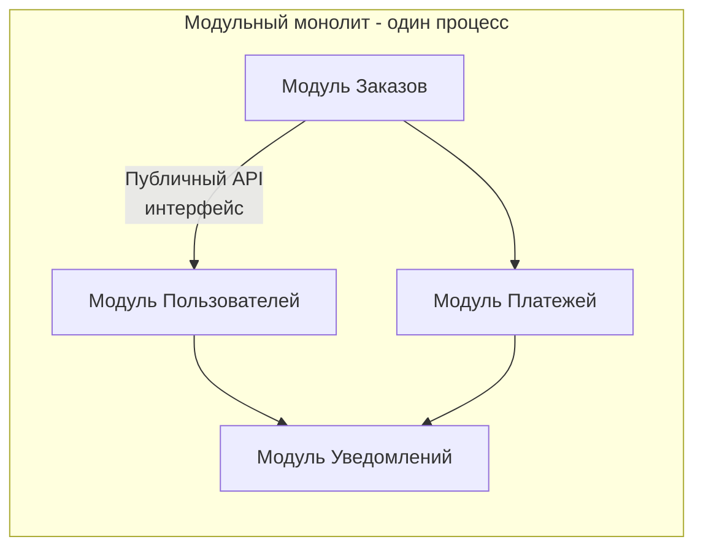

После анализа двух полярных подходов — монолита и микросервисов — возникает закономерный вопрос: существует ли промежуточный вариант, сочетающий простоту разработки и деплоя монолита с дисциплиной и модульностью, необходимой для будущего роста? Ответ — **модульный монолит**. В этой статье мы детально разберём, что это за архитектурный стиль, как реализовать его в Go и почему для многих проектов он является оптимальным выбором на годы вперёд.

### Что такое модульный монолит

**Модульный монолит** — это единое развёртываемое приложение (один процесс, один бинарный файл), внутренняя структура которого строго разделена на слабосвязанные, высокосвязные модули с явными границами. Каждый модуль инкапсулирует определённый бизнес-контекст (аналог Bounded Context из [[12. Domain Driven Design. Bounded Context и Aggregate]]) и взаимодействует с другими модулями исключительно через публичные API (интерфейсы), а не через прямой доступ к внутренним структурам данных или таблицам базы данных.

Ключевое отличие от «просто монолита» — **принудительное соблюдение границ**. В классическом монолите легко «срезать угол» и импортировать внутренний пакет соседнего модуля. В модульном монолите такие связи запрещены архитектурными правилами и проверяются линтерами.



### Построение модульного монолита в Go

Go предоставляет отличные примитивы для реализации модульного монолита без тяжёлых фреймворков.

#### 1. Организация пакетов и `internal`

Используйте директиву `internal` для сокрытия деталей реализации модуля. Всё, что находится в `internal/`, не может быть импортировано извне этого поддерева. Это создаёт жёсткую границу на уровне компилятора.

```
project/
├── cmd/
│   └── app/
│       └── main.go           # точка сборки всех модулей
├── internal/
│   ├── order/                # модуль заказов
│   │   ├── handler.go        # HTTP handlers (публичные только для main)
│   │   ├── service.go        # бизнес-логика
│   │   ├── repository.go     # доступ к данным
│   │   └── model.go
│   ├── user/                 # модуль пользователей
│   │   ├── handler.go
│   │   ├── service.go
│   │   ├── repository.go
│   │   └── model.go
│   └── payment/              # модуль платежей
│       └── ...
├── pkg/                      # общий код, доступный для импорта всеми
│   ├── events/               # внутрипроцессная событийная шина
│   ├── logger/
│   └── db/
└── go.mod
```

#### 2. Явные интерфейсы и Dependency Injection

Каждый модуль **определяет интерфейсы для своих зависимостей** внутри собственного пакета, а не импортирует конкретные реализации других модулей. Это ключевой принцип инверсии зависимостей.

```go
// internal/order/service.go
package order

// UserService - интерфейс, нужный модулю заказов.
// Он определён в пакете order, а не в user!
type UserService interface {
    GetUserForOrder(ctx context.Context, userID string) (*UserInfo, error)
}

type Service struct {
    userSvc UserService
    repo    Repository
    payment PaymentService
}

func NewService(userSvc UserService, repo Repository, payment PaymentService) *Service {
    return &Service{
        userSvc: userSvc,
        repo:    repo,
        payment: payment,
    }
}
```

Модуль `user` реализует этот интерфейс, но `order` ничего не знает о существовании пакета `internal/user`. Сборка зависимостей происходит в `main.go`:

```go
// cmd/app/main.go
func main() {
    db := connectDB()
    
    userRepo := user.NewRepository(db)
    userSvc := user.NewService(userRepo)
    
    orderRepo := order.NewRepository(db)
    // userSvc удовлетворяет интерфейсу order.UserService
    orderSvc := order.NewService(userSvc, orderRepo, paymentSvc)
    
    // запуск HTTP сервера с хендлерами из разных модулей
}
```

#### 3. Внутрипроцессная коммуникация через события

Для асинхронного взаимодействия между модулями без создания прямых зависимостей используйте событийную шину. В Go это легко реализовать с помощью каналов или простой синхронной/асинхронной диспетчеризации.

```go
// pkg/events/bus.go
type Event interface {
    Name() string
}

type Bus struct {
    mu     sync.RWMutex
    subs   map[string][]chan Event
}

func (b *Bus) Subscribe(eventName string, ch chan Event) {
    b.mu.Lock()
    defer b.mu.Unlock()
    b.subs[eventName] = append(b.subs[eventName], ch)
}

func (b *Bus) Publish(ctx context.Context, event Event) {
    b.mu.RLock()
    defer b.mu.RUnlock()
    for _, ch := range b.subs[event.Name()] {
        select {
        case ch <- event:
        case <-ctx.Done():
            return
        default:
            // не блокируемся, если подписчик медленный
        }
    }
}
```

Теперь модуль `order` может публиковать событие `OrderCreated`, а модуль `notification` подписываться на него, не зная друг о друге:

```go
// internal/order/service.go
func (s *Service) Create(ctx context.Context, req CreateRequest) error {
    // ...
    s.eventBus.Publish(ctx, &OrderCreatedEvent{OrderID: order.ID})
    return nil
}

// internal/notification/service.go
func (s *Service) Start(ctx context.Context) {
    ch := make(chan events.Event, 100)
    s.eventBus.Subscribe("OrderCreated", ch)
    go func() {
        for {
            select {
            case ev := <-ch:
                s.sendEmail(ev.(*OrderCreatedEvent))
            case <-ctx.Done():
                return
            }
        }
    }()
}
```

#### 4. Единая база данных, разделённая на схемы или префиксы таблиц

Модульный монолит обычно использует одну физическую базу данных. Чтобы сохранить инкапсуляцию, применяйте:

- **Отдельные схемы PostgreSQL**: `orders.orders`, `users.users`. Каждый модуль подключается к своей схеме и не имеет доступа к чужим таблицам на уровне прав пользователя БД.
- **Префиксы таблиц**: `order_*`, `user_*` — менее строго, но проще в настройке.

> [!warning] Ловушка / Gotcha
> Прямые JOIN между таблицами разных модулей нарушают границы. Если вам кажется, что такой JOIN необходим, возможно, вы неправильно провели границы модулей. Вместо JOIN используйте вызов API другого модуля или денормализацию данных через события.

### Преимущества модульного монолита

#### Простота деплоя и эксплуатации
Один бинарный файл, один процесс, один набор конфигураций. Это снижает операционные расходы и позволяет стартапам и небольшим командам быстро двигаться.

#### Низкая задержка и высокая производительность
Все вызовы между модулями — это вызовы функций в пределах одного адресного пространства. Нет сетевых задержек, сериализации и десериализации. Транзакции ACID работают «из коробки» без сложных Saga.

#### Сильная консистентность данных
Можно использовать обычные транзакции базы данных, охватывающие несколько таблиц, если они находятся в рамках одной схемы и модуля. При необходимости, с помощью событий, реализуется eventual consistency.

#### Эволюционность и готовность к разделению
Чёткие границы и использование интерфейсов позволяют в будущем **вычленить** любой модуль в отдельный микросервис с минимальными изменениями. Достаточно заменить локальную реализацию интерфейса на gRPC-клиент.

```go
// Было: локальный вызов
userSvc := user.NewService(userRepo)

// Стало: gRPC клиент, реализующий тот же интерфейс order.UserService
userSvc := userclient.NewGRPCClient(conn)
```

> [!tip] Собеседование
> **Вопрос:** Как бы вы подошли к постепенному переходу от модульного монолита к микросервисам?
> **Ответ:** Я бы использовал паттерн Strangler Fig. Сначала выделил модуль, который:
> 1) наиболее независим по данным,
> 2) требует частых деплоев или отдельного масштабирования.
> Создал бы для него отдельный сервис, реализовал взаимодействие с монолитом через API. В монолите заменил бы локальную реализацию на клиент к новому сервису, сохранив тот же интерфейс. Постепенно перевёл бы и другие модули.

### Ограничения модульного монолита

#### Масштабирование только вместе
Если одному модулю требуется больше ресурсов, масштабируется весь монолит (горизонтально или вертикально). Это может быть неэффективно с точки зрения затрат, но для большинства проектов до достижения действительно высоких нагрузок это не является проблемой.

#### Единая кодовая база для большой команды
При росте команды свыше 20-30 разработчиков координация изменений в одном репозитории может замедлиться. Однако правильная модульность и ownership (CODEOWNERS) частично решают эту проблему.

#### Отсутствие технологической свободы
Нельзя написать один модуль на Python, а другой на Go. Но, как правило, это и не требуется, если Go удовлетворяет все потребности.

### Сравнение архитектурных стилей

| Характеристика | Монолит (бесструктурный) | Модульный монолит | Микросервисы |
|----------------|--------------------------|-------------------|--------------|
| **Связанность** | Высокая, трудно контролировать | Низкая, enforced границы | Очень низкая, физическое разделение |
| **Задержка вызовов** | Наносекунды | Наносекунды | Миллисекунды |
| **Транзакции** | ACID глобально | ACID внутри модуля | Распределённые (Saga) |
| **Деплой** | Один артефакт | Один артефакт | Много независимых |
| **Масштабирование** | Только вместе | Только вместе | Независимое |
| **Сложность эксплуатации** | Низкая | Низкая | Высокая |
| **Скорость разработки (малая команда)** | Высокая, но падает со временем | Стабильно высокая | Низкая (инфраструктура) |
| **Готовность к росту** | Плохая | Отличная (легко разделить) | Изначально высокая |

### Когда выбирать модульный монолит

- **Стартапы и новые проекты** — когда требования ещё не устоялись, а скорость итераций критична.
- **Небольшие и средние команды** (до 20-30 разработчиков).
- **Сложная предметная область** — модульный монолит позволяет разобраться в домене, выделить Bounded Contexts, и только потом принимать решение о разделении.
- **Высокие требования к консистентности данных** — где распределённые транзакции слишком дороги или сложны.

> [!info] Под капотом
> С точки зрения рантайма Go, модульный монолит максимально эффективен: одна куча, один GC, общий пул горутин. Нет накладных расходов на сериализацию и сетевые вызовы между «сервисами». Планировщик Go эффективно распределяет нагрузку всех модулей по ядрам CPU. Это позволяет достичь впечатляющей производительности на скромном железе.

### Итог

Модульный монолит — это не просто компромисс, а часто **оптимальная архитектурная стратегия** на первые несколько лет жизни проекта. Он даёт дисциплину и готовность к будущему масштабированию без немедленной платы операционной сложностью микросервисов. Go, с его системой пакетов, `internal`, интерфейсами и быстрой компиляцией, является идеальным языком для реализации такого подхода.

Мы рассмотрели основные архитектурные стили: монолит, микросервисы и модульный монолит. Но эволюция архитектурных идей на этом не заканчивается. Исторически между монолитом и микросервисами существовала Service Oriented Architecture (SOA), которая во многом предвосхитила современные подходы. В следующей статье мы разберём: [[11. Service Oriented Architecture и эволюция архитектур]].