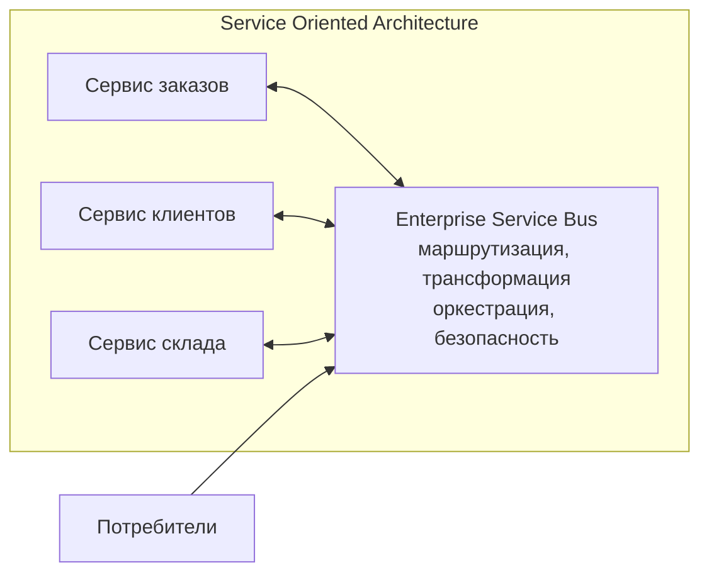
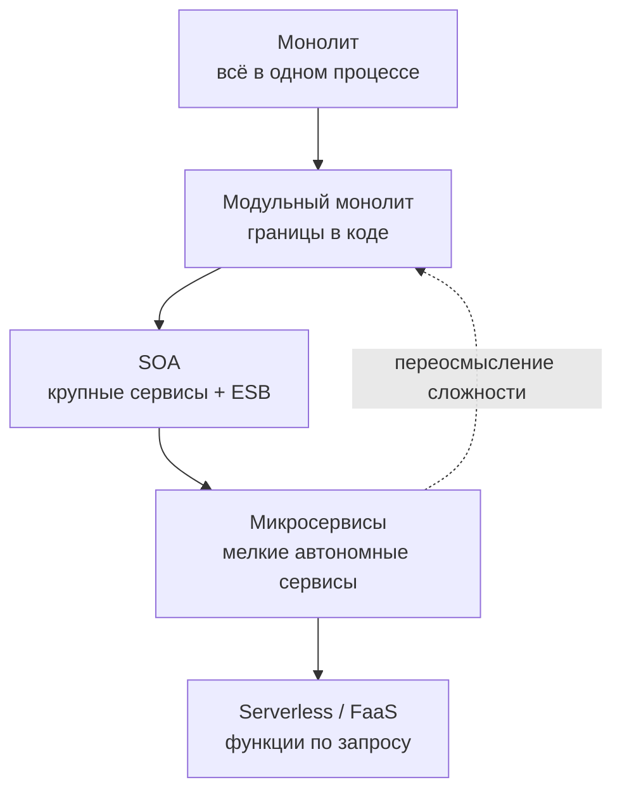

Прежде чем микросервисы стали мейнстримом, индустрия прошла через этап **Service Oriented Architecture (SOA)**. Понимание SOA важно не только для исторического контекста, но и для осознания того, какие проблемы решали микросервисы, а какие — унаследовали. В этой статье мы проследим эволюцию архитектурных стилей от монолитов к SOA и далее к микросервисам и модульным монолитам, выделяя ключевые уроки для Go-разработчика.

### Что такое SOA

**Service Oriented Architecture** — архитектурный стиль, популяризированный в начале 2000-х, который предполагает построение систем из слабосвязанных, повторно используемых сервисов, взаимодействующих через стандартизированные протоколы (чаще всего SOAP/WSDL и XML). SOA возникла как ответ на хаос корпоративных систем, где десятки приложений дублировали логику и данные, не имея единого способа интеграции.

Ключевые принципы SOA:
- **Сервис-ориентированность**: бизнес-функции предоставляются как сервисы с чёткими контрактами.
- **Слабая связанность**: сервисы не зависят от внутренней реализации друг друга.
- **Повторное использование**: сервисы проектируются так, чтобы их могли использовать многие потребители.
- **Стандартизированный протокол**: SOAP, WSDL, UDDI, XML Schema.
- **Enterprise Service Bus (ESB)** — центральная шина, через которую проходят все взаимодействия.



### Enterprise Service Bus: сердце и ахиллесова пята SOA

ESB задумывался как «клей», соединяющий разнородные системы. Он должен был:
- Маршрутизировать сообщения между сервисами.
- Трансформировать форматы данных (XML ↔ JSON, разные версии схем).
- Обеспечивать оркестрацию бизнес-процессов (BPEL).
- Управлять безопасностью, транзакциями, мониторингом.

На практике ESB часто становился монолитным, сложным в настройке и узким местом производительности. Вся логика интеграции концентрировалась в одной точке, что противоречило идее децентрализации. Изменение схемы одного сервиса требовало перенастройки ESB. В результате SOA-проекты страдали от высокой стоимости и длительных циклов внедрения.

> [!info] Под капотом
> ESB обычно реализовывался на Java (Apache Camel, Mule ESB, IBM WebSphere). Пересылка сообщений через XML/SOAP требовала многократной сериализации и парсинга, создавая огромные накладные расходы по CPU и памяти. В Go-мире аналогов тяжеловесных ESB нет — сообщество предпочитает легковесные протоколы (gRPC, NATS, Kafka) и «умные конечные точки, глупые каналы».

### SOA vs Микросервисы: в чём разница

Микросервисы часто называют «SOA, сделанной правильно». Ключевые отличия:

| Аспект | SOA | Микросервисы |
|--------|-----|--------------|
| **Размер сервиса** | Крупные, охватывающие целые бизнес-домены | Мелкие, один Bounded Context |
| **Протокол** | SOAP/XML, WSDL | REST/JSON, gRPC/Protobuf, сообщения |
| **Интеграционная шина** | Тяжёлый ESB | Легковесный message bus или прямые вызовы |
| **Данные** | Общая корпоративная модель данных (Canonical Data Model) | Каждый сервис владеет своей БД |
| **Развёртывание** | Часто монолитное или на дорогих Application Server'ах | Независимое, контейнеры, оркестрация |
| **Управление** | Централизованное (UDDI-реестр) | Децентрализованное (Service Discovery) |
| **Философия** | Повторное использование любой ценой | Автономность и независимость команд |

Мартин Фаулер сформулировал принцип микросервисов как **«умные конечные точки и глупые каналы»**, в противоположность SOA, где ESB был «умным каналом», а сервисы — «глупыми».

### Эволюция архитектур: от монолита к микросервисам и обратно

Эволюцию архитектурных стилей можно представить как маятник, качающийся между централизацией и децентрализацией.



1. **Монолит** — естественная отправная точка. Простота, но со временем становится неуправляемым.
2. **SOA** — попытка внедрить структуру и повторное использование в крупных enterprise-системах. Избыточная сложность и стоимость.
3. **Микросервисы** — реакция на недостатки SOA и рост облачных технологий. Акцент на автономность и скорость разработки.
4. **Модульный монолит** — реакция на операционную сложность микросервисов. Возврат к единому деплою с сохранением дисциплины границ.
5. **Serverless / FaaS** — ещё более гранулярное разделение, где единица развёртывания — функция.

### Уроки SOA для современного Go-разработчика

Несмотря на то, что SOA в классическом виде редко встречается в новых проектах, её идеи и ошибки дают ценные уроки.

#### 1. Опасность «канонической модели данных»

SOA продвигала идею единой схемы данных для всего предприятия. Это приводило к тому, что изменение в одном сервисе требовало изменения общей схемы и всех её потребителей. В микросервисах и модульных монолитах мы придерживаемся принципа **«каждый сервис/модуль владеет своей моделью данных»**. В Go это выражается в том, что структуры, используемые внутри пакета, не экспортируются, а для внешнего взаимодействия используются DTO.

```go
// internal/order/model.go - внутренняя модель
type Order struct {
    ID     string
    userID string // приватное поле, не экспортируется
    items  []Item
}

// pkg/orderapi/dto.go - публичный контракт
type OrderResponse struct {
    ID    string   `json:"id"`
    Items []Item   `json:"items"`
}
```

#### 2. Избегайте «умного канала»

ESB брал на себя слишком много: маршрутизацию, трансформацию, оркестрацию, безопасность. Это делало систему хрупкой и непрозрачной. Современный подход — **«умные конечные точки, глупые каналы»**. В Go это означает:
- Логика остаётся в сервисе, а не в инфраструктуре.
- Для асинхронного взаимодействия использовать простые брокеры (NATS, Kafka) без сложной маршрутизации.
- Для синхронного — прямые gRPC/HTTP вызовы с явными клиентами.

#### 3. Контракты важнее протоколов

SOA делала ставку на SOAP и WSDL как стандарт. Микросервисы показали, что важнее сам контракт, а не конкретный протокол. Сегодня мы используем OpenAPI/Swagger для REST и Protobuf для gRPC. В Go экосистеме генерация кода из контрактов (`protoc`, `oapi-codegen`) стала стандартом, позволяя менять транспорт без изменения бизнес-логики.

#### 4. Осторожность с повторным использованием

Одной из целей SOA было максимальное повторное использование сервисов. На практике это приводило к созданию «общих» сервисов, которые становились узким местом и тормозили развитие, потому что изменение в таком сервисе затрагивало десятки потребителей. Микросервисы пропагандируют принцип **«повторное использование через копирование или разделяемые библиотеки, а не через общие сервисы»**. В Go можно вынести общий код в отдельный модуль (`pkg/`) и импортировать его, но сервисы должны оставаться автономными.

### Mechanical Sympathy: SOA с точки зрения Go

Если бы SOA реализовывалась сегодня на Go, многие её проблемы были бы смягчены:
- **Легковесные сервисы** вместо тяжеловесных Java-приложений на Application Server'ах. Статическая компиляция Go позволяет разворачивать сервисы как простые бинарники.
- **Низкое потребление памяти** снижает стоимость инфраструктуры.
- **Горутины и netpoller** позволяют обрабатывать тысячи соединений к ESB или напрямую к другим сервисам без блокировок потоков ОС.
- **Контексты и таймауты** делают управление временем жизни запросов явным, что критично для распределённых систем.

Однако ключевая проблема SOA — **централизованный ESB** — остаётся проблемой независимо от языка. Поэтому современные Go-архитектуры избегают единой шины в пользу децентрализованных паттернов.

### Эволюция интеграции: от ESB к Service Mesh

Интересно, что идея централизованного управления трафиком вернулась в виде **Service Mesh** (Istio, Linkerd). Но есть принципиальное отличие:
- **ESB** работал на уровне приложения и часто содержал бизнес-логику.
- **Service Mesh** работает на уровне инфраструктуры (sidecar-прокси) и решает только операционные задачи: retry, circuit breaking, observability, mTLS. Бизнес-логика остаётся в сервисе.

В Go-мире популярность gRPC и встроенные возможности балансировки и ретраев в `grpc-go` снижают необходимость в Service Mesh для многих проектов.

> [!tip] Собеседование
> **Вопрос:** В чём принципиальное отличие SOA от микросервисной архитектуры, и почему SOA часто считают неудачной попыткой?
> **Ответ:**
> 1. **Размер и границы**: SOA оперировала крупными сервисами, часто соответствующими целым отделам; микросервисы дробят систему на Bounded Contexts.
> 2. **Интеграция**: SOA полагалась на тяжёлый ESB с бизнес-логикой; микросервисы используют «глупые» каналы и умные конечные точки.
> 3. **Данные**: SOA стремилась к единой корпоративной модели данных; микросервисы признают, что единая модель невозможна, и разрешают каждому сервису свою БД.
> 4. **Организационное влияние**: SOA часто внедрялась сверху, без изменения командной структуры; микросервисы тесно связаны с автономными командами (Закон Конвея).
> SOA не была полностью провальной — она заложила основы сервис-ориентированного мышления, но её реализация страдала от избыточной централизации и сложности, которые микросервисы попытались преодолеть.

### Итог

Понимание SOA и эволюции архитектур даёт контекст для современных решений. Многие «лучшие практики» микросервисов (чёткие контракты, слабая связанность) родились в недрах SOA, а их антипаттерны (распределённый монолит, общая БД) — это ошибки, повторяющие ошибки прошлого. Как Go-разработчик, вы можете использовать уроки истории, чтобы не изобретать заново тяжёлые ESB и не попадать в ловушку канонических моделей данных.

Теперь, вооружённые пониманием архитектурных стилей, мы переходим к методологии, которая помогает правильно определить границы сервисов и модулей — **Domain-Driven Design**. В следующей статье мы разберём ключевые концепты DDD: [[12. Domain Driven Design. Bounded Context и Aggregate]].