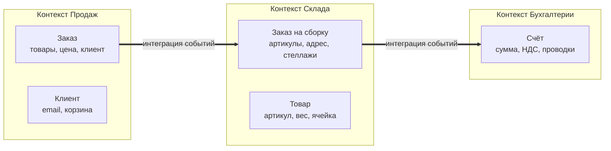

После обсуждения архитектурных стилей мы подошли к вопросу: как правильно разделить систему на модули или сервисы? Раньше мы говорили о модульном монолите и микросервисах, но не отвечали на главное: **где провести границы**. Неверные границы приводят к распределённому монолиту или наносервисам — проблемам, которые сводят на нет преимущества выбранной архитектуры. Domain-Driven Design (DDD) предоставляет набор стратегических паттернов для решения именно этой задачи.

В этой статье мы сосредоточимся на двух ключевых концепциях DDD: **Bounded Context** и **Aggregate**. Мы рассмотрим их через призму Go-разработчика: как они влияют на структуру пакетов, проектирование структур данных и транзакционные границы.

### DDD как ответ на сложность предметной области

Domain-Driven Design (предметно-ориентированное проектирование) — это подход к разработке сложного ПО, ставящий во главу угла **предметную область (домен)** и её модель. Вместо того чтобы думать о таблицах базы данных или HTTP-эндпоинтах, DDD предлагает строить **единую модель домена**, отражающую бизнес-реальность, и выражать её в коде на **едином языке (Ubiquitous Language)**.

Для Go-разработчика DDD не означает использования тяжёлых фреймворков. Напротив, идиоматический Go с его акцентом на явные структуры, интерфейсы и композицию идеально подходит для реализации тактических паттернов DDD.

### Bounded Context: лингвистические и функциональные границы

**Bounded Context (Ограниченный контекст)** — это явная граница, внутри которой определённая модель домена имеет чёткое, непротиворечивое значение. Ключевое слово — **язык**. Одно и то же слово может означать разное в разных контекстах, и попытка создать единую модель для всего предприятия ведёт к хаосу.

**Пример:** В интернет-магазине термин **«Заказ»**:
- В контексте **Продажи** (Sales) — это коммерческая сделка: список товаров, итоговая цена, статус оплаты.
- В контексте **Склада** (Fulfillment) — это инструкция по сборке: список артикулов, адрес доставки, вес упаковки.
- В контексте **Бухгалтерии** (Accounting) — это финансовый документ: проводки, НДС, счёт-фактура.

Попытка создать одну структуру `Order`, которая удовлетворит все три отдела, приведёт к огромной, противоречивой сущности. DDD предписывает признать, что это **разные модели**, и явно разделить их на Bounded Contexts.



#### Bounded Context и Go-пакеты

В Go естественной реализацией Bounded Context является **пакет (package) или группа пакетов**, часто с использованием `internal/` для сокрытия деталей. Каждый контекст получает своё собственное пространство имён, в котором термины определены однозначно.

```
ecommerce/
├── sales/
│   ├── order.go          // type Order struct { Items []Item; Total Price }
│   └── customer.go
├── fulfillment/
│   ├── order.go          // type Order struct { SKUs []string; Address string }
│   └── inventory.go
├── accounting/
│   ├── invoice.go        // type Invoice struct { OrderID string; NetAmount Money }
│   └── ledger.go
└── shared/
    └── money.go          // type Money struct { Amount int64; Currency string }
```

Обратите внимание: имя типа `Order` повторяется, но находится в разных пакетах, поэтому конфликта нет. Импортируя пакет, вы явно указываете контекст: `sales.Order` vs `fulfillment.Order`.

> [!warning] Ловушка / Gotcha
> **Совместное использование моделей между контекстами** — антипаттерн. Не пытайтесь создать `shared.Order` и использовать её везде. Вы либо столкнётесь с постоянными конфликтами полей, либо создадите «божественный объект», который знает всё обо всём. Используйте маппинг данных при пересечении границ контекстов (например, через события или DTO).

### Aggregate: гарант консистентности

Если Bounded Context определяет **лингвистические** границы, то **Aggregate (Агрегат)** определяет **транзакционные** границы.

**Агрегат** — это кластер доменных объектов (Entities и Value Objects), которые рассматриваются как единое целое при изменении данных. У агрегата есть:

- **Корень агрегата (Aggregate Root)** — единственная точка входа, через которую внешний мир может взаимодействовать с агрегатом.
- **Инварианты** — бизнес-правила, которые должны быть соблюдены всегда, в любой момент времени. Агрегат отвечает за поддержание инвариантов в пределах своей границы.
- **Глобальная идентичность** — корень агрегата имеет уникальный идентификатор (UUID, ID из БД).

**Пример: Заказ как агрегат**

Возьмём `Order` в контексте продаж. Он включает позиции (`OrderLine`), адрес доставки и статус оплаты. Бизнес-правило: **«Сумма заказа должна быть пересчитана при добавлении или удалении позиций»**. Это инвариант. Вы не должны иметь возможность изменить позицию, не пересчитав общую сумму заказа.

```go
// sales/order.go
package sales

import "errors"

type OrderID string

// Order - корень агрегата
type Order struct {
    ID          OrderID
    CustomerID  string
    Lines       []OrderLine    // сущности внутри агрегата
    TotalAmount Money
    Status      OrderStatus
}

// OrderLine - часть агрегата, не имеет глобальной идентичности
type OrderLine struct {
    ProductID string
    Quantity  int
    UnitPrice Money
}

// AddLine - метод корня агрегата, единственный способ изменить позиции
func (o *Order) AddLine(productID string, qty int, price Money) error {
    if o.Status != StatusDraft {
        return errors.New("cannot modify confirmed order")
    }
    if qty <= 0 {
        return errors.New("quantity must be positive")
    }
    
    // Находим существующую позицию или добавляем новую
    for i := range o.Lines {
        if o.Lines[i].ProductID == productID {
            o.Lines[i].Quantity += qty
            o.recalculateTotal()
            return nil
        }
    }
    o.Lines = append(o.Lines, OrderLine{
        ProductID: productID,
        Quantity:  qty,
        UnitPrice: price,
    })
    o.recalculateTotal()
    return nil
}

func (o *Order) recalculateTotal() {
    total := Money{Amount: 0, Currency: "RUB"}
    for _, line := range o.Lines {
        total = total.Add(line.UnitPrice.Multiply(line.Quantity))
    }
    o.TotalAmount = total
}
```

Ключевые моменты:
1. Внешний код **не может** напрямую модифицировать `o.Lines` или `o.TotalAmount`. Поле `Lines` может быть приватным (в Go — с маленькой буквы), но даже если оно экспортировано, правило доступа должно соблюдаться через код-ревью и линтеры.
2. Любое изменение позиций происходит **только** через методы корня агрегата (`AddLine`, `RemoveLine`).
3. Эти методы гарантируют соблюдение инвариантов (статус позволяет изменение, количество положительное, сумма пересчитана).

> [!info] Под капотом
> Агрегат — это не просто структура данных. Это конечный автомат с чёткими переходами. В Go удобно моделировать статусы с помощью констант и проверять допустимость операций. Транзакционная граница агрегата означает, что **все изменения агрегата должны сохраняться в БД в рамках одной ACID-транзакции**. Нельзя сохранить `Order`, а `OrderLine` — в другой транзакции.

### Реализация репозитория для агрегата

Агрегат требует репозитория (Repository) — интерфейса для сохранения и загрузки корня агрегата. За сохранение вложенных объектов (`OrderLine`) отвечает репозиторий, внешний код об этом не знает.

```go
// sales/repository.go
package sales

import "context"

type OrderRepository interface {
    Save(ctx context.Context, order *Order) error
    GetByID(ctx context.Context, id OrderID) (*Order, error)
    // Нет методов для сохранения отдельных OrderLine!
}
```

Реализация на PostgreSQL может использовать JSONB для позиций или отдельную таблицу с `ON DELETE CASCADE` (но тогда репозиторий управляет транзакцией). Важно, что загрузка агрегата из БД должна восстанавливать **весь агрегат целиком**, включая все его части, чтобы гарантировать консистентность.

```go
// internal/postgres/order_repo.go
func (r *OrderRepo) Save(ctx context.Context, order *sales.Order) error {
    tx, _ := r.db.BeginTx(ctx, nil)
    defer tx.Rollback()
    
    // Сохраняем Order
    _, err := tx.ExecContext(ctx, `
        INSERT INTO orders (id, customer_id, total_amount, status) 
        VALUES ($1, $2, $3, $4)
        ON CONFLICT (id) DO UPDATE SET ...`, 
        order.ID, order.CustomerID, order.TotalAmount, order.Status)
    if err != nil { return err }
    
    // Удаляем старые позиции (упрощённо)
    _, _ = tx.ExecContext(ctx, `DELETE FROM order_lines WHERE order_id = $1`, order.ID)
    
    // Вставляем новые позиции
    for _, line := range order.Lines {
        _, err = tx.ExecContext(ctx, `
            INSERT INTO order_lines (order_id, product_id, qty, price) 
            VALUES ($1, $2, $3, $4)`,
            order.ID, line.ProductID, line.Quantity, line.UnitPrice)
        if err != nil { return err }
    }
    return tx.Commit()
}
```

### Mechanical Sympathy: агрегаты, транзакции и конкурентность

В Go-приложении, особенно монолитном, несколько горутин могут одновременно пытаться изменить один и тот же агрегат (например, два запроса на добавление позиции в корзину). Полагаться только на транзакцию БД с уровнем изоляции `READ COMMITTED` недостаточно — можно потерять обновления (lost update). Решения:

1. **Оптимистическая блокировка**: добавить поле `Version int` в агрегат и обновлять с условием `WHERE version = old_version`. При конфликте возвращать ошибку и требовать повтора операции.
2. **Пессимистическая блокировка**: `SELECT ... FOR UPDATE` при загрузке агрегата. Блокирует строку в БД на время транзакции, снижая конкурентность, но гарантируя отсутствие гонок.
3. **Идемпотентные операции**: если бизнес-логика допускает повторное добавление той же позиции, можно просто суммировать количество. Однако для сложных инвариантов (например, списание со склада) без блокировок не обойтись.

```go
type Order struct {
    ID      OrderID
    Version int // для оптимистической блокировки
    // ...
}

func (r *OrderRepo) Update(ctx context.Context, order *Order) error {
    result, err := r.db.ExecContext(ctx, `
        UPDATE orders 
        SET total_amount = $1, status = $2, version = version + 1
        WHERE id = $3 AND version = $4`,
        order.TotalAmount, order.Status, order.ID, order.Version)
    if err != nil { return err }
    rowsAffected, _ := result.RowsAffected()
    if rowsAffected == 0 {
        return ErrConcurrentModification
    }
    // обновить позиции
    return nil
}
```

### Агрегаты и ссылки на другие агрегаты

Агрегат может ссылаться на **корень другого агрегата** **только по идентификатору**, а не по прямому указателю на объект. Это минимизирует связанность и держит транзакционные границы строгими.

```go
// Плохо: прямая ссылка на объект Customer
type Order struct {
    Customer *Customer // Customer - отдельный агрегат
}

// Хорошо: ссылка по ID
type Order struct {
    CustomerID string
}
```

Если для выполнения операции нужны данные другого агрегата (например, проверка, что клиент не заблокирован), это делается **до** загрузки агрегата или через **доменный сервис**, который оркеструет взаимодействие нескольких агрегатов.

### Связь с CQRS и Event Sourcing

Агрегаты естественно ложатся на паттерны CQRS ([[23. CQRS. Разделение чтения и записи]]) и Event Sourcing ([[24. Event Sourcing. Хранение событий вместо состояния]]). Совокупность событий, порождённых методами агрегата (`OrderCreated`, `OrderLineAdded`), становится источником истины, а сам агрегат восстанавливается из истории событий. В Go это может быть реализовано через хранение событий в той же транзакции, что и изменения агрегата.

### DDD в Go: подводные камни

1. **Структуры с указателями на срезы.** Внутри агрегата срез `Lines []OrderLine` может быть модифицирован внешним кодом, если он получил доступ к агрегату и вызвал `append` напрямую. Используйте инкапсуляцию (приватные поля) и возвращайте **копии** срезов при необходимости.
2. **Горутины и параллельные изменения.** Агрегат сам по себе не потокобезопасен. В Go вы не должны использовать мьютексы внутри агрегата. Консистентность обеспечивается на уровне репозитория и БД.
3. **Соблазн переусложнить.** DDD не нужен для CRUD-приложений. Если бизнес-логика проста, используйте более простые подходы (например, активную запись). DDD ценен там, где сложные правила и частые изменения.

> [!tip] Собеседование
> **Вопрос:** Как бы вы спроектировали операцию «Отменить заказ», если товары уже зарезервированы на складе, а склад — это другой Bounded Context?
> **Ответ:** Отмена заказа — это команда в контексте Продаж. Агрегат `Order` выполняет метод `Cancel()`, который изменяет статус и публикует доменное событие `OrderCancelled`. Контекст Склада подписан на это событие и в своей транзакции освобождает резервы. Таким образом, сохраняется автономия контекстов и eventual consistency. Прямого синхронного вызова между контекстами не происходит.

### Итог

- **Bounded Context** — лингвистическая граница, реализуемая в Go через пакеты и `internal`. Позволяет избежать «единой канонической модели».
- **Aggregate** — транзакционная граница, гарантирующая консистентность группы объектов. В Go реализуется через структуру с методами и репозиторий.
- Соблюдение этих границ — основа модульного монолита и правильно спроектированных микросервисов.
- DDD не требует тяжёлых фреймворков; Go идиоматично поддерживает эти паттерны через интерфейсы, композицию и отсутствие наследования.

Определив границы и агрегаты, мы теперь можем перейти к вопросу: как организовать код внутри Bounded Context, чтобы доменная логика не зависела от инфраструктуры? В следующей статье мы рассмотрим одну из самых популярных архитектурных реализаций этой идеи: [[13. Hexagonal Architecture. Ports and Adapters]].