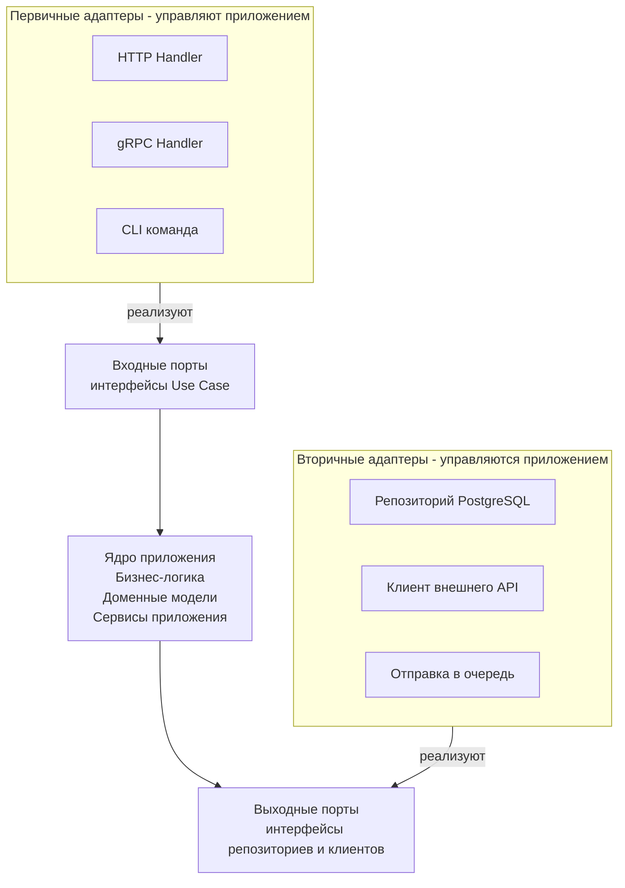

После определения границ с помощью Bounded Context и агрегатов в рамках Domain-Driven Design возникает практический вопрос: как организовать код внутри отдельного контекста или сервиса так, чтобы бизнес-логика оставалась изолированной от деталей инфраструктуры? Шестигранная архитектура (Hexagonal Architecture), также известная как **Ports and Adapters**, предлагает элегантное решение этой задачи, естественно ложащееся на идиомы Go.

### Истоки и основная идея

Алистер Кокбёрн сформулировал Hexagonal Architecture как альтернативу традиционной слоистой архитектуре ([[15. Layered Architecture. Классическая трехслойка]]), где каждый слой зависит от нижележащего. Проблема классической трехслойки (Controller → Service → Repository) в том, что **ядро приложения** — бизнес-логика — оказывается зависимым от инфраструктуры: базы данных, HTTP-фреймворка, внешних API. Это затрудняет тестирование и замену технологий.

Шестигранная архитектура **инвертирует зависимости**: ядро приложения находится в центре и ничего не знает о внешнем мире. Оно определяет **порты (Ports)** — интерфейсы, описывающие, как с ним можно взаимодействовать. Внешний мир (HTTP, gRPC, БД, очереди) реализует **адаптеры (Adapters)**, которые подключаются к этим портам.



Шестигранник символизирует множество равноправных способов взаимодействия с приложением. Количество граней не фиксировано; важна **симметрия**: и «вход» (UI, API), и «выход» (БД, внешние сервисы) подключаются через адаптеры к портам.

### Порты (Ports) в Go

**Порт** — это интерфейс Go, определённый **внутри ядра** приложения. Ядро говорит: «Мне нужен способ сохранять заказы. Я объявляю интерфейс `OrderRepository` и буду вызывать его методы. Как именно это будет реализовано — не моё дело».

#### Входной порт (Primary Port)

Описывает сценарии использования (use cases), которые инициирует внешний мир. Обычно это интерфейс сервиса приложения.

```go
// core/ports/order_use_cases.go
package ports

import (
    "context"
    "yourproject/core/domain"
)

type OrderUseCases interface {
    CreateOrder(ctx context.Context, input CreateOrderInput) (*domain.Order, error)
    GetOrder(ctx context.Context, orderID string) (*domain.Order, error)
    // ...
}
```

#### Выходной порт (Secondary Port)

Описывает, что ядру нужно от внешнего мира (сохранить данные, отправить событие). Интерфейс репозитория — классический пример.

```go
// core/ports/order_repository.go
package ports

import (
    "context"
    "yourproject/core/domain"
)

type OrderRepository interface {
    Save(ctx context.Context, order *domain.Order) error
    FindByID(ctx context.Context, id string) (*domain.Order, error)
    // ...
}
```

> [!info] Под капотом
> Определяя интерфейсы **в том же пакете, где они используются** (в core), мы реализуем принцип инверсии зависимостей (Dependency Inversion Principle) из SOLID. Компилятор Go не требует явного объявления реализации интерфейса, поэтому адаптер в пакете `postgres` просто реализует методы, и его можно передать в ядро. Это делает замену хранилища (in-memory для тестов, PostgreSQL в проде) тривиальной.

### Адаптеры (Adapters) в Go

Адаптер — это конкретная реализация порта, связывающая ядро с конкретной технологией. Адаптеры живут **вне ядра**, обычно в отдельных пакетах.

**Первичный адаптер** (входной) — например, HTTP-обработчик, который получает запрос, преобразует его в формат входного порта, вызывает метод ядра и возвращает ответ.

```go
// adapters/http/order_handler.go
package http

import (
    "encoding/json"
    "net/http"
    "yourproject/core/ports"
)

type OrderHandler struct {
    useCases ports.OrderUseCases
}

func NewOrderHandler(uc ports.OrderUseCases) *OrderHandler {
    return &OrderHandler{useCases: uc}
}

func (h *OrderHandler) CreateOrder(w http.ResponseWriter, r *http.Request) {
    var req struct {
        UserID string `json:"user_id"`
        Items  []struct {
            ProductID string `json:"product_id"`
            Quantity  int    `json:"quantity"`
        } `json:"items"`
    }
    if err := json.NewDecoder(r.Body).Decode(&req); err != nil {
        http.Error(w, err.Error(), http.StatusBadRequest)
        return
    }

    // Адаптер знает о формате HTTP и преобразует его в доменный Input
    input := ports.CreateOrderInput{
        UserID: req.UserID,
        Items:  make([]ports.OrderItem, len(req.Items)),
    }
    for i, item := range req.Items {
        input.Items[i] = ports.OrderItem{
            ProductID: item.ProductID,
            Quantity:  item.Quantity,
        }
    }

    order, err := h.useCases.CreateOrder(r.Context(), input)
    if err != nil {
        // обработка ошибок домена
        http.Error(w, err.Error(), http.StatusInternalServerError)
        return
    }

    w.Header().Set("Content-Type", "application/json")
    json.NewEncoder(w).Encode(order)
}
```

**Вторичный адаптер** (выходной) — реализация репозитория для PostgreSQL.

```go
// adapters/postgres/order_repository.go
package postgres

import (
    "context"
    "database/sql"
    "yourproject/core/domain"
    "yourproject/core/ports"
)

type OrderRepository struct {
    db *sql.DB
}

func NewOrderRepository(db *sql.DB) ports.OrderRepository {
    return &OrderRepository{db: db}
}

func (r *OrderRepository) Save(ctx context.Context, order *domain.Order) error {
    // конкретный SQL, знание схемы таблиц
    _, err := r.db.ExecContext(ctx, `
        INSERT INTO orders (id, user_id, total_amount, status) 
        VALUES ($1, $2, $3, $4)`, 
        order.ID, order.UserID, order.TotalAmount, order.Status)
    return err
}

func (r *OrderRepository) FindByID(ctx context.Context, id string) (*domain.Order, error) {
    row := r.db.QueryRowContext(ctx, "SELECT id, user_id, total_amount, status FROM orders WHERE id = $1", id)
    var order domain.Order
    err := row.Scan(&order.ID, &order.UserID, &order.TotalAmount, &order.Status)
    if err != nil {
        return nil, err
    }
    return &order, nil
}
```

Обратите внимание: пакет `postgres` импортирует `core/ports` и `core/domain`, но **ядро не знает о существовании `postgres`**. Это и есть инверсия зависимостей.

### Сборка приложения: Dependency Injection

Точкой сборки выступает `main.go` (или отдельный пакет `cmd`), который создаёт конкретные адаптеры и внедряет их в ядро.

```go
// cmd/app/main.go
package main

import (
    "database/sql"
    "log"
    "net/http"
    
    "yourproject/adapters/http"
    "yourproject/adapters/postgres"
    "yourproject/core/service"
    "yourproject/core/ports"
    
    _ "github.com/lib/pq"
)

func main() {
    db, _ := sql.Open("postgres", "...")
    defer db.Close()

    // Вторичный адаптер
    orderRepo := postgres.NewOrderRepository(db)
    
    // Ядро (сервис приложения, реализующий входной порт)
    orderService := service.NewOrderService(orderRepo)
    
    // Первичный адаптер
    orderHandler := http.NewOrderHandler(orderService)
    
    // Роутинг
    http.HandleFunc("/orders", orderHandler.CreateOrder)
    log.Fatal(http.ListenAndServe(":8080", nil))
}
```

> [!warning] Ловушка / Gotcha
> Не помещайте логику HTTP (парсинг JSON, установку статусов ответа) в ядро. Ядро должно возвращать только доменные ошибки или структуры. Адаптер преобразует их в HTTP-ответы. Иначе при добавлении gRPC или CLI вам придётся дублировать логику отображения.

### Преимущества в Go

#### Тестируемость

Поскольку ядро зависит только от интерфейсов, мы можем легко подставить моки или in-memory реализации.

```go
// core/service/order_service_test.go
type mockOrderRepo struct {
    saved *domain.Order
}

func (m *mockOrderRepo) Save(ctx context.Context, order *domain.Order) error {
    m.saved = order
    return nil
}
func (m *mockOrderRepo) FindByID(ctx context.Context, id string) (*domain.Order, error) {
    return nil, nil
}

func TestCreateOrder(t *testing.T) {
    repo := &mockOrderRepo{}
    svc := NewOrderService(repo)
    _, err := svc.CreateOrder(context.Background(), ports.CreateOrderInput{...})
    assert.NoError(t, err)
    assert.NotNil(t, repo.saved)
}
```

Никаких тестовых контейнеров или реальной БД для юнит-тестов ядра — только Go.

#### Замена технологий

Если вы решите перейти с PostgreSQL на MongoDB или даже на файловое хранилище, вам нужно только написать новый адаптер, реализующий тот же интерфейс `ports.OrderRepository`, и заменить его в `main.go`. Ядро останется нетронутым.

#### Параллельная работа

Команды могут работать над разными адаптерами независимо, имея только спецификацию порта (интерфейс). Это ускоряет разработку.

### Mechanical Sympathy: влияние на производительность

В Go инверсия зависимостей и использование интерфейсов практически бесплатны. Вызов метода через интерфейс — это косвенный переход по `itab`, который предсказуем для CPU и не создаёт аллокаций, если не возвращать интерфейсы из функций без необходимости. Основные накладные расходы возникают при сериализации/десериализации данных на границе адаптеров, что неизбежно в любой архитектуре.

При использовании гексагональной архитектуры важно не создавать лишних аллокаций при маппинге между слоями. Например, адаптер HTTP может преобразовывать JSON непосредственно в доменные объекты, минуя промежуточные DTO, если доменный объект подходит для анмаршалинга (что редко). Обычно разумно иметь DTO на границе адаптера и маппить их в доменные структуры, что добавляет немного CPU, но изолирует ядро от изменений API.

### Сравнение с Clean Architecture

Hexagonal Architecture часто путают с Clean Architecture ([[14. Clean Architecture и Dependency Rule]]). Они преследуют одну цель — изоляцию бизнес-логики, но различаются в деталях:

- **Hexagonal** акцентирует симметрию входных и выходных портов. Её правило направления зависимостей: внешние слои зависят от внутренних, внутренние ничего не знают о внешних.
- **Clean Architecture** добавляет больше слоёв (Entities, Use Cases, Interface Adapters, Frameworks & Drivers) и явное правило зависимостей: зависимости направлены внутрь, внутренние круги не знают о внешних.

На практике в Go-проектах эти идеи сливаются: ядро — это Entities + Use Cases, порты — интерфейсы, адаптеры — Interface Adapters. Выбор между ними скорее терминологический.

### Когда применять Hexagonal Architecture

- **Сложная бизнес-логика**, которая должна пережить смену инфраструктуры.
- **Необходимость поддерживать несколько способов взаимодействия** (REST API, gRPC, CLI, асинхронные события).
- **Высокие требования к тестированию** без поднятия реальных зависимостей.
- **Долгосрочные проекты**, где технологии вокруг ядра могут меняться.

Для простых CRUD-сервисов гексагональная архитектура может быть избыточной — классическая трехслойка или даже плоская структура с активной записью сработают быстрее и проще.

> [!tip] Собеседование
> **Вопрос:** Чем отличается Hexagonal Architecture от Layered Architecture? В каком случае вы выберете первую?
> **Ответ:** В Layered Architecture слой сервиса напрямую зависит от конкретной реализации репозитория (импортирует пакет с SQL). В Hexagonal Architecture сервис зависит только от интерфейса, определённого в том же пакете. Я выбираю Hexagonal, когда ожидаю замену хранилища или внешнего сервиса в будущем, или когда нужно изолировать бизнес-логику для модульного тестирования без моков БД. Для небольших внутренних инструментов Layered быстрее в разработке.

### Итог

Hexagonal Architecture — мощный паттерн для построения устойчивых к изменениям и легко тестируемых приложений на Go. Она идеально сочетается с философией языка: интерфейсы, композиция, явные зависимости. В сочетании с DDD она даёт чистую, выразительную кодовую базу, где бизнес-логика читается как книга, а замена инфраструктуры сводится к написанию нового адаптера.

Теперь, разобравшись с портами и адаптерами, логично перейти к родственной концепции — Clean Architecture, которая детализирует внутреннюю структуру ядра: [[14. Clean Architecture и Dependency Rule]].