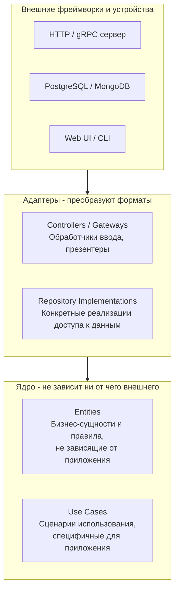

После знакомства с Hexagonal Architecture ([[13. Hexagonal Architecture. Ports and Adapters]]) мы переходим к родственной, но более детализированной концепции — **Clean Architecture**, предложенной Робертом Мартином. Она расширяет идею инверсии зависимостей и предлагает чёткую многослойную структуру с жёстким **правилом зависимостей (Dependency Rule)**. В этой статье мы разберём ключевые слои Clean Architecture, их реализацию в Go, и как они помогают строить долгоживущие, тестируемые системы.

### Слои Clean Architecture

Clean Architecture представляется в виде концентрических кругов, каждый из которых представляет определённый уровень абстракции. Чем глубже слой, тем он более абстрактен и тем меньше зависит от внешних деталей.



**1. Entities (Сущности)**
Наиболее абстрактный и стабильный слой. Содержит бизнес-правила, критически важные для функционирования предприятия в целом. Это те же агрегаты, Value Objects и доменные сервисы из DDD ([[12. Domain Driven Design. Bounded Context и Aggregate]]). Они ничего не знают ни о базе данных, ни о HTTP.

```go
// core/entity/order.go
package entity

import "errors"

type Order struct {
    ID          string
    CustomerID  string
    Items       []OrderItem
    TotalAmount Money
    Status      OrderStatus
}

func (o *Order) AddItem(productID string, quantity int, price Money) error {
    if o.Status != StatusDraft {
        return errors.New("cannot modify confirmed order")
    }
    // бизнес-логика...
    return nil
}
```

**2. Use Cases (Сценарии использования)**
Содержит логику, специфичную для конкретного приложения. Оркеструет Entities для выполнения пользовательских сценариев. В Go это обычно сервисы приложения, реализующие интерфейсы входных портов.

```go
// core/usecase/order_creation.go
package usecase

import (
    "context"
    "yourproject/core/entity"
)

type OrderRepository interface {
    Save(ctx context.Context, order *entity.Order) error
}

type CreateOrderUseCase struct {
    orderRepo OrderRepository
}

func NewCreateOrderUseCase(repo OrderRepository) *CreateOrderUseCase {
    return &CreateOrderUseCase{orderRepo: repo}
}

func (uc *CreateOrderUseCase) Execute(ctx context.Context, input CreateOrderInput) (*entity.Order, error) {
    // Входная валидация уже выполнена адаптером
    order := entity.NewOrder(input.CustomerID, input.Items...)
    
    // Бизнес-правила внутри сущности
    if err := order.Validate(); err != nil {
        return nil, err
    }
    
    if err := uc.orderRepo.Save(ctx, order); err != nil {
        return nil, err
    }
    return order, nil
}
```

**3. Interface Adapters (Адаптеры интерфейсов)**
Преобразуют данные между форматом, удобным для Use Cases/Entities, и форматом, удобным для внешних слоёв. Сюда входят HTTP-хендлеры, gRPC-серверы, реализации репозиториев для конкретных БД, клиенты к внешним API.

**4. Frameworks & Drivers (Внешние фреймворки)**
Самый внешний слой: веб-фреймворки (Gin, Echo), драйверы БД, системы очередей. В Clean Architecture этот слой должен быть **подключаемым**, чтобы его можно было заменить с минимальными изменениями.

### Правило зависимостей (Dependency Rule)

Ключевой принцип Clean Architecture: **зависимости исходного кода должны быть направлены только внутрь, к центру**. Внутренние круги ничего не знают о внешних.

В Go это выражается в направлении импортов:
- Пакет `entity` не импортирует ничего, кроме стандартной библиотеки (или пакетов для общих value objects).
- Пакет `usecase` импортирует `entity` и, возможно, другие пакеты с интерфейсами, но **не** импортирует `postgres` или `http`.
- Пакет `postgres` импортирует интерфейсы из `usecase` и реализует их.

```go
// ✔ Правильное направление зависимостей
usecase.OrderRepository (интерфейс) ← postgres.OrderRepository (реализация)

// ✘ Неправильно
usecase.CreateOrderUseCase импортирует postgres.OrderRepository
```

> [!info] Под капотом
> В Go правило зависимостей проверяется компилятором только на уровне запрета циклических импортов. Но архитектурные границы можно контролировать с помощью линтеров, таких как `golangci-lint` с правилами `depguard` или специализированных тулов вроде `go-arch`. Они проверяют, что пакет `usecase` не импортирует `adapters/postgres`.

### Реализация Clean Architecture в Go

Рассмотрим типичную структуру каталогов для Go-проекта, придерживающегося Clean Architecture:

```
project/
├── cmd/
│   └── server/
│       └── main.go              # Композиция корня приложения
├── internal/
│   ├── entity/                  # Слой Entities
│   │   ├── order.go
│   │   ├── customer.go
│   │   └── money.go
│   ├── usecase/                 # Слой Use Cases
│   │   ├── order/
│   │   │   ├── create.go
│   │   │   ├── get.go
│   │   │   └── repository.go    # Интерфейс репозитория
│   │   └── customer/
│   ├── adapter/                 # Слой адаптеров
│   │   ├── http/
│   │   │   ├── order_handler.go
│   │   │   └── dto.go
│   │   ├── postgres/
│   │   │   ├── order_repo.go
│   │   │   └── models.go
│   │   └── external/
│   │       └── payment_client.go
│   └── pkg/                     # Переиспользуемые пакеты (логи, ошибки)
└── go.mod
```

#### Внедрение зависимостей

В `main.go` происходит сборка графа зависимостей:

```go
func main() {
    db := connectDB()
    
    orderRepo := postgres.NewOrderRepository(db)
    createOrderUC := orderuc.NewCreateOrderUseCase(orderRepo)
    orderHandler := http.NewOrderHandler(createOrderUC)
    
    router := chi.NewRouter()
    router.Post("/api/orders", orderHandler.Create)
    http.ListenAndServe(":8080", router)
}
```

#### Работа с ошибками

Ошибки, возвращаемые из Use Cases, должны быть доменными типами, а не инфраструктурными. Адаптер преобразует их.

```go
// usecase/order/errors.go
package order

import "errors"

var (
    ErrOrderNotFound = errors.New("order not found")
    ErrInvalidStatus = errors.New("invalid order status for operation")
)

// adapter/http/order_handler.go
func (h *OrderHandler) Get(w http.ResponseWriter, r *http.Request) {
    order, err := h.uc.Execute(r.Context(), orderID)
    if err != nil {
        switch {
        case errors.Is(err, order.ErrOrderNotFound):
            http.Error(w, err.Error(), http.StatusNotFound)
        case errors.Is(err, order.ErrInvalidStatus):
            http.Error(w, err.Error(), http.StatusConflict)
        default:
            http.Error(w, "internal error", http.StatusInternalServerError)
        }
        return
    }
    json.NewEncoder(w).Encode(order)
}
```

### Mechanical Sympathy: влияние на производительность

Использование множества слоёв и маппингов между структурами может вызывать опасения по поводу производительности. В Go:

- **Вызовы через интерфейсы** дешёвы: это косвенный переход через таблицу интерфейсов, хорошо предсказуемый для CPU.
- **Аллокации** происходят при конвертации DTO в доменные модели и обратно. Это неизбежная плата за изоляцию. В высоконагруженных системах оптимизируют количество аллокаций, используя пулы объектов (`sync.Pool`) или генерируя код для быстрой сериализации (`easyjson`, `protobuf`).
- **GC** может чаще срабатывать из-за большого числа временных структур. Профилирование (`pprof`) поможет найти горячие точки.

> [!warning] Ловушка / Gotcha
> Не создавайте избыточных маппингов. Например, если доменная сущность `Order` уже содержит все поля, которые нужно вернуть клиенту, можно возвращать её напрямую из Use Case, а адаптер HTTP пусть сериализует её с помощью JSON-тегов. Но тогда сущность становится зависимой от формата представления (JSON-теги), что нарушает независимость ядра. Компромисс: использовать аннотации `json:"-"` или отдельные структуры ответа.

### Clean Architecture vs Hexagonal Architecture

Обе архитектуры преследуют одну цель — изоляцию бизнес-логики. Различия больше терминологические:

- **Hexagonal Architecture** фокусируется на симметрии портов и адаптеров, не предписывая строгую внутреннюю структуру.
- **Clean Architecture** явно разделяет Entities и Use Cases, акцентируя **правило зависимостей** как универсальный закон.

На практике в Go-проектах эти подходы смешиваются: используют слои Clean Architecture, но входные и выходные интерфейсы называют портами.

### Антипаттерны при использовании Clean Architecture в Go

1. **Переусложнение**. Для простых CRUD-сервисов Clean Architecture — оверкилл. Не применяйте её слепо; оцените, принесёт ли она реальную пользу.
2. **Утечка деталей фреймворка в ядро**. Например, использование `context.Context` в сущностях — допустимо (это часть языка), но методы типа `context.Value("userID")` привязывают ядро к HTTP-контексту. Лучше передавать конкретные значения параметрами.
3. **Зависимость ядра от пакета репозитория**. Убедитесь, что интерфейс репозитория определён в `usecase`, а не импортирован из `adapter/postgres`.
4. **Игнорирование транзакционных границ**. Use Case должен управлять транзакцией. Не позволяйте репозиторию начинать и коммитить транзакцию самостоятельно.

```go
// Плохо: репозиторий сам управляет транзакцией
func (r *PostgresRepo) Save(ctx context.Context, order *entity.Order) error {
    tx, _ := r.db.Begin()
    defer tx.Rollback()
    // ...
    return tx.Commit()
}

// Хорошо: Use Case управляет транзакцией через Unit of Work
type UnitOfWork interface {
    Begin(ctx context.Context) (context.Context, error)
    Commit(ctx context.Context) error
    Rollback(ctx context.Context) error
    OrderRepository() OrderRepository
}

func (uc *CreateOrderUC) Execute(ctx context.Context, input Input) (*entity.Order, error) {
    ctx, err := uc.uow.Begin(ctx)
    if err != nil { return nil, err }
    defer uc.uow.Rollback(ctx)
    
    repo := uc.uow.OrderRepository()
    // работа с репозиторием...
    
    return order, uc.uow.Commit(ctx)
}
```

### Когда применять Clean Architecture

- **Долгосрочные проекты с ожидаемыми изменениями** в бизнес-логике и технологиях.
- **Системы с высокой степенью тестирования**, где важно тестировать Use Cases изолированно от инфраструктуры.
- **Сложные домены**, где Entities имеют насыщенную логику.

Для небольших проектов или прототипов можно начать с более простой слоистой архитектуры и рефакторить по мере роста сложности.

> [!tip] Собеседование
> **Вопрос:** Что такое Dependency Rule в Clean Architecture и как вы обеспечиваете его соблюдение в Go-проекте?
> **Ответ:** Правило зависимостей гласит, что зависимости исходного кода должны указывать только внутрь, на более абстрактные слои. Внутренние круги не должны ничего знать о внешних. В Go это означает, что пакет `entity` не импортирует ничего из `usecase`, а `usecase` не импортирует `postgres` или `http`. Обеспечивается:
> 1. **Разделением интерфейсов и реализаций**: интерфейс репозитория определяется в `usecase`, а реализуется в `adapter/postgres`.
> 2. **Линтерами**: `golangci-lint` с `depguard` запрещает импорты внешних слоёв во внутренние.
> 3. **Code Review**: архитектурные границы проверяются вручную.

### Итог

Clean Architecture даёт строгую дисциплину управления зависимостями, позволяя строить гибкие, тестируемые и долгоживущие приложения на Go. Она естественно сочетается с DDD, Hexagonal Architecture и паттернами внедрения зависимостей. Платой за эту гибкость является дополнительный код маппинга и более сложная структура проекта, поэтому применять её следует осознанно, оценивая потребности системы.

Теперь, когда мы разобрали современные чистые архитектуры, полезно вспомнить классический подход, с которого многие начинали: [[15. Layered Architecture. Классическая трехслойка]]. Понимание её сильных и слабых сторон поможет лучше оценить преимущества Clean Architecture.