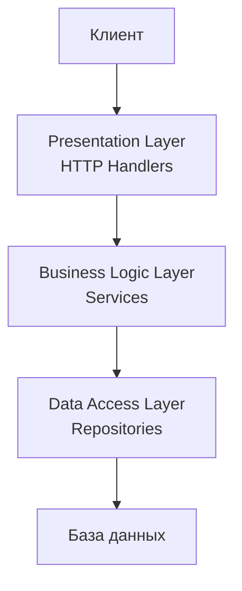

После изучения продвинутых архитектурных паттернов вроде Clean и Hexagonal Architecture может показаться, что трехслойка — устаревший подход, недостойный внимания Senior-разработчика. Однако именно с неё начинали большинство проектов, и понимание её ограничений необходимо, чтобы осознанно выбирать более сложные альтернативы. В этой статье мы разберем классическую трехслойную архитектуру, её реализацию в Go, типичные подводные камни и сценарии, когда она всё ещё уместна.

### Структура трехслойной архитектуры

Классическая трехслойная архитектура (Layered Architecture) делит приложение на три горизонтальных слоя:

1. **Presentation Layer (Слой представления)** — отвечает за взаимодействие с пользователем или внешними системами. В бэкенд-приложениях на Go это HTTP-обработчики, gRPC-серверы, CLI-команды. Его задача — получить запрос, вызвать нужный метод бизнес-логики и вернуть ответ в правильном формате.

2. **Business Logic Layer (Слой бизнес-логики)** — содержит основную логику приложения: валидацию, вычисления, бизнес-правила. В Go это обычно пакеты `service` или `usecase`. 

3. **Data Access Layer (Слой доступа к данным)** — отвечает за взаимодействие с хранилищами: базами данных, кэшами, внешними API. В Go это пакеты `repository`, `dao`, `storage`.



### Реализация в Go: типичная структура

В Go трехслойка часто реализуется следующим образом:

```
project/
├── cmd/
│   └── main.go
├── internal/
│   ├── handler/       # Presentation Layer
│   │   ├── order.go
│   │   └── user.go
│   ├── service/       # Business Logic Layer
│   │   ├── order.go
│   │   └── user.go
│   ├── repository/    # Data Access Layer
│   │   ├── order_repo.go
│   │   └── user_repo.go
│   └── model/         # Общие структуры данных
│       ├── order.go
│       └── user.go
└── go.mod
```

**Слой обработчиков** вызывает сервисы:

```go
// internal/handler/order.go
package handler

import (
    "encoding/json"
    "net/http"
    "project/internal/service"
)

type OrderHandler struct {
    orderService *service.OrderService
}

func NewOrderHandler(svc *service.OrderService) *OrderHandler {
    return &OrderHandler{orderService: svc}
}

func (h *OrderHandler) Create(w http.ResponseWriter, r *http.Request) {
    var req CreateOrderRequest
    json.NewDecoder(r.Body).Decode(&req)
    
    order, err := h.orderService.CreateOrder(r.Context(), req.UserID, req.Items)
    if err != nil {
        http.Error(w, err.Error(), http.StatusInternalServerError)
        return
    }
    json.NewEncoder(w).Encode(order)
}
```

**Слой бизнес-логики** вызывает репозиторий:

```go
// internal/service/order.go
package service

import (
    "context"
    "project/internal/model"
    "project/internal/repository"
)

type OrderService struct {
    orderRepo *repository.OrderRepository
}

func NewOrderService(repo *repository.OrderRepository) *OrderService {
    return &OrderService{orderRepo: repo}
}

func (s *OrderService) CreateOrder(ctx context.Context, userID string, items []ItemInput) (*model.Order, error) {
    order := &model.Order{
        ID:     generateID(),
        UserID: userID,
        Items:  convertItems(items),
        Status: model.StatusNew,
    }
    
    // Бизнес-логика: проверка, вычисление суммы и т.д.
    if err := s.validateOrder(order); err != nil {
        return nil, err
    }
    order.TotalAmount = s.calculateTotal(order.Items)
    
    // Сохранение через репозиторий
    if err := s.orderRepo.Save(ctx, order); err != nil {
        return nil, err
    }
    return order, nil
}
```

**Слой доступа к данным** содержит SQL-запросы:

```go
// internal/repository/order_repo.go
package repository

import (
    "context"
    "database/sql"
    "project/internal/model"
)

type OrderRepository struct {
    db *sql.DB
}

func NewOrderRepository(db *sql.DB) *OrderRepository {
    return &OrderRepository{db: db}
}

func (r *OrderRepository) Save(ctx context.Context, order *model.Order) error {
    _, err := r.db.ExecContext(ctx, 
        "INSERT INTO orders (id, user_id, total_amount, status) VALUES ($1, $2, $3, $4)",
        order.ID, order.UserID, order.TotalAmount, order.Status)
    return err
}
```

### Направление зависимостей: корень проблем

Ключевая характеристика классической трехслойки — **строгое направление зависимостей сверху вниз**:
- `handler` зависит от `service`
- `service` зависит от `repository`
- `repository` зависит от `model` и `database/sql`

Это кажется естественным, но порождает несколько проблем:

1. **Бизнес-логика знает о деталях хранения**. Пакет `service` импортирует конкретный `repository.OrderRepository`, который привязан к PostgreSQL. Заменить хранилище на MongoDB или in-memory для тестов становится сложно.

2. **Трудности с модульным тестированием**. Чтобы протестировать `OrderService`, нужен либо реальный репозиторий (и база данных), либо придётся менять сигнатуры функций для внедрения моков.

3. **Связанность через общие модели**. Модель `Order` часто используется во всех трёх слоях, становясь «божественным объектом», который вынужден учитывать требования и БД (теги `db`), и JSON-сериализации (теги `json`), и бизнес-логики.

4. **Сложность замены внешних зависимостей**. Если вы захотите перейти с `database/sql` на `pgx` или добавить кэширование, изменения затронут слой `service`.

> [!warning] Ловушка / Gotcha
> В Go трёхслойка часто приводит к тому, что пакет `service` импортирует `repository`, а `repository` импортирует `model`. Если `model` вдруг понадобится вызвать `service` — возникает циклический импорт, и компилятор Go жёстко это пресекает. Это первая ласточка, сигнализирующая о необходимости инверсии зависимостей.

### Когда трехслойка всё ещё хороша

Несмотря на недостатки, трехслойная архитектура не является абсолютным злом. Она проста, понятна и требует минимум церемоний. Она оправдана в следующих случаях:

- **Простые CRUD-приложения**, где бизнес-логика минимальна и сводится к валидации данных перед сохранением.
- **Прототипы и MVPs**, когда скорость разработки важнее долгосрочной поддерживаемости.
- **Внутренние инструменты** с коротким жизненным циклом и небольшим количеством разработчиков.
- **Стартапы на ранних стадиях**, где требования меняются быстро, и более сложные архитектуры могут тормозить итерации.

В таких проектах треёхслойка может быть оптимальным выбором, особенно если разработчики не знакомы с Clean Architecture.

### Переход к более чистым архитектурам

Когда приложение вырастает, и становятся очевидны проблемы трёхслойки, естественным шагом является **инверсия зависимостей**. Вместо того чтобы `service` зависел от конкретной реализации `repository`, `service` определяет интерфейс репозитория, а конкретная реализация внедряется извне.

Этот рефакторинг превращает трёхслойку в подобие гексагональной архитектуры ([[13. Hexagonal Architecture. Ports and Adapters]]), где:
- Слой бизнес-логики становится **ядром** с определёнными в нём интерфейсами.
- Слой доступа к данным становится **адаптером**, реализующим эти интерфейсы.
- Слой представления также превращается в адаптер.

```go
// До рефакторинга: service зависит от repository
type OrderService struct {
    repo *repository.OrderRepository
}

// После рефакторинга: service определяет интерфейс и не зависит от реализации
type OrderRepository interface {
    Save(ctx context.Context, order *Order) error
}

type OrderService struct {
    repo OrderRepository
}
```

### Mechanical Sympathy: трехслойка и производительность Go

С точки зрения рантайма Go, трехслойка сама по себе не добавляет значительных накладных расходов. Вызовы функций между слоями — обычные Go-вызовы, которые компилятор может даже инлайнить. Основные потери производительности в такой архитектуре связаны не со слоями как таковыми, а с избыточными аллокациями при маппинге между слоями, если каждый слой создаёт свои копии данных. Эту проблему можно смягчить, используя одни и те же структуры, но тогда усиливается связанность.

### Сравнение с чистыми архитектурами

| Критерий | Трехслойная архитектура | Clean / Hexagonal Architecture |
|----------|--------------------------|-------------------------------|
| **Направление зависимостей** | Сверху вниз | Снаружи внутрь |
| **Зависимость бизнес-логики от БД** | Прямая (импорт репозитория) | Через интерфейс, определённый в ядре |
| **Тестирование бизнес-логики** | Требует моков или реальной БД | Легко тестируется с заглушками |
| **Замена хранилища** | Требует изменения `service` | Требует только нового адаптера |
| **Порог входа** | Низкий | Средний / высокий |
| **Количество кода** | Меньше | Больше (интерфейсы, маппинги) |

> [!tip] Собеседование
> **Вопрос:** В вашем текущем проекте используется трехслойная архитектура. Какие симптомы подскажут вам, что пора переходить на Clean Architecture?
> **Ожидаемый ответ:** 
> - Модульные тесты сервисов стали медленными, потому что поднимают тестовую БД, или их сложно писать из-за необходимости мокать конкретные реализации.
> - При добавлении нового хранилища (например, Redis для кэша) приходится изменять код сервисов, что увеличивает риск регрессии.
> - Несколько сервисов дублируют логику доступа к данным, которую хотелось бы вынести.
> - Команда растёт, и разные люди одновременно меняют одни и те же файлы, что приводит к конфликтам слияния.
> - Бизнес-логика начинает проникать в обработчики или репозитории, размывая ответственность слоёв.

### Итог

Классическая трехслойная архитектура — это простой и интуитивный способ структурировать приложение, с которого многие начинают. Она остаётся хорошим выбором для простых CRUD-проектов, прототипов и стартапов на ранней стадии. Однако по мере роста сложности её жёсткие зависимости начинают мешать тестированию, замене компонентов и масштабированию команды.

Понимание трёхслойки важно не только для поддержки legacy-кода, но и как отправная точка для осознанного перехода к более гибким архитектурным стилям — Clean Architecture и Hexagonal Architecture, которые мы уже рассмотрели.

Теперь, когда мы изучили внутреннюю организацию кода, самое время обсудить, как структурировать файлы и папки в типичном Go-проекте согласно принятым в сообществе соглашениям: [[16. Standard Go Project Layout и его ограничения]].