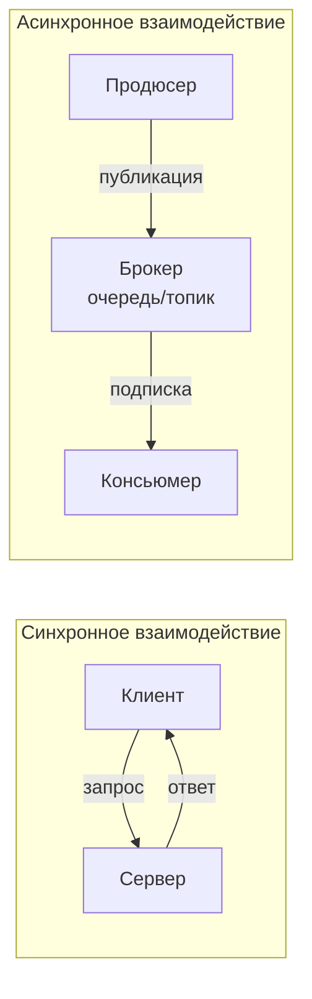

Когда система перерастает монолит и распределяется по нескольким сервисам, на первый план выходит вопрос: **как они будут общаться друг с другом?** Выбор между синхронным (запрос-ответ) и асинхронным (события, сообщения) стилем взаимодействия имеет фундаментальные последствия для задержек, надёжности, масштабируемости и даже структуры кода. В этой статье мы разберём оба подхода, их влияние на архитектуру Go-сервисов, физические ограничения и типичные сценарии применения.

### Определения

**Синхронное взаимодействие** (Request-Response) — клиент отправляет запрос серверу и **блокируется** в ожидании ответа. Протоколы: HTTP/REST, gRPC, GraphQL. В Go типичная реализация — HTTP-клиент, выполняющий `client.Do(req)` и ожидающий `resp.Body`.

**Асинхронное взаимодействие** (Message-Driven) — отправитель публикует сообщение (событие или команду) в посредник (брокер, очередь), не дожидаясь немедленного ответа. Получатель обрабатывает сообщение в своём темпе. Протоколы/системы: Kafka, RabbitMQ, NATS, облачные очереди (SQS, Pub/Sub). В Go используются клиенты соответствующих брокеров, работающие с каналами, колбэками или пулами горутин.



### Синхронное взаимодействие: плюсы, минусы и контекст Go

#### Преимущества

- **Простота ментальной модели.** Вы вызываете функцию, ждёте результат, обрабатываете его. Код линейный и легко читаемый.
- **Немедленная обратная связь.** Клиент сразу знает, успешен ли запрос, и может принять решение (показать ошибку пользователю, повторить попытку).
- **Согласованность данных (в ограниченном контексте).** Можно обновить несколько систем в рамках транзакции, если использовать распределённые транзакции или компенсационные механизмы, но в пределах одного синхронного вызова проще координировать изменения.
- **Инструментарий.** HTTP-серверы и gRPC глубоко интегрированы в Go (`net/http`, `grpc-go`), имеют отличную поддержку middleware, трассировки, метрик.

#### Недостатки и вызовы

- **Временная связанность (Temporal Coupling).** Оба сервиса должны быть доступны одновременно. Если сервер недоступен, клиент получает ошибку. Падение одного сервиса каскадно влияет на вызывающих.
- **Задержки.** Каждый синхронный вызов добавляет сетевое время оборота (RTT) и ожидание обработки. В цепочке сервисов (A→B→C) задержки суммируются, что может нарушить SLO ([[5. Latency, Throughput, Availability и Trade-offs]]).
- **Плохая масштабируемость при пиках нагрузки.** Если сервер медленный или перегружен, клиенты будут накапливать открытые соединения, потребляя память и горутины. В Go это может привести к исчерпанию файловых дескрипторов или росту latency из-за ожидания свободного соединения в пуле.
- **Сложность с гарантией доставки.** Если ответ потерян или клиент упал после отправки запроса, сервер может выполнить операцию, а клиент об этом не узнает. Требуются ретраи с идемпотентностью ([[27. Idempotency и exactly once семантика]]).

> [!info] Под капотом
> В Go синхронный HTTP-запрос блокирует текущую горутину на I/O. Планировщик Go открепляет её от потока ОС (hand-off), позволяя потоку выполнять другие горутины. Это эффективно, но каждая блокированная горутина всё равно потребляет память (стек ~2 КБ и структуру в рантайме). При тысячах одновременных ожидающих запросов расход памяти становится заметным, а планировщик вынужден чаще переключать контекст.

### Асинхронное взаимодействие: плюсы, минусы и Go-специфика

#### Преимущества

- **Слабая временная связанность.** Продюсеру не важно, запущен ли консьюмер в данный момент. Сообщение будет доставлено, когда консьюмер появится (если брокер хранит сообщения). Это повышает доступность системы в целом: даже при отказе части сервисов система деградирует, но не падает полностью.
- **Естественное сглаживание пиков (Load Leveling).** Продюсеры публикуют сообщения с высокой скоростью, брокер буферизует их, а консьюмеры обрабатывают в своём темпе. Нет необходимости масштабировать консьюмеров синхронно с пиками.
- **Высокая пропускная способность.** Асинхронная запись в брокер обычно быстрее, чем ожидание синхронного ответа. Можно отправлять сообщения пачками (batching), ещё больше повышая throughput.
- **Развязывание команд.** Разные команды могут развивать продюсеров и консьюмеров независимо, имея только контракт на формат сообщения (схема Avro, Protobuf, JSON Schema).

#### Недостатки и вызовы

- **Сложность ментальной модели.** Вместо простого вызова и ответа — распределённый поток событий. Отладка усложняется: нужно отслеживать путь сообщения через топики, очереди, DLQ.
- **Eventual Consistency.** Консьюмер обрабатывает сообщение с задержкой. Клиент, инициировавший операцию, не получает немедленного подтверждения. Требуется либо polling статуса, либо обратный вызов через webhook / WebSocket.
- **Усложнение инфраструктуры.** Нужен брокер сообщений (Kafka, RabbitMQ, NATS) — ещё одна распределённая система, которую нужно мониторить, настраивать и обслуживать.
- **Гарантии доставки и порядок.** Брокеры предлагают разные уровни гарантий: at-most-once, at-least-once, exactly-once. Каждый из них влечёт свои сложности (дедупликация, идемпотентность). В Go обработчики сообщений должны быть готовы к дубликатам.

### Mechanical Sympathy: влияние на планировщик Go и системные ресурсы

Асинхронные обработчики в Go часто реализуются как долгоживущие горутины, потребляющие сообщения из канала или колбэка клиента брокера. Это позволяет эффективно использовать память (фиксированное число горутин-воркеров) и избегать накладок на создание/уничтожение горутин на каждое сообщение. Пример с Kafka (используя `sarama` или `confluent-kafka-go`):

```go
func startConsumer(ctx context.Context, handler func(msg *kafka.Message)) {
    for {
        select {
        case <-ctx.Done():
            return
        default:
            msg, err := consumer.ReadMessage(ctx)
            if err != nil {
                log.Error("read error", err)
                continue
            }
            go handler(msg) // осторожно: может породить миллионы горутин
        }
    }
}
```

Однако порождение горутины на каждое сообщение может быть допустимо только при низком темпе поступления. Для высоконагруженных систем применяют пул воркеров с фиксированным количеством горутин, читающих из одного канала.

```go
func workerPool(msgs <-chan *Message, concurrency int, handler func(*Message)) {
    for i := 0; i < concurrency; i++ {
        go func() {
            for msg := range msgs {
                handler(msg)
            }
        }()
    }
}
```

### Сравнительный анализ

| Критерий               | Синхронное (HTTP/gRPC)                          | Асинхронное (Kafka/RabbitMQ)                    |
|------------------------|-------------------------------------------------|-------------------------------------------------|
| **Связанность**        | Временнáя: отправитель ждёт ответ               | Слабая: отправитель не ждёт                     |
| **Задержка**           | Низкая (миллисекунды) для отдельных запросов    | Выше из-за прохода через брокер и ожидания в очереди |
| **Пропускная способность** | Средняя, ограничена числом соединений и обработчиком | Высокая, может буферизовать пики                |
| **Доступность**        | Требует одновременной доступности обоих сервисов | Допускает временную недоступность консьюмера    |
| **Сложность обработки ошибок** | Явная (HTTP-статусы, gRPC-коды)          | Сложнее: retry, DLQ, потерянные сообщения       |
| **Go-реализация**      | `net/http`, `grpc-go`                           | Клиенты брокеров, часто требуют ручного управления горутинами |
| **Надёжность доставки**| Нет встроенных гарантий, требуется retry         | Настраиваемые гарантии, хранение на диске        |

### Когда что выбирать

**Синхронное** предпочтительно:
- Для операций, требующих немедленного ответа пользователю (например, запрос на чтение данных профиля).
- Когда цепочка вызовов короткая и задержка предсказуема.
- При тесной интеграции с внешними системами, которые ожидают синхронный ответ (платёжные шлюзы).
- Внутри Bounded Context, где сервисы сильно связаны и разрабатываются одной командой (например, микросервисы, но с общей кодовой базой).

**Асинхронное** предпочтительно:
- Для долгих операций (генерация отчёта, отправка email, транскодирование видео).
- Когда нужно развязать команды и позволить им независимо развиваться.
- Для обработки потоковых данных (логи, события от IoT, клики пользователей).
- Когда требуется высокая надёжность доставки при возможных отказах консьюмеров (гарантированное уведомление).
- В паттернах Event-Driven Architecture ([[21. Event Driven Architecture]]), CQRS ([[23. CQRS. Разделение чтения и записи]]), Saga ([[26. Saga Pattern. Оркестрация и хореография]]).

### Гибридные подходы: синхронное API поверх асинхронного ядра

Распространённый паттерн в Go-приложениях: внешний API (HTTP/gRPC) принимает команду, публикует событие в брокер и сразу возвращает клиенту идентификатор операции (`202 Accepted` с `Location` для polling статуса). Внутренняя обработка идёт асинхронно. Это сочетает удобство синхронного интерфейса для клиента с преимуществами асинхронной обработки внутри системы.

```go
func (h *OrderHandler) Create(w http.ResponseWriter, r *http.Request) {
    var req CreateOrderRequest
    // валидация...
    
    orderID := uuid.New().String()
    event := OrderCreatedEvent{ID: orderID, ...}
    
    // Публикуем событие и сразу отвечаем
    if err := h.eventBus.Publish(r.Context(), event); err != nil {
        http.Error(w, "failed to publish event", http.StatusInternalServerError)
        return
    }
    
    w.Header().Set("Location", "/orders/"+orderID)
    w.WriteHeader(http.StatusAccepted)
    json.NewEncoder(w).Encode(map[string]string{"id": orderID, "status": "pending"})
}
```

Клиент затем опрашивает эндпоинт `/orders/{id}`, пока статус не станет терминальным.

> [!warning] Ловушка / Gotcha
> При использовании глобальной переменной для подключения к брокеру и синхронном API легко забыть про корректное завершение. Если приложение получает SIGTERM, нужно успеть отправить уже принятые сообщения (graceful shutdown). Для HTTP-сервера это `Shutdown()`, для брокера — `Close()` с ожиданием подтверждения от брокера. Необработанные сообщения могут быть потеряны.

### Влияние на тестирование

- **Синхронные сервисы** тестируются проще: можно поднять реальный сервер на localhost или использовать `httptest.Server`.
- **Асинхронные сервисы** требуют эмуляции брокера (например, `testcontainers-go` с Kafka или встроенные очереди в памяти). Проверка асинхронной логики сложнее из-за гонок и необходимости ожидания (используйте `assert.Eventually`).

> [!tip] Собеседование
> **Вопрос:** У вас есть сервис заказов и сервис уведомлений. Как они должны взаимодействовать: синхронно или асинхронно? Обоснуйте выбор с точки зрения Go-разработчика.
> **Ответ:** Я бы выбрал асинхронное взаимодействие через брокер сообщений. Причины:
> 1. **Слабая связанность:** сервис заказов не должен ждать, пока сервис уведомлений отправит email (это может занять секунды). Синхронный вызов добавил бы задержку к ответу пользователю и сделал бы сервис заказов уязвимым к недоступности сервиса уведомлений.
> 2. **Устойчивость к отказам:** если сервис уведомлений упал, сообщения накопятся в брокере и будут обработаны после восстановления. В синхронном сценарии пришлось бы реализовывать сложную логику повторных попыток в коде заказов.
> 3. **Пиковая нагрузка:** в чёрную пятницу сервис уведомлений может не справляться с потоком. Брокер сгладит пик.
> 4. **Идиоматичная реализация в Go:** я создам фиксированный пул горутин-воркеров в сервисе уведомлений, которые будут потреблять сообщения из Kafka. Это эффективно с точки зрения планировщика и памяти.

### Итог

Синхронное и асинхронное взаимодействие — два фундаментальных инструмента в арсенале архитектора. Выбор между ними диктуется требованиями к задержке, связанности компонентов, надёжности и масштабируемости. Go предоставляет эффективные примитивы для обоих подходов, но требует понимания их влияния на рантайм (горутины, планировщик, память). Современные системы часто сочетают оба стиля: синхронный API для внешних клиентов и асинхронную шину для внутренней коммуникации.

В следующей статье мы детально сравним три конкретных технологии обмена данными, которые реализуют синхронное и асинхронное взаимодействие: [[20. RPC vs REST vs Messaging]].