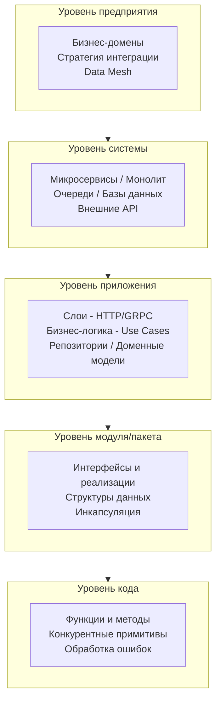

Когда разработчик слышит слово «архитектура», воображение часто рисует красивые диаграммы с квадратиками микросервисов, стрелочками RabbitMQ и облачком Kubernetes. Это важная часть, но архитектура начинается гораздо раньше — в тот момент, когда вы решаете, как разбить код на пакеты, какие интерфейсы сделать публичными и как организовать внедрение зависимостей.

Цель этой статьи — дать четкое, инженерное определение архитектуры, показать её многоуровневую природу и объяснить, почему чёткие границы являются фундаментом любой масштабируемой системы.

### Определение архитектуры

В классической книге «Software Architecture in Practice» архитектура определяется как:

> **Архитектура программной системы** — это совокупность структур, необходимых для рассуждений о системе. Эти структуры включают программные элементы, отношения между ними и свойства обоих.

Проще говоря, архитектура отвечает на вопросы:
- Из каких **компонентов** состоит система?
- Как эти компоненты **взаимодействуют** друг с другом и с внешним миром?
- Какие **принципы и ограничения** управляют их проектированием и эволюцией?
- Какие **нефункциональные характеристики** (производительность, надёжность, масштабируемость) система обеспечивает?

> [!info] Под капотом
> Архитектура — это не статичный чертёж. Это живое знание, которое развивается вместе с системой. В хорошо спроектированной системе изменения локализованы и предсказуемы; в плохой — даже небольшое изменение вызывает каскад отказов (та самая «страшно трогать» кодовая база).

### Уровни абстракции в архитектуре

Архитектура не является монолитной дисциплиной. Она проявляется на разных масштабах, и инженер должен уметь переключаться между этими уровнями.



1. **Уровень предприятия** (Enterprise Architecture) — как различные системы и команды взаимодействуют в рамках бизнеса. Здесь принимаются решения о единых протоколах, форматах данных и сквозной аутентификации.

2. **Уровень системы** (System Architecture) — о чём чаще всего говорят на System Design интервью. Это уровень отдельных сервисов, баз данных, брокеров сообщений и сетевых связей между ними. Пример: выбор между синхронным REST-взаимодействием и асинхронной передачей событий через Kafka ([[19. Синхронное vs асинхронное взаимодействие сервисов]], [[20. RPC vs REST vs Messaging]]).

3. **Уровень приложения** (Application Architecture) — внутренняя структура отдельного сервиса. Здесь обитают Clean Architecture ([[14. Clean Architecture и Dependency Rule]]), Hexagonal Architecture ([[13. Hexagonal Architecture. Ports and Adapters]]) и классическая слоистая архитектура ([[15. Layered Architecture. Классическая трехслойка]]). На этом уровне Go-разработчик принимает решения о разделении на пакеты `internal`, `pkg`, `cmd` ([[16. Standard Go Project Layout и его ограничения]]).

4. **Уровень модуля / пакета** — дизайн конкретного набора связанных функций и типов. В Go этот уровень особенно важен из-за системы пакетов и неявного удовлетворения интерфейсов. Здесь определяются границы инкапсуляции, публичные API пакета и внутренние детали реализации.

5. **Уровень кода** — реализация конкретной функции или метода. На этом уровне принимаются решения о том, использовать ли `sync.Mutex` или канал, как обрабатывать ошибки и как избежать утечек горутин.

> [!tip] Собеседование
> **Вопрос:** Опишите, на каких уровнях абстракции вы принимали архитектурные решения в последнем проекте.
> **Ожидаемый ответ:** Senior-кандидат должен показать способность оперировать на всех уровнях: от выбора протокола взаимодействия между сервисами (уровень системы) до структуры папок и организации DI (уровень приложения) и идиоматичного использования интерфейсов (уровень модуля).

### Границы системы

Ключевая концепция архитектуры — **границы**. Архитектор постоянно проводит линии, отделяя одно от другого:
- Что находится внутри сервиса, а что снаружи.
- Какие данные принадлежат домену, а какие являются деталями инфраструктуры.
- Какие изменения могут затронуть только один пакет, а какие потребуют переписывания всего приложения.

Границы реализуются через **контракты**:
- **API Endpoint** (HTTP путь и формат JSON) — граница между клиентом и сервером.
- **Protobuf-схема** — граница между сервисами в gRPC.
- **Интерфейс Go** — граница между бизнес-логикой и реализацией репозитория или внешнего клиента.
- **Топик Kafka** и схема событий — граница между publisher и consumer.

#### Почему границы важны в Go?

Go предоставляет минималистичный, но мощный инструментарий для проведения границ:

1. **Интерфейсы**. В отличие от языков с явным объявлением реализации (Java `implements`, C# `: IInterface`), в Go интерфейсы удовлетворяются неявно. Это позволяет определять интерфейс в пакете-потребителе, а не в пакете-реализации — фундаментальный приём для инверсии зависимостей (Dependency Inversion Principle).

```go
// Пакет usecase (бизнес-логика) определяет, ЧТО ему нужно
package usecase

type UserRepository interface {
    FindByID(ctx context.Context, id string) (*User, error)
    Save(ctx context.Context, user *User) error
}

// Пакет postgres (инфраструктура) предоставляет КАК это сделано
package postgres

type UserRepo struct { db *sql.DB }

func (r *UserRepo) FindByID(ctx context.Context, id string) (*usecase.User, error) {
    // реализация
}
```

2. **Пакеты и внутренняя видимость**. Ключевое слово `internal` в Go создаёт жёсткую границу, запрещая импорт извне. Это мощный механизм для сокрытия деталей реализации и предотвращения нежелательных связей.

3. **Context**. Передача `context.Context` через все слои — это способ провести границу для таймаутов, дедлайнов и трассировочной информации. Хорошая архитектура гарантирует, что контекст пробрасывается от входящего HTTP-запроса до вызова базы данных без разрывов.

### Mechanical Sympathy на уровне архитектуры

При проектировании границ между компонентами необходимо учитывать физическую реальность.

- **Сетевой вызов** — это минимум сотни микросекунд (в лучшем случае внутри одного дата-центра) и до сотен миллисекунд (между регионами). Каждый такой вызов включает сериализацию, передачу по TCP (с подтверждениями и возможными повторными передачами), десериализацию и обработку на стороне получателя. В то время как вызов метода внутри одного процесса (даже с учётом аллокаций) занимает наносекунды.

- **Сериализация/десериализация** JSON или Protobuf — это не бесплатно. Она нагружает CPU, создаёт аллокации в куче (что провоцирует GC) и добавляет задержку.

- **Переключение контекста между горутинами** дёшево, но не бесплатно. Если архитектура вынуждает создавать тысячи горутин, которые большую часть времени ждут ответа от медленного downstream-сервиса, планировщик Go будет вынужден постоянно переключать контекст, расходуя ресурсы.

> [!warning] Ловушка / Gotcha
> **Микросервисная «лапша»**. Разработчики, пришедшие из монолитного мира, часто воспринимают микросервисы как панацею. Они дробят логику на десятки сервисов, каждый из которых делает один-два сетевых вызова к соседу. В результате простая операция, которая в монолите выполнялась за 5 мс (вызов функции), начинает занимать 150 мс (три последовательных HTTP-запроса с сериализацией JSON на каждом шаге). Итог: латенси возрастает в 30 раз, а пропускная способность падает. В Go это усугубляется тем, что каждая горутина, ожидающая сетевого ответа, блокирует не поток ОС, но всё ещё занимает память под стек (минимум 2 КБ) и создаёт нагрузку на планировщик.

### Границы и эволюция системы

Хорошо спроектированные границы позволяют системе эволюционировать без боли:

- **Замена реализации**. Если репозиторий скрыт за интерфейсом, вы можете заменить PostgreSQL на MongoDB или даже на in-memory кэш для тестов, не трогая бизнес-логику.
- **Версионирование API**. Чётко определённая граница в виде API с версией (`/v1/users`, `/v2/users`) позволяет поддерживать старых клиентов, пока новые используют улучшенную логику ([[46. Версионирование сервисов и API]]).
- **Извлечение микросервиса**. Когда монолит становится слишком большим, чёткие границы между модулями позволяют «вырезать» один из них в отдельный сервис с минимальными изменениями.

### Итог

Архитектура — это не про выбор модного фреймворка или рисование диаграмм в Miro. Это дисциплина управления сложностью через проведение границ и определение контрактов на разных уровнях абстракции. Go с его простыми, но строгими инструментами (пакеты, интерфейсы, неявное удовлетворение) идеально подходит для реализации этих принципов.

В следующей статье мы перейдём от философского определения к практической основе любого дизайна: [[3. Функциональные и нефункциональные требования]]. Именно требования диктуют, где провести границы, какие компромиссы допустимы и какую архитектуру выбрать.