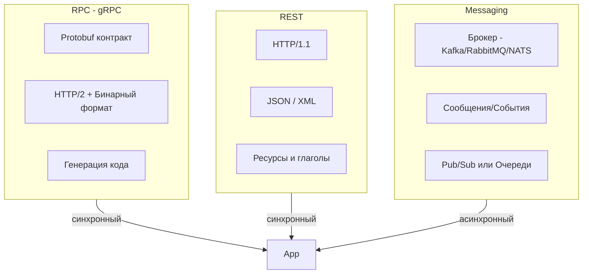

В предыдущей статье мы разделили межсервисное взаимодействие на синхронное и асинхронное. Теперь пришло время рассмотреть три конкретные технологические парадигмы, которые чаще всего реализуют эти стили в современных Go-системах: **RPC** (воплощённый в gRPC), **REST** (HTTP/JSON) и **Messaging** (брокеры сообщений). Выбор между ними влияет на производительность, контракты API, идиоматичность кода и даже на стратегию версионирования. В этой статье мы сопоставим их по ключевым инженерным критериям, уделяя особое внимание особенностям реализации в Go.

### Три кита коммуникации



- **RPC (Remote Procedure Call)** — вызов удалённой процедуры так, будто она локальная. Современный стандарт в Go-мире — **gRPC** от Google, использующий **Protocol Buffers (Protobuf)** для сериализации и **HTTP/2** в качестве транспорта.
- **REST (Representational State Transfer)** — архитектурный стиль, оперирующий ресурсами, идентифицируемыми URL, и стандартными методами HTTP (GET, POST, PUT, DELETE). Данные обычно передаются в формате JSON.
- **Messaging** — асинхронный обмен сообщениями через посредника (брокера). Сообщения могут быть командами, событиями или данными. Популярные брокеры: Apache Kafka, RabbitMQ, NATS.

### RPC на примере gRPC

gRPC — это высокопроизводительный RPC-фреймворк, использующий строгую типизацию через Protobuf. Контракт описывается в `.proto` файлах, из которых кодогенератор `protoc` создаёт клиентские и серверные заглушки на Go.

#### Преимущества gRPC в Go

- **Строгий контракт.** Protobuf задаёт схему данных, исключая недопонимание между командами. Кодогенерация гарантирует согласованность.
- **Высокая производительность.** Бинарный Protobuf компактнее JSON, а HTTP/2 поддерживает мультиплексирование запросов в одном TCP-соединении, снижая накладные расходы. В Go-реализации `grpc-go` эффективно использует горутины и управляет пулом соединений.
- **Встроенная поддержка стриминга.** gRPC поддерживает четыре типа взаимодействия: унарный (один запрос — один ответ), серверный стрим, клиентский стрим и двунаправленный стрим. Это идеально для real-time сценариев.
- **Интеграция с экосистемой Go.** Пакет `google.golang.org/grpc` предоставляет middleware-перехватчики (interceptors) для аутентификации, логирования, трассировки, метрик.

#### Недостатки и ограничения

- **Сложность отладки.** Бинарный формат не читается человеком, необходим инструментарий (grpcurl, grpcui, Jaeger).
- **Жёсткая связанность контрактом.** Изменение `.proto` требует регенерации кода у всех потребителей. Обратная совместимость поддерживается правилами Protobuf, но требует дисциплины.
- **Не для браузеров.** Браузеры не умеют нативно работать с gRPC (нужен gRPC-Web или трансляция через gRPC-gateway в REST).

```go
// Пример gRPC сервера на Go
type OrderServer struct {
    pb.UnimplementedOrderServiceServer
}

func (s *OrderServer) CreateOrder(ctx context.Context, req *pb.CreateOrderRequest) (*pb.Order, error) {
    // бизнес-логика
    return &pb.Order{Id: "123"}, nil
}
```

### REST (HTTP/JSON)

REST остаётся самым распространённым стилем для публичных API и взаимодействия с фронтендом. Go имеет первоклассную поддержку HTTP в стандартной библиотеке `net/http`.

#### Преимущества REST в Go

- **Человекочитаемость.** JSON легко читать и писать вручную, что ускоряет разработку и отладку.
- **Широкая совместимость.** Любой HTTP-клиент (curl, браузер, мобильное приложение) может работать с REST API.
- **Гибкость версионирования.** Можно включать версию в URL (`/v1/orders`) или заголовки. JSON легко расширять новыми полями без нарушения обратной совместимости.
- **Богатая экосистема middleware.** В Go существуют десятки роутеров (gorilla/mux, chi, echo) и библиотек для валидации, CORS, OpenAPI.

#### Недостатки

- **Раздутые данные.** JSON содержит имена полей и синтаксический оверхед. Для высоконагруженных систем это может быть узким местом.
- **HTTP/1.1.** Хотя Go поддерживает HTTP/2, многие REST-сервисы по-прежнему работают на HTTP/1.1 с его ограничениями (head-of-line blocking). Для внутренних API это может создавать задержки.
- **Контракт не формализован.** Схема описывается отдельно (OpenAPI/Swagger), и нет гарантии её соблюдения на уровне компиляции. Требуется контрактное тестирование ([[48. Тестирование архитектуры. Contract и Integration testing]]).
- **Сериализация JSON в `encoding/json` медленнее Protobuf и создаёт больше аллокаций.** Для снижения нагрузки используют альтернативные библиотеки: `goccy/go-json`, `easyjson`, `sonic`.

```go
// Типичный REST-хендлер на Go
func (h *OrderHandler) Create(w http.ResponseWriter, r *http.Request) {
    var req CreateOrderRequest
    if err := json.NewDecoder(r.Body).Decode(&req); err != nil {
        http.Error(w, err.Error(), http.StatusBadRequest)
        return
    }
    // бизнес-логика
    w.Header().Set("Content-Type", "application/json")
    json.NewEncoder(w).Encode(order)
}
```

### Messaging (Брокеры сообщений)

Messaging реализует асинхронную коммуникацию через промежуточного брокера. В отличие от RPC и REST, это не просто протокол, а архитектурный стиль со своими гарантиями доставки и семантикой.

#### Преимущества Messaging в Go

- **Полная асинхронность и развязка.** Продюсер не зависит от доступности консьюмера. Подходит для Event-Driven Architecture ([[21. Event Driven Architecture]]).
- **Устойчивость к пикам.** Брокер буферизует сообщения, защищая консьюмеров от перегрузки.
- **Гарантии доставки.** Брокеры предоставляют at-least-once, exactly-once семантику и персистентное хранение на диске.
- **Масштабирование консьюмеров.** Можно добавлять инстансы консьюмера в потребительскую группу (Kafka) или конкурентные подписчики (RabbitMQ/NATS), что увеличивает пропускную способность.
- **Легковесные Go-клиенты.** Kafka (segmentio/kafka-go, confluent-kafka-go), RabbitMQ (streadway/amqp), NATS (nats.go) предоставляют удобные API.

#### Недостатки

- **Операционная сложность.** Необходимо разворачивать и обслуживать кластер брокера.
- **Задержка доставки.** Сообщение проходит через брокер и очередь, что добавляет десятки-сотни миллисекунд по сравнению с прямым RPC.
- **Сложность отладки и мониторинга.** Нужно отслеживать лаги консьюмеров, сообщения в DLQ, задержки в топиках.
- **Eventual Consistency.** Система становится распределённой в смысле консистентности данных ([[30. CAP теорема и реальные компромиссы]]).

```go
// Пример консьюмера Kafka на Go (segmentio/kafka-go)
r := kafka.NewReader(kafka.ReaderConfig{
    Brokers: []string{"localhost:9092"},
    Topic:   "orders",
    GroupID: "order-processor",
})
for {
    m, err := r.ReadMessage(ctx)
    if err != nil { break }
    process(m.Value)
    r.CommitMessages(ctx, m)
}
```

> [!info] Под капотом
> Клиенты брокеров в Go часто работают в неблокирующем режиме с использованием горутин. Например, `segmentio/kafka-go` для consumer group порождает отдельные горутины для чтения из каждого партиции. Это позволяет эффективно распараллеливать обработку.

### Сравнительная таблица

| Критерий                   | gRPC (RPC)                              | REST (HTTP/JSON)                       | Messaging (Broker)                      |
|----------------------------|-----------------------------------------|----------------------------------------|-----------------------------------------|
| **Стиль взаимодействия**   | Синхронный (запрос-ответ)               | Синхронный (запрос-ответ)              | Асинхронный (сообщения)                 |
| **Формат данных**          | Protobuf (бинарный)                     | JSON (текстовый)                       | Произвольный (JSON, Avro, Protobuf)     |
| **Производительность**     | Очень высокая (меньше CPU, сеть)        | Средняя (оверхед JSON и HTTP/1.1)      | Высокая пропускная способность, но латенси выше |
| **Контракт**               | Жёсткий, кодогенерируемый (.proto)      | Мягкий, через документацию (OpenAPI)   | Мягкий (схема сообщения)                |
| **Поддержка стриминга**    | Встроенная (клиент/сервер/двунаправленный) | Нет (только Server-Sent Events, но редко) | Естественная (поток событий)            |
| **Совместимость**          | Требует gRPC-клиент или gRPC-Web       | Универсальная (HTTP)                   | Требует клиента брокера                 |
| **Надёжность / Гарантии**  | Нет встроенных, retry в коде            | Нет встроенных, retry в коде           | Персистентность, репликация, DLQ        |
| **Отладка**                | Сложнее (нужны инструменты)             | Просто (curl, Postman)                 | Сложно (инструменты брокера)            |
| **Go-экосистема**          | `grpc-go`, `protoc-gen-go`              | `net/http`, множество роутеров         | Клиенты для каждого брокера             |

### Выбор в зависимости от сценариев

**Когда выбирать gRPC:**
- Внутренние высоконагруженные микросервисы, где важна низкая задержка и малый оверхед.
- Сервисы, требующие стриминга (чат, мониторинг, передача больших объёмов данных).
- Полиглот-системы, где сервисы на разных языках должны общаться по строгому контракту.

**Когда выбирать REST:**
- Публичные API для клиентов, особенно веб- и мобильных приложений.
- Быстрая разработка прототипов, где скорость изменений важнее идеальной производительности.
- API, ориентированные на ресурсы и CRUD-операции.

**Когда выбирать Messaging:**
- Слабая связанность и независимое масштабирование обработчиков событий.
- Отказоустойчивость и гарантированная доставка (например, платежи, заказы).
- Обработка потоковых данных и событийно-ориентированные системы.

### Комбинирование подходов в Go

Современная Go-архитектура часто использует гибридные подходы:
- Внешний REST API принимает запрос и публикует команду в брокер, возвращая клиенту `202 Accepted`.
- Внутренние сервисы общаются по gRPC для синхронных операций, требующих низкой задержки.
- События из брокера используются для асинхронной репликации данных между сервисами (CQRS, [[23. CQRS. Разделение чтения и записи]]).

Например, `grpc-gateway` автоматически генерирует REST-прокси для gRPC-сервиса на основе аннотаций в `.proto` файле. Это даёт унифицированный интерфейс и возможность обслуживать как gRPC, так и REST клиентов из одного Go-приложения.

### Mechanical Sympathy: влияние выбора на Go-рантайм

- **gRPC в Go:** по умолчанию использует HTTP/2 с мультиплексированием, что снижает число open соединений и дескрипторов. Сериализация Protobuf аллоцирует меньше, чем JSON. Это приводит к меньшему давлению на GC и более предсказуемым паузам.
- **REST с JSON:** стандартная библиотека `encoding/json` использует рефлексию и порождает много аллокаций в куче. При больших объёмах трафика это увеличивает частоту циклов GC и может ухудшать P99 latency.
- **Messaging клиенты:** как правило, оптимизированы под высокую пропускную способность, но требуют внимания к конфигурации (размеры батчей, частота коммитов, число горутин-обработчиков). Неправильная настройка может привести к утечкам горутин или перегрузке брокера.

> [!warning] Ловушка / Gotcha
> При использовании REST-хендлеров в Go помните, что `json.Decoder(r.Body)` **необходимо закрывать**. Хотя `r.Body` закроется автоматически при завершении обработчика, утечка дескрипторов возможна, если вы передаёте тело в другую горутину. Всегда явно `defer r.Body.Close()` при таком сценарии.

### Влияние на тестирование

- **gRPC:** легко тестировать с помощью сгенерированных моков (например, `gomock` для интерфейсов сервера) или через in-memory соединение `bufconn`.
- **REST:** `httptest.NewRecorder` и `httptest.NewServer` позволяют тестировать хендлеры без реальной сети.
- **Messaging:** требуется поднимать тестовый брокер (например, `testcontainers-go` с Kafka) или использовать встроенные в память реализации (в NATS есть `nats-server` embedded). Проверка асинхронной обработки требует `assert.Eventually`.

> [!tip] Собеседование
> **Вопрос:** Предположим, вы проектируете систему из 10 микросервисов. Часть из них взаимодействуют по синхронным вызовам, часть генерирует события. Какие критерии вы используете, чтобы решить, где применить gRPC, REST или Messaging?
> **Ожидаемый ответ:** 
> - Для синхронного взаимодействия внутри кластера, где критична производительность и есть строгие SLA, я выберу **gRPC** с Protobuf. Он даёт низкую задержку, компактный трафик и контроль контракта на этапе компиляции.
> - Для публичных эндпоинтов, доступных из интернета или мобильных приложений, я оставлю **REST** с JSON и OpenAPI-спецификацией для удобства интеграции.
> - Для операций, которые не требуют немедленного ответа, или когда нужно развязать сервисы по времени (например, "после создания заказа отправить уведомление и обновить склад"), я применю **Messaging** — Kafka для потоков событий или NATS для легковесного pub/sub. Это повысит отказоустойчивость и сгладит пики нагрузки.

### Итог

Выбор между RPC, REST и Messaging — это не религиозный спор, а инженерная задача, решаемая на основе требований к системе. gRPC отлично подходит для внутреннего высокопроизводительного синхронного обмена, REST незаменим для внешних API и быстрых итераций, а Messaging строит основу надёжных, масштабируемых и слабосвязанных распределённых систем. Go предоставляет зрелые инструменты для каждого из этих стилей, позволяя архитектору гибко комбинировать их в рамках одной системы.

В следующей статье мы углубимся в одну из самых мощных архитектурных парадигм, основанных на асинхронной коммуникации: [[21. Event Driven Architecture]].