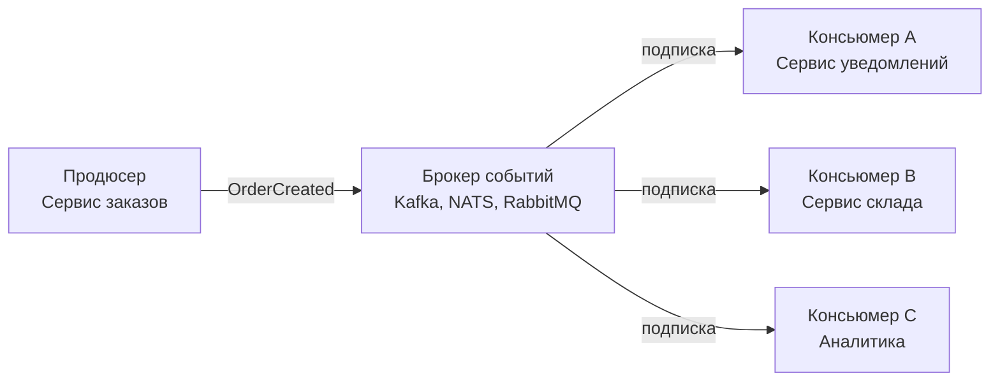

## События как фундамент слабой связанности

В предыдущих статьях мы рассмотрели синхронное и асинхронное взаимодействие, а также технологические парадигмы RPC, REST и Messaging. Однако асинхронная передача сообщений — это лишь транспортный уровень. Настоящий архитектурный сдвиг происходит, когда мы переходим от мышления «вызвать сервис и получить ответ» к мышлению «зафиксировать факт и позволить системе реагировать». Это и есть **Event-Driven Architecture (EDA)** — событийно-ориентированная архитектура.

В этой статье мы разберём, что такое события на уровне дизайна системы, как они преобразуют связанность между сервисами, и как Go с его горутинами и каналами естественно ложится на эту парадигму.

### Что такое событие в архитектурном смысле

**Событие** — это неизменяемая запись о факте, который произошёл в прошлом. Оно не говорит другим сервисам, что делать, а просто констатирует: «Это случилось». Примеры:

- `OrderCreated{OrderID: "123", UserID: "456", Total: 99.99}`
- `PaymentCompleted{PaymentID: "789", OrderID: "123"}`
- `InventoryReserved{OrderID: "123", Items: [...]}`

Ключевые характеристики события:
- **Иммутабельность**: событие никогда не изменяется. Если данные были ошибочны, публикуется новое компенсирующее событие.
- **Именование в прошедшем времени**: `Created`, `Completed`, `Failed`, а не `Create`, `Complete`. Это подчёркивает, что событие — свершившийся факт.
- **Самодостаточность**: событие содержит все данные, необходимые для его обработки, либо ссылку на агрегат, из которого можно получить недостающее.

### Компоненты событийно-ориентированной системы



- **Продюсер** — сервис, в котором произошёл факт. Он публикует событие в брокер.
- **Брокер** — посредник, отвечающий за доставку событий подписчикам (Kafka, RabbitMQ, NATS).
- **Консьюмер** — сервис, реагирующий на событие. Один продюсер может иметь множество консьюмеров, и они ничего не знают друг о друге.

### Типы событий

1. **Event Notification** — событие-уведомление. Содержит минимум информации (например, `OrderID`), а консьюмер сам запрашивает недостающие данные у источника. Плюс — малый размер, минус — дополнительный синхронный запрос.
2. **Event-Carried State Transfer** — событие переносит полное состояние, необходимое консьюмеру. Позволяет консьюмеру быть полностью автономным, но увеличивает размер события.
3. **Domain Event** — событие, отражающее изменение в доменной модели (агрегате). Используется в DDD для коммуникации между Bounded Contexts.
4. **Integration Event** — то же, что domain event, но на уровне инфраструктуры: опубликовано во внешний брокер для других сервисов.

### Преимущества EDA

- **Минимальная связанность**. Продюсер не знает, кто подписан на событие. Можно добавлять новых консьюмеров без изменения продюсера.
- **Масштабируемость и независимость**. Консьюмеры можно масштабировать отдельно, поднимая больше инстансов в потребительской группе.
- **Отказоустойчивость**. Если консьюмер временно недоступен, события накапливаются в брокере и будут обработаны позже.
- **Аудит и история**. Сохраняя все события, можно восстановить состояние системы на любой момент времени — это основа Event Sourcing ([[24. Event Sourcing. Хранение событий вместо состояния]]).

### Недостатки и вызовы

- **Eventual Consistency**. Данные между сервисами согласуются с задержкой. Бизнес-процессы должны быть спроектированы с учётом этого ([[29. Consistency модели. Strong, Eventual, Causal]]).
- **Сложность отслеживания**. Путь события через систему нелинейный. Требуется распределённая трассировка ([[40. Distributed Tracing и корреляция запросов]]).
- **Проблемы с порядком и дубликатами**. Брокеры могут доставлять события не по порядку или повторно. Консьюмеры должны быть идемпотентными ([[27. Idempotency и exactly once семантика]]).

### Mechanical Sympathy: EDA и Go

Go особенно хорош для построения событийно-ориентированных систем благодаря своей модели конкурентности.

**Обработка событий через каналы и горутины.** Типичный консьюмер на Go читает сообщения из брокера и отправляет их в канал. Пул горутин-воркеров разбирает этот канал.

```go
func startConsumer(ctx context.Context, reader *kafka.Reader, workers int, handler func(msg []byte) error) {
    msgs := make(chan kafka.Message, 1000) // буферизированный канал
    for i := 0; i < workers; i++ {
        go worker(ctx, msgs, handler)
    }
    for {
        m, err := reader.ReadMessage(ctx)
        if err != nil {
            break
        }
        msgs <- m
    }
}

func worker(ctx context.Context, msgs <-chan kafka.Message, handler func([]byte) error) {
    for {
        select {
        case <-ctx.Done():
            return
        case m := <-msgs:
            if err := handler(m.Value); err != nil {
                log.Error("handler failed", "error", err)
            }
            // коммит после успешной обработки
        }
    }
}
```

> [!info] Под капотом
> Буферизированный канал действует как «микро-очередь» в памяти процесса, сглаживая микро-пики и развязывая чтение из брокера и обработку. При переполнении канала `msgs <- m` блокируется, создавая backpressure на брокер. Размер буфера — компромисс между задержкой и устойчивостью к пикам.

**Влияние на GC.** При высоком темпе событий (десятки тысяч в секунду) каждое событие — это аллокация в куче. Для снижения давления на GC используйте `sync.Pool` для структур событий и минимизируйте аллокации в горячем пути.

**Память горутин.** Каждая горутина-воркер потребляет минимум 2 КБ стека. При пуле из 100 воркеров это всего 200 КБ — пренебрежимо мало. Важно не создавать горутину на каждое событие, а переиспользовать фиксированный пул.

### Обработка ошибок и Dead Letter Queue

В EDA ошибки неизбежны. Стандартный паттерн в Go:
1. Обработчик пытается обработать событие.
2. При ошибке — ретрай с exponential backoff ([[36. Circuit Breaker, Retry, Timeout и Backoff]]).
3. После исчерпания попыток событие отправляется в **Dead Letter Queue (DLQ)** для ручного разбора.
4. Основной поток обработки не блокируется.

```go
const maxRetries = 3

func processWithRetry(ctx context.Context, msg *Message) error {
    for i := 0; i < maxRetries; i++ {
        err := handler(msg)
        if err == nil {
            return nil
        }
        if i < maxRetries-1 {
            time.Sleep(time.Duration(1<<i) * 100 * time.Millisecond) // exponential backoff
        }
    }
    // Отправляем в DLQ
    return dlq.Publish(ctx, msg)
}
```

### Связь с другими архитектурными паттернами

- **CQRS** ([[23. CQRS. Разделение чтения и записи]]) естественно строится поверх EDA: команда порождает событие, которое обновляет модель чтения.
- **Event Sourcing** ([[24. Event Sourcing. Хранение событий вместо состояния]]) использует события как единственный источник истины.
- **Saga** ([[26. Saga Pattern. Оркестрация и хореография]]) — это распределённая транзакция, реализованная через цепочку событий или команд.

### EDA в Go: выбор брокера

| Брокер | Модель | Когда использовать |
|--------|--------|--------------------|
| **NATS** | Pub/Sub, At-most-once | Быстрые, легковесные события, где допустима потеря |
| **Kafka** | Log-based, At-least-once/Exactly-once | Потоковая обработка, аудит, высокая пропускная способность |
| **RabbitMQ** | Очереди, At-least-once | Сложная маршрутизация, гарантированная доставка |
| **Redis Pub/Sub** | Pub/Sub | Прототипы, внутренние системы с низкими требованиями |

> [!warning] Ловушка / Gotcha
> При использовании EDA в Go остерегайтесь утечки горутин. Если консьюмер запущен в бесконечном цикле, всегда проверяйте контекст на отмену и завершайте горутины при graceful shutdown. `ctx.Done()` — ваш друг.

```go
func runConsumer(ctx context.Context) {
    for {
        select {
        case <-ctx.Done():
            return
        default:
            // чтение и обработка
        }
    }
}
```

### Идемпотентность как архитектурное требование

В EDA консьюмер должен быть идемпотентным: обработка одного и того же события дважды не должна приводить к некорректному состоянию. Достигается через:
- Хранение обработанных ID событий (in-memory или в БД).
- Идемпотентные операции на уровне БД (`INSERT ... ON CONFLICT DO NOTHING`).
- Использование версионности агрегатов.

### Когда применять EDA

- Система состоит из множества независимых поддоменов с разной скоростью изменений.
- Требуется высокая масштабируемость и отказоустойчивость.
- Бизнес-процессы длительные и включают несколько шагов (Saga).
- Важна история всех изменений для аудита и аналитики.

> [!tip] Собеседование
> **Вопрос:** Вы проектируете маркетплейс. При создании заказа нужно зарезервировать товар на складе, списать деньги, отправить уведомление. Как бы вы реализовали этот процесс с помощью EDA на Go?
> **Ответ:** Я бы использовал хореографию событий (Saga):
> 1. Сервис заказов принимает запрос, создаёт заказ в статусе `Pending` и публикует `OrderCreated`.
> 2. Сервис склада подписан на `OrderCreated`, резервирует товары и публикует `InventoryReserved`.
> 3. Сервис оплаты подписан на `InventoryReserved`, списывает деньги и публикует `PaymentCompleted`.
> 4. Сервис заказов, получив `PaymentCompleted`, меняет статус на `Confirmed`.
> 5. Если на любом шаге ошибка, публикуется компенсирующее событие (например, `PaymentFailed` → отмена резервирования).
> В Go я бы реализовал каждого консьюмера как отдельную горутину или группу горутин, читающих из Kafka. Для гарантий доставки использовал бы идемпотентность и коммит оффсета после успешной обработки.

### Итог

Event-Driven Architecture — это не просто «использовать очередь», а фундаментальный сдвиг в мышлении: от команд («сделай это») к фактам («это произошло»). Она обеспечивает слабую связанность, масштабируемость и отказоустойчивость ценой усложнения консистентности и отладки. Go с его легковесными горутинами, каналами и явной обработкой ошибок — идеальный инструмент для реализации EDA.

Следующая статья детально разберёт абстрактные модели обмена сообщениями, лежащие в основе EDA: [[22. Pub Sub, Queue, Stream модели]].