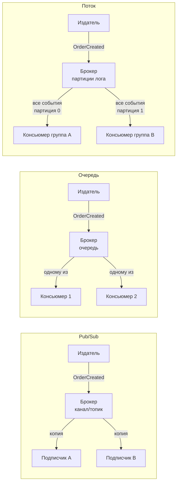

В предыдущей статье мы рассмотрели Event-Driven Architecture — архитектурный стиль, построенный на асинхронных событиях. Теперь пришло время углубиться в фундаментальные **модели доставки сообщений**, которые являются строительными блоками любой событийной системы: **Pub/Sub**, **Queue** и **Stream**. Выбор между ними определяет не только способ коммуникации, но и надёжность, порядок обработки, масштабируемость и даже сложность кода на Go.

### Три модели: определения и ключевые отличия

**Pub/Sub (Publish/Subscribe)** — модель, в которой издатель публикует сообщение в канал (subject, topic), а все активные подписчики получают копию этого сообщения. Сообщение не хранится после доставки текущим подписчикам; отключившийся подписчик пропускает сообщения.

**Queue (Очередь)** — модель, в которой сообщение отправляется в очередь и доставляется **ровно одному** консьюмеру, даже если их несколько. Консьюмеры соревнуются за сообщения (competing consumers). Сообщения сохраняются в очереди, пока не будут обработаны и подтверждены (acknowledged).

**Stream (Поток)** — модель, гибридная по свойствам. Сообщения сохраняются в упорядоченный лог (log) и не удаляются после обработки. Несколько консьюмеров могут читать один и тот же поток независимо, каждый сохраняя свою позицию (offset). Поток хранит историю и поддерживает параллельную обработку с сохранением порядка через партиции.



### Pub/Sub в Go

Классический пример — NATS. Издатель публикует сообщение в субъект, подписчики получают его немедленно, если активны. В Go это часто реализуется через библиотеки `nats.go` или через собственные внутрипроцессные механизмы на каналах.

```go
// Внутрипроцессный Pub/Sub на каналах
type Broker struct {
    mu   sync.RWMutex
    subs map[string][]chan Event
}

func (b *Broker) Publish(subject string, ev Event) {
    b.mu.RLock()
    defer b.mu.RUnlock()
    for _, ch := range b.subs[subject] {
        select {
        case ch <- ev:
        default: // non-blocking — сообщение пропущено, если подписчик медленный
        }
    }
}

func (b *Broker) Subscribe(subject string) <-chan Event {
    ch := make(chan Event, 64) // буферизированный канал
    b.mu.Lock()
    b.subs[subject] = append(b.subs[subject], ch)
    b.mu.Unlock()
    return ch
}
```

> [!warning] Ловушка / Gotcha
> Внутрипроцессный Pub/Sub на каналах без буфера или с маленьким буфером легко теряет сообщения, если подписчик медленный. Используйте `select` с `default`, чтобы не блокировать издателя, но учитывайте, что это **at-most-once** семантика.

**Когда использовать:**
- Рассылка уведомлений в реальном времени (WebSocket, серверные события).
- Внутренние события в модульном монолите, где допустима потеря при сбое.
- Лёгкие интеграции, где важна скорость, а не гарантии доставки.

### Queue в Go

Очередь гарантирует, что каждое сообщение обработано ровно одним консьюмером. В Go типичный представитель — RabbitMQ (с `streadway/amqp`) или облачные очереди (AWS SQS, GCP Pub/Sub с pull-подпиской).

Консьюмеры слушают очередь, получают сообщения, обрабатывают и подтверждают (ack). Если консьюмер упал без подтверждения, сообщение возвращается в очередь (at-least-once).

```go
// Конкурентные консьюмеры RabbitMQ в Go
func startWorkers(ctx context.Context, channel *amqp.Channel, queueName string, workers int, handler func(msg amqp.Delivery)) {
    for i := 0; i < workers; i++ {
        go func() {
            deliveries, _ := channel.Consume(queueName, "", false, false, false, false, nil)
            for {
                select {
                case <-ctx.Done():
                    return
                case msg, ok := <-deliveries:
                    if !ok {
                        return
                    }
                    handler(msg)
                    msg.Ack(false) // подтверждение после успешной обработки
                }
            }
        }()
    }
}
```

> [!info] Под капотом
> В RabbitMQ канал (channel) мультиплексирует сообщения на TCP-соединении. Несколько горутин могут безопасно читать из канала, но подтверждение (`Ack`) должно быть синхронизировано. При высоких нагрузках важно гранулировать подтверждения (потоково), чтобы не терять производительность.

**Когда использовать:**
- Распределение задач между идентичными воркерами (периодические задачи, генерация отчётов).
- Где каждое сообщение должно быть обработано ровно одним исполнителем.
- Команды (command) в системах с CQRS.

### Stream в Go

Stream — это персистентный, упорядоченный лог сообщений. Apache Kafka — эталонная реализация. Поток разделён на партиции; в пределах партиции порядок гарантирован. Несколько консьюмеров могут читать поток независимо (разные consumer groups) или параллельно (разные инстансы в одной consumer group, каждому достается своё подмножество партиций).

В Go для Kafka используют `segmentio/kafka-go` или `confluent-kafka-go`.

```go
// Чтение из Kafka с фиксацией offset после обработки
func consumePartition(ctx context.Context, reader *kafka.Reader, handler func(msg kafka.Message) error) {
    for {
        msg, err := reader.ReadMessage(ctx)
        if err != nil {
            break
        }
        if err := handler(msg); err != nil {
            log.Error("processing failed", "error", err)
            // ретраи, DLQ, но offset не коммитим
            continue
        }
        // Атомарно коммитим offset
        if err := reader.CommitMessages(ctx, msg); err != nil {
            log.Error("commit failed", "error", err)
        }
    }
}
```

> [!info] Под капотом
> В Kafka консьюмер группа автоматически ребалансирует партиции между инстансами. При старте вызова `ReadMessage()` в Go-клиенте происходит низкоуровневое чтение из TCP-сокета. Для высокой пропускной способности используют `ReadBatch`, минимизируя системные вызовы и аллокации.

**Когда использовать:**
- Аудит и хранение полной истории событий (Event Sourcing).
- Обработка потоковых данных в реальном времени с возможностью перечитывания истории.
- Системы, где несколько сервисов должны независимо потреблять одни и те же события с разной скоростью.

### Сравнительный анализ

| Характеристика               | Pub/Sub                           | Queue                                 | Stream                               |
|------------------------------|-----------------------------------|---------------------------------------|--------------------------------------|
| **Доставка**                 | Всем подписчикам                  | Одному консьюмеру из группы           | Всем consumer groups, параллельно в группе |
| **Сохранение сообщений**    | Нет (доставлены — удалены)        | Да, до подтверждения                  | Да, хранятся по retention-политике   |
| **Порядок**                  | Не гарантирован                   | Обычно FIFO                           | Гарантирован в рамках партиции       |
| **Перечитывание**            | Невозможно                        | Невозможно                            | Возможно (с любого offset)           |
| **Семантика**                | At-most-once                      | At-least-once (возможна exactly-once) | At-least-once / Exactly-once         |
| **Примеры в Go**            | NATS, встроенные каналы           | RabbitMQ, AWS SQS                     | Apache Kafka, Redpanda               |
| **Нагрузка на GC**           | Минимальная (нет истории)         | Средняя                                | Высокая при перечитывании больших пачек |

### Mechanical Sympathy: Go и модели сообщений

**Память и GC.** В Pub/Sub сообщение живёт в памяти короткое время, сборщик утилизирует его быстро. В Queue сообщение может задержаться в памяти (буфер канала у консьюмера), что увеличивает working set. В Stream приложение может читать батчи из тысяч сообщений, что создаёт временные массивы байтов и нагружает GC. Профилирование с `pprof` выявляет такие горячие точки.

**Горутины и обработка.** Во всех моделях для консьюмеров используется пул горутин. В Pub/Sub каждая горутина читает из канала брокера; в Queue — слушает очередь; в Stream — читает партицию. При большом количестве партиций (Stream) может потребоваться много горутин. Планировщик Go справляется с сотнями тысяч горутин, но важно ограничивать максимальное количество одновременных обработчиков через семафоры или worker pool.

**Сетевые системные вызовы.** Клиенты брокеров используют неблокирующий I/O или отдельные горутины для чтения из сокетов. В Go сетевые операции автоматически передаются netpoller'у. При массовом чтении из Kafka или RabbitMQ системные вызовы `read()` происходят часто, но планировщик Go эффективно распределяет потоки ОС.

### Выбор модели в архитектуре

- **Рассылка событий многим сервисам без гарантий** → Pub/Sub.
- **Распределение задач между воркерами** → Queue.
- **Хранение событий, аудит, аналитика, Event Sourcing** → Stream.
- **Если нужен и Pub/Sub, и гарантии хранения** → Stream (Kafka фактически реализует обе модели).

На практике современные системы часто комбинируют:
- Внутренние события модульного монолита — через каналы (Pub/Sub).
- Межсервисные команды — через очередь (Queue).
- Долгосрочное хранение событий и аналитика — через поток (Stream).

> [!tip] Собеседование
> **Вопрос:** Чем Stream отличается от Queue, и почему вы выбрали бы Kafka вместо RabbitMQ?
> **Ответ:** Stream — это персистентный, упорядоченный лог событий с возможностью перечитывания истории. Kafka сохраняет сообщения на диск и не удаляет их после обработки, что позволяет подключать новых консьюмеров, не теряя историю. В отличие от очереди, где сообщение исчезает после ack, в Kafka offset коммитится, но сообщение остаётся доступным для других consumer groups или перечитывания при исправлении бага. Я выберу Kafka, если нужна высокая пропускная способность, аудит событий и возможность пересобрать состояние из истории. RabbitMQ предпочтительнее для сложной маршрутизации и очередей с приоритетами, где каждое сообщение обрабатывается одним воркером.

### Итог

Pub/Sub, Queue и Stream — три фундаментальные модели обмена сообщениями, каждая из которых оптимизирована под определённый класс задач. Pub/Sub даёт слабую связанность и скорость, Queue — гарантированную доставку и распределение работы, Stream — персистентную историю и независимое потребление. Понимание их механик критично для построения надёжных событийно-ориентированных систем на Go.

Теперь, освоив модели обмена сообщениями, мы готовы перейти к архитектурному паттерну, который опирается на асинхронную коммуникацию для разделения ответственности за чтение и запись данных: [[23. CQRS. Разделение чтения и записи]].