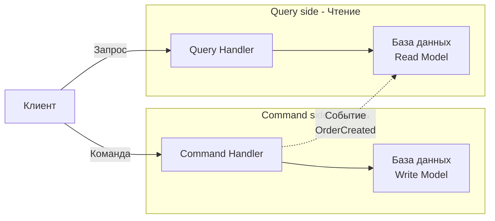

В традиционных CRUD-приложениях одна и та же модель данных используется и для чтения, и для записи. Это просто, но с ростом сложности приводит к проблемам: сложные запросы на чтение конфликтуют с транзакциями на запись, схема БД раздувается, а производительность падает. **CQRS (Command Query Responsibility Segregation)** предлагает радикальное решение: разделить ответственность за команды (изменяющие состояние) и запросы (читающие состояние) на две отдельные модели.

В этой статье мы разберём CQRS в контексте Go: как разделять сервисы и структуры данных, как синхронизировать модели через события и как этот паттерн влияет на производительность, масштабируемость и архитектурные границы.

### Что такое CQRS

**Command Query Responsibility Segregation** — архитектурный паттерн, впервые описанный Грегом Янгом и популяризированный в DDD-сообществе. Основная идея: **метод, изменяющий состояние, не должен возвращать данные**, а метод, возвращающий данные, не должен изменять состояние. На практике это приводит к разделению системы на две части:

- **Command side (Write Model)** — обрабатывает команды (`CreateOrder`, `UpdateProfile`), валидирует бизнес-правила и сохраняет изменения.
- **Query side (Read Model)** — обрабатывает запросы (`GetOrderHistory`, `SearchUsers`), оптимизированные под конкретные сценарии отображения.



### Зачем разделять чтение и запись

**Проблемы единой модели:**
1. **Разные требования к форме данных.** При записи данные нормализованы (агрегаты, связи), при чтении — денормализованы (DTO, view). Единая модель вынуждена компромиссно обслуживать оба случая.
2. **Конкуренция за ресурсы БД.** Тяжёлые запросы на чтение блокируют транзакции записи и наоборот.
3. **Сложность оптимизации.** Индексы для чтения замедляют запись. Денормализация для чтения усложняет запись.
4. **Разные требования к масштабированию.** Чтений часто на порядки больше, чем записей. В единой модели масштабировать приходится всё вместе.

CQRS решает эти проблемы, позволяя **независимо оптимизировать, масштабировать и даже выбирать технологии** для чтения и записи.

### Простейшая реализация CQRS на Go

В Go разделение начинается на уровне интерфейсов и структур. Даже без отдельных баз данных, строгое разделение на команды и запросы приносит пользу.

```go
// core/order/command.go - Command side
package order

type CreateOrderCommand struct {
    UserID string
    Items  []OrderItem
}

type CommandHandler struct {
    repo   WriteRepository
    eventBus EventBus
}

func (h *CommandHandler) CreateOrder(ctx context.Context, cmd CreateOrderCommand) (string, error) {
    order := NewOrder(cmd.UserID, cmd.Items)
    if err := h.repo.Save(ctx, order); err != nil {
        return "", err
    }
    h.eventBus.Publish(ctx, OrderCreated{OrderID: order.ID, UserID: cmd.UserID, Items: cmd.Items})
    return order.ID, nil
}
```

```go
// core/order/query.go - Query side
package order

type GetOrderQuery struct {
    OrderID string
}

type QueryHandler struct {
    readRepo ReadRepository
}

func (h *QueryHandler) GetOrder(ctx context.Context, q GetOrderQuery) (*OrderView, error) {
    return h.readRepo.FindByID(ctx, q.OrderID)
}
```

Обратите внимание: **команда возвращает только идентификатор** (или ошибку), а не полный объект заказа. Запрос возвращает `OrderView` — оптимизированную для чтения структуру, которая может включать денормализованные данные (имя пользователя, статус доставки, последний комментарий).

### Разделение моделей данных

В классическом CQRS Write Model и Read Model могут жить в разных базах данных или в разных схемах/таблицах одной БД.

**Write Model** (обычно PostgreSQL, нормализованная):
```sql
CREATE TABLE orders (
    id UUID PRIMARY KEY,
    user_id UUID NOT NULL,
    status VARCHAR(20) NOT NULL,
    total_amount DECIMAL NOT NULL,
    created_at TIMESTAMPTZ DEFAULT now()
);
```

**Read Model** (может быть Elasticsearch, отдельная таблица в PG, Redis, MongoDB):
```sql
-- Денормализованная таблица для быстрых запросов
CREATE TABLE order_views (
    order_id UUID PRIMARY KEY,
    user_name TEXT,
    status TEXT,
    total DECIMAL,
    items_count INT,
    last_comment TEXT
);
```

### Синхронизация моделей: синхронная и асинхронная

**Синхронная синхронизация** — после сохранения команды мы сразу обновляем Read Model в той же транзакции. Просто, но связывает стороны и снижает производительность записи.

```go
func (h *CommandHandler) CreateOrder(ctx context.Context, cmd CreateOrderCommand) (string, error) {
    tx, _ := h.db.Begin(ctx)
    defer tx.Rollback(ctx)
    
    order := NewOrder(cmd.UserID, cmd.Items)
    h.writeRepo.SaveWithTx(ctx, tx, order)
    
    view := NewOrderView(order)
    h.readRepo.SaveWithTx(ctx, tx, view)
    
    return order.ID, tx.Commit(ctx)
}
```

**Асинхронная синхронизация (рекомендуемая)** — команда публикует событие, а консьюмер обновляет Read Model асинхронно. Это развязывает запись и чтение, повышая производительность и отказоустойчивость (Read Model может временно отставать).

```go
// Command side
func (h *CommandHandler) CreateOrder(ctx context.Context, cmd CreateOrderCommand) (string, error) {
    order := NewOrder(cmd.UserID, cmd.Items)
    if err := h.repo.Save(ctx, order); err != nil {
        return "", err
    }
    h.eventBus.Publish(ctx, OrderCreated{...}) // событие уходит в брокер
    return order.ID, nil
}

// Query side - отдельный сервис или горутина
func (p *OrderProjector) OnOrderCreated(ctx context.Context, event OrderCreated) error {
    view := NewOrderView(event)
    return p.readRepo.Upsert(ctx, view)
}
```

> [!warning] Ловушка / Gotcha
> При асинхронной синхронизации возникает **Eventual Consistency** ([[29. Consistency модели. Strong, Eventual, Causal]]). Клиент, создавший заказ, может не увидеть его в списке заказов ещё несколько миллисекунд. UX должен быть готов к этому: либо показывать заказ из кэша команды, либо информировать пользователя.

### Mechanical Sympathy: CQRS и Go

#### Разделение нагрузки на горутины

Command side обычно обрабатывает меньше запросов, но каждый запрос тяжелее (валидация, транзакции). Query side обрабатывает много лёгких запросов. В Go это реализуется через отдельные пулы горутин и даже отдельные инстансы сервиса.

Query side можно оптимизировать за счёт:
- **Connection pooling**: большое количество горутин, обслуживающих чтение, может использовать пул соединений к Read DB (например, `pgxpool`).
- **Кэширование в памяти**: `sync.Map`, `sync.Pool` или библиотеки вроде `bigcache` для горячих данных, чтобы избежать походов в БД.

#### Влияние на GC

Read Model часто агрегирует данные из нескольких источников, создавая временные структуры. При высокой частоте запросов это может создавать давление на GC. Использование `sync.Pool` для структур ответов (`OrderView`) или буферов сериализации уменьшает аллокации.

```go
var viewPool = sync.Pool{
    New: func() interface{} { return &OrderView{} },
}

func (h *QueryHandler) GetOrder(ctx context.Context, q GetOrderQuery) (*OrderView, error) {
    view := viewPool.Get().(*OrderView)
    defer viewPool.Put(view)
    
    row := h.db.QueryRowContext(ctx, "SELECT ...")
    err := row.Scan(&view.ID, &view.UserName, ...)
    return view, err
}
```

#### Системные вызовы и батчинг

Если синхронизация идёт через очередь или стрим, проектор (консьюмер) может обрабатывать события батчами. В Go это снижает количество системных вызовов к БД.

```go
func (p *OrderProjector) OnEvents(ctx context.Context, events []OrderCreated) error {
    batch := &pgx.Batch{}
    for _, ev := range events {
        batch.Queue(`INSERT INTO order_views ... ON CONFLICT ...`, ev.OrderID, ...)
    }
    return p.pool.SendBatch(ctx, batch).Close()
}
```

### Связь с Event Sourcing

CQRS часто путают с Event Sourcing ([[24. Event Sourcing. Хранение событий вместо состояния]]). Важно понимать: **CQRS не требует Event Sourcing**, и наоборот. Однако они отлично сочетаются. В Event Sourcing текущее состояние восстанавливается из потока событий; эти же события можно использовать для наполнения Read Model. Go-проекты, использующие оба паттерна, часто применяют одну шину событий (Kafka) для питания проекторов, строящих денормализованные представления.

### Когда применять CQRS

- **Сложные предметные области**, где бизнес-правила при записи сильно отличаются от формы данных при чтении.
- **Высокое соотношение чтений к записям** (100:1 и более).
- **Разные требования к масштабированию**: чтение требует горизонтального масштабирования, запись — вертикального.
- **Поиск и отчёты**: когда нужны полнотекстовый поиск (Elasticsearch) или сложные аналитические запросы, несовместимые с нормализованной схемой записи.

> [!info] Под капотом
> CQRS без разделения хранилищ — это просто хорошая практика именования и разделения интерфейсов. Настоящая мощь раскрывается, когда Write Model и Read Model физически разделены. В Go это может быть как два отдельных микросервиса, так и два пакета в одном приложении, работающие с разными базами данных.

### Антипаттерны и типичные ошибки

1. **CQRS ради CQRS.** Если приложение — простой CRUD с невысокой нагрузкой, CQRS привносит лишнюю сложность. Не усложняйте без необходимости.
2. **Единая модель для команд и запросов.** Даже при разделении интерфейсов, использование одних и тех же структур данных для записи и чтения сводит пользу на нет. Read Model должна быть оптимизирована под экраны/клиентов.
3. **Игнорирование eventual consistency.** Клиенты должны знать, что данные после команды могут быть не сразу видны. Проектируйте UX с учётом этого (optimistic UI, polling, WebSocket).
4. **Слишком много проекторов.** При большом количестве Read Model обновление каждого из них может стать бутылочным горлышком. Проектируйте их асинхронно и мониторьте лаг.

### Итог

CQRS — мощный паттерн, позволяющий разделить сложность записи и чтения, оптимизировать их независимо и масштабировать под разные нагрузки. В Go он естественно реализуется через интерфейсы, разделение пакетов и асинхронную обработку событий. Однако внедрение CQRS без необходимости ведёт к переусложнению, поэтому применяйте его осознанно, когда преимущества перевешивают затраты.

Следующая статья раскроет родственный паттерн, который часто идёт рука об руку с CQRS и поднимает планку надёжности на новый уровень: [[24. Event Sourcing. Хранение событий вместо состояния]].