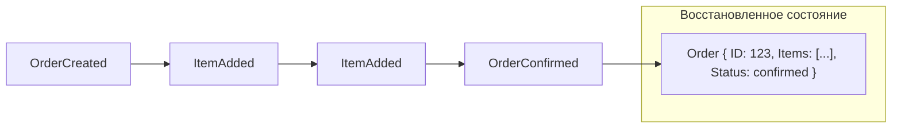

## Событие как источник истины

В предыдущих статьях мы разобрали CQRS и событийно-ориентированную архитектуру, где события уведомляют другие сервисы о произошедших фактах. **Event Sourcing** идёт дальше: он делает события не просто средством коммуникации, а **единственным источником истины** о состоянии системы. Вместо того чтобы хранить текущее состояние в базе данных, мы храним последовательность событий, которые к этому состоянию привели. Такой подход кардинально меняет мышление разработчика и открывает уникальные возможности для аудита, отладки и пересборки системы.

### Что такое Event Sourcing

**Event Sourcing** — паттерн, при котором каждое изменение состояния приложения сохраняется как отдельное неизменяемое событие. Текущее состояние не хранится напрямую; оно **восстанавливается** путём последовательного применения всех событий, произошедших с агрегатом.

Вместо:
```sql
UPDATE orders SET status = 'confirmed', total = 150 WHERE id = '123';
```
Мы сохраняем:
```go
events.Append(
    OrderCreated{ID: "123", ...},
    OrderItemAdded{ProductID: "p1", Qty: 2, Price: 50},
    OrderConfirmed{},
)
```

Состояние заказа в любой момент времени — это результат применения этих событий одно за другим.



### Ключевые компоненты

**Event Store** — специализированное хранилище, оптимизированное для добавления и чтения событий. Это может быть отдельная таблица в PostgreSQL, Apache Kafka, специализированные БД вроде EventStoreDB или даже простой файл. В Go типичная схема таблицы:

```sql
CREATE TABLE events (
    aggregate_id UUID NOT NULL,
    version      INT NOT NULL,
    event_type   TEXT NOT NULL,
    payload      JSONB NOT NULL,
    occurred_at  TIMESTAMPTZ DEFAULT now(),
    PRIMARY KEY (aggregate_id, version)
);
```

**Агрегат** (из DDD, [[12. Domain Driven Design. Bounded Context и Aggregate]]) — объект, состояние которого мы храним как поток событий. Агрегат загружается из Event Store путём чтения всех его событий и применения их к пустому состоянию.

**Событие** — структура данных, описывающая факт в прошлом. В Go события удобно представлять как интерфейс или набор конкретных типов.

```go
type Event interface {
    AggregateID() string
    Version() int
}

type OrderCreated struct {
    OrderID  string
    UserID   string
    At       time.Time
}
func (e OrderCreated) AggregateID() string { return e.OrderID }
func (e OrderCreated) Version() int { return 1 }
```

### Реализация Event Sourcing в Go

Агрегат больше не загружается через `SELECT * FROM orders WHERE id = $1`. Вместо этого репозиторий загружает все события и «проигрывает» их.

```go
type OrderRepository struct {
    store EventStore
}

func (r *OrderRepository) Load(ctx context.Context, id string) (*Order, error) {
    events, err := r.store.LoadEvents(ctx, id)
    if err != nil {
        return nil, err
    }
    order := NewBlankOrder()
    for _, ev := range events {
        order.Apply(ev)
    }
    return order, nil
}
```

Метод `Apply` — это мутатор, который меняет состояние агрегата, но **никогда не вызывает побочных эффектов** (не пишет в БД, не шлёт HTTP). После того как агрегат загружен, бизнес-операция вызывает методы агрегата, которые **порождают новые события** и применяют их.

```go
func (o *Order) AddItem(productID string, qty int, price Money) error {
    if o.Status != StatusDraft {
        return ErrOrderNotEditable
    }
    event := OrderItemAdded{OrderID: o.ID, ProductID: productID, Qty: qty, Price: price}
    o.Apply(event)
    o.uncommittedEvents = append(o.uncommittedEvents, event)
    return nil
}

func (o *Order) Apply(event Event) {
    switch e := event.(type) {
    case OrderCreated:
        o.ID = e.OrderID
        o.UserID = e.UserID
        o.Status = StatusDraft
    case OrderItemAdded:
        o.Items = append(o.Items, Item{e.ProductID, e.Qty, e.Price})
        o.Total += e.Price.Mul(e.Qty)
    case OrderConfirmed:
        o.Status = StatusConfirmed
    }
}
```

Сохранение агрегата — это атомарная запись **только новых событий** в Event Store:

```go
func (r *OrderRepository) Save(ctx context.Context, order *Order) error {
    if len(order.uncommittedEvents) == 0 {
        return nil
    }
    // Оптимистическая блокировка по версии
    err := r.store.Append(ctx, order.ID, order.Version, order.uncommittedEvents)
    if err != nil {
        return err
    }
    order.uncommittedEvents = nil
    return nil
}
```

### Преимущества Event Sourcing

1. **Полный аудит.** Каждое изменение задокументировано. Можно ответить на вопрос «как мы оказались в этом состоянии?» в любой момент.
2. **Пересборка состояния.** Можно воссоздать состояние на любой момент времени, что критично для финансовых систем и расследований инцидентов.
3. **Отладка и воспроизведение.** Поток событий можно скопировать в тестовое окружение и воспроизвести баг по шагам.
4. **Гибкие Read Models.** Поскольку события хранят всю историю, можно строить любые проекции для CQRS. Если понадобится новая аналитика, достаточно перечитать события и построить новую модель, не трогая боевую базу.
5. **Естественная интеграция.** Другие сервисы могут подписываться на события из Event Store и реагировать на них.

> [!tip] Собеседование
> **Вопрос:** Что вы выберете для системы учёта финансовых транзакций: традиционное хранение состояния или Event Sourcing? Почему?
> **Ответ:** Event Sourcing. Потому что финансовая отчётность требует полного аудита и возможности восстановить состояние на любой момент времени. Традиционная БД хранит только текущий баланс, и если потребуется узнать, как он образовался, придётся поднимать бэкапы и парсить WAL-логи. Event Sourcing хранит всю историю операций как первоклассные данные, что делает аудит тривиальным, а исправление ошибок — добавлением корректирующих событий, а не изменением исторических записей.

### Проблемы и вызовы

#### Сложность запросов к текущему состоянию

Без CQRS запрос «показать все заказы со статусом Confirmed» становится нетривиальным: нужно прочитать все события и вычислить состояние каждого агрегата. Решение — строить **Read Models** с помощью проекторов (см. [[23. CQRS. Разделение чтения и записи]]). Это усложняет архитектуру, но даёт гибкость.

#### Версионирование событий

Структура событий со временем меняется: добавляются поля, удаляются старые. Нельзя просто изменить Go-структуру и ожидать, что старые события прочитаются. Подходы к версионированию:
- **Upcasting** — преобразование старых событий в новую схему при чтении.
- **Слабая схема** — хранение в JSON с полем `type`, игнорирование неизвестных полей.
- **Неизменяемость + новые события** — никогда не менять старые события, только добавлять новые типы.

```go
// Upcast: старый OrderItemAdded -> новый OrderItemAddedV2 с полем Discount
func upcast(raw json.RawMessage, eventType string) (Event, error) {
    switch eventType {
    case "OrderItemAdded":
        var ev OrderItemAdded
        json.Unmarshal(raw, &ev)
        return ev, nil
    case "OrderItemAdded_V2":
        var ev OrderItemAddedV2
        json.Unmarshal(raw, &ev)
        return ev, nil
    }
}
```

#### Снапшоты (Snapshots)

При большом количестве событий загрузка агрегата становится медленной. Решение — периодически сохранять снимок состояния агрегата. Загрузка: взять последний снапшот и применить только события после него.

```go
func (r *OrderRepository) Load(ctx context.Context, id string) (*Order, error) {
    snapshot, version, _ := r.snapshotStore.Load(ctx, id)
    order := NewBlankOrder()
    if snapshot != nil {
        order = snapshot
    }
    events, _ := r.store.LoadEventsFrom(ctx, id, version+1)
    for _, ev := range events {
        order.Apply(ev)
    }
    return order, nil
}
```

#### Идемпотентность

Event Store должен гарантировать, что одно и то же событие не будет записано дважды (например, при повторе сетевого запроса). Обычно этого добиваются уникальным ключом `(aggregate_id, version)` и использованием `INSERT ... ON CONFLICT DO NOTHING` в PostgreSQL.

### Mechanical Sympathy: Event Sourcing и Go

**Сериализация и аллокации.** При каждом сохранении агрегата его новые события сериализуются (обычно в JSON или Protobuf). `encoding/json` аллоцирует много временных байтовых слайсов. Для высоконагруженных систем предпочтительнее Protobuf или более быстрые JSON-кодеры (`goccy/go-json`). Использование `sync.Pool` для буферов сериализации снижает давление на GC.

**Загрузка агрегата.** Применение тысяч событий к агрегату — это CPU-bound работа, выполняемая в одной горутине. Если агрегат содержит большие срезы (например, позиции заказа), каждое событие создаёт новые слайсы и структуры — потенциально много аллокаций. Использование value-типов и переиспользование слайсов через `sync.Pool` не рекомендуется внутри агрегата, так как агрегат должен быть потокобезопасен в рамках одной горутины.

**Снапшоты и память.** Снапшот агрегата можно хранить в бинарном формате (gob, Protobuf) и загружать за один вызов, экономя время на повторном применении событий. Это уменьшает CPU-нагрузку и количество аллокаций.

**Хранилище событий.** Выбор Event Store влияет на производительность. PostgreSQL с JSONB удобен, но порождает много аллокаций при парсинге JSON. Kafka как Event Store даёт высокую пропускную способность, но требует внешней проекции для восстановления агрегатов (интерактивные запросы Kafka Streams или отдельный компактный топик).

> [!warning] Ловушка / Gotcha
> При использовании JSONB в PostgreSQL для событий помните: сканирование JSONB в Go-структуры через `json.Unmarshal` создаёт аллокации на каждое событие. При загрузке 10 000 событий это ощутимо. Рассмотрите использование бинарного формата (Protobuf + BYTEA) или пакетной обработки с переиспользованием буферов.

### Связь с другими паттернами

- **CQRS** — практически обязательный спутник Event Sourcing. События из Event Store питают проекторы, строящие Read Models.
- **Saga** ([[26. Saga Pattern. Оркестрация и хореография]]) — в Event Sourcing команда может инициировать процесс Saga, который слушает события из Event Store и реагирует на них.
- **Idempotency** ([[27. Idempotency и exactly once семантика]]) — повторная отправка команды не должна порождать дублирующиеся события. Event Store с уникальным ключом (aggregate_id, version) решает эту проблему.

### Когда применять Event Sourcing

- **Финансовые системы и учёт.** Полный аудит обязателен.
- **Сложные бизнес-процессы**, где важна история изменений.
- **Системы с высокой потребностью в аналитике**, где постоянно появляются новые вопросы к историческим данным.
- **Отладка и воспроизводимость.** Когда критично уметь воссоздать проблему по логам событий.

**Когда НЕ применять:**
- Простые CRUD-приложения.
- Когда нет потребности в истории изменений.
- Команда не готова к дополнительной сложности (версионирование событий, снапшоты, eventual consistency).

### Итог

Event Sourcing превращает события из побочного продукта в основной источник истины, давая беспрецедентный контроль над историей и состоянием системы. В Go он реализуется через структуры событий, методы Apply и строгий контроль версий. В сочетании с CQRS этот паттерн открывает путь к системам с полным аудитом, гибкой аналитикой и возможностью пересборки состояния. Однако плата — возросшая сложность и необходимость дисциплины в управлении схемами событий.

Следующая статья посвящена проблеме, которая неизбежно возникает при распределении данных по сервисам: как обеспечить консистентность операций, затрагивающих несколько систем? Разбираемся в [[25. Distributed Transactions. 2PC и проблемы]].